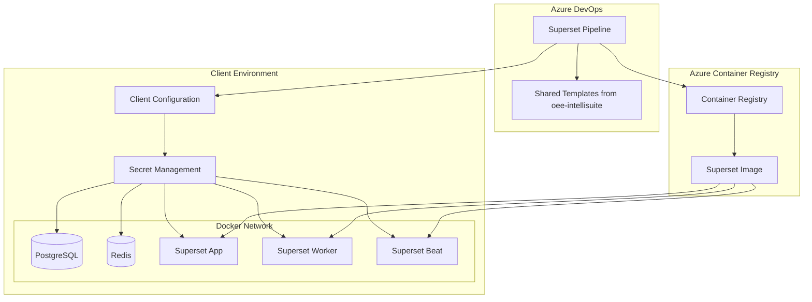
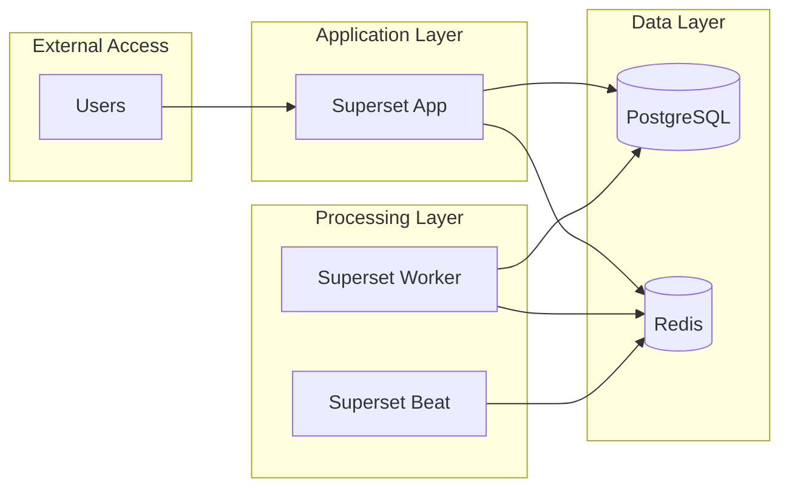
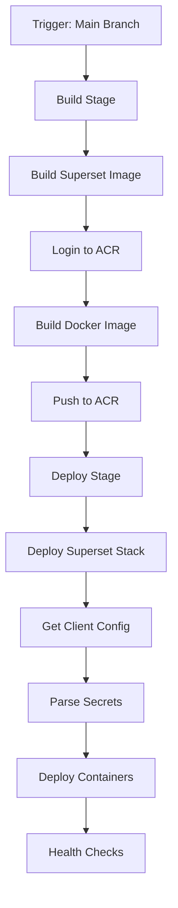
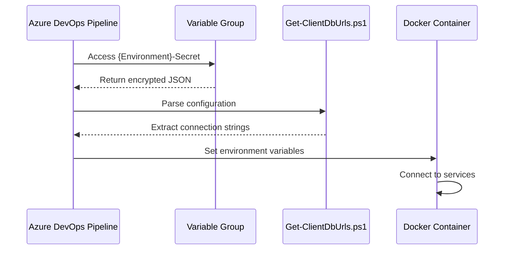
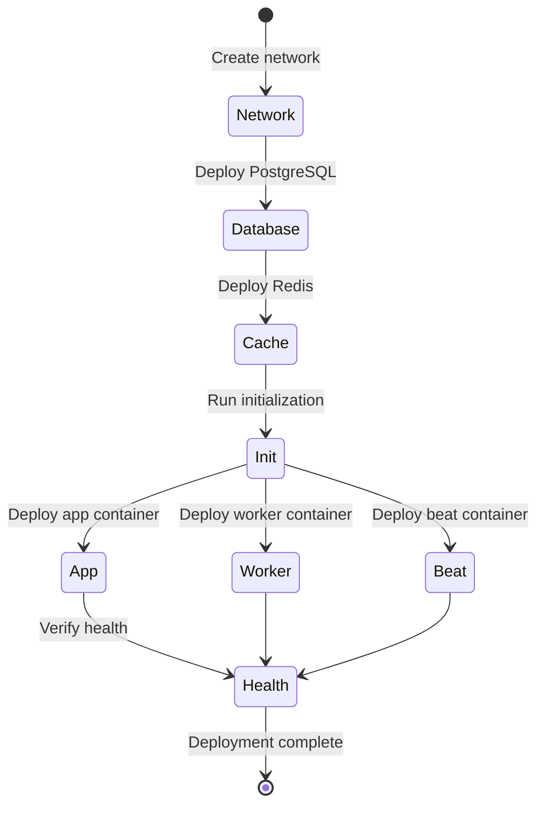

# Superset Deployment Architecture

## Overview

This document provides a detailed architectural overview of the Superset deployment strategy using Azure DevOps pipelines, designed to reuse existing DevOps patterns from the oee-intellisuite repository.

## System Architecture Diagram



## Container Architecture

### Superset Components

1. **superset-app**: Main web application server

   - Runs gunicorn WSGI server
   - Exposes port 8088
   - Handles HTTP requests and serves the UI

2. **superset-worker**: Celery worker processes

   - Executes asynchronous tasks
   - Processes data exports, reports, and other background jobs
   - Scales horizontally based on workload

3. **superset-worker-beat**: Celery beat scheduler

   - Manages scheduled tasks
   - Triggers periodic jobs like cache refreshes
   - Single instance per deployment

4. **superset-init**: Initialization container

   - Runs database migrations
   - Creates admin user
   - Sets up roles and permissions
   - Runs once during deployment

5. **PostgreSQL**: Primary database

   - Stores metadata, dashboards, charts
   - User authentication data
   - Configuration settings

6. **Redis**: Cache and message broker
   - Session storage
   - Celery task queue
   - Application caching

### Container Communication



## Pipeline Architecture

### Template Hierarchy

```
oee-intellisuite/.azuredevops/templates/
├── stages/
│   └── client-deploy.yml          # Reused deployment stage
├── jobs/
│   ├── build-docker.yml           # Reused build job
│   └── deploy-docker.yml          # Reused deployment job
└── steps/
    ├── get-client-config.yml      # Reused configuration step
    └── pnpm-install.yml           # Reused dependency step

superset-server/.azuredevops/
├── superset-deploy.yml           # Main pipeline
└── templates/
    └── superset/
        ├── build-superset.yml     # Superset-specific build
        └── deploy-superset.yml    # Superset-specific deployment
```

### Pipeline Flow



## Configuration Management

### Client Configuration Structure

The client configuration system provides a centralized way to manage environment-specific settings:

```json
{
  "client": {
    "name": "client-name",
    "environment": "production"
  },
  "app-suite": [
    {
      "postgres": {
        "host": "postgres-server",
        "port": 5432,
        "database": "superset",
        "admin": { "user": "admin", "password": "encrypted-password" },
        "owner": { "user": "owner", "password": "encrypted-password" },
        "writer": { "user": "writer", "password": "encrypted-password" },
        "reader": { "user": "reader", "password": "encrypted-password" }
      },
      "redis": {
        "host": "redis-server",
        "port": 6379,
        "password": "encrypted-password"
      },
      "superset": {
        "secretKey": "flask-secret-key",
        "adminPassword": "admin-password",
        "features": {
          "enableExamples": false,
          "logLevel": "INFO"
        }
      }
    }
  ]
}
```

### Secret Management Flow



## Deployment Strategy

### Multi-Container Orchestration

The deployment strategy orchestrates multiple containers in a specific sequence:

1. **Network Creation**: Create Docker network for inter-container communication
2. **Database Deployment**: Deploy PostgreSQL container
3. **Cache Deployment**: Deploy Redis container
4. **Initialization**: Run Superset initialization container
5. **Application Deployment**: Deploy Superset app, worker, and beat containers
6. **Health Verification**: Verify all containers are running and healthy

### Container Lifecycle



## Build Optimization

### Docker Build Strategy

To optimize build times and resource usage:

1. **Multi-stage Builds**: Use Docker multi-stage builds to minimize image size
2. **Layer Caching**: Leverage Docker layer caching for faster rebuilds
3. **Base Image Optimization**: Use optimized base images for production
4. **Build Context**: Minimize build context to improve build speed

### Build Targets

The Dockerfile provides multiple build targets:

- **dev**: Development environment with all dependencies
- **lean**: Production-optimized image with minimal footprint
- **ci**: CI environment with testing tools

## Security Considerations

### Container Security

1. **Non-root User**: Run containers as non-root user where possible
2. **Resource Limits**: Implement resource constraints for containers
3. **Network Isolation**: Use Docker networks for container isolation
4. **Secret Management**: Never store secrets in container images

### Pipeline Security

1. **Variable Groups**: Use Azure DevOps variable groups for secrets
2. **Least Privilege**: Grant minimum required permissions
3. **Audit Logging**: Enable audit logging for all pipeline activities
4. **Secure Checkout**: Use secure checkout for repository access

## Monitoring and Observability

### Health Checks

Each container implements health checks:

```yaml
healthcheck:
  test: ["CMD", "/app/docker/docker-healthcheck.sh"]
  interval: 30s
  timeout: 10s
  retries: 3
  start_period: 40s
```

### Logging Strategy

1. **Structured Logging**: Use structured logging format
2. **Log Aggregation**: Forward logs to centralized logging system
3. **Log Retention**: Implement appropriate log retention policies
4. **Error Tracking**: Integrate error tracking and alerting

## Scaling Considerations

### Horizontal Scaling

The architecture supports horizontal scaling of:

1. **Superset Workers**: Add more worker containers based on workload
2. **Application Servers**: Multiple app containers behind load balancer
3. **Database**: Read replicas for read-heavy workloads

### Resource Management

1. **CPU/Memory Limits**: Set appropriate resource limits
2. **Auto-scaling**: Implement auto-scaling based on metrics
3. **Load Balancing**: Distribute traffic across multiple instances

## Disaster Recovery

### Backup Strategy

1. **Database Backups**: Regular PostgreSQL backups
2. **Configuration Backups**: Version control all configuration
3. **Container Images**: Store images in Azure Container Registry
4. **Recovery Procedures**: Documented recovery procedures

### High Availability

1. **Multi-zone Deployment**: Deploy across multiple availability zones
2. **Database Replication**: Implement database replication
3. **Health Monitoring**: Continuous health monitoring
4. **Failover Automation**: Automated failover procedures
