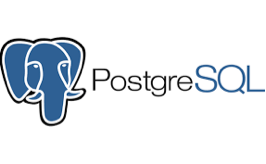

<!--
Licensed to the Apache Software Foundation (ASF) under one
or more contributor license agreements.  See the NOTICE file
distributed with this work for additional information
regarding copyright ownership.  The ASF licenses this file
to you under the Apache License, Version 2.0 (the
"License"); you may not use this file except in compliance
with the License.  You may obtain a copy of the License at

  http://www.apache.org/licenses/LICENSE-2.0

Unless required by applicable law or agreed to in writing,
software distributed under the License is distributed on an
"AS IS" BASIS, WITHOUT WARRANTIES OR CONDITIONS OF ANY
KIND, either express or implied.  See the License for the
specific language governing permissions and limitations
under the License.
-->
Superset
=========

A modern, enterprise-ready business intelligence web application.

[**Why Superset**](#why-superset) |
[**Supported Databases**](#supported-databases) |
[**Installation and Configuration**](#installation-and-configuration) |
[**Get Help**](#get-help) |
[**Contributor Guide**](#contributor-guide) |
[**Resources**](#resources) |
[**Superset Users**](INTHEWILD.md)

## Screenshots & Gifs

**View Dashboards**

<kbd></kbd> 

**Slice & dice your data**

<kbd></kbd> 

**Query and visualize your data with SQL Lab**

<kbd></kbd> 

**Visualize geospatial data with deck.gl**

<kbd></kbd> 

**Choose from a wide array of visualizations**

<kbd></kbd> 

## Why Superset

Superset provides:
* An intuitive interface to explore and visualize datasets, and
    create interactive dashboards.
* A wide array of beautiful visualizations to showcase your data.
* Easy, code-free, user flows to drill down and slice and dice the data
    underlying exposed dashboards. The dashboards and charts act as a starting
    point for deeper analysis.
* A state of the art SQL editor/IDE exposing a rich metadata browser, and
    an easy workflow to create visualizations out of any result set.
* An extensible, high granularity security model allowing intricate rules
    on who can access which product features and datasets.
    Integration with major
    authentication backends (database, OpenID, LDAP, OAuth, REMOTE_USER, ...)
* A lightweight semantic layer, allowing to control how data sources are
    exposed to the user by defining dimensions and metrics
* Out of the box support for most SQL-speaking databases
* Deep integration with Druid allows for Superset to stay blazing fast while
    slicing and dicing large, realtime datasets
* Fast loading dashboards with configurable caching

## Supported Databases

Superset speaks many SQL dialects through SQLAlchemy - a Python
SQL toolkit that is compatible with most databases. Here are some of the major database solutions that are supported:

  
  
  
  
  
  
  
  
  
  
  
  
  
  
  
  
    
  
  
  

A complete list of supported databases can be found
[here](https://superset.incubator.apache.org/docs/databases/installing-database-drivers).

## Installation and Configuration

[See in the documentation](https://superset.incubator.apache.org/docs/installation/installing-superset-using-docker-compose)

## Get Involved

* Ask and answer questions on [StackOverflow](https://stackoverflow.com/questions/tagged/apache-superset)
* [Join our community's Slack](https://join.slack.com/t/apache-superset/shared_invite/zt-g8lpruog-HeqpgYrwdfrD5OYhlU7hPQ)
  and please read our [Slack Community Guidelines](CODE_OF_CONDUCT.md#slack-community-guidelines)
* [Join our dev@superset.apache.org Mailing list](https://lists.apache.org/list.html?dev@superset.apache.org)

## Contributor Guide

Interested in contributing? Check out our
[CONTRIBUTING.md](https://github.com/apache/superset/blob/master/CONTRIBUTING.md)
to find resources around contributing along with a detailed guide on
how to set up a development environment.

## Resources

* Superset 101 -- Getting Started Guide (From [Preset](https://preset.io) [Blog](https://preset.io/blog/))
  * [Installing Apache Superset Locally](https://preset.io/blog/2020-05-11-getting-started-installing-superset/)
  * [Installing Database Drivers](https://preset.io/blog/2020-05-18-install-db-drivers/)
  * [Connect Superset To Google Sheets](https://preset.io/blog/2020-06-01-connect-superset-google-sheets/)
  * [Create Your First Chart](https://preset.io/blog/2020-06-08-first-chart/)
  * [Create Time Series Charts](https://preset.io/blog/2020-06-26-timeseries-chart/)
* [Docker image](https://hub.docker.com/r/preset/superset/)
* [Youtube Channel](https://www.youtube.com/channel/UCMuwrvBsg_jjI2gLcm04R0g)
  * [May 15, 2020: Virtual Meetup Recording. Topics: 0.36 Overview, Committers Self-Intro, Roadmap](https://www.youtube.com/watch?v=tXGDmqjmcTs&t=20s)
  * [July 16, 2020: Virtual Meetup Recording. Topics: Visualization Plugins, 0.37 Preview, Demo](https://www.youtube.com/watch?v=f6up5x_iRbI)
* [So, You Want to Build a Superset Viz Plugin...](https://preset.io/blog/2020-07-02-hello-world/)
