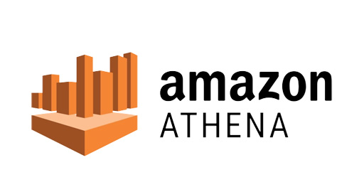
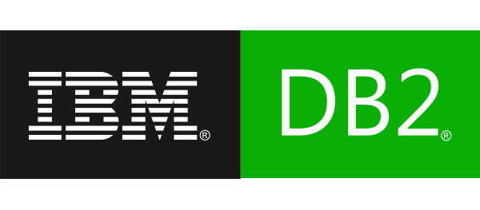

<!--
Licensed to the Apache Software Foundation (ASF) under one
or more contributor license agreements.  See the NOTICE file
distributed with this work for additional information
regarding copyright ownership.  The ASF licenses this file
to you under the Apache License, Version 2.0 (the
"License"); you may not use this file except in compliance
with the License.  You may obtain a copy of the License at

  http://www.apache.org/licenses/LICENSE-2.0

Unless required by applicable law or agreed to in writing,
software distributed under the License is distributed on an
"AS IS" BASIS, WITHOUT WARRANTIES OR CONDITIONS OF ANY
KIND, either express or implied.  See the License for the
specific language governing permissions and limitations
under the License.
-->

# Superset

<picture width="500">
  <source
    width="600"
    media="(prefers-color-scheme: dark)"
    src="https://superset.apache.org/img/superset-logo-horiz-dark.svg"
    alt="Superset logo (dark)"
  />
  
</picture>

A modern, enterprise-ready business intelligence web application.

[**Why Superset?**](#why-superset) |
[**Supported Databases**](#supported-databases) |
[**Installation and Configuration**](#installation-and-configuration) |
[**Release Notes**](https://github.com/apache/superset/blob/master/RELEASING/README.md#release-notes-for-recent-releases) |
[**Get Involved**](#get-involved) |
[**Contributor Guide**](#contributor-guide) |
[**Resources**](#resources) |
[**Organizations Using Superset**](https://superset.apache.org/inTheWild)

## Why Superset?

Superset is a modern data exploration and data visualization platform. Superset can replace or augment proprietary business intelligence tools for many teams. Superset integrates well with a variety of data sources.

Superset provides:

- A **no-code interface** for building charts quickly
- A powerful, web-based **SQL Editor** for advanced querying
- A **lightweight semantic layer** for quickly defining custom dimensions and metrics
- Out of the box support for **nearly any SQL** database or data engine
- A wide array of **beautiful visualizations** to showcase your data, ranging from simple bar charts to geospatial visualizations
- Lightweight, configurable **caching layer** to help ease database load
- Highly extensible **security roles and authentication** options
- An **API** for programmatic customization
- A **cloud-native architecture** designed from the ground up for scale

## Screenshots & Gifs

**Video Overview**

<!-- File hosted here https://github.com/apache/superset-site/raw/lfs/superset-video-4k.mp4 -->

[superset-video-1080p.webm](https://github.com/user-attachments/assets/b37388f7-a971-409c-96a7-90c4e31322e6)

 

**Large Gallery of Visualizations**

<kbd></kbd> 

**Craft Beautiful, Dynamic Dashboards**

<kbd></kbd> 

**No-Code Chart Builder**

<kbd></kbd> 

**Powerful SQL Editor**

<kbd></kbd> 

## Supported Databases

Superset can query data from any SQL-speaking datastore or data engine (Presto, Trino, Athena, [and more](https://superset.apache.org/docs/databases)) that has a Python DB-API driver and a SQLAlchemy dialect.

Here are some of the major database solutions that are supported:

<!-- SUPPORTED_DATABASES_START -->

   &nbsp;
   &nbsp;
   &nbsp;
   &nbsp;
   &nbsp;
   &nbsp;
   &nbsp;
   &nbsp;
   &nbsp;
   &nbsp;
   &nbsp;
   &nbsp;
   &nbsp;
   &nbsp;
   &nbsp;
   &nbsp;
   &nbsp;
   &nbsp;
   &nbsp;
   &nbsp;
   &nbsp;
   &nbsp;
   &nbsp;
   &nbsp;
   &nbsp;
   &nbsp;
   &nbsp;
   &nbsp;
   &nbsp;
   &nbsp;
   &nbsp;
   &nbsp;
   &nbsp;
   &nbsp;
   &nbsp;
   &nbsp;
   &nbsp;
   &nbsp;
   &nbsp;
   &nbsp;
   &nbsp;
   &nbsp;
   &nbsp;
   &nbsp;
   &nbsp;
   &nbsp;
   &nbsp;
   &nbsp;
   &nbsp;
   &nbsp;
   &nbsp;
   &nbsp;
   &nbsp;
   &nbsp;
   &nbsp;
   &nbsp;
   &nbsp;
   &nbsp;
   &nbsp;
   &nbsp;
  

<!-- SUPPORTED_DATABASES_END -->

**A more comprehensive list of supported databases** along with the configuration instructions can be found [here](https://superset.apache.org/docs/databases).

Want to add support for your datastore or data engine? Read more [here](https://superset.apache.org/docs/frequently-asked-questions#does-superset-work-with-insert-database-engine-here) about the technical requirements.

## Installation and Configuration

Try out Superset's [quickstart](https://superset.apache.org/docs/quickstart/) guide or learn about [the options for production deployments](https://superset.apache.org/docs/installation/architecture/).

## Get Involved

- Ask and answer questions on [StackOverflow](https://stackoverflow.com/questions/tagged/apache-superset) using the **apache-superset** tag
- [Join our community's Slack](http://bit.ly/join-superset-slack)
  and please read our [Slack Community Guidelines](https://github.com/apache/superset/blob/master/CODE_OF_CONDUCT.md#slack-community-guidelines)
- [Join our dev@superset.apache.org Mailing list](https://lists.apache.org/list.html?dev@superset.apache.org). To join, simply send an email to [dev-subscribe@superset.apache.org](mailto:dev-subscribe@superset.apache.org)
- If you want to help troubleshoot GitHub Issues involving the numerous database drivers that Superset supports, please consider adding your name and the databases you have access to on the [Superset Database Familiarity Rolodex](https://docs.google.com/spreadsheets/d/1U1qxiLvOX0kBTUGME1AHHi6Ywel6ECF8xk_Qy-V9R8c/edit#gid=0)
- Join Superset's Town Hall and [Operational Model](https://preset.io/blog/the-superset-operational-model-wants-you/) recurring meetings. Meeting info is available on the [Superset Community Calendar](https://superset.apache.org/community)

## Contributor Guide

Interested in contributing? Check out our
[Developer Portal](https://superset.apache.org/developer_portal/)
to find resources around contributing along with a detailed guide on
how to set up a development environment.

## Resources

- [Superset "In the Wild"](https://superset.apache.org/inTheWild) - see who's using Superset, and [add your organization](https://github.com/apache/superset/edit/master/RESOURCES/INTHEWILD.yaml) to the list!
- [Feature Flags](https://superset.apache.org/docs/configuration/feature-flags) - the status of Superset's Feature Flags.
- [Standard Roles](https://github.com/apache/superset/blob/master/RESOURCES/STANDARD_ROLES.md) - How RBAC permissions map to roles.
- [Superset Wiki](https://github.com/apache/superset/wiki) - Tons of additional community resources: best practices, community content and other information.
- [Superset SIPs](https://github.com/orgs/apache/projects/170) - The status of Superset's SIPs (Superset Improvement Proposals) for both consensus and implementation status.

Understanding the Superset Points of View

- [The Case for Dataset-Centric Visualization](https://preset.io/blog/dataset-centric-visualization/)
- [Understanding the Superset Semantic Layer](https://preset.io/blog/understanding-superset-semantic-layer/)

- Getting Started with Superset
  - [Superset in 2 Minutes using Docker Compose](https://superset.apache.org/docs/installation/docker-compose#installing-superset-locally-using-docker-compose)
  - [Installing Database Drivers](https://superset.apache.org/docs/configuration/databases#installing-database-drivers)
  - [Building New Database Connectors](https://preset.io/blog/building-database-connector/)
  - [Create Your First Dashboard](https://superset.apache.org/docs/using-superset/creating-your-first-dashboard/)
  - [Comprehensive Tutorial for Contributing Code to Apache Superset
    ](https://preset.io/blog/tutorial-contributing-code-to-apache-superset/)
- [Resources to master Superset by Preset](https://preset.io/resources/)

- Deploying Superset

  - [Official Docker image](https://hub.docker.com/r/apache/superset)
  - [Helm Chart](https://github.com/apache/superset/tree/master/helm/superset)

- Recordings of Past [Superset Community Events](https://preset.io/events)

  - [Mixed Time Series Charts](https://preset.io/events/mixed-time-series-visualization-in-superset-workshop/)
  - [How the Bing Team Customized Superset for the Internal Self-Serve Data & Analytics Platform](https://preset.io/events/how-the-bing-team-heavily-customized-superset-for-their-internal-data/)
  - [Live Demo: Visualizing MongoDB and Pinot Data using Trino](https://preset.io/events/2021-04-13-visualizing-mongodb-and-pinot-data-using-trino/)
  - [Introduction to the Superset API](https://preset.io/events/introduction-to-the-superset-api/)
  - [Building a Database Connector for Superset](https://preset.io/events/2021-02-16-building-a-database-connector-for-superset/)

- Visualizations

  - [Creating Viz Plugins](https://superset.apache.org/docs/contributing/creating-viz-plugins/)
  - [Managing and Deploying Custom Viz Plugins](https://medium.com/nmc-techblog/apache-superset-manage-custom-viz-plugins-in-production-9fde1a708e55)
  - [Why Apache Superset is Betting on Apache ECharts](https://preset.io/blog/2021-4-1-why-echarts/)

- [Superset API](https://superset.apache.org/docs/rest-api)

## Repo Activity

<a href="https://next.ossinsight.io/widgets/official/compose-last-28-days-stats?repo_id=39464018" target="_blank" align="center">
  <picture>
    <source media="(prefers-color-scheme: dark)" srcset="https://next.ossinsight.io/widgets/official/compose-last-28-days-stats/thumbnail.png?repo_id=39464018&image_size=auto&color_scheme=dark" width="655" height="auto" />
    
  </picture>
</a>

<!-- Made with [OSS Insight](https://ossinsight.io/) -->

<!-- telemetry/analytics pixel: -->

