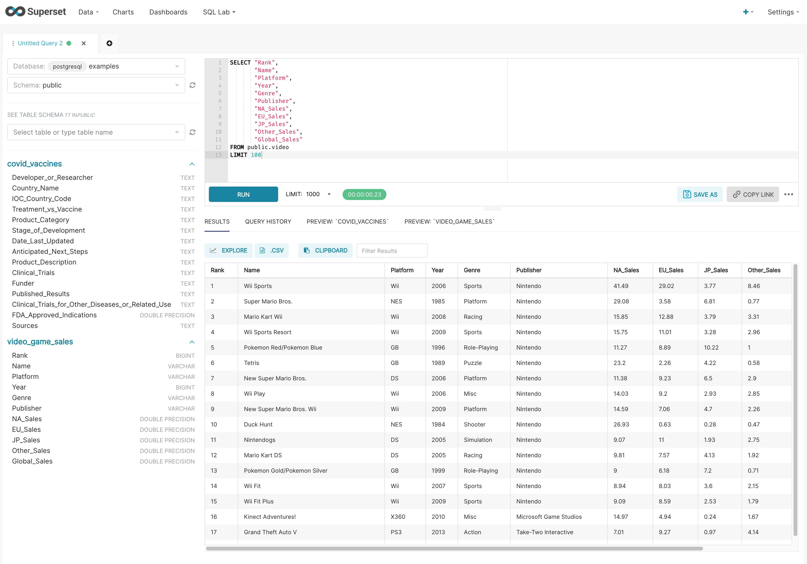

<!--
Licensed to the Apache Software Foundation (ASF) under one
or more contributor license agreements.  See the NOTICE file
distributed with this work for additional information
regarding copyright ownership.  The ASF licenses this file
to you under the Apache License, Version 2.0 (the
"License"); you may not use this file except in compliance
with the License.  You may obtain a copy of the License at

  http://www.apache.org/licenses/LICENSE-2.0

Unless required by applicable law or agreed to in writing,
software distributed under the License is distributed on an
"AS IS" BASIS, WITHOUT WARRANTIES OR CONDITIONS OF ANY
KIND, either express or implied.  See the License for the
specific language governing permissions and limitations
under the License.
-->

# Superset

A modern, enterprise-ready business intelligence web application.

[**Why Superset?**](#why-superset) |
[**Supported Databases**](#supported-databases) |
[**Installation and Configuration**](#installation-and-configuration) |
[**Release Notes**](RELEASING/README.md#release-notes-for-recent-releases) |
[**Get Involved**](#get-involved) |
[**Contributor Guide**](#contributor-guide) |
[**Resources**](#resources) |
[**Organizations Using Superset**](RESOURCES/INTHEWILD.md)

## Screenshots & Gifs

**Gallery**

<kbd></kbd> 

**View Dashboards**

<kbd></kbd> 

**Slice & dice your data**

<kbd></kbd> 

**Query and visualize your data with SQL Lab**

<kbd></kbd> 

**Visualize geospatial data with deck.gl**

<kbd></kbd> 

**Choose from a wide array of visualizations**

<kbd></kbd> 

## Why Superset?

Superset provides:

- An intuitive interface for visualizing datasets and
  crafting interactive dashboards
- A wide array of beautiful visualizations to showcase your data
- Code-free visualization builder to extract and present datasets
- A world-class SQL IDE for preparing data for visualization, including a rich metadata browser
- A lightweight semantic layer which empowers data analysts to quickly define custom dimensions and metrics
- Out-of-the-box support for most SQL-speaking databases
- Seamless, in-memory asynchronous caching and queries
- An extensible security model that allows configuration of very intricate rules
  on who can access which product features and datasets.
- Integration with major
  authentication backends (database, OpenID, LDAP, OAuth, REMOTE_USER, etc)
- The ability to add custom visualization plugins
- An API for programmatic customization
- A cloud-native architecture designed from the ground up for scale

## Supported Databases

Superset can query data from any SQL-speaking datastore or data engine (e.g. Presto or Athena) that has a Python DB-API driver and a SQLAlchemy dialect.

Here are some of the major database solutions that are supported:

  
  
  
  
  
  
  
  
  
  
  
  
  
  
  
  
  
  
  
  
  
  
  

**A more comprehensive list of supported databases** along with the configuration instructions can be found
[here](https://superset.apache.org/docs/databases/installing-database-drivers).

Want to add support for your datastore or data engine? Read more [here](https://superset.apache.org/docs/frequently-asked-questions#does-superset-work-with-insert-database-engine-here) about the technical requirements.

## Installation and Configuration

[Extended documentation for Superset](https://superset.apache.org/docs/installation/installing-superset-using-docker-compose)

## Get Involved

- Ask and answer questions on [StackOverflow](https://stackoverflow.com/questions/tagged/apache-superset) using the **apache-superset** tag
- [Join our community's Slack](https://join.slack.com/t/apache-superset/shared_invite/zt-uxbh5g36-AISUtHbzOXcu0BIj7kgUaw)
  and please read our [Slack Community Guidelines](https://github.com/apache/superset/blob/master/CODE_OF_CONDUCT.md#slack-community-guidelines)
- [Join our dev@superset.apache.org Mailing list](https://lists.apache.org/list.html?dev@superset.apache.org)

## Contributor Guide

Interested in contributing? Check out our
[CONTRIBUTING.md](https://github.com/apache/superset/blob/master/CONTRIBUTING.md)
to find resources around contributing along with a detailed guide on
how to set up a development environment.

## Resources

- Superset 1.0
  - [Superset 1.0 Milestone](https://superset.apache.org/docs/version-one)
  - [Superset 1.0 Release Notes](https://github.com/apache/superset/tree/master/RELEASING/release-notes-1-0)
- Getting Started with Superset
  - [Superset in 2 Minutes using Docker Compose](https://superset.apache.org/docs/installation/installing-superset-using-docker-compose#installing-superset-locally-using-docker-compose)
  - [Installing Database Drivers](https://superset.apache.org/docs/databases/dockeradddrivers)
  - [Building New Database Connectors](https://preset.io/blog/building-database-connector/)
  - [Create Your First Dashboard](https://superset.apache.org/docs/creating-charts-dashboards/first-dashboard)
- [Documentation for Superset End-Users (by Preset)](https://docs.preset.io/docs/terminology)
- Deploying Superset
  - [Official Docker image](https://hub.docker.com/r/apache/superset)
  - [Helm Chart](https://github.com/apache/superset/tree/master/helm/superset)
- [Recordings of Past Community Events](https://www.youtube.com/channel/UCMuwrvBsg_jjI2gLcm04R0g)
  - [Meetup: Superset 1.0](https://www.youtube.com/watch?v=gEZkFF2kokk)
  - [Live Demo: Interactive Time-series Analysis with Druid and Superset](https://www.youtube.com/watch?v=4eh7OTfMln8)
  - [Live Demo: Visualizing MongoDB and Pinot Data using Trino](https://www.youtube.com/watch?v=Dw_al_26F6o)
- Upcoming Superset Events
  - [Superset + Star Wars: May the 4th Be With You](https://preset.io/events/2021-05-04-superset-star-wars-may-the-4th-be-with-you)
  - [Meetup - Developing and Deploying Custom Visualization Plugins in Superset](https://www.meetup.com/Global-Apache-Superset-Community-Meetup/events/277835486/)
  - [Visualize Your Data Lake Using Athena and Superset](https://preset.io/events/2021-05-18-visualize-your-data-lake-using-athena-and-superset)
- Visualizations
  - [Building Custom Viz Plugins](https://superset.apache.org/docs/installation/building-custom-viz-plugins)
  - [Managing and Deploying Custom Viz Plugins](https://medium.com/nmc-techblog/apache-superset-manage-custom-viz-plugins-in-production-9fde1a708e55)
  - [Why Apache Superset is Betting on Apache ECharts](https://preset.io/blog/2021-4-1-why-echarts/)
- [Superset API](https://superset.apache.org/docs/rest-api)
