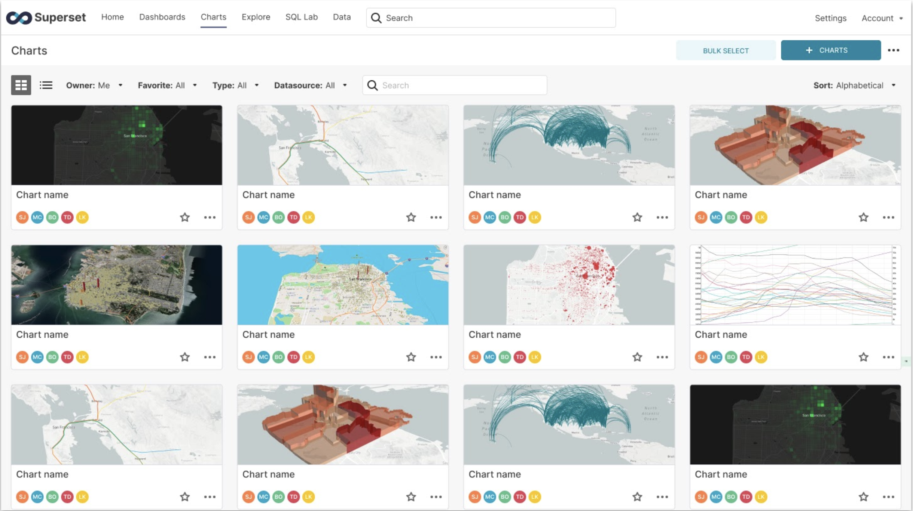
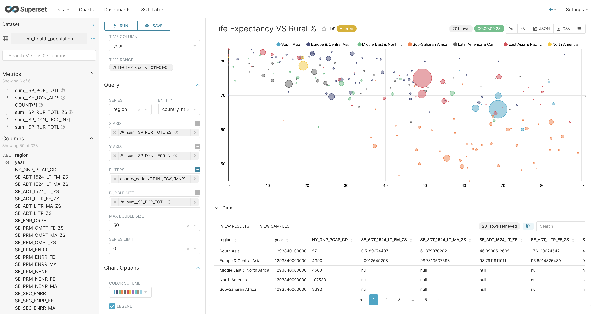
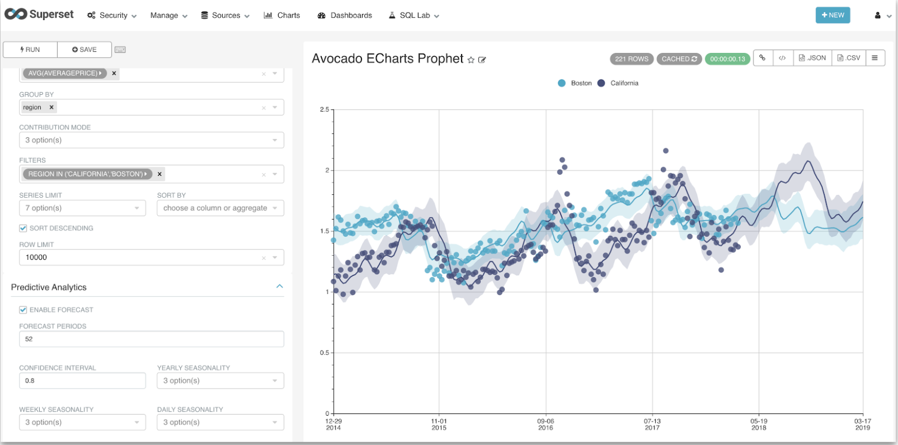
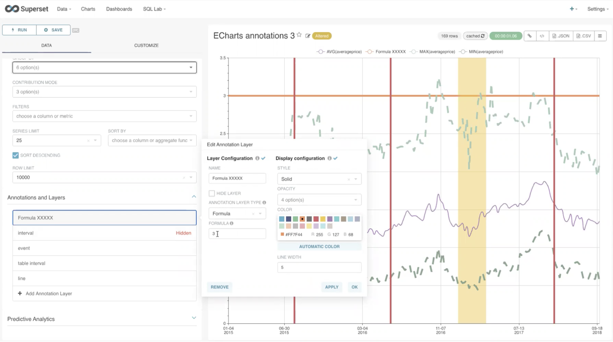
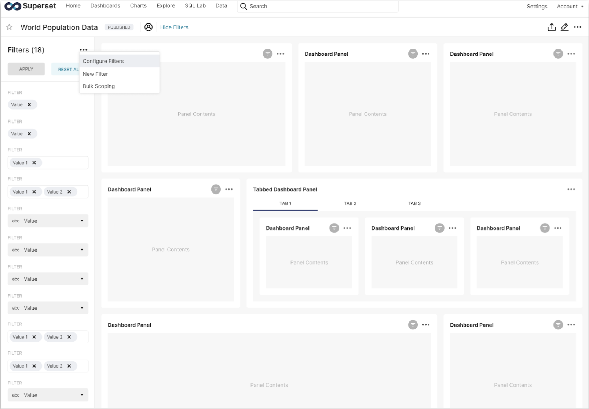
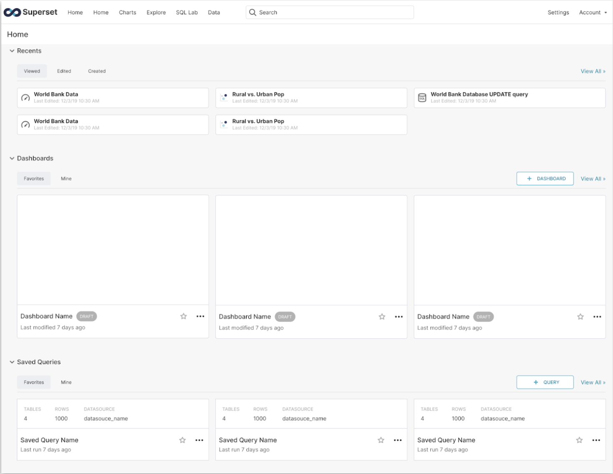
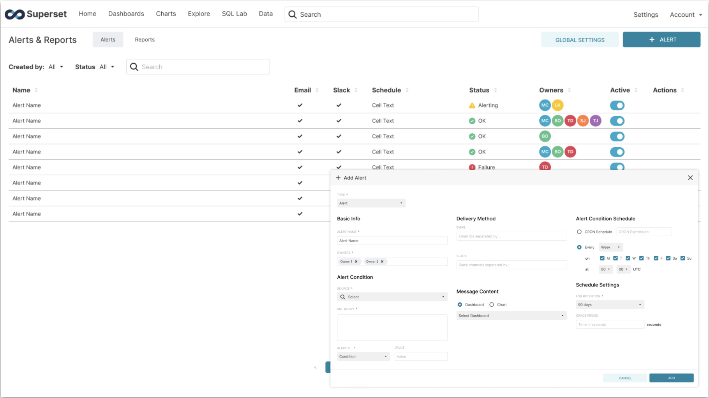

<!--
Licensed to the Apache Software Foundation (ASF) under one
or more contributor license agreements.  See the NOTICE file
distributed with this work for additional information
regarding copyright ownership.  The ASF licenses this file
to you under the Apache License, Version 2.0 (the
"License"); you may not use this file except in compliance
with the License.  You may obtain a copy of the License at

  http://www.apache.org/licenses/LICENSE-2.0

Unless required by applicable law or agreed to in writing,
software distributed under the License is distributed on an
"AS IS" BASIS, WITHOUT WARRANTIES OR CONDITIONS OF ANY
KIND, either express or implied.  See the License for the
specific language governing permissions and limitations
under the License.
-->
# Release Notes for Superset 1.0

Superset 1.0 is the first major release for Apache Superset. This release holds a higher quality standard than any previous version and raises the bar for releases to come. Superset 1.0 improves on usability and delivers a new set of long awaited features focused on five major themes:
- [**User Experience**](#user-experience)
- [**Developer Experience**](#developer-experience)
- [**Performance**](#performance)
- [**New Features**](#new-features)
- [**Stability and Bugfixes**](#stability-and-bugfixes)

# User Experience
We have taken the Superset user experience to the next level with a much simpler, more intuitive UI.

Lists of Charts and Dashboards are shown in a new format using a grid of thumbnails. This makes it easier to discover and find Charts and Dashboards, especially when there are a lot of them in your Superset instance.

<kbd></kbd>

Visualization controls have been updated to create a more consistent and modernized interface. Refactoring includes updates to the content/labeling/ordering of these controls as well as updating their styling and simplifying their interactions and layout. This will line us up for features like drag-and-drop controls, and dynamically populated control inputs in future releases.

<kbd></kbd>

Users also now have the ability to create and name a new dataset or update an existing dataset when moving from SQL Lab to Explore. When going back to SQL Lab, the underlying query for the dataset will be shown, allowing users to easily make changes and update their dataset when moving between SQL Lab and Explore.

The [Superset 1.0 documentation](https://superset.apache.org/docs/intro) has been updated to reflect the current design and functionality.

See related PR highlights [here](#user-experience-1).

# Developer Experience
Superset 1.0 makes it easier for developers to build, deploy, and maintain Superset functionality. This release is a major milestone in an ongoing effort to modernize, consolidate, and simplify the interface elements of Superset. Highly-used components have been visually updated, refactored to modern component libraries, and integrated with React Storybook for immediate visibility with consolidated test/styles. This improves the developer experience and creates a more consistent and modern aesthetic for the user.

See related PR highlights [here](#developer-experience-1).

# Performance
This the most performant Superset release to date, with enhanced scalability and efficiency. In addition to many small tweaks, Charts and SQL Lab both now support asynchronous data loading. Users will feel this improvement when loading query results, especially when there are many charts in a Dashboard or when queries are long running.

See related PR highlights [here](#performance-1).

# New Features
Superset 1.0 includes some other new features and enhancements. New visualization plugin architecture will make it easier to build, test, style and configure custom visualizations for Superset. Dynamic viz plugin imports will allow Superset to load data viz plugins, allowing developers to more easily use or share their custom plugins and load custom plugins on-demand. Superset has also adopted Apache ECharts as the core library for new visualizations.

<kbd></kbd>

Along with the Echarts integration, we are also introducing a better set of annotation features. Formula annotation, which allows users to plot any mathematical function on the chart; Interval and Event annotations, will allow users to add context to the trent in Time-Series; and Line annotation, which use a predefined chart as the source of annotation.

<kbd></kbd>

Unlike many other BI tools, Superset's dashboard filter lives as a chart, which needs to be created in the Explore view and added to dashboard as a chart/component. To improve the usability and user experience, we are introducing a new dashboard filter as a dashboard-native component, allowing users to create, add, and edit filters quickly at the dashboard level.

<kbd></kbd>

A redesigned home screen provides a personalized landing page that the user sees when they log into Superset, improving discoverability. It shows items relevant to the user (Charts, Dashboards, Saved Queries, etc) and serves as a hub to discover content and access recent items quickly.

<kbd></kbd>

Charts on dashboards have been updated to concisely show which filters are in scope, have been applied, or are in error. Context around filter changes has been increased by highlighting scoped charts when a filter is selected and increasing visibility of charts with incompatible filters applied.

<kbd></kbd>

Alerts and reporting have received a robust backend and UI overhaul.

<kbd></kbd>

See related PR highlights [here](#new-features-1).

# Stability and Bugfixes
This release emphasizes hardening and squashing bugs, with hundreds of bugfixes. Future major releases will see a continued emphasis on providing a stable and bug-free experience.

# Community Spotlight
blurb

# PR Highlights
## User Experience
- Revert "refactor: Remove usages of reactable from TimeTable (#11046)" (#[11150](https://github.com/apache/incubator-superset/pull/11150))
- style: Restoring menu highlights (#[12024](https://github.com/apache/incubator-superset/pull/12024))
- style: eslint curly rule (#[11913](https://github.com/apache/incubator-superset/pull/11913))
- style: remove react bootstrap fade component (#[11843](https://github.com/apache/incubator-superset/pull/11843))
- style: dark filter popover background (#[11611](https://github.com/apache/incubator-superset/pull/11611))

### Card Layout
Lists of Charts and Dashboards are shown in a new format using a grid of thumbnails. This makes it easier to discover and find Charts and Dashboards, especially when there is a lot of them in your Superset instance.

### Explore Controls
Visualization controls have been updated to create a more consistent and modernized interface. Refactoring includes updates to the content/labeling/ordering of these controls as well as updating their styling and simplifying their interactions and layout. This will line us up for features like drag-and-drop controls, and dynamically populated control inputs.

- feat: Global nav menus open on hover (#[12025](https://github.com/apache/incubator-superset/pull/12025))
- feat: add hook for dataset health check (#[11970](https://github.com/apache/incubator-superset/pull/11970))
- feat: add modal to import dashboards (#[11924](https://github.com/apache/incubator-superset/pull/11924))
- feat: add modal to import charts (#[11956](https://github.com/apache/incubator-superset/pull/11956))
- feat: add modal to import datasets (#[11910](https://github.com/apache/incubator-superset/pull/11910))
- feat: add modal to import databases (#[11884](https://github.com/apache/incubator-superset/pull/11884))
- feat: Results table on Explore view (#[11854](https://github.com/apache/incubator-superset/pull/11854))
- feat: report/alert list CRUD view (#[11802](https://github.com/apache/incubator-superset/pull/11802))
- feat: filter by me on CRUD list view (#[11683](https://github.com/apache/incubator-superset/pull/11683))
- feat(explore-datasource): add new datasource tab to explore view (#[12008](https://github.com/apache/incubator-superset/pull/12008))
- feat(explore): time picker enhancement (#[11418](https://github.com/apache/incubator-superset/pull/11418))
- feat(explore): metrics and filters controls redesign (#[12095](https://github.com/apache/incubator-superset/pull/12095))
- feat(explore): change save button text when users cannot override (#[11281](https://github.com/apache/incubator-superset/pull/11281))
- feat(explore): update the order of datasource dropdown menu (#[11424](https://github.com/apache/incubator-superset/pull/11424))
## SQL Lab
Users now have the ability to create and name a new dataset or update an existing dataset when moving from SQL Lab to Explore. When going back to SQL Lab, the underlying query for the dataset will be shown, allowing users to easily make changes and update their dataset when moving between SQL Lab and Explore.

- feat: initial custom error messages for SQL Lab (#[12080](https://github.com/apache/incubator-superset/pull/12080))
- feat: show missing parameters in query (#[12049](https://github.com/apache/incubator-superset/pull/12049))
- feat: Sqllab to Explore UX improvements (#[11755](https://github.com/apache/incubator-superset/pull/11755))
- feat: add Postgres SQL validator (#[11538](https://github.com/apache/incubator-superset/pull/11538))
- feat: run BQ queries as single statement (#[11904](https://github.com/apache/incubator-superset/pull/11904))
- feat: Adding SaveDatasetModal component (#[11861](https://github.com/apache/incubator-superset/pull/11861))
- feat: list view filters for Query History  (#[11702](https://github.com/apache/incubator-superset/pull/11702))
- feat: Sqllab to Explore UX improvements api changes (#[11836](https://github.com/apache/incubator-superset/pull/11836))
- feat: SQL preview modal for Query History (#[11634](https://github.com/apache/incubator-superset/pull/11634))
- feat: Query History CRUD list view (#[11574](https://github.com/apache/incubator-superset/pull/11574))
- feat: add UUID column to saved_query for export/import (#[11397](https://github.com/apache/incubator-superset/pull/11397))
- feat: saved queries with execution info (#[11391](https://github.com/apache/incubator-superset/pull/11391))
- feat: saved query preview modal (#[11135](https://github.com/apache/incubator-superset/pull/11135))
- feat(saved queries): security perm simplification (#[11764](https://github.com/apache/incubator-superset/pull/11764))
- feat(welcome): add SQL snippets to saved queries card (#[11678](https://github.com/apache/incubator-superset/pull/11678))
## Documentation
The [Superset 1.0 documentation](https://superset.apache.org/docs/intro) has been updated to reflect the current design and functionality.

- docs: restored page on roles in security, executed other touchups, and… (#[11978](https://github.com/apache/incubator-superset/pull/11978))
- docs: 0.38.0 CHANGELOG and UPDATING (#[11809](https://github.com/apache/incubator-superset/pull/11809))
- docs: add Xite to users list (#[11775](https://github.com/apache/incubator-superset/pull/11775))
- docs: fix docker config paths (#[11703](https://github.com/apache/incubator-superset/pull/11703))
- docs: add support for Google Analytics on superset.apache.org (#[11613](https://github.com/apache/incubator-superset/pull/11613))
- docs: add Avesta to users list (#[11551](https://github.com/apache/incubator-superset/pull/11551))
- docs: add Xendit to users list (#[11361](https://github.com/apache/incubator-superset/pull/11361))
- docs: fix db drivers PG and ES (#[11504](https://github.com/apache/incubator-superset/pull/11504))
- docs: improve docs and update apache release scripts (#[11457](https://github.com/apache/incubator-superset/pull/11457))
- docs: Update Dremio doc with Arrow Flight connection details (#[11422](https://github.com/apache/incubator-superset/pull/11422))
- docs: Add semantic prefix info for PR titles (#[11398](https://github.com/apache/incubator-superset/pull/11398))
- docs: fix typo (#[11129](https://github.com/apache/incubator-superset/pull/11129))
- docs: add VLMedia to users list (#[11386](https://github.com/apache/incubator-superset/pull/11386))
- docs: Fix typo in installing from scratch (#[11026](https://github.com/apache/incubator-superset/pull/11026))
- docs: add a roadmap page pointing to SIP-53 (#[11169](https://github.com/apache/incubator-superset/pull/11169))
- docs: add note about migration in #11098 to Changelog (#[11256](https://github.com/apache/incubator-superset/pull/11256))
- docs: Add utair to list of companies using Apache Superset (#[11261](https://github.com/apache/incubator-superset/pull/11261))
- docs: don't link to database engine pages (#[11242](https://github.com/apache/incubator-superset/pull/11242))
- docs: Added Dremio to superset home page (#[11231](https://github.com/apache/incubator-superset/pull/11231))
- docs: typo (#[11152](https://github.com/apache/incubator-superset/pull/11152))
- docs: add API page to docs using Swagger UI (#[11154](https://github.com/apache/incubator-superset/pull/11154))
- docs(release): small fixes and deprecate apache docs (#[11827](https://github.com/apache/incubator-superset/pull/11827))
- docs(releasing): update release automation and docs for Apache graduation (#[12117](https://github.com/apache/incubator-superset/pull/12117))
- feat: Add new default dashboard (#[12044](https://github.com/apache/incubator-superset/pull/12044))
# Developer Experience
Superset 1.0 makes it easier for developers to build, deploy, and maintain Superset functionality.

- feat: add endpoint to export saved queries using new format (#[11447](https://github.com/apache/incubator-superset/pull/11447))
## Single Page Application
deprecated

## Component Library
This release is a major milestone in an ongoing effort to modernize, consolidate, and simplify the interface elements of Superset. Highly-used components have been visually updated, refactored to modern component libraries, and integrated with React Storybook for immediate visibility with consolidated test/styles. This will ease developer experience and create a more consistent and modern aesthetic for the user.

- build(deps-dev): update cypress to 5.5.0, improvements for running locally (#[11603](https://github.com/apache/incubator-superset/pull/11603))
- build(deps-dev): bump less from 3.9.0 to 3.12.2 in /superset-frontend (#[11597](https://github.com/apache/incubator-superset/pull/11597))
- build(deps-dev): bump @storybook/addon-essentials in /superset-frontend (#[11573](https://github.com/apache/incubator-superset/pull/11573))
- build(deps-dev): bump node-fetch in /superset-frontend (#[11485](https://github.com/apache/incubator-superset/pull/11485))
- build(deps): bump @emotion/core in /superset-frontend (#[11518](https://github.com/apache/incubator-superset/pull/11518))
- build(deps): bump core-js from 3.2.1 to 3.6.5 in /superset-frontend (#[11522](https://github.com/apache/incubator-superset/pull/11522))
- build(deps): bump object-path from 0.11.4 to 0.11.5 in /docs (#[11484](https://github.com/apache/incubator-superset/pull/11484))
- build(deps): bump lodash in /superset-frontend/cypress-base (#[11483](https://github.com/apache/incubator-superset/pull/11483))
- chore: bump nvd3 plugin version (#[11947](https://github.com/apache/incubator-superset/pull/11947))
- chore: bump pypi cryptography from 2.4.2 to 3.2.1 (#[11511](https://github.com/apache/incubator-superset/pull/11511))
# Performance
This the most performant Superset release to date, with enhanced scalability and efficiency.

- perf: cache dashboard bootstrap data (#[11234](https://github.com/apache/incubator-superset/pull/11234))
- perf:  speed up uuid column generation (#[11209](https://github.com/apache/incubator-superset/pull/11209))
- perf(api): improve API info performance (#[11346](https://github.com/apache/incubator-superset/pull/11346))

## Global Async Query Support
Charts and SQL Lab both now support asynchronous data loading. This will improve performance and user experience when loading query results, especially when there are many charts in a Dashboard or when queries are long running.

- feat(SIP-39): Async query support for charts (#[11499](https://github.com/apache/incubator-superset/pull/11499))
# New Features
Superset 1.0 includes some other new features and enhancements.

## Improved Data Visualizations
New visualization plugin architecture will make it easier to build, test, style and configure custom visualizations for Superset. Dynamic viz plugin imports will allow Superset to load data viz plugins, allowing  developers to more easily use or share their custom plugins and load custom plugins on-demand. Superset has also adopted Apache ECharts as the core library for new visualizations.

- feat: add event and interval annotation support to chart data ep (#[11665](https://github.com/apache/incubator-superset/pull/11665))
- feat: add ECharts BoxPlot chart (#[11199](https://github.com/apache/incubator-superset/pull/11199))
- feat(sankey-viz): allow sort by metric and bump superset-ui packages (#[11626](https://github.com/apache/incubator-superset/pull/11626))
## Discovery and Navigation
A redesigned home screen and landing page makes discoverability much easier. Global Search gives users the ability to access search from all pages in the app. This can be used to search across databases, datasets, charts, dashboards, and queries.

- chore: Add home link to navbar (#[11851](https://github.com/apache/incubator-superset/pull/11851))
- chore(home-screen): fixes for loading states, flicker issue, and reduction of api calls (#[11557](https://github.com/apache/incubator-superset/pull/11557))
- feat: alert/report execution log list view (#[11937](https://github.com/apache/incubator-superset/pull/11937))
- feat: home screen mvp  (#[11206](https://github.com/apache/incubator-superset/pull/11206))
- style: various little tweaks to home screen stylin' (#[11650](https://github.com/apache/incubator-superset/pull/11650))
## Alerts and Reporting
Alerts and reporting have received a robust backend and UI overhaul.

- feat: update alert/report icons and column order (#[12081](https://github.com/apache/incubator-superset/pull/12081))
- feat: add cron picker to AlertReportModal (#[12032](https://github.com/apache/incubator-superset/pull/12032))
- feat: alerts/reports add/edit modal (#[11770](https://github.com/apache/incubator-superset/pull/11770))
- feat: filters for alerts and reports list view  (#[11900](https://github.com/apache/incubator-superset/pull/11900))
- feat(alert/report): add 'not null' condition option to modal (#[12077](https://github.com/apache/incubator-superset/pull/12077))
- feat(alerts/reports): remove SIP_34_UI feature flag (#[12085](https://github.com/apache/incubator-superset/pull/12085))
- feat(alerts/reports): add refresh action (#[12071](https://github.com/apache/incubator-superset/pull/12071))
- feat(alerts/reports): delete and bulk delete actions (#[12053](https://github.com/apache/incubator-superset/pull/12053))
- feat(releasing): support changelog csv export (#[11893](https://github.com/apache/incubator-superset/pull/11893))

# Breaking Changes
## Breaking Changes
[List of backwards incompatible changes](https://github.com/apache/incubator-superset/blob/master/UPDATING.md#0380)

## Complete Changelog
For the complete changelog, see [apache/incubator-superset/CHANGELOG.md](https://github.com/apache/incubator-superset/blob/master/CHANGELOG.md)
``