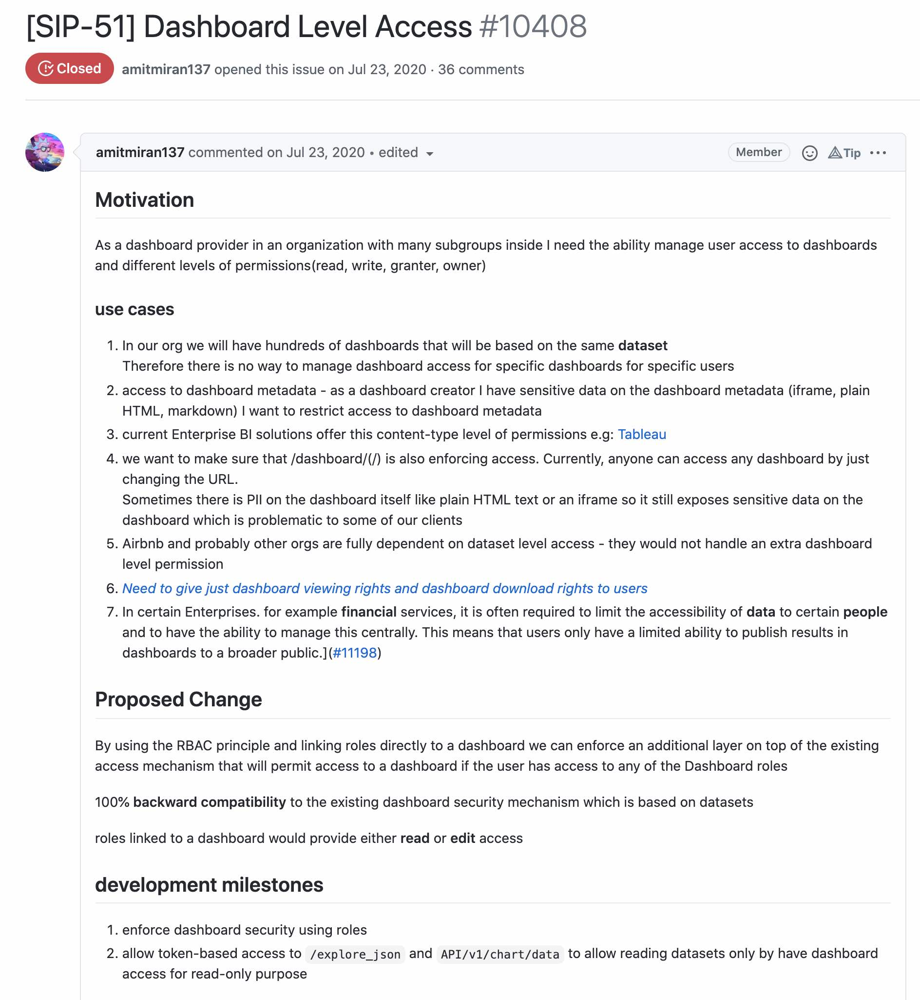

<!--
Licensed to the Apache Software Foundation (ASF) under one
or more contributor license agreements.  See the NOTICE file
distributed with this work for additional information
regarding copyright ownership.  The ASF licenses this file
to you under the Apache License, Version 2.0 (the
"License"); you may not use this file except in compliance
with the License.  You may obtain a copy of the License at

  http://www.apache.org/licenses/LICENSE-2.0

Unless required by applicable law or agreed to in writing,
software distributed under the License is distributed on an
"AS IS" BASIS, WITHOUT WARRANTIES OR CONDITIONS OF ANY
KIND, either express or implied.  See the License for the
specific language governing permissions and limitations
under the License.
-->

# Release Notes for Superset 1.2

Superset 1.2 continues the Apache ECharts migration by introducing a number of chart types, inbcludes tons of bugfixes, and builds on experimental features included in previous releases. 

- [**User Experience**](#user-experience)
- [**Dashboard Level Security**](#dashboard-level-security)
- [**Dashboard Native Filters**](#dashboard-native-filters)
- [**Database Connectivity**](#database-connectivity)
- [**Developer Experience**](#developer-experience
- [**PR Highlights**](#pr-highlights)
- [**Breaking Changes and Full Changelog**](#breaking-changes-and-full-changelog)

# User Experience

The ongoing migration to Apache ECharts introduces a more new high-quality visualizations in this release.

The mixed time-series multichart allows different kinds of time-series visualization associated with different sources to be overlayed.

The radar chart provides a good way compare two or more groups over various features.

By popular demand, we have introduced a new version of the pivot table visualization as well.

A number of UI tweaks in explore and sql lab made it into this release as well, with new buttons and menu options appearing to make common workflows easier.

![image]

The dashboard native filter feature, [while still behind a feature flag in this release,](https://github.com/apache/superset/blob/master/RELEASING/release-notes-1-0/README.md#feature-flags) has been improved and is ready to test out.

# Dashboard Level Security

Superset has so far relied on a role based access system implemented at the dataset level. While this provides granular security options that satisfy many use cases, some organizations need more options. [SIP-51](https://github.com/apache/superset/issues/10408) lays out a vision for dashboard level role based access control as a fully backwards compatible extension to Superset's security options.

The 1.1 release saw steps taken in the direction of this vision, and 1.2 builds on that with new permissions for sharing charts and dashboards that can be assigned to roles. **Note that this functionality is still experimental and hidden behind feature flag as of 1.2.**

![dashboard rbac]

# Database Connectivity

Superset is only as good as the databases it can query. This release saw the expanded support of existing databases and foundational support for new databases.

- [Opendistro](https://github.com/apache/superset/pull/12602)
- [Trino](https://github.com/apache/superset/pull/13105)
- [CrateDB](https://github.com/apache/superset/pull/13152/files)
- [Apache Pinot](https://github.com/apache/superset/pull/13163)
- [Presto](https://github.com/apache/superset/pull/13214)
- [BigQuery](https://github.com/apache/superset/pull/12581)
- [Postgres](https://github.com/apache/superset/pull/11720)
- [Google Sheets](https://github.com/apache/superset/pull/13185)
- [Athena](https://github.com/apache/superset/pull/13201)

# PR Highlights

**New Charts and User Experience**

**Progress On Dashboard Native Filters**

**Progress On Dashboard Level Access**

**Improvements to Developer Experience**

- chore: add non-dev docker-compose workflow (#[13143](https://github.com/apache/superset/pull/13143))
- feat(style-theme): add support for custom superset themes (#[12858](https://github.com/apache/superset/pull/12858))
- feat: Move SQLAlchemy url reference to config (#[13182](https://github.com/apache/superset/pull/13182))
- feat(helm): Evaluate configOverrides as templates (#[13130](https://github.com/apache/superset/pull/13130))
- feat(helm): Helm template for Celery beat (for reporting and alerting) (#[13116](https://github.com/apache/superset/pull/13116))
- feat: Custom superset_config.py + secret envs (#[13096](https://github.com/apache/superset/pull/13096))
- feat: Force pod restart on config changes (#[13056](https://github.com/apache/superset/pull/13056))
- feat: add separate endpoint to fetch function names for autocomplete (#[12840](https://github.com/apache/superset/pull/12840))
- feat: request ids on API related endpoints (#[12663](https://github.com/apache/superset/pull/12663))
- feat: Adding option to `set_database_uri` CLI command (#[12740](https://github.com/apache/superset/pull/12740))
- feat: add decorator to guard public APIs (#[12635](https://github.com/apache/superset/pull/12635))

## Breaking Changes and Full Changelog

- To see the complete changelog in this release, head to [CHANGELOG.MD](https://github.com/apache/superset/blob/master/CHANGELOG.md).
- You can find a list of backwards incompatible changes [here](https://github.com/apache/superset/blob/3d103e66fcaee42a6b4a42b2638e13d5e2208c3b/UPDATING.md).
