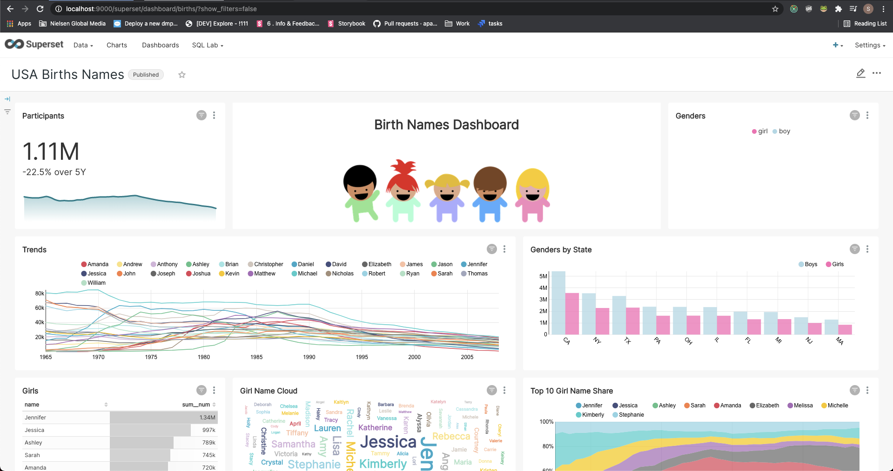

<!--
Licensed to the Apache Software Foundation (ASF) under one
or more contributor license agreements.  See the NOTICE file
distributed with this work for additional information
regarding copyright ownership.  The ASF licenses this file
to you under the Apache License, Version 2.0 (the
"License"); you may not use this file except in compliance
with the License.  You may obtain a copy of the License at

  http://www.apache.org/licenses/LICENSE-2.0

Unless required by applicable law or agreed to in writing,
software distributed under the License is distributed on an
"AS IS" BASIS, WITHOUT WARRANTIES OR CONDITIONS OF ANY
KIND, either express or implied.  See the License for the
specific language governing permissions and limitations
under the License.
-->

# Release Notes for Superset 1.3

Superset 1.3 focuses on hardening and polishing the superset user experience, with tons of UX improvements and bug fixes focused on charts, dashboards, and the new dashboard-native filters.

- [**User Experience**](#user-experience)
- [**PR Highlights**](#pr-highlights)
- [**Breaking Changes and Full Changelog**](#breaking-changes-and-full-changelog)

# User Experience
One major goal of this release is to improve and harden dashboard-native filters. These filters live at the dashboard level instead of within a chart and affect all charts under their scope within a dashboard. Improvements in this release include clearer visual indicators of what charts are within the scope of a selected filter.

Native-filters can also be set to load collapsed, which also improves connected thumbnail and alerts/reports functionality.

For charts, we've added a new funnel chart.

Users can also now use Jinja templating in calculated columns and SQL metrics.

At the dashboard level, work has been focused on improving available information and UX ergonomics. Users can now download a full .csv of the full dataset behind a table chart from the dashboard.

Continuing on the theme of making more things accessible directly from the dashboard, users can now view the SQL Query behind any chart directly from the dashboard as well.

# Developer Experience
The API has received a new endpoint to allow the developer to pass DB-specific parameters instead of the full SQLAlchemy URI.

# Database Connectivity
We have improved support for Ascend.io's engine spec and fixed a long list of bugs.

Also in the works is a new database connection UI, which should make connecting to a database easier without having to put together a SQLAlchemy URI. It's behind a feature flag for now, but it can be turned on in config.py with `FORCE_DATABASE_CONNECTIONS_SSL = True`.

# PR Highlights

- [14682](https://github.com/apache/superset/pull/14682) add ascend engine spec (#14682) (@Daniel Wood)
- [14420](https://github.com/apache/superset/pull/14420) feat: API endpoint to validate databases using separate parameters (#14420) (@Beto Dealmeida)
- [14934](https://github.com/apache/superset/pull/14934) feat: Adding FORCE_SSL as feature flag in config.py (#14934) (@AAfghahi)
- [14480](https://github.com/apache/superset/pull/14480) feat(viz): add funnel chart (#14480) (@Ville Brofeldt)

## Breaking Changes and Full Changelog

- To see the complete changelog in this release, head to [CHANGELOG.MD](../../CHANGELOG.md).
- 1.3.0 does not contain any backwards incompatible changes.
