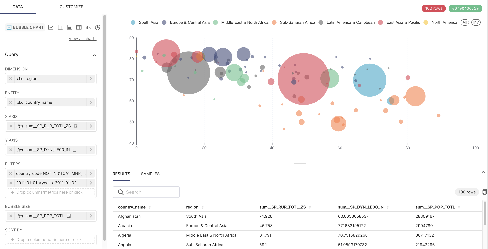
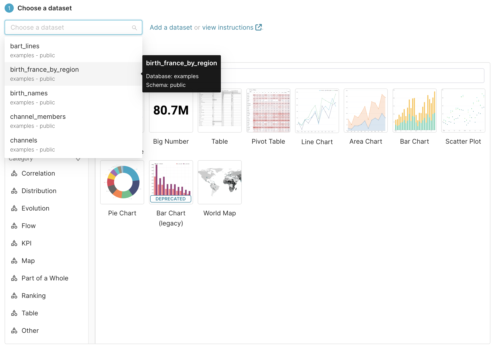
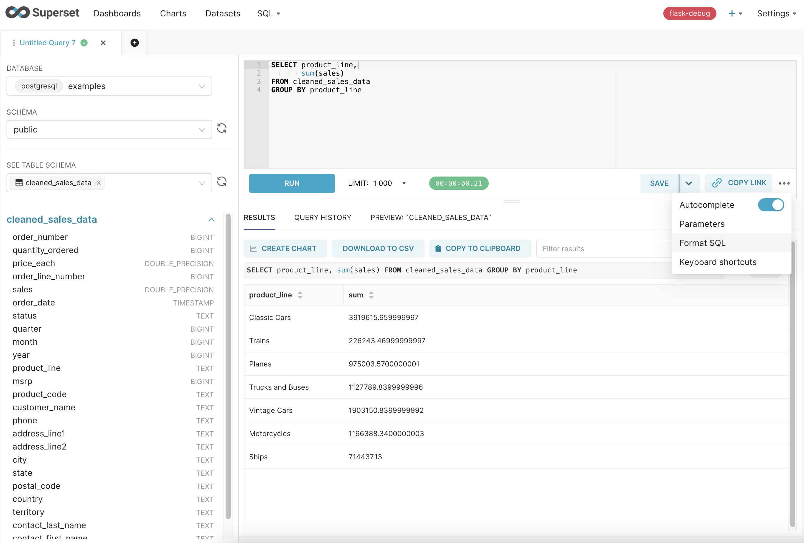
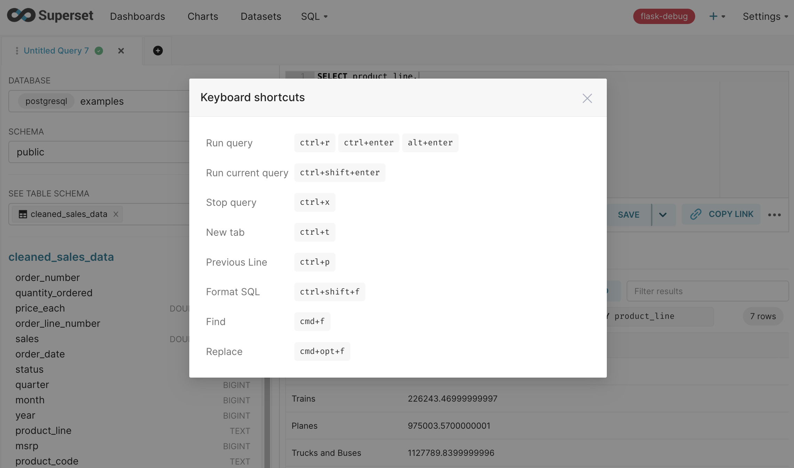
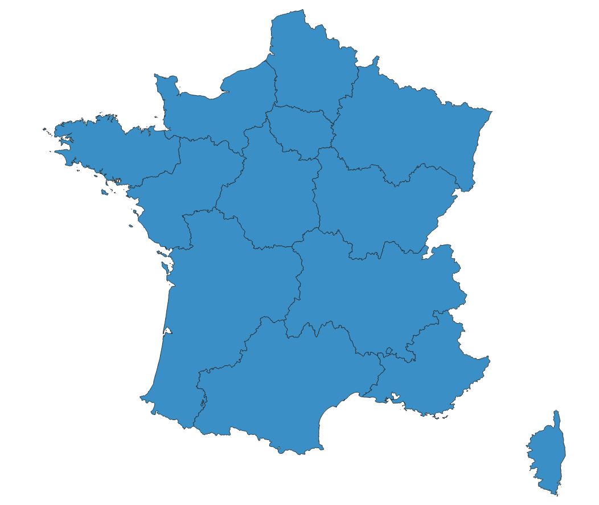
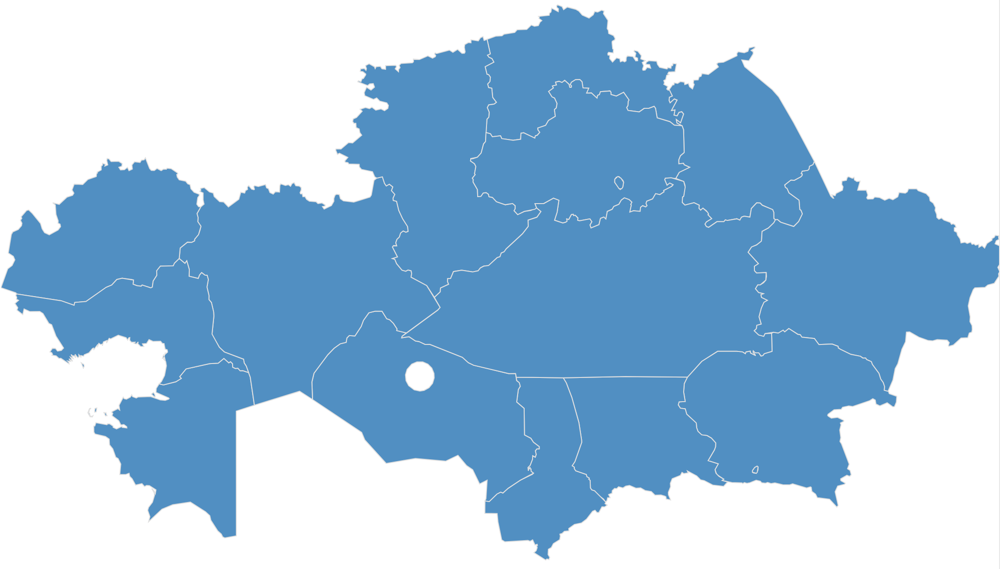
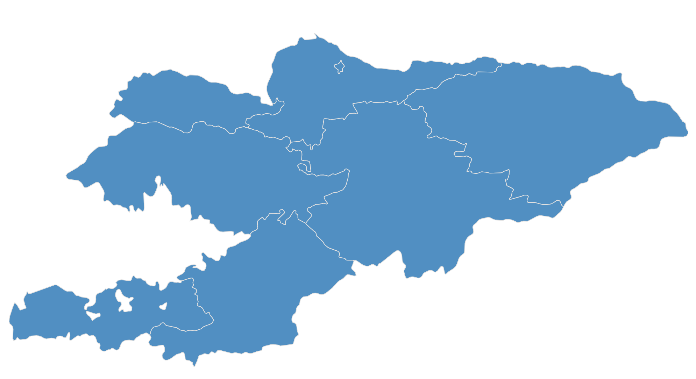
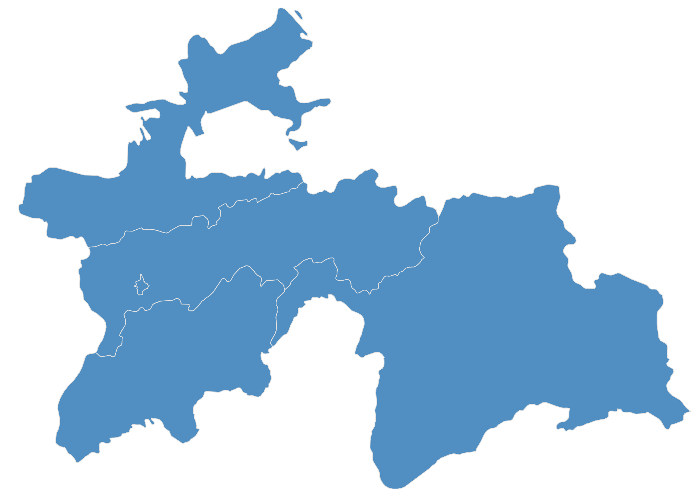
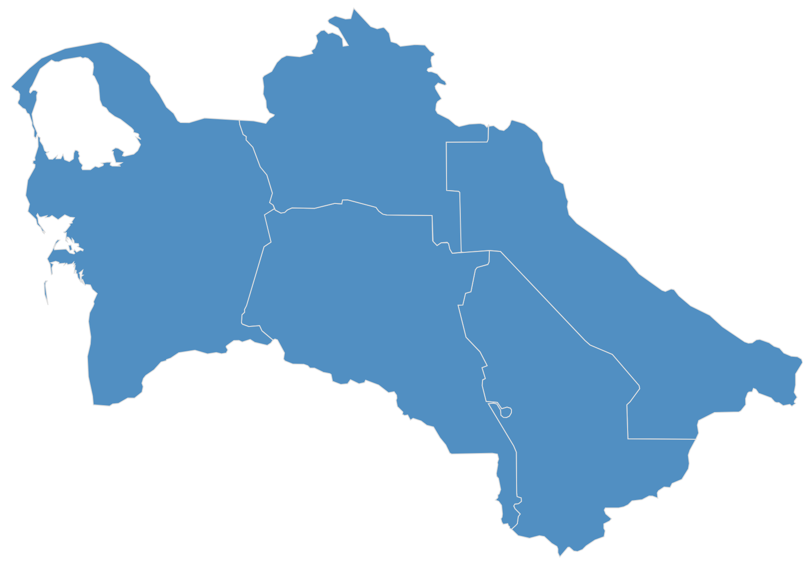
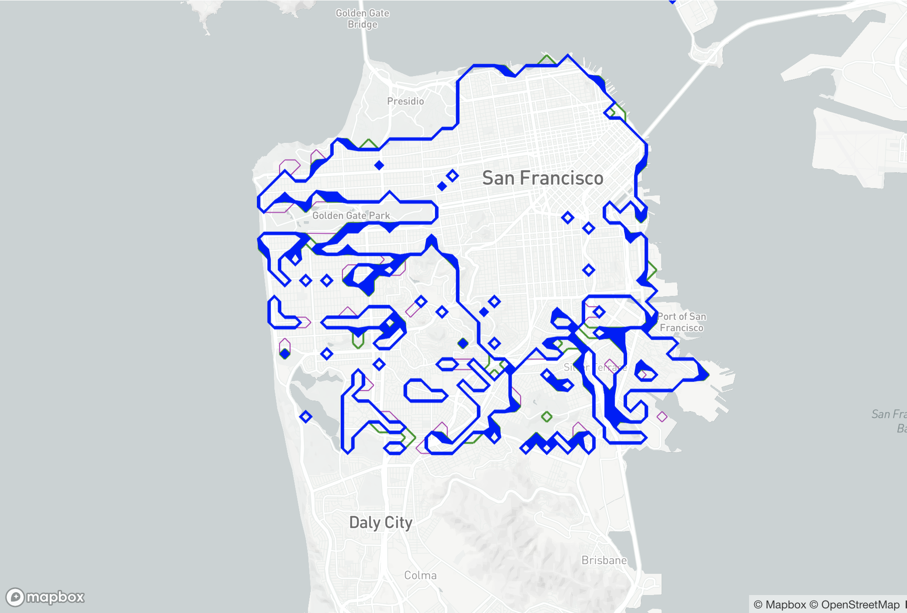

<!--
Licensed to the Apache Software Foundation (ASF) under one
or more contributor license agreements.  See the NOTICE file
distributed with this work for additional information
regarding copyright ownership.  The ASF licenses this file
to you under the Apache License, Version 2.0 (the
"License"); you may not use this file except in compliance
with the License.  You may obtain a copy of the License at

  http://www.apache.org/licenses/LICENSE-2.0

Unless required by applicable law or agreed to in writing,
software distributed under the License is distributed on an
"AS IS" BASIS, WITHOUT WARRANTIES OR CONDITIONS OF ANY
KIND, either express or implied.  See the License for the
specific language governing permissions and limitations
under the License.
-->

# Release Notes for Superset 3.1.0

Superset 3.1.0 brings a range of new features and quality of life improvements. This release is a minor version, meaning it doesn't include any breaking changes to ensure a seamless transition for our users. Here are some of the highlights of this release.

### Waterfall chart

The new [Waterfall chart](https://github.com/apache/superset/pull/25557) visualization provides a visual representation of how a value changes over time or across different categories. They are very helpful to show the cumulative effect of positive and negative changes from a starting value. Superset's Waterfall chart supports Breakdowns which can be used to analyze the contribution of different dimensions or factors to a specific metric. By breaking down the data into various categories or dimensions, you can identify the individual components that contribute to the overall variation or change in the metric.

The chart example below displays the total sales grouped by year and broken down by product line.


### Bubble Chart ECharts version

The new ECharts [Bubble chart](https://github.com/apache/superset/pull/22107) offers feature parity with the previous NVD3 version which should be removed in the next major release. This work is part of the [ECharts migration effort](https://github.com/apache/superset/issues/10418) to increase consistency and quality of our plugins. We'll add a migration to the new plugin soon which you'll be able to execute using the new CLI command.



### Improved Dataset selectors

The [dataset selectors](https://github.com/apache/superset/pull/25569) have been improved to also display the database and schema names which will help users locate the correct dataset, particularly when there are multiple tables/datasets with the same name that could benefit from disambiguation.



### SQL Lab improvements

SQL Lab received many user experience and performance improvements in this release. We’ll continue to improve the capabilities of SQL Lab with feedback from the community.

Now users can [automatically format](https://github.com/apache/superset/pull/25344) their SQL queries using the `Ctrl+Shift+F` shortcut or the Format SQL menu option available in the SQL configuration panel. Another improvement is that the results panel now shows the [executed query](https://github.com/apache/superset/pull/24787) which is very helpful when your SQL Lab editor has multiple queries.



In the SQL panel configurations, there's a menu option to show the [keyboard shortcuts](https://github.com/apache/superset/pull/25542) a user has access to.



SQL Lab has launched a non-blocking persistence mode, as outlined in [SIP-93](https://github.com/apache/superset/issues/21385). This enhancement ensures that your SQL editor content is preserved, even if your internet or service goes offline. Moreover, it improves user interaction by saving changes in a non-blocking way, similar to how Google Docs does.

Finally, the [SQL Lab module was moved to the Single Page Application](https://github.com/apache/superset/pull/25151) context. This means that both navigation and loading time of that module is significantly faster than previous versions (particularly when navigating to and from this page from other pages in Superset). This also reduces the number of requests to the server and pays some of our technical debt. Try it out! The difference is quite impressive!

### Country Map improvements

The Country Map visualization received some improvements in this release. The community added [France's regions](https://github.com/apache/superset/pull/25676) in addition to its departments and also many [Central Asia countries](https://github.com/apache/superset/pull/24870).

<table>
  <tr>
    <td width="33%">France's regions</td>
    <td width="33%">Kazakhstan</td>
    <td width="33%">Kyrgyzstan</td>
  </tr>
  <tr>
    <td width="33%"></td>
    <td width="33%"></td>
    <td width="33%"></td>
  </tr>
  <tr>
    <td width="33%">Tajikistan</td>
    <td width="33%">Turkmenistan</td>
    <td width="33%">Uzbekistan</td>
  </tr>
  <tr>
    <td width="33%"></td>
    <td width="33%"></td>
    <td width="33%"></td>
  </tr>
</table>

### Deck.gl ContourLayer

We [added](https://github.com/apache/superset/pull/24154) the Deck.gl [ContourLayer](https://deck.gl/docs/api-reference/aggregation-layers/contour-layer) which aggregates data into Isolines or Isobands for a given threshold and cell size. By expanding the range of available [Deck.gl](https://deck.gl/) visualization layers, users will have more options to choose from when creating their visualizations. This will allow them to tailor their visualizations to their specific needs and explore their data in different ways.



### New Databases

Superset has added support for two new databases:

- [Databend](https://databend.rs/), an open-source, elastic, and workload-aware cloud data warehouse built in Rust. You can see the PR [here](https://github.com/apache/superset/pull/23308), and the updated documentation [here](https://superset.apache.org/docs/databases/databend).
- [Apache Doris](https://doris.apache.org/), which is based on the MySQL protocol and introduces the concept of Multi Catalog. You can see the PR [here](https://github.com/apache/superset/pull/24714/) and the updated documentation [here](https://superset.apache.org/docs/databases/doris).

<table>
  <tr>
    <td width="50%"></td>
    <td width="50%"></td>
  </tr>
</table>

### CLI command to execute viz migrations

A new [CLI command](https://github.com/apache/superset/pull/25304) called viz-migrations was added to allow users to migrate charts of a specific type. This command is particularly helpful to migrate visualizations to their latest version and at the same time disable their legacy versions with the `VIZ_TYPE_DENYLIST` configuration. The main advantage of this command is that you can migrate your visualizations without needing to wait for a major release, where we generally remove the legacy plugins.

Currently, you can use the command to migrate Area, Bubble, Line, and Sunburst chart types but we'll add more as the ECharts migrations continue. Note that migrations for deprecated charts may be forced in upcoming major versions when the code is removed. Running migrations earlier will allow you to de-risk future upgrades while improving user experience.

```bash
Usage: superset viz-migrations [OPTIONS] COMMAND [ARGS]...

  Migrates a viz from one type to another.

Commands:
  downgrade  Downgrades a viz to the previous version.
  upgrade    Upgrade a viz to the latest version.
```

Note: When migrating dashboards from one Superset instance to another (using import/export features or the Superset CLI), or restoring a backup of prior charts and dashboards, Superset will apply the existing migrations that are used during version upgrades. This will ensure that your charts and dashboards are using the latest and greatest charts that Superset officially supports.

### Database engine spec improvements

Many database engine improvements were added in this release. Some highlights:

- [feat: improve SQLite DB engine spec](https://github.com/apache/superset/pull/24909)
- [feat: add MotherDuck DB engine spec](https://github.com/apache/superset/pull/24934)
- [feat: Add week time grain for Elasticsearch datasets](https://github.com/apache/superset/pull/25683)
- [feat: method for dynamic allows_alias_in_select](https://github.com/apache/superset/pull/25882)

We even added a new [CLI command](https://github.com/apache/superset/pull/24918) to test DB engine specs, SQLAlchemy dialects, and database connections.

```bash
Usage: superset test-db [OPTIONS] SQLALCHEMY_URI

  Run a series of tests against an analytical database.

  This command tests:
    1. The Superset DB engine spec.
    2. The SQLAlchemy dialect.
    3. The database connectivity and performance.

  It's useful for people developing DB engine specs and/or SQLAlchemy
  dialects, and also to test new versions of DB API 2.0 drivers.

Options:
  -c, --connect-args TEXT  Connect args as JSON or YAML
  --help                   Show this message and exit.
```

### Playwright as an alternative to Selenium

Per [SIP-98](https://github.com/apache/superset/issues/24948), we [introduced Playwright](https://github.com/apache/superset/pull/25247) for rendering charts in Superset reports. [Playwright](https://playwright.dev/) is an open-source library for automating web browsers, similar to Selenium but with better support for modern browser features and improved performance. By using Playwright, we aim to provide a more stable and accurate chart rendering experience in Superset reports, especially for [Deck.gl](https://deck.gl/) charts.

Since configuring Playwright requires installing additional dependencies, in order to prevent breaking changes in existing deployments, we put the new flow behind a feature flag called `PLAYWRIGHT_REPORTS_AND_THUMBNAILS`. Users that don't enable the feature flag will be unaffected by the changes.

### Pandas upgraded to v2

We [upgraded Pandas to v2](https://github.com/apache/superset/pull/24705) and [added performance dependencies](https://github.com/apache/superset/pull/24768) to provide speed improvements, especially when working with large data sets. For the full list of changes, check [Pandas 2.0.0 Release Notes](https://pandas.pydata.org/docs/dev/whatsnew/v2.0.0.html).

### Tags

Tags evolved a lot since 3.0, with many PRs that further improved the feature. During this phase, the community also made [great suggestions](https://github.com/apache/superset/discussions/25918) to make sure the feature is scalable, adhere to our security model, and offer a consistent design. We're still working on this feedback and new improvements will follow. For that reason, we're keeping the feature as beta behind the `TAGGING_SYSTEM` feature flag.
