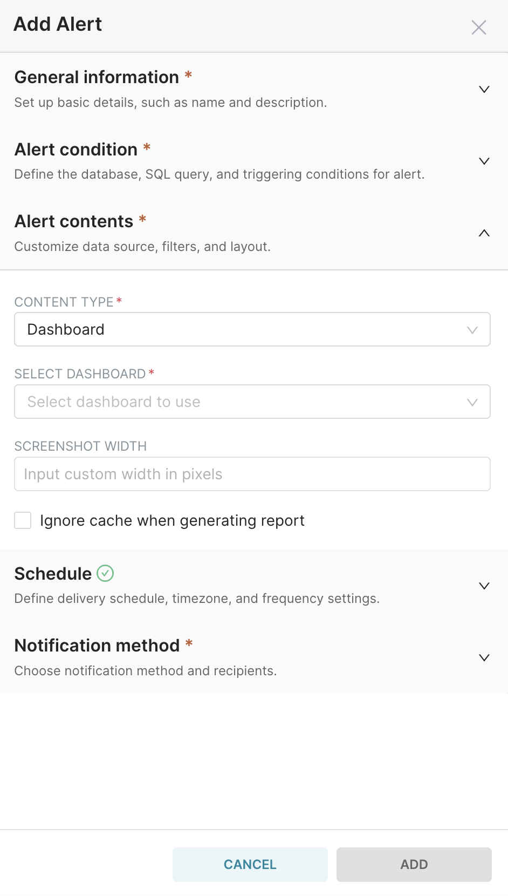
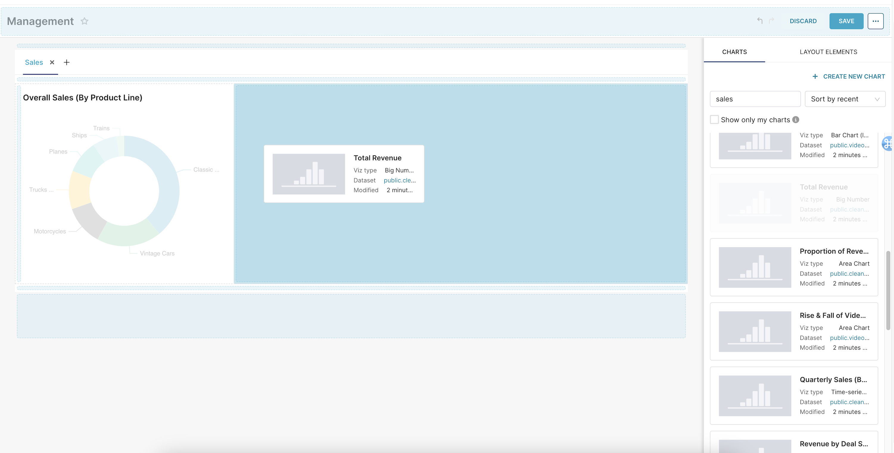
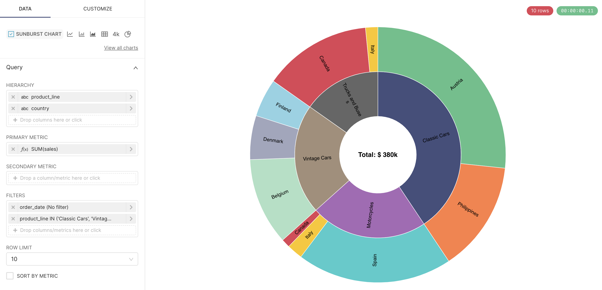

<!--
Licensed to the Apache Software Foundation (ASF) under one
or more contributor license agreements.  See the NOTICE file
distributed with this work for additional information
regarding copyright ownership.  The ASF licenses this file
to you under the Apache License, Version 2.0 (the
"License"); you may not use this file except in compliance
with the License.  You may obtain a copy of the License at

  http://www.apache.org/licenses/LICENSE-2.0

Unless required by applicable law or agreed to in writing,
software distributed under the License is distributed on an
"AS IS" BASIS, WITHOUT WARRANTIES OR CONDITIONS OF ANY
KIND, either express or implied.  See the License for the
specific language governing permissions and limitations
under the License.
-->

# Release Notes for Superset 4.0.0

4.0.0 brings a plethora of exciting changes to Superset. We have introduced several breaking changes to improve the overall architecture and scalability of our codebase. These changes may require some code updates, but they are designed to enhance performance and maintainability in the long run. We have also upgraded various dependencies to their latest versions and deprecated certain features that are no longer aligned with our long-term roadmap. We encourage all developers to carefully review the `CHANGELOG.md` and `UPDATING.md` files and update their code accordingly. Even though, our main focus was on code cleanup, this release still contain exciting new features and mark a significant milestone for us, paving the way for our continued growth and success.

Here are some of the highlights of this release.

### Alerts and Reports modal redesign

The Alerts and Reports modal has been [redesigned](https://github.com/apache/superset/discussions/25729) to improve the user experience and make it more intuitive. The new design is has the following goals:

- Declutter the interface by providing a cleaner, more organized layout
- Create a linear setup process with the necessary options in a step-by-step manner to make alert/report setup more intuitive
- Prepare the interface for additional features that will be introduced in future releases

    
    
    

### Tags

TODO @rusackas

### New CHANGELOG format

We changed the structure of the `CHANGELOG.md` file to better organize the contents of each release and also to deal with GitHub size limitations when displaying the file. Now every release will have its own file at `CHANGELOG/<version>.md`. The main `CHANGELOG.md` file is now an index with links to all releases.

- https://github.com/apache/superset/pull/26800

### Improved drag and drop experience when editing a dashboard

When a component was being dragged towards the edge of the tab container or the row/column containers, multiple drop indicators were often displayed. This created confusion about the exact insertion point of the element. To fix this, we built a distinct, non-conflicting area for the drop zone, which is highlighted during the dragging process to clearly indicate where the element will be placed. We also improved the forbidden drop zones to prevent users from dropping elements in invalid locations.

    
    

- https://github.com/apache/superset/pull/26699
- https://github.com/apache/superset/pull/26313

### Dropping support for 3.0.X versions

In accordance with our [release process](https://github.com/apache/superset/wiki/Release-Process), we are dropping support for the 3.0.X versions. As a result, we will no longer be providing bug fixes for these versions. We strongly recommend that all users upgrade to the latest version to take advantage of the newest features and bug fixes. Moving forward, the supported versions will be 3.1.X and 4.0.X. Bug fixes will continue to be backported to 3.1.X until the next minor release. For more information, please refer to our [release schedule](https://github.com/apache/superset/wiki/Release-Process#schedule).

### Feature flag changes

Following our 4.0 proposals, the following feature flags were removed:

- `VERSIONED_EXPORT`
- `DASHBOARD_FILTERS_EXPERIMENTAL`
- `ENABLE_EXPLORE_JSON_CSRF_PROTECTION`
- `ENABLE_TEMPLATE_REMOVE_FILTERS`
- `REMOVE_SLICE_LEVEL_LABEL_COLORS`
- `CLIENT_CACHE`
- `DASHBOARD_CACHE`
- `DASHBOARD_NATIVE_FILTERS_SET`
- `ENABLE_EXPLORE_DRAG_AND_DROP`
- `DISABLE_DATASET_SOURCE_EDIT`
- `DASHBOARD_NATIVE_FILTERS`
- `GENERIC_CHART_AXES`

The following feature flags were deprecated:

- `DASHBOARD_CROSS_FILTERS`
- `ENABLE_JAVASCRIPT_CONTROLS`
- `KV_STORE`

The following feature flags were enabled by default:

- `DASHBOARD_VIRTUALIZATION`
- `DRILL_BY`

### Removed features

As part of the 4.0 approved initiatives, the following features were removed from Superset:

- Filter Box: [#26328](https://github.com/apache/superset/pull/26328) removed the Filter Box code and it's associated dependencies `react-select` and `array-move`. It also removed the `DeprecatedSelect` and `AsyncSelect` components that were exclusively used by filter boxes. Existing filter boxes will be automatically migrated to native filters.

- Filter Sets: [#26369](https://github.com/apache/superset/pull/26369) removed the Filters Set feature including the deprecated `DASHBOARD_NATIVE_FILTERS_SET` feature flag and all related API endpoints. The feature is permanently removed as it was not being actively maintained, it was not widely used, and it was full of bugs. We also considered that if we were to provide a similar feature, it would be better to re-implement it from scratch given the amount of technical debt that the implementation had.

- Profile: [#26462](https://github.com/apache/superset/pull/26462) removed the Profile feature given that it was not actively maintained and not widely used.

- Redirect API: [#26377](https://github.com/apache/superset/pull/26377) removed the deprecated Redirect API that supported short URLs (`/r`) and the `url` metadata table used to store them that was used before the permalink feature. Users lost the ability to generate R links ~1.5 years ago which seems sufficient time to remove the API.

### Session management improvements

As part of [[SIP-99] Proposal for correctly handling business logic](https://github.com/apache/superset/issues/25048) (specifically [SIP-99A](https://github.com/apache/superset/issues/25107) and [SIP-99B](https://github.com/apache/superset/issues/25108)) in order to ensure a consistent "unit of work"—via a single atomic unit—all non-Alembic database operations should be associated with the same Flask-SQLAlchemy session (`db.session`).

- https://github.com/apache/superset/pull/26909
- https://github.com/apache/superset/pull/26200
- https://github.com/apache/superset/pull/26186

### All country maps are now managed via the Jupyter notebook

TODO @rusackas

- https://github.com/apache/superset/pull/26300

### Sunburst chart migrated to ECharts

The ECharts version of the Sunburst chart was introduced by [#22833](https://github.com/apache/superset/pull/22833) as part of our efforts to complete [SIP-50](https://github.com/apache/superset/issues/10418). In 4.0, legacy Sunburst charts are [automatically migrated](https://github.com/apache/superset/pull/26350) to ECharts and the legacy version was removed.

### Some cool stats

- ~15K lines of code were removed by PRs related to 4.0 proposals
- We reduced the number of NPM packages vulnerabilities by 72%
  - 3.1: 90 vulnerabilities (42 moderate, 34 high, 14 critical)
  - 4.0: 25 vulnerabilities (16 moderate, 8 high, 1 critical)
- 40+ dependency changes (upgrades, additions, and removals)
