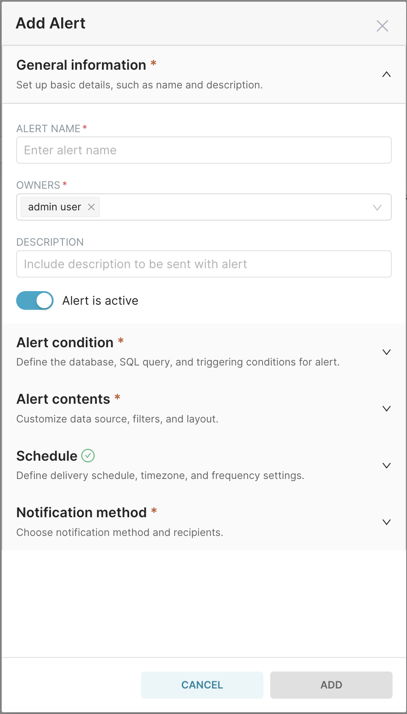

<!--
Licensed to the Apache Software Foundation (ASF) under one
or more contributor license agreements.  See the NOTICE file
distributed with this work for additional information
regarding copyright ownership.  The ASF licenses this file
to you under the Apache License, Version 2.0 (the
"License"); you may not use this file except in compliance
with the License.  You may obtain a copy of the License at

  http://www.apache.org/licenses/LICENSE-2.0

Unless required by applicable law or agreed to in writing,
software distributed under the License is distributed on an
"AS IS" BASIS, WITHOUT WARRANTIES OR CONDITIONS OF ANY
KIND, either express or implied.  See the License for the
specific language governing permissions and limitations
under the License.
-->

# Release Notes for Superset 4.0.0

4.0.0 brings a plethora of exciting changes to Superset. We have introduced several breaking changes to improve the overall architecture and scalability of our codebase. These changes may require some code updates, but they are designed to enhance performance and maintainability in the long run. We have also upgraded various dependencies to their latest versions and deprecated certain features that are no longer aligned with our long-term roadmap. We encourage all developers to carefully review the `CHANGELOG.md` and `UPDATING.md` files and update their code accordingly. Even though, our main focus was on code cleanup, this release still contain exciting new features and mark a significant milestone for us, paving the way for our continued growth and success.

### Alerts and Reports modal redesign

The Alerts and Reports modal has been [redesigned](https://github.com/apache/superset/discussions/25729) to improve the user experience and make it more intuitive. The new design is has the following goals:

- Declutter the interface by providing a cleaner, more organized layout
- Create a linear setup process with the necessary options in a step-by-step manner to make alert/report setup more intuitive
- Prepare the interface for additional features that will be introduced in future releases

    
    
    

### Tags

TODO @rusackas

### New CHANGELOG format

TODO

- https://github.com/apache/superset/pull/26800

### Improved drag and drop experience when editing a dashboard

- https://github.com/apache/superset/pull/26699
- https://github.com/apache/superset/pull/26313

### Dropping support for 3.0.X versions

TODO

### Feature flag changes

Following our 4.0 proposals, the following feature flags were removed:

- VERSIONED_EXPORT
- DASHBOARD_FILTERS_EXPERIMENTAL
- ENABLE_EXPLORE_JSON_CSRF_PROTECTION
- ENABLE_TEMPLATE_REMOVE_FILTERS
- REMOVE_SLICE_LEVEL_LABEL_COLORS
- CLIENT_CACHE
- DASHBOARD_CACHE
- DASHBOARD_NATIVE_FILTERS_SET
- ENABLE_EXPLORE_DRAG_AND_DROP
- DISABLE_DATASET_SOURCE_EDIT
- DASHBOARD_NATIVE_FILTERS
- GENERIC_CHART_AXES

The following feature flags were deprecated:

- DASHBOARD_CROSS_FILTERS
- ENABLE_JAVASCRIPT_CONTROLS
- KV_STORE

The following feature flags were enabled by default:

- DASHBOARD_VIRTUALIZATION
- DRILL_BY

### Filter Box was removed

TODO

- https://github.com/apache/superset/pull/26328

### Session management improvements

TODO @john-bodley

- https://github.com/apache/superset/pull/26200
- https://github.com/apache/superset/pull/26186

### Profile was removed

TODO

- https://github.com/apache/superset/pull/26462

### All country maps are now managed via the Jupyter notebook

TODO @rusackas

- https://github.com/apache/superset/pull/26300

### Sunburst chart migrated to ECharts

- https://github.com/apache/superset/pull/26350

### Old redirect (/r) endpoint was removed

- https://github.com/apache/superset/pull/26377

### Some cool stats

- ~15K lines of code were removed by PRs related to 4.0 proposals
- We reduced the number of NPM packages vulnerabilities by 72%
  - 3.1: 90 vulnerabilities (42 moderate, 34 high, 14 critical)
  - 4.0: 25 vulnerabilities (16 moderate, 8 high, 1 critical)
- TODO package bump stats
