<!--
Licensed to the Apache Software Foundation (ASF) under one
or more contributor license agreements.  See the NOTICE file
distributed with this work for additional information
regarding copyright ownership.  The ASF licenses this file
to you under the Apache License, Version 2.0 (the
"License"); you may not use this file except in compliance
with the License.  You may obtain a copy of the License at

  http://www.apache.org/licenses/LICENSE-2.0

Unless required by applicable law or agreed to in writing,
software distributed under the License is distributed on an
"AS IS" BASIS, WITHOUT WARRANTIES OR CONDITIONS OF ANY
KIND, either express or implied.  See the License for the
specific language governing permissions and limitations
under the License.
-->

# Release Notes for Superset 4.1.0

Superset 4.1.0 brings a range of new features and quality of life improvements.  This release is a minor version, meaning it doesn't include any breaking changes. However, users of basic Superset docker images like `4.1.0` should see the note at the bottom of this file about [changes to those builds](/RELEASING/release-notes-4-1/README.md#change-to-docker-image-builds).

## Highlights

Here are some of the highlights of this release.

### Big Number With Time Period Updates

We released a [Big Number with Time Period Comparison](https://github.com/apache/superset/pull/26908) chart as part of Superset 4.0. With the latest update, there are now [color options](https://github.com/apache/superset/pull/27524) for comparisons. The chart now also uses [standardize controls](https://github.com/apache/superset/pull/27193) such that when switching charts will maintain the selected metrics. To enable the new chart, you'll need to enable the `CHART_PLUGINS_EXPERIMENTAL` feature flag.

<div>
    <image src="media/big_number_chart.png" alt="Image" width="100%">
</div>

### Table with Time Comparison
Added functionality to do [table time comparisons](https://github.com/apache/superset/pull/28057) behind the `CHART_PLUGINS_EXPERIMENTAL` feature flag. This will help improve and facilitate efficient data analysis.

<div>
    <image src="media/table_with_time.png" alt="Image" width="100%">
</div>

### New ECharts Versions

The new ECharts [Heatmap](https://github.com/apache/superset/pull/25353) has been added. Compared to the legacy Heatmap, it has more accurate percentage calculations, server side sorting to respect row limits, and a more interactive legend control that allows selecting a subset of values.

<div>
    <image src="media/heatmap.png" alt="Image" width="100%">
</div>

We also added a new ECharts [Histogram](https://github.com/apache/superset/pull/28652) chart. The new chart will help visualize patterns, clusters, and outliers in the data and provides insights into its shape, central tendency, and spread.

<div>
    <image src="media/histogram.png" alt="Image" width="100%">
</div>

A new Echarts [Sankey](https://github.com/apache/superset/pull/29329) chart now exists. The chart visually tracks the movement and transformation of values across system stages.

<div>
    <image src="media/sankey.png" alt="Image" width="100%">
</div>

You can use the CLI command to migrate Area, Bubble, Line, Sankey, [Heatmap](https://github.com/apache/superset/pull/27771), and [Histogram](https://github.com/apache/superset/pull/28780) chart types but we'll add more as the ECharts migrations continue. Note that migrations for deprecated charts may be forced in upcoming major versions when the code is removed. Running migrations earlier will allow you to de-risk future upgrades while improving user experience.

```bash
Usage: superset viz-migrations [OPTIONS] COMMAND [ARGS]...

  Migrates a viz from one type to another.

Commands:
  downgrade  Downgrades a viz to the previous version.
  upgrade    Upgrade a viz to the latest version.
```

Note: When migrating dashboards from one Superset instance to another (using import/export features or the Superset CLI), or restoring a backup of prior charts and dashboards, Superset will apply the existing migrations that are used during version upgrades. This will ensure that your charts and dashboards are using the latest and greatest charts that Superset officially supports. For any migration issues, feel free to [open a new issue](https://github.com/apache/superset/issues/new?assignees=&labels=bug&projects=&template=bug-report.yml) in the repo.

### Improved Upload Forms

We've made design changes to the [CSV](https://github.com/apache/superset/pull/27840), [Excel](https://github.com/apache/superset/pull/28105), and [Columnar](https://github.com/apache/superset/pull/28192
) upload modals to improve user experience and to be more performant. The new designs has the following goals:

- Improved error handling.
- Better backend parameter validation.
- More aligned with our other modal dialogs

#### CSV
<div>
    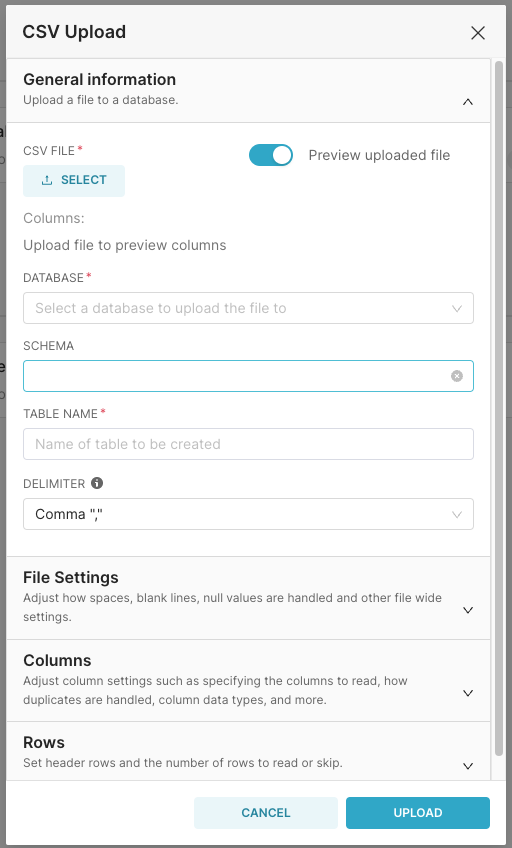
    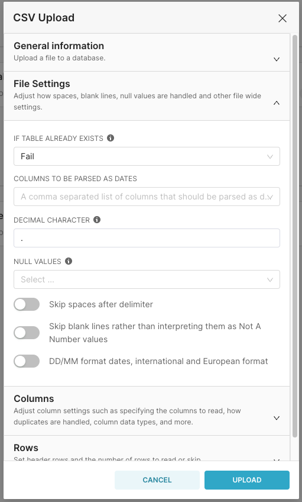
    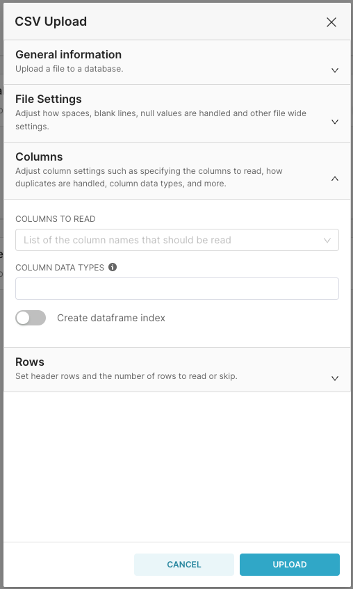
    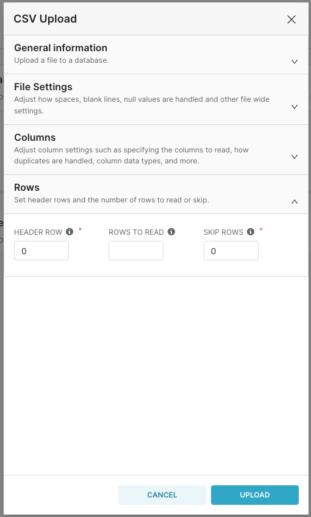
</div>

#### Excel
<div>
    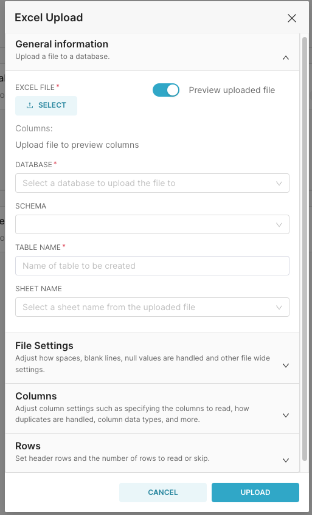
    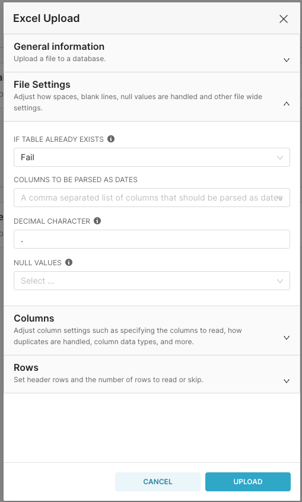
    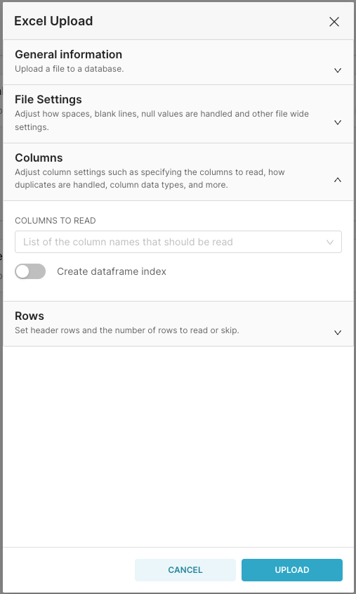
    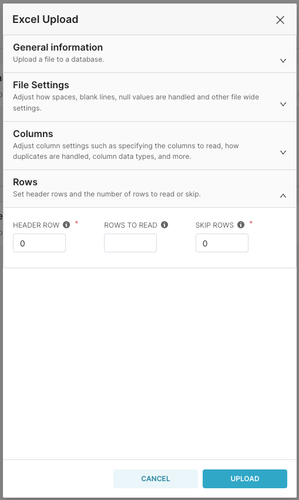
</div>

#### Columnar
<div>
    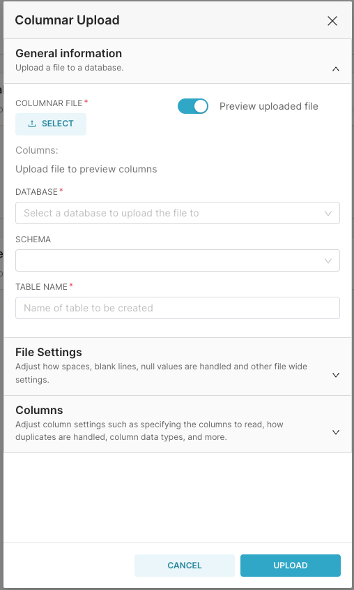
    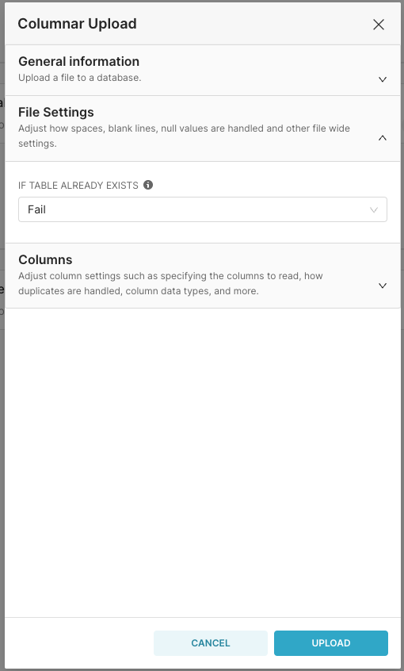
    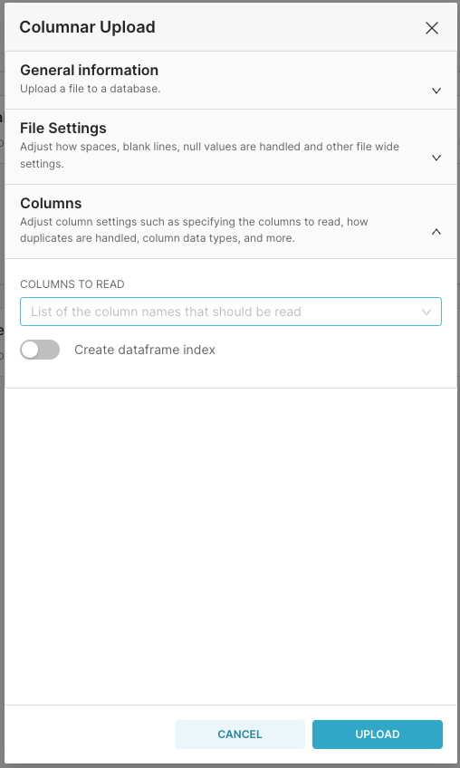
</div>


### OAuth2 For Databases

You now have the ability to enable [OAuth2](https://github.com/apache/superset/pull/27631) for databases like BigQuery, Snowflake, Dremio, Databricks, Google Sheets, etc. When enabled, it will allow users to connect to Oauth2 enabled databases with their own credentials.

### Catalog Support For Databases

Added support for the [catalog heirachy](https://github.com/apache/superset/pull/28317) for databases that support it, such as [BigQuery (projects), Databricks, Presto, Snowflake, and Trino](https://github.com/apache/superset/pull/28416). Once enabled, users will see catalogs when selecting tables in [SQL Lab, datasets](https://github.com/apache/superset/pull/28376), and when setting up Data Access Roles

### Slack Upload Files V2 API Updates
As part of [[SIP-138] Proposal for Slack file upload V2 integration for Alerts and Reports](https://github.com/apache/superset/issues/29263) we now have support for Slack file upload files v2 API call. This feature is behind the feature flag `ALERT_REPORT_SLACK_V2` and also changes the Slack channel to a selector. You may also need to add the following scopes (`channels:read`, `group:read`) to your Slack bot to work.

<div>
    <image src="media/slack_modal.png" alt="Image" width="100%">
</div>

### Total and Percentages In Tooltips For ECharts

Users can now see both the [total and percentage in tooltips](https://github.com/apache/superset/pull/27950) for ECharts.

<div>
    <image src="media/tooltips.png" alt="Image" width="100%">
</div>

### Additional Metadata Bar To Dashboards

There is now a [metadata bar](https://github.com/apache/superset/pull/27857) added to the header of dashboards. This will now show viewers of the dashboard both the owners and last modified time of the dashboard.


## Change to Docker image builds

Starting in 4.1.0, the release's docker image does not ship with drivers needed to operate Superset. Users may need to install a driver for their metadata database (MySQL or Postgres) as well as the driver for their data warehouse. This is a result of changes to the `lean` docker image that official releases come from; see [Docker Build Presets](/docs/installation/docker-builds#build-presets) for more details.
