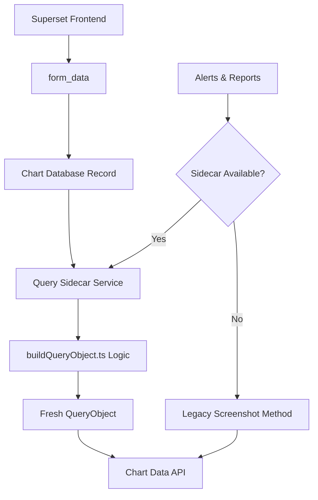

# Query Sidecar Service Integration

This document describes the Node.js Query Sidecar Service integration that eliminates stale QueryObject issues in Superset Alerts & Reports.

## Problem Statement

Previously, Superset stored QueryObjects in the database after chart visualization logic transformed `form_data` into QueryObject format. This approach had a critical flaw: when the JavaScript visualization code changed, the stored QueryObjects became stale, causing Alerts & Reports to use outdated query logic.

## Solution

The Query Sidecar Service provides a Node.js service that computes QueryObjects from `form_data` on-demand using the same logic as the frontend, ensuring:

- **No stale data**: QueryObjects are computed fresh every time
- **Consistency**: Uses identical logic to the Superset frontend
- **Backward compatibility**: Falls back to legacy screenshot method if sidecar is unavailable

## Architecture



## Components

### 1. Node.js Sidecar Service (`sidecar-node/`)

Located in `sidecar-node/`, this service provides:

- **REST API**: `POST /api/v1/query-object` to transform form_data
- **Type Safety**: Full TypeScript implementation with Superset type definitions
- **Frontend Compatibility**: Uses identical logic from `superset-ui-core`
- **Health Checks**: `/health` endpoint for monitoring
- **Docker Support**: Production-ready containerization

Key files:
- `src/query/buildQueryObject.ts` - Main transformation logic
- `src/types/index.ts` - TypeScript type definitions
- `src/routes/queryObject.ts` - REST API endpoints
- `Dockerfile` - Container configuration

### 2. Python Client (`superset/utils/query_sidecar.py`)

Python client library that:

- **HTTP Communication**: Handles requests to the sidecar service
- **Error Handling**: Robust error handling with fallback mechanisms
- **QueryObject Creation**: Converts responses to Superset QueryObject instances
- **Configuration**: Configurable timeouts and URLs

### 3. Reports Integration (`superset/commands/report/execute.py`)

Updated report execution logic:

- **Primary Method**: Uses sidecar service to generate fresh QueryObjects
- **Fallback Method**: Falls back to legacy screenshot method on failure
- **Configuration**: Controlled by `QUERY_SIDECAR_ENABLED` setting

## Setup and Configuration

### 1. Deploy the Sidecar Service

#### Development
```bash
cd sidecar-node
npm install
npm run dev
```

#### Production with Docker
```bash
cd sidecar-node
docker build -t superset-query-sidecar .
docker run -p 3001:3001 superset-query-sidecar
```

#### Production with Docker Compose
```bash
docker-compose -f docker-compose.sidecar.yml up -d
```

### 2. Configure Superset

Add to your Superset configuration:

```python
# Enable sidecar service integration
QUERY_SIDECAR_ENABLED = True

# Sidecar service URL
QUERY_SIDECAR_BASE_URL = "http://localhost:3001"

# Request timeout (seconds)  
QUERY_SIDECAR_TIMEOUT = 10
```

#### Production Configuration Example
```python
QUERY_SIDECAR_ENABLED = True
QUERY_SIDECAR_BASE_URL = "http://superset-query-sidecar:3001"
QUERY_SIDECAR_TIMEOUT = 30
```

### 3. Verify Integration

#### Check Sidecar Health
```bash
curl http://localhost:3001/health
```

#### Test API Endpoint
```bash
curl -X POST http://localhost:3001/api/v1/query-object \
  -H "Content-Type: application/json" \
  -d '{
    "form_data": {
      "datasource": "1__table",
      "viz_type": "table",
      "metrics": ["count"],
      "columns": ["name"]
    }
  }'
```

## API Reference

### POST /api/v1/query-object

Transforms `form_data` into a QueryObject.

**Request:**
```json
{
  "form_data": {
    "datasource": "1__table",
    "viz_type": "table",
    "metrics": ["count"],
    "columns": ["name"],
    "time_range": "No filter"
  },
  "query_fields": {
    "x": "columns",
    "y": "metrics"  
  }
}
```

**Response:**
```json
{
  "query_object": {
    "metrics": ["count"],
    "columns": ["name"],
    "time_range": "No filter",
    "filters": [],
    "extras": {},
    "row_limit": undefined,
    "order_desc": true
  }
}
```

**Error Response:**
```json
{
  "error": "form_data must include datasource and viz_type"
}
```

### GET /health

Returns service health status.

**Response:**
```json
{
  "status": "healthy",
  "timestamp": "2023-12-01T12:00:00.000Z",
  "version": "1.0.0"
}
```

## Error Handling

The integration includes comprehensive error handling:

### Sidecar Service Errors
- **Connection Errors**: Falls back to legacy screenshot method
- **Timeout Errors**: Configurable timeout with fallback
- **Service Errors**: Logs errors and uses fallback method

### Configuration
```python
# Disable sidecar to use legacy method only
QUERY_SIDECAR_ENABLED = False

# Increase timeout for slow networks
QUERY_SIDECAR_TIMEOUT = 30
```

## Migration Strategy

### Phase 1: Parallel Running
1. Deploy sidecar service alongside existing Superset
2. Enable `QUERY_SIDECAR_ENABLED = True`
3. Monitor logs for any fallback usage

### Phase 2: Validation  
1. Compare QueryObjects generated by sidecar vs stored versions
2. Verify Alerts & Reports work correctly
3. Monitor performance metrics

### Phase 3: Full Migration
1. Remove dependency on stored query_context (future)
2. Optimize sidecar performance
3. Scale sidecar service as needed

## Testing

### Node.js Service Tests
```bash
cd sidecar-node
npm test
npm run test:watch
```

### Python Integration Tests  
```bash
pytest tests/unit_tests/utils/test_query_sidecar.py
pytest tests/unit_tests/commands/report/test_execute_sidecar.py
```

### Integration Testing
1. Create test alerts/reports
2. Verify they execute with fresh QueryObjects
3. Test fallback behavior by stopping sidecar service

## Monitoring and Logging

### Service Monitoring
- Health check endpoint: `GET /health`
- Docker health checks included
- Prometheus metrics (future enhancement)

### Superset Logging
The integration adds detailed logging:

```python
logger.info("Successfully generated query context via sidecar for chart %s", chart_id)
logger.warning("Failed to generate query context via sidecar service: %s. Falling back to screenshot method.", error)
```

### Log Levels
- `INFO`: Successful sidecar operations
- `WARNING`: Fallback to legacy method  
- `ERROR`: Critical failures

## Performance Considerations

### Latency
- Sidecar adds ~10-50ms per request
- Network latency between services
- Configurable timeout prevents blocking

### Scaling
- Sidecar service is stateless and can be horizontally scaled
- Consider load balancing for high-volume deployments
- Cache QueryObjects if needed (future enhancement)

### Resource Usage
- Node.js service: ~50-100MB RAM
- CPU usage minimal for typical workloads
- Network bandwidth: ~1-10KB per request

## Future Enhancements

1. **Caching**: Add Redis/Memcached for QueryObject caching
2. **Metrics**: Prometheus metrics for monitoring
3. **Load Balancing**: Support multiple sidecar instances  
4. **Query Optimization**: Optimize query generation performance
5. **Database Cleanup**: Remove stored query_context column (breaking change)

## Troubleshooting

### Common Issues

#### Sidecar Service Not Starting
```bash
# Check logs
docker logs superset-query-sidecar

# Verify port availability
netstat -tlnp | grep 3001
```

#### Connection Errors
```bash
# Test connectivity
curl http://localhost:3001/health

# Check Superset logs
grep -i "sidecar" /var/log/superset/superset.log
```

#### Fallback Behavior
```bash
# Check if sidecar is being bypassed
grep -i "falling back" /var/log/superset/superset.log
```

### Configuration Issues
- Verify `QUERY_SIDECAR_BASE_URL` is correct
- Check network connectivity between services
- Ensure sidecar service is healthy

### Performance Issues  
- Increase `QUERY_SIDECAR_TIMEOUT` if needed
- Monitor sidecar service resource usage
- Consider scaling sidecar service

## Security Considerations

### Network Security
- Run sidecar service on internal network
- Use HTTPS in production environments
- Configure proper firewall rules

### Input Validation
- Sidecar service validates all inputs
- Superset client validates responses
- No raw SQL execution in sidecar service

### Access Control
- Service-to-service authentication (future)
- Network-level access controls
- Audit logging of sidecar requests
