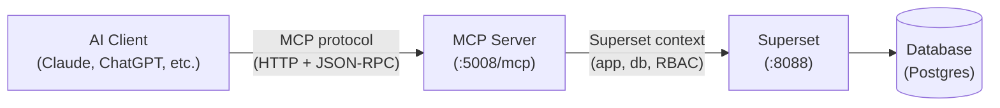
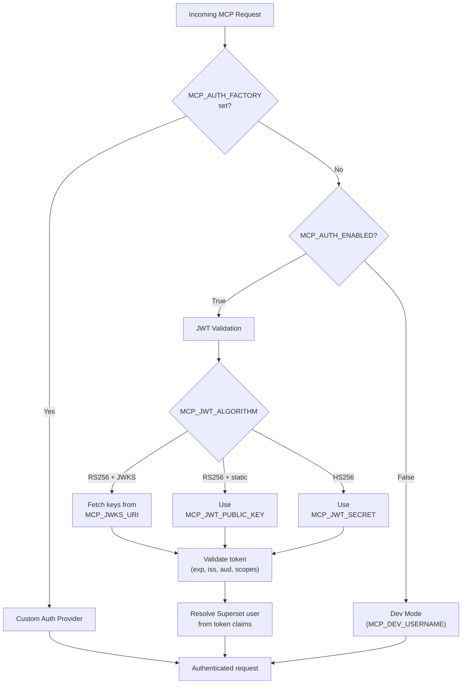
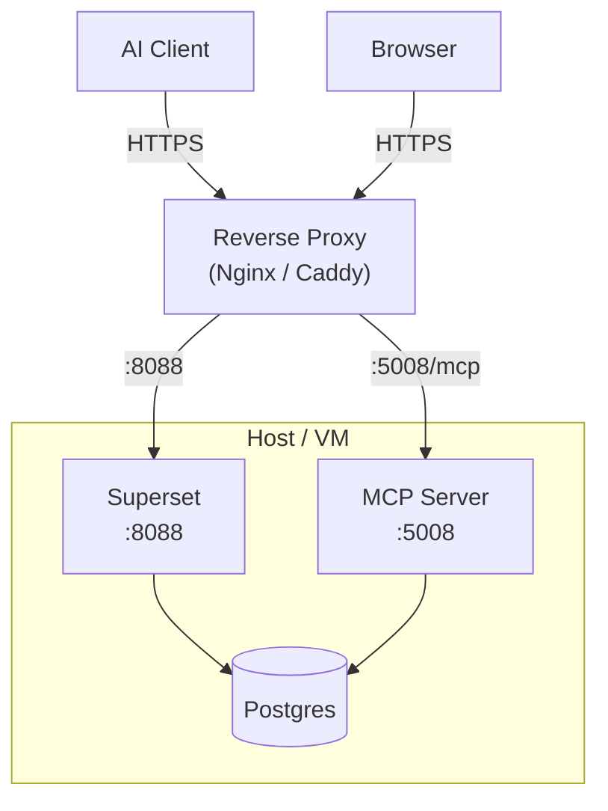
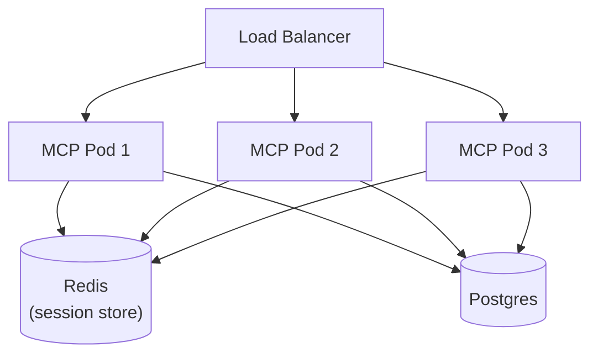

<!--
Licensed to the Apache Software Foundation (ASF) under one
or more contributor license agreements.  See the NOTICE file
distributed with this work for additional information
regarding copyright ownership.  The ASF licenses this file
to you under the Apache License, Version 2.0 (the
"License"); you may not use this file except in compliance
with the License.  You may obtain a copy of the License at

  http://www.apache.org/licenses/LICENSE-2.0

Unless required by applicable law or agreed to in writing,
software distributed under the License is distributed on an
"AS IS" BASIS, WITHOUT WARRANTIES OR CONDITIONS OF ANY
KIND, either express or implied.  See the License for the
specific language governing permissions and limitations
under the License.
-->

# MCP Server Deployment & Authentication

Superset includes a built-in [Model Context Protocol (MCP)](https://modelcontextprotocol.io/) server that lets AI assistants -- Claude, ChatGPT, and other MCP-compatible clients -- interact with your Superset instance. Through MCP, clients can list dashboards, query datasets, execute SQL, create charts, and more.

This guide covers how to run, secure, and deploy the MCP server.

:::tip Looking for user docs?
See **[Using AI with Superset](/user-docs/using-superset/using-ai-with-superset)** for a guide on what AI can do with Superset and how to connect your AI client.
:::



---

## Quick Start

Get the MCP server running locally and connect an AI client in three steps.

### 1. Start the MCP server

The MCP server runs as a separate process alongside Superset:

```bash
superset mcp run --host 127.0.0.1 --port 5008
```

| Flag | Default | Description |
|------|---------|-------------|
| `--host` | `127.0.0.1` | Host to bind to |
| `--port` | `5008` | Port to bind to |
| `--debug` | off | Enable debug logging |

The endpoint is available at `http://<host>:<port>/mcp`.

### 2. Set a development user

For local development, tell the MCP server which Superset user to impersonate (the user must already exist in your database):

```python
# superset_config.py
MCP_DEV_USERNAME = "admin"
```

### 3. Connect an AI client

Point your MCP client at the server. For **Claude Desktop**, edit the config file:

- **macOS**: `~/Library/Application Support/Claude/claude_desktop_config.json`
- **Windows**: `%APPDATA%\Claude\claude_desktop_config.json`
- **Linux**: `~/.config/Claude/claude_desktop_config.json`

```json
{
  "mcpServers": {
    "superset": {
      "url": "http://localhost:5008/mcp"
    }
  }
}
```

Restart Claude Desktop. The hammer icon in the chat bar confirms the connection.

See [Connecting AI Clients](#connecting-ai-clients) for Claude Code, Claude Web, ChatGPT, and raw HTTP examples.

---

## Prerequisites

- Apache Superset 5.0+ running and accessible
- Python 3.10+
- The `fastmcp` package (`pip install fastmcp`)

---

## Authentication

The MCP server supports multiple authentication methods depending on your deployment scenario.



### Development Mode (No Auth)

Disable authentication and use a fixed user:

```python
# superset_config.py
MCP_AUTH_ENABLED = False
MCP_DEV_USERNAME = "admin"
```

All operations run as the configured user.

:::warning
Never use development mode in production. Always enable authentication for any internet-facing deployment.
:::

### JWT Authentication

For production, enable JWT-based authentication. The MCP server validates a Bearer token on every request.

#### Option A: RS256 with JWKS endpoint

The most common setup for OAuth 2.0 / OIDC providers that publish a JWKS (JSON Web Key Set) endpoint:

```python
# superset_config.py
MCP_AUTH_ENABLED = True
MCP_JWT_ALGORITHM = "RS256"
MCP_JWKS_URI = "https://your-identity-provider.com/.well-known/jwks.json"
MCP_JWT_ISSUER = "https://your-identity-provider.com/"
MCP_JWT_AUDIENCE = "your-superset-instance"
```

#### Option B: RS256 with static public key

Use this when you have a fixed RSA key pair (e.g., self-signed tokens):

```python
# superset_config.py
MCP_AUTH_ENABLED = True
MCP_JWT_ALGORITHM = "RS256"
MCP_JWT_PUBLIC_KEY = """-----BEGIN PUBLIC KEY-----
MIIBIjANBgkqhkiG9w0BAQEFAAOCAQ8AMIIBCgKCAQEA...
-----END PUBLIC KEY-----"""
MCP_JWT_ISSUER = "your-issuer"
MCP_JWT_AUDIENCE = "your-audience"
```

#### Option C: HS256 with shared secret

Use this when both the token issuer and the MCP server share a symmetric secret:

```python
# superset_config.py
MCP_AUTH_ENABLED = True
MCP_JWT_ALGORITHM = "HS256"
MCP_JWT_SECRET = "your-shared-secret-key"
MCP_JWT_ISSUER = "your-issuer"
MCP_JWT_AUDIENCE = "your-audience"
```

:::warning
Store `MCP_JWT_SECRET` securely. Never commit it to version control. Use environment variables:
```python
import os
MCP_JWT_SECRET = os.environ.get("MCP_JWT_SECRET")
```
:::

#### JWT claims

The MCP server validates these standard claims:

| Claim | Config Key | Description |
|-------|-----------|-------------|
| `exp` | -- | Expiration time (always validated) |
| `iss` | `MCP_JWT_ISSUER` | Token issuer (optional but recommended) |
| `aud` | `MCP_JWT_AUDIENCE` | Token audience (optional but recommended) |
| `sub` | -- | Subject -- primary claim used to resolve the Superset user |

#### User resolution

After validating the token, the MCP server resolves a Superset username from the claims. It checks these in order, using the first non-empty value:

1. `subject` -- the standard `sub` claim (via the access token object)
2. `client_id` -- for machine-to-machine tokens
3. `payload["sub"]` -- fallback to raw payload
4. `payload["email"]` -- email-based lookup
5. `payload["username"]` -- explicit username claim

The resolved value must match a `username` in the Superset `ab_user` table.

#### Scoped access

Require specific scopes in the JWT to limit what MCP operations a token can perform:

```python
# superset_config.py
MCP_REQUIRED_SCOPES = ["mcp:read", "mcp:write"]
```

Only tokens that include **all** required scopes are accepted.

### Custom Auth Provider

For advanced scenarios (e.g., a proprietary auth system), provide a factory function. This takes precedence over all built-in JWT configuration:

```python
# superset_config.py
def my_custom_auth_factory(app):
    """Return a FastMCP auth provider instance."""
    from fastmcp.server.auth.providers.jwt import JWTVerifier
    return JWTVerifier(
        jwks_uri="https://my-auth.example.com/.well-known/jwks.json",
        issuer="https://my-auth.example.com/",
        audience="superset-mcp",
    )

MCP_AUTH_FACTORY = my_custom_auth_factory
```

---

## Connecting AI Clients

### Claude Desktop

**Local development (no auth):**

```json
{
  "mcpServers": {
    "superset": {
      "url": "http://localhost:5008/mcp"
    }
  }
}
```

**With JWT authentication:**

```json
{
  "mcpServers": {
    "superset": {
      "command": "npx",
      "args": [
        "-y",
        "mcp-remote@latest",
        "http://your-superset-host:5008/mcp",
        "--header",
        "Authorization: Bearer YOUR_TOKEN"
      ]
    }
  }
}
```

### Claude Code (CLI)

Add to your project's `.mcp.json`:

```json
{
  "mcpServers": {
    "superset": {
      "type": "url",
      "url": "http://localhost:5008/mcp"
    }
  }
}
```

With authentication:

```json
{
  "mcpServers": {
    "superset": {
      "type": "url",
      "url": "http://localhost:5008/mcp",
      "headers": {
        "Authorization": "Bearer YOUR_TOKEN"
      }
    }
  }
}
```

### Claude Web (claude.ai)

1. Open [claude.ai](https://claude.ai)
2. Click the **+** button (or your profile icon)
3. Select **Connectors**
4. Click **Manage Connectors** > **Add custom connector**
5. Enter a name and your MCP URL (e.g., `https://your-superset-host/mcp`)
6. Click **Add**

:::info
Custom connectors on Claude Web require a Pro, Max, Team, or Enterprise plan.
:::

### ChatGPT

1. Click your profile icon > **Settings** > **Apps and Connectors**
2. Enable **Developer Mode** in Advanced Settings
3. In the chat composer, press **+** > **Add sources** > **App** > **Connect more** > **Create app**
4. Enter a name and your MCP server URL
5. Click **I understand and continue**

:::info
ChatGPT MCP connectors require a Pro, Team, Enterprise, or Edu plan.
:::

### Direct HTTP requests

Call the MCP server directly with any HTTP client:

```bash
curl -X POST http://localhost:5008/mcp \
  -H 'Content-Type: application/json' \
  -H 'Authorization: Bearer YOUR_JWT_TOKEN' \
  -d '{"jsonrpc": "2.0", "method": "tools/list", "id": 1}'
```

---

## Deployment

### Single Process

The simplest setup: run the MCP server alongside Superset on the same host.



**superset_config.py:**

```python
MCP_SERVICE_HOST = "0.0.0.0"
MCP_SERVICE_PORT = 5008
MCP_DEV_USERNAME = "admin"  # or enable JWT auth

# If behind a reverse proxy, set the public-facing URL so
# MCP-generated links (chart previews, SQL Lab URLs) resolve correctly:
MCP_SERVICE_URL = "https://superset.example.com"
```

**Start both processes:**

```bash
# Terminal 1 -- Superset web server
superset run -h 0.0.0.0 -p 8088

# Terminal 2 -- MCP server
superset mcp run --host 0.0.0.0 --port 5008
```

**Nginx reverse proxy with TLS:**

```nginx
server {
    listen 443 ssl;
    server_name superset.example.com;

    ssl_certificate     /path/to/cert.pem;
    ssl_certificate_key /path/to/key.pem;

    # Superset web UI
    location / {
        proxy_pass http://127.0.0.1:8088;
        proxy_set_header Host $host;
        proxy_set_header X-Real-IP $remote_addr;
    }

    # MCP endpoint
    location /mcp {
        proxy_pass http://127.0.0.1:5008/mcp;
        proxy_set_header Host $host;
        proxy_set_header X-Real-IP $remote_addr;
        proxy_set_header Authorization $http_authorization;
    }
}
```

### Docker Compose

Run Superset and the MCP server as separate containers sharing the same config:

```yaml
# docker-compose.yml
services:
  superset:
    image: apache/superset:latest
    ports:
      - "8088:8088"
    volumes:
      - ./superset_config.py:/app/superset_config.py
    environment:
      - SUPERSET_CONFIG_PATH=/app/superset_config.py

  mcp:
    image: apache/superset:latest
    command: ["superset", "mcp", "run", "--host", "0.0.0.0", "--port", "5008"]
    ports:
      - "5008:5008"
    volumes:
      - ./superset_config.py:/app/superset_config.py
    environment:
      - SUPERSET_CONFIG_PATH=/app/superset_config.py
    depends_on:
      - superset
```

Both containers share the same `superset_config.py`, so authentication settings, database connections, and feature flags stay in sync.

### Multi-Pod (Kubernetes)

For high-availability deployments, configure Redis so that replicas share session state:



**superset_config.py:**

```python
MCP_STORE_CONFIG = {
    "enabled": True,
    "CACHE_REDIS_URL": "redis://redis-host:6379/0",
    "event_store_max_events": 100,
    "event_store_ttl": 3600,
}
```

When `CACHE_REDIS_URL` is set, the MCP server uses a Redis-backed EventStore for session management, allowing replicas to share state. Without Redis, each pod manages its own in-memory sessions and stateful MCP interactions may fail when requests hit different replicas.

---

## Configuration Reference

All MCP settings go in `superset_config.py`. Defaults are defined in `superset/mcp_service/mcp_config.py`.

### Core

| Setting | Default | Description |
|---------|---------|-------------|
| `MCP_SERVICE_HOST` | `"localhost"` | Host the MCP server binds to |
| `MCP_SERVICE_PORT` | `5008` | Port the MCP server binds to |
| `MCP_SERVICE_URL` | `None` | Public base URL for MCP-generated links (set this when behind a reverse proxy) |
| `MCP_DEBUG` | `False` | Enable debug logging |
| `MCP_DEV_USERNAME` | -- | Superset username for development mode (no auth) |
| `MCP_RBAC_ENABLED` | `True` | Enforce Superset's role-based access control on MCP tool calls. When `True`, each tool checks that the authenticated user has the required FAB permission before executing. Disable only for testing or trusted-network deployments. |

### Authentication

| Setting | Default | Description |
|---------|---------|-------------|
| `MCP_AUTH_ENABLED` | `False` | Enable JWT authentication |
| `MCP_JWT_ALGORITHM` | `"RS256"` | JWT signing algorithm (`RS256` or `HS256`) |
| `MCP_JWKS_URI` | `None` | JWKS endpoint URL (RS256) |
| `MCP_JWT_PUBLIC_KEY` | `None` | Static RSA public key string (RS256) |
| `MCP_JWT_SECRET` | `None` | Shared secret string (HS256) |
| `MCP_JWT_ISSUER` | `None` | Expected `iss` claim |
| `MCP_JWT_AUDIENCE` | `None` | Expected `aud` claim |
| `MCP_REQUIRED_SCOPES` | `[]` | Required JWT scopes |
| `MCP_JWT_DEBUG_ERRORS` | `False` | Log detailed JWT errors server-side (never exposed in HTTP responses per RFC 6750) |
| `MCP_AUTH_FACTORY` | `None` | Custom auth provider factory `(flask_app) -> auth_provider`. Takes precedence over built-in JWT |
| `MCP_USER_RESOLVER` | `None` | Custom function `(app, access_token) -> username` to extract a Superset username from a validated JWT token. When `None`, the default resolver checks `preferred_username`, `username`, `email`, and `sub` claims in that order. |

### Response Size Guard

Limits response sizes to prevent exceeding LLM context windows:

```python
MCP_RESPONSE_SIZE_CONFIG = {
    "enabled": True,
    "token_limit": 25000,
    "warn_threshold_pct": 80,
    "excluded_tools": [
        "health_check",
        "get_chart_preview",
        "generate_explore_link",
        "open_sql_lab_with_context",
    ],
}
```

| Key | Default | Description |
|-----|---------|-------------|
| `enabled` | `True` | Enable response size checking |
| `token_limit` | `25000` | Maximum estimated token count per response |
| `warn_threshold_pct` | `80` | Warn when response exceeds this percentage of the limit |
| `excluded_tools` | See above | Tools exempt from size checking (e.g., tools that return URLs, not data) |

### Caching

Optional response caching for read-heavy workloads. Requires Redis when used with multiple replicas.

```python
MCP_CACHE_CONFIG = {
    "enabled": False,
    "CACHE_KEY_PREFIX": None,
    "list_tools_ttl": 300,       # 5 min
    "list_resources_ttl": 300,
    "list_prompts_ttl": 300,
    "read_resource_ttl": 3600,   # 1 hour
    "get_prompt_ttl": 3600,
    "call_tool_ttl": 3600,
    "max_item_size": 1048576,    # 1 MB
    "excluded_tools": [
        "execute_sql",
        "generate_dashboard",
        "generate_chart",
        "update_chart",
    ],
}
```

| Key | Default | Description |
|-----|---------|-------------|
| `enabled` | `False` | Enable response caching |
| `CACHE_KEY_PREFIX` | `None` | Optional prefix for cache keys (useful for shared Redis) |
| `list_tools_ttl` | `300` | Cache TTL in seconds for `tools/list` |
| `list_resources_ttl` | `300` | Cache TTL for `resources/list` |
| `list_prompts_ttl` | `300` | Cache TTL for `prompts/list` |
| `read_resource_ttl` | `3600` | Cache TTL for `resources/read` |
| `get_prompt_ttl` | `3600` | Cache TTL for `prompts/get` |
| `call_tool_ttl` | `3600` | Cache TTL for `tools/call` |
| `max_item_size` | `1048576` | Maximum cached item size in bytes (1 MB) |
| `excluded_tools` | See above | Tools that are never cached (mutating or non-deterministic) |

### Redis Store (Multi-Pod)

Enables Redis-backed session and event storage for multi-replica deployments:

```python
MCP_STORE_CONFIG = {
    "enabled": False,
    "CACHE_REDIS_URL": None,
    "event_store_max_events": 100,
    "event_store_ttl": 3600,
}
```

| Key | Default | Description |
|-----|---------|-------------|
| `enabled` | `False` | Enable Redis-backed store |
| `CACHE_REDIS_URL` | `None` | Redis connection URL (e.g., `redis://redis-host:6379/0`) |
| `event_store_max_events` | `100` | Maximum events retained per session |
| `event_store_ttl` | `3600` | Event TTL in seconds |

### Tool Search

By default the MCP server exposes a lightweight tool-search interface instead of advertising every tool at once. This reduces the initial context sent to the LLM by ~70%, which lowers cost and latency. The AI client discovers tools on demand by calling `search_tools` and then invokes them via `call_tool`.

```python
MCP_TOOL_SEARCH_CONFIG = {
    "enabled": True,
    "strategy": "bm25",        # "bm25" (natural language) or "regex"
    "max_results": 5,
    "always_visible": [        # Tools always listed (pinned)
        "health_check",
        "get_instance_info",
    ],
    "search_tool_name": "search_tools",
    "call_tool_name": "call_tool",
    "compact_schemas": True,   # Strip $defs in search results to save tokens
    "max_description_length": 300,
}
```

| Key | Default | Description |
|-----|---------|-------------|
| `enabled` | `True` | Enable tool search. When `False`, all tools are listed upfront |
| `strategy` | `"bm25"` | Search ranking algorithm. `"bm25"` supports natural language; `"regex"` supports pattern matching |
| `max_results` | `5` | Maximum tools returned per search query |
| `always_visible` | See above | Tools that always appear in `list_tools`, regardless of search |
| `compact_schemas` | `True` | Strip `$defs` from search results to reduce token cost. Full schemas are used when the tool is actually called |
| `max_description_length` | `300` | Truncate tool descriptions in search results (0 = no truncation) |

:::tip
Set `enabled: False` to revert to the traditional "show all tools at once" behavior, which some clients or workflows may prefer.
:::

Tool search reduces the initial token cost from ~15–20K tokens (full catalog) down to ~4–5K tokens (pinned tools + search interface) — roughly 85% savings at the start of each conversation.

### Session & CSRF

These values are flat-merged into the Flask app config used by the MCP server process:

```python
MCP_SESSION_CONFIG = {
    "SESSION_COOKIE_HTTPONLY": True,
    "SESSION_COOKIE_SECURE": False,
    "SESSION_COOKIE_SAMESITE": "Lax",
    "SESSION_COOKIE_NAME": "superset_session",
    "PERMANENT_SESSION_LIFETIME": 86400,
}

MCP_CSRF_CONFIG = {
    "WTF_CSRF_ENABLED": True,
    "WTF_CSRF_TIME_LIMIT": None,
}
```

---

## Access Control

### RBAC Enforcement

The MCP server respects Superset's full role-based access control (RBAC). Every authenticated user can only access the data and operations their Superset roles permit — the same rules that apply in the Superset UI apply through MCP.

Each tool declares one or more required FAB permissions. The table below maps tool groups to their permission requirements:

| Tool group | Required FAB permission |
|------------|------------------------|
| `list_charts`, `get_chart_info`, `get_chart_data`, `get_chart_preview`, `generate_chart`, `update_chart` | `can_read` on `Chart` (read), `can_write` on `Chart` (mutate) |
| `list_dashboards`, `get_dashboard_info`, `generate_dashboard`, `add_chart_to_existing_dashboard` | `can_read` on `Dashboard` (read), `can_write` on `Dashboard` (mutate) |
| `list_datasets`, `get_dataset_info`, `create_virtual_dataset` | `can_read` on `Dataset` (read), `can_write` on `Dataset` (mutate) |
| `list_databases`, `get_database_info` | `can_read` on `Database` |
| `execute_sql` | `can_execute_sql_query` on `SQLLab` |
| `open_sql_lab_with_context` | `can_read` on `SQLLab` |
| `save_sql_query` | `can_write` on `SavedQuery` |
| `health_check` | None (public) |

To disable RBAC checking globally (for trusted-network deployments or testing), set:

```python
# superset_config.py
MCP_RBAC_ENABLED = False
```

:::warning
Disabling RBAC removes all permission checks from MCP tool calls. Only do this on isolated, internal deployments where all MCP users are trusted admins.
:::

### Audit Log

All MCP tool calls are recorded in Superset's action log. You can view them at **Settings → Action Log** (admin only). Each log entry records:

- The tool name (e.g., `mcp.generate_chart.db_write`)
- The authenticated user
- A timestamp

This makes MCP activity fully auditable alongside regular Superset activity. The action log uses the same event logger as the rest of Superset, so existing log ingestion pipelines (e.g., sending logs to Elasticsearch or a SIEM) capture MCP events automatically.

### Middleware Pipeline

Every MCP request passes through a middleware stack before reaching the tool function. The default stack (assembled in `build_middleware_list()` in `server.py`) is:

| Middleware | Purpose | Default |
|------------|---------|---------|
| `StructuredContentStripperMiddleware` | Strips `structuredContent` from responses for Claude.ai bridge compatibility | Enabled |
| `LoggingMiddleware` | Logs each tool call with user, parameters, and duration | Enabled |
| `GlobalErrorHandlerMiddleware` | Catches unhandled exceptions and sanitizes sensitive data before it reaches the client | Enabled |
| `ResponseSizeGuardMiddleware` | Estimates token count, warns at 80% of limit, blocks at limit | Enabled (configurable via `MCP_RESPONSE_SIZE_CONFIG`) |
| `ResponseCachingMiddleware` | Caches read-heavy tool responses (in-memory or Redis) | Disabled (enable via `MCP_CACHE_CONFIG`) |

Additional middleware classes (`RateLimitMiddleware`, `FieldPermissionsMiddleware`, `PrivateToolMiddleware`) are implemented in `superset/mcp_service/middleware.py` but are not added to the default pipeline. They are available for operators who want to layer them in via a custom startup path.

### Error Sanitization

The `GlobalErrorHandlerMiddleware` automatically redacts sensitive information from all error messages before they reach the LLM client. The following are replaced with generic messages:

- **Database connection strings** — replaced with a generic connection error message
- **API keys and tokens** — redacted from error traces
- **File system paths** — stripped to prevent information disclosure
- **IP addresses** — removed from error context

This ensures that a misconfigured database connection or an unexpected exception never leaks credentials or internal topology to the LLM or its users. All regex patterns used for redaction are bounded to prevent ReDoS attacks.

---

## Performance

### Connection Pooling

Each MCP server process maintains its own SQLAlchemy connection pool to the database. For multi-worker deployments, total open connections = **workers × pool size**.

```python
# superset_config.py
SQLALCHEMY_POOL_SIZE = 5
SQLALCHEMY_MAX_OVERFLOW = 10
SQLALCHEMY_POOL_TIMEOUT = 30
SQLALCHEMY_POOL_RECYCLE = 3600  # Recycle connections after 1 hour
```

For a 3-pod Kubernetes deployment with the defaults above, expect up to 3 × (5 + 10) = 45 connections. Size your database's `max_connections` accordingly.

### Response Caching

Enable response caching for read-heavy workloads (dashboards/datasets that don't change frequently). With the in-memory backend (default when `MCP_STORE_CONFIG` is disabled), caching is per-process. Use Redis-backed caching for consistent cache hits across multiple pods:

```python
MCP_CACHE_CONFIG = {"enabled": True, "call_tool_ttl": 3600}
MCP_STORE_CONFIG = {"enabled": True, "CACHE_REDIS_URL": "redis://redis:6379/0"}
```

Mutating tools (`generate_chart`, `update_chart`, `execute_sql`, `generate_dashboard`) are always excluded from caching regardless of this setting.

---

## Troubleshooting

### Server won't start

- Verify `fastmcp` is installed: `pip install fastmcp`
- Check that `MCP_DEV_USERNAME` is set if auth is disabled -- the server requires a user identity
- Confirm the port is not already in use: `lsof -i :5008`

### 401 Unauthorized

- Verify your JWT token has not expired (`exp` claim)
- Check that `MCP_JWT_ISSUER` and `MCP_JWT_AUDIENCE` match the token's `iss` and `aud` claims exactly
- For RS256 with JWKS: confirm the JWKS URI is reachable from the MCP server
- For RS256 with static key: confirm the public key string includes the `BEGIN`/`END` markers
- For HS256: confirm the secret matches between the token issuer and `MCP_JWT_SECRET`
- Enable `MCP_JWT_DEBUG_ERRORS = True` for detailed server-side logging (errors are never leaked to the client)

### Tool not found

- Ensure the MCP server and Superset share the same `superset_config.py`
- Check server logs at startup -- tool registration errors are logged with the tool name and reason

### Client can't connect

- Verify the MCP server URL is reachable from the client machine
- For Claude Desktop: fully quit the app (not just close the window) and restart after config changes
- For remote access: ensure your firewall and reverse proxy allow traffic to the MCP port
- Confirm the URL path ends with `/mcp` (e.g., `http://localhost:5008/mcp`)

### Permission errors on tool calls

- The MCP server enforces Superset's RBAC permissions -- the authenticated user must have the required roles
- In development mode, ensure `MCP_DEV_USERNAME` maps to a user with appropriate roles (e.g., Admin)
- Check `superset/security/manager.py` for the specific permission tuples required by each tool domain (e.g., `("can_execute_sql_query", "SQLLab")`)

### Response too large

- If a tool call returns an error about exceeding token limits, the response size guard is blocking an oversized result
- Reduce `page_size` or `limit` parameters, use `select_columns` to exclude large fields, or add filters to narrow results
- To adjust the threshold, change `token_limit` in `MCP_RESPONSE_SIZE_CONFIG`
- To disable the guard entirely, set `MCP_RESPONSE_SIZE_CONFIG = {"enabled": False}`

---

## Audit Events

All MCP tool calls are logged to Superset's event logger, the same system used by the web UI (viewable at **Settings → Action Log**). Each event captures:

- **Action**: `mcp.<tool_name>.<phase>` (e.g., `mcp.list_databases.query`)
- **User**: the resolved Superset username from the JWT or dev config
- **Timestamp**: when the operation ran

This means MCP activity is auditable alongside normal user activity. No additional configuration is required — logging is on by default whenever the event logger is enabled in your Superset deployment.

## Tool Pagination

MCP list tools (`list_datasets`, `list_charts`, `list_dashboards`, `list_databases`) use **offset pagination** via `page` (1-based) and `page_size` parameters. Responses include `page`, `page_size`, `total_count`, `total_pages`, `has_previous`, and `has_next`. To iterate through all results:

```python
# Example: fetch all charts across pages
all_charts = []
page = 1
while True:
    result = mcp.list_charts(page=page, page_size=50)
    all_charts.extend(result["charts"])
    if not result.get("has_next"):
        break
    page += 1
```

## Security Best Practices

- **Use TLS** for all production MCP endpoints -- place the server behind a reverse proxy with HTTPS
- **Enable JWT authentication** for any internet-facing deployment
- **RBAC enforcement** -- The MCP server respects Superset's role-based access control. Users can only access data their roles permit
- **Secrets management** -- Store `MCP_JWT_SECRET`, database credentials, and API keys in environment variables or a secrets manager, never in config files committed to version control
- **Scoped tokens** -- Use `MCP_REQUIRED_SCOPES` to limit what operations a token can perform
- **Network isolation** -- In Kubernetes, restrict MCP pod network policies to only allow traffic from your AI client endpoints
- Review the **[Security documentation](/developer-docs/extensions/security)** for additional extension security guidance

---

## Next Steps

- **[Using AI with Superset](/user-docs/using-superset/using-ai-with-superset)** -- What AI can do with Superset and how to get started
- **[MCP Integration](/developer-docs/extensions/mcp)** -- Build custom MCP tools and prompts via Superset extensions
- **[Security](/developer-docs/extensions/security)** -- Security best practices for extensions
- **[Deployment](/developer-docs/extensions/deployment)** -- Package and deploy Superset extensions
