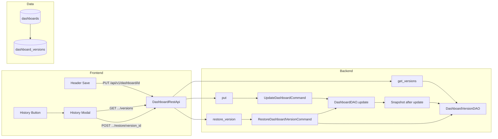

# ADR-0001: Dashboard Version History and One-Click Restore

## Status

**In progress** — Implemented on branch `feature/dashboard-version-history`.

## Context

Users need a way to recover from accidental or undesirable dashboard edits. Without version history, the only recovery options are manual re-editing or restoring from backup. We want an MVP that:

- Captures dashboard state on each manual save
- Exposes a list of versions and allows one-click restore
- Fits existing Superset patterns (models, commands, APIs, frontend)
- Stays within a bounded scope (no diff UI, no chart/dataset versioning, no autosave versioning)

The dashboard’s editable state is primarily stored in:

- **`position_json`** — layout (rows, tabs, chart positions)
- **`json_metadata`** — metadata (filters, chart config, etc.)

Restore must revert both so the dashboard looks and behaves as it did at that point in time. We also need to keep storage and complexity under control (retention limit, single write path).

## High-level implementation plan

### Architecture diagram

- **Save path**: `put` → `UpdateDashboardCommand` runs `DashboardDAO.update`, then `_snapshot_after_update` (create snapshot + retention) via `DashboardVersionDAO`.
- **List path**: `get_versions` → `DashboardVersionDAO.get_versions_for_dashboard`.
- **Restore path**: `restore_version` → `RestoreDashboardVersionCommand` loads version from `DashboardVersionDAO`, overwrites dashboard via `DashboardDAO.update`, then syncs `dashboard_slices` and removes orphaned chart components (no extra snapshot row).

The implementation was driven by a detailed plan (not stored in the repo) that defined architecture, layers, and order of work. Summary:

**Flow.** Frontend: Header Save triggers `PUT /dashboard/<id>`; History button opens a modal that calls `GET /dashboard/<id>/versions` and, on Restore, `POST /dashboard/<id>/restore/<version_id>`. Backend: `UpdateDashboardCommand` creates a snapshot after each relevant update; list/restore use `DashboardVersionDAO` and `RestoreDashboardVersionCommand`; both read/write the `dashboard_versions` table.

**Layers (bottom-up).**

1. **Model + migration** — New `DashboardVersion` model and `dashboard_versions` table (with optional `comment` in a follow-up migration); use shared migration helpers and reversible downgrade.
2. **DAO** — `DashboardVersionDAO`: create, get_versions_for_dashboard, get_by_id, delete_older_than; version number from `max(version_number)+1` in the same transaction.
3. **Snapshot on save** — In `UpdateDashboardCommand.run()`, after `DashboardDAO.update`, call a small helper that creates one snapshot (when `position_json` or `json_metadata` changed) and runs retention (e.g. keep 20).
4. **Restore command** — New `RestoreDashboardVersionCommand`: validate dashboard + ownership + version ownership; overwrite dashboard layout/metadata; sync `dashboard_slices` from layout; remove orphaned chart components; use `@transaction` and dedicated exceptions.
5. **API** — Register `get_versions` and `restore_version`; use existing dashboard resolution and permissions; add response schema for version list.
6. **Frontend** — History button in Header (edit permission); new HistoryModal (fetch versions, list with comment/author/timestamp, Restore with confirm and full reload).

**Order of work.** Model and migration first; then DAO; then snapshot logic in UpdateDashboardCommand; then restore command and exceptions; then API routes and schemas; then Header + HistoryModal; finally unit (and optional integration) tests and pre-commit.

**Out of scope for the MVP.** Diff UI, chart/dataset versioning, versioning on filter/colors/chart-customization endpoints, autosave or draft versioning.

## Decision

### 1. Snapshot model and storage

- **New table**: `dashboard_versions`, append-only.
- **Snapshot fields**: `position_json`, `json_metadata` (same types as `Dashboard`: MediumText where applicable).
- **Metadata**: `id`, `dashboard_id` (FK → `dashboards.id`, CASCADE on delete), `version_number` (monotonic per dashboard), `comment` (optional, max 500 chars), `created_at`, `created_by_fk` (FK → `ab_user.id`, SET NULL on delete).
- **Index**: `dashboard_id` (and ordering by `version_number` DESC) for list and retention queries.

Snapshots are **not** created for every API that touches the dashboard; only the main dashboard save path creates versions.

### 2. Single write path for versions

- **Only** `UpdateDashboardCommand.run()` (used by `PUT /api/v1/dashboard/<pk>`) creates version snapshots.
- **No** versioning on `put_filters`, `put_chart_customizations`, or `put_colors`.
- Snapshot is taken **after** applying the update (post-`DashboardDAO.update`), so “Version N” is the state after the Nth save.
- Snapshot is skipped when the update does not change `position_json` or `json_metadata` (e.g. tags-only updates).

This keeps behavior predictable and avoids duplicate or empty versions.

### 3. Retention

- After each snapshot insert, prune so at most **N versions per dashboard** (e.g. N=20).
- Implemented as `DashboardVersionDAO.delete_older_than(dashboard_id, keep_n)` in the same transaction as the snapshot.

### 4. Restore semantics

- Restore overwrites the dashboard’s `position_json` and `json_metadata` with the selected version’s values.
- **Chart–dashboard linkage**: Restore syncs `dashboard.slices` (and the `dashboard_slices` association table) from the restored layout so that:
  - A version that removed a chart no longer has that chart linked.
  - A version that included a chart has it linked again.
- **Orphaned chart components**: CHART components in the layout that reference a slice no longer in the dashboard (e.g. chart deleted from DB) are removed from the layout on restore to avoid broken references.
- Restore does **not** create a new version entry by default; the next save after restore will create the next version.

### 5. API

- **List versions**: `GET /api/v1/dashboard/<id_or_slug>/versions`  
  Returns metadata only: `id`, `version_number`, `comment`, `created_at`, `created_by` (username). No full layout/metadata in list.
- **Restore**: `POST /api/v1/dashboard/<id_or_slug>/restore/<version_id>`  
  Validates dashboard and version (version must belong to dashboard), enforces ownership, runs `RestoreDashboardVersionCommand`, returns updated dashboard info (e.g. 200 with `last_modified_time`).
- Permissions: re-use dashboard read/edit semantics (list versions = read; restore = edit/ownership).

### 6. Frontend

- **History** entry point: button in the dashboard editor Header, next to Save, only when the user can edit.
- **History modal**: Opens on click; fetches `GET .../versions`, shows list (version number, optional comment, author, timestamp) and a “Restore” action per version.
- Restore: confirmation dialog, then `POST .../restore/<version_id>`; on success, reload dashboard (e.g. full page reload) so the UI reflects the restored state.

### 7. Optional version comment on save

- Dashboard update schema supports an optional `version_comment` (max 500 chars) for the snapshot created by that save.
- Stored in `dashboard_versions.comment` and displayed in the History modal.

### 8. Exceptions and errors

- `DashboardVersionNotFoundError` when the version id is invalid or does not belong to the dashboard.
- `DashboardRestoreFailedError` for restore command failures.
- API maps these to 404/403/422 as appropriate.

## Consequences

### Positive

- Users can revert to a previous dashboard state without external backups.
- Single, clear write path for versions (main Save only) keeps behavior and testing simple.
- Retention limit (e.g. 20) bounds storage growth per dashboard.
- Restore keeps layout and chart linkage consistent and strips orphaned chart components.
- Optional version comments give users a way to label important saves.
- Implementation follows existing patterns (DAO, commands, FAB API, React components) and stays type-safe (Python type hints, MyPy; TypeScript on frontend).

### Negative

- No diff UI between versions in the MVP; users see metadata only until they restore.
- Only “full” dashboard saves create versions; filter/chart customizations/colors-only updates do not, so fine-grained undo for those is not available.
- Full page reload after restore is a blunt but simple way to refresh the editor.

### Neutral

- Version number is monotonic per dashboard (1, 2, …) and is computed in the DAO (e.g. `max(version_number)+1`) within the same transaction as the insert to avoid races.
- Migration uses shared helpers (`create_table`, `create_fks_for_table`, etc.) and is reversible.

## Alternatives Considered

- **Snapshot before update**: We snapshot **after** update so “Version N” is the state after the Nth save; this avoids storing a duplicate of the previous state and keeps the semantics clear (“restore Version 3” = dashboard as it was after the third save).
- **Version on every dashboard-related PUT**: Would create many versions (filters, colors, etc.). Rejected for MVP to limit scope and noise; only main Save creates versions.
- **Creating a new version on restore**: Would make “restore” itself a version. Rejected for MVP; the next normal save after restore creates the next version.
- **Diff UI and chart-level versioning**: Deferred as out of scope for the MVP to keep the 10-hour budget and scope manageable.

## References

- Backend: `superset/models/dashboard_version.py`, `superset/daos/dashboard_version.py`, `superset/commands/dashboard/update.py`, `superset/commands/dashboard/restore_version.py`, `superset/dashboards/api.py`
- Frontend: `superset-frontend/src/dashboard/components/Header/`, `superset-frontend/src/dashboard/components/HistoryModal/`
- Migrations: `superset/migrations/versions/2026_02_02_add_dashboard_versions.py`, `2026_02_02_add_dashboard_version_comment.py`
