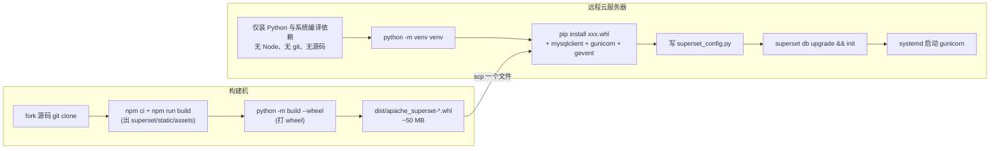
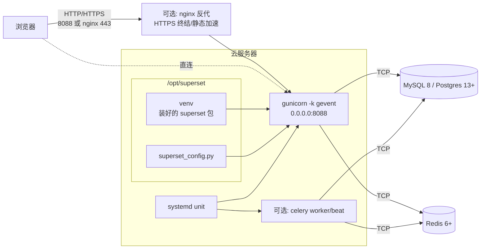

<!--
Licensed to the Apache Software Foundation (ASF) under one
or more contributor license agreements.  See the NOTICE file
distributed with this work for additional information
regarding copyright ownership.  The ASF licenses this file
to you under the Apache License, Version 2.0 (the
"License"); you may not use this file except in compliance
with the License.  You may obtain a copy of the License at

  http://www.apache.org/licenses/LICENSE-2.0

Unless required by applicable law or agreed to in writing,
software distributed under the License is distributed on an
"AS IS" BASIS, WITHOUT WARRANTIES OR CONDITIONS OF ANY
KIND, either express or implied.  See the License for the
specific language governing permissions and limitations
under the License.
-->

# 把 Fork 后的 Superset 部署到远程云服务器

本文档面向**生产 / 准生产**场景，给出一套把本仓库（apache/superset 的 fork，~6.1）以「**构建机出 wheel → 远程云服务器 `pip install wheel`**」的方式部署上线的完整步骤。这是 Apache Superset 官方 PyPI 安装方式（`pip install apache-superset`）应用到自有 fork 时的**完整等价做法**——你自己当一回 release manager，给自己的 fork 打一份 wheel。

开发与调试场景请看 [development-setup.zh.md](development-setup.zh.md)；英文官方 PyPI 指南见 [Installing from PyPI](https://superset.apache.org/docs/installation/pypi)。

## 一、整体思路

> **核心**：把"前端 npm build + Python 打包"这两个**只需要做一次**的事放在**构建机**上完成，得到一个 `.whl` 文件；**远程云服务器**仅需要 Python，`pip install` 这个 wheel 就装好了——零 Node、零 npm、零源码污染。



| 维度 | 单机一体方案<br/>（构建机 = 生产机） | **本文主流程<br/>（构建机 + 远程云）** |
|---|---|---|
| 生产机依赖 | Python + Node + npm + git + 源码 | **仅 Python + 系统库** |
| 单机磁盘占用 | ~5 GB（含 node_modules 中间产物） | **~1.5 GB**（仅 venv） |
| 多机部署 | 每台机器重跑 npm build（15 min × N） | **一次 build，scp 到 N 台机器** |
| 适合内网/防火墙 | 差（每台机器要联 npmjs） | **完美**（云机只要联 PyPI） |
| 与 `pip install apache-superset` 体验 | 不像 | **几乎等价**——你成了自己 fork 的发布者 |
| 升级流程 | 云上 git pull + build + reinstall | **本地出新 wheel → scp → reinstall** |

> 单机一体方案（不区分构建机 / 生产机）请看 [附录 A](#附录-a单机一体方案构建机即生产机)。

### 运行时拓扑



---

## 二、前置条件

### 2.1 构建机

任何能跑 Node 22 + Python 3.10 的 Linux 都行——本地虚拟机、自己开发用的 Ubuntu / WSL2、一台 CI runner 都可以。**不必和生产机同物理位置**。

| 项 | 要求 | 说明 |
|---|---|---|
| OS | Ubuntu 22.04 / 24.04（与生产机同发行版） | 保持 glibc 版本一致最稳 |
| 架构 | 与云服务器同架构（一般都 `x86_64`） | wheel 是纯 Python 的 `any` 平台，但本地编译的扩展（mysqlclient 等装在云上）受架构影响 |
| 磁盘 | ≥ 10 GB | node_modules 3 GB + 源码 200 MB + dist 50 MB |
| 内存 | ≥ 4 GB | npm build 峰值 2.5 GB |
| 网络 | 能访问 `github.com`、`registry.npmjs.org`、`pypi.org` | |

> 推荐就用你本地开发用的 Linux VM（Windows VirtualBox + Ubuntu 22 / WSL2 都行）。Windows 原生**不推荐**做构建机：webpack 插件路径分隔符、symlink 权限、IO 慢，坑较多。

### 2.2 远程云服务器

| 项 | 要求 | 验证 |
|---|---|---|
| OS | **Ubuntu 22.04 LTS**（本文示例）/ 24.04 LTS / Debian 12 / CentOS Stream 9 | `cat /etc/os-release` |
| 架构 | 与构建机一致 | `uname -m` |
| 磁盘 | 系统盘空闲 ≥ 3 GB（venv + 配置 + 日志） | `df -h /opt` |
| 内存 | ≥ 2 GB（无大数据集时） / ≥ 4 GB（推荐） | `free -h` |
| 端口 | 8088（应用）/ 80 / 443（nginx，可选） | `ss -ltnp` |
| sudo 权限 | 当前用户能 sudo | `sudo -n whoami` |
| 网络 | 能访问 PyPI、能连到元数据库与 Redis | `curl -I https://pypi.org` |

### 2.3 元数据库（二选一）

| 数据库 | 版本 | 字符集 |
|---|---|---|
| **MySQL** | 8.0+ | `utf8mb4` / `utf8mb4_unicode_ci` |
| **PostgreSQL** | 13+ | `UTF8` |

可以是：

- 云厂商托管服务（阿里云 RDS、腾讯云 CDB、AWS RDS、GCP Cloud SQL）——**强烈推荐**
- 与 Superset 同机自建（docker 或 apt 装）
- 独立 IDC 自建集群

只需 superset 进程能 TCP 直连。

### 2.4 Redis

云厂商托管（阿里云 Tair、AWS ElastiCache）或自建 6+ / 7+ 均可，TCP 直连。

### 2.5 部署用户

云服务器上建议**专用账号**：

```bash
sudo useradd -m -s /bin/bash superset
sudo passwd superset                 # 设密码或后续用 ssh key
# 装依赖期间临时给 sudo
sudo usermod -aG sudo superset
```

部署完成后建议把 `superset` 移出 `sudo` 组。

---

## 三、构建机：装工具链（一次性）

以下命令在**构建机**上执行。

### 3.1 系统编译依赖

```bash
sudo apt-get update
sudo apt-get install -y \
    build-essential libssl-dev libffi-dev \
    pkg-config \
    python3.10-dev python3.10-venv python3-pip \
    git curl ca-certificates
```

> 注意：构建机**不需要** `default-libmysqlclient-dev` / `libpq-dev` 这些数据库 client 头文件——它们只在云服务器上装 `mysqlclient` / `psycopg2` 时才需要。

### 3.2 Node 22 + npm 10（前端 build 要求）

```bash
curl -fsSL https://raw.githubusercontent.com/nvm-sh/nvm/v0.40.1/install.sh | bash
export NVM_DIR="$HOME/.nvm" && . "$NVM_DIR/nvm.sh"

nvm install 22
nvm alias default 22
node -v   # v22.22.x
npm -v    # 10.9.x
```

> 项目 [superset-frontend/package.json](../../../superset-frontend/package.json) 的 `engines` 强制要求 Node `^22.22.0` 与 npm `^10.8.1`，低于此版本 build 会报错。

---

## 四、构建机：克隆 Fork + Build 前端 + 出 wheel

> **本节的最终产物**是一个 `.whl` 文件（约 50 MB），下面所有后续步骤都围绕它展开。

### 4.1 拉代码

```bash
sudo mkdir -p /opt/superset-build
sudo chown -R $USER:$USER /opt/superset-build
cd /opt
git clone --depth=1 --branch=master \
    https://github.com/250715122/superset.git /opt/superset-build

cd /opt/superset-build
git log --oneline -1
```

> 构建机上的目录用 `/opt/superset-build`，与云端 `/opt/superset` 区分。

### 4.2 构建前端静态产物

```bash
cd /opt/superset-build/superset-frontend
nvm use 22

npm ci --no-audit --no-fund                                  # 约 5-10 分钟
NODE_OPTIONS="--max-old-space-size=4096" npm run build       # 约 8-15 分钟

# 验证
ls -lh ../superset/static/assets/manifest.json
du -sh ../superset/static/assets/                            # 期望 200-400 MB
```

> 这一步在 `superset/static/assets/` 下生成压缩后的 JS/CSS/字体/图片——它们将随后一步打进 wheel。

### 4.3 创建构建用 venv

构建用的 venv 独立于运行用的 venv，**只装打包工具**，不需要 superset 的运行时依赖：

```bash
cd /opt/superset-build
python3.10 -m venv build-venv
source build-venv/bin/activate

pip install --upgrade 'pip==25.2' 'setuptools<75' wheel build
```

> pip 26.x 当前有 certifi 路径 bug，固定到 25.2。

### 4.4 打 wheel

```bash
cd /opt/superset-build
python -m build --wheel

ls -lh dist/
# 输出形如:
# -rw-rw-r-- 1 user user  52M Jan 15 14:30 apache_superset-6.1.0.dev0-py3-none-any.whl
```

打 wheel 做的事（你不需要关心，记结论即可）：

1. 读 [pyproject.toml](../../../pyproject.toml) 的 `[build-system]`，知道用 setuptools 构建
2. 读 [setup.py](../../../setup.py) 拿到包名 `apache_superset`、版本、依赖、entry_points
3. 读 [MANIFEST.in](../../../MANIFEST.in)，把 `superset/static/`、`superset/templates/`、`superset/migrations/` 这些非 `.py` 资源一并塞进去
4. 把所有内容压缩成 `apache_superset-X.Y.Z-py3-none-any.whl`

### 4.5 验证 wheel 内容

```bash
# 用 unzip 看 wheel 里有没有前端 build 产物
unzip -l dist/apache_superset-*.whl | grep "static/assets/manifest.json"
# 应输出 manifest.json 一行 → 说明前端产物已经打进 wheel

# 看依赖列表
unzip -p dist/apache_superset-*.whl '*/METADATA' | head -50
```

> **如果没看到 `static/assets/manifest.json`**，说明 4.2 步前端 build 没生效，回去重跑。

### 4.6 记录构建 commit

```bash
cd /opt/superset-build
git rev-parse HEAD > dist/BUILD_COMMIT.txt
cat dist/BUILD_COMMIT.txt        # 部署后用于核对哪个版本上线了
```

---

## 五、传输到云服务器

把 4.4 出的 wheel 加上配套配置传过去。

```bash
# 1. wheel 本体
scp /opt/superset-build/dist/apache_superset-*.whl <user>@<cloud-host>:/tmp/

# 2. build commit 记录
scp /opt/superset-build/dist/BUILD_COMMIT.txt <user>@<cloud-host>:/tmp/

# 3.（可选，首次部署时）准备好的 superset_config.py 模板
scp /path/to/your/superset_config.py <user>@<cloud-host>:/tmp/
```

> **多台云机器**：把 scp 改成循环：
>
> ```bash
> for host in prod1 prod2 prod3; do
>     scp /opt/superset-build/dist/*.whl ${host}:/tmp/
> done
> ```

> **跨网络分发**：若构建机和云机不在同一内网，可改成上传到 OSS / S3 / 私有 PyPI 后再 wget 拉。

---

## 六、云服务器：装系统依赖（每台云机一次性）

以下命令在**云服务器**上执行。**没有 Node、没有 npm、没有 git**。

```bash
ssh <user>@<cloud-host>

sudo apt-get update
sudo apt-get install -y \
    build-essential libssl-dev libffi-dev \
    libsasl2-dev libldap2-dev \
    default-libmysqlclient-dev pkg-config \
    libpq-dev \
    python3.10-dev python3.10-venv python3-pip \
    curl ca-certificates
```

> - `default-libmysqlclient-dev` —— 装 MySQL 驱动时编译需要
> - `libpq-dev` —— 装 PostgreSQL 驱动时编译需要
> - `libsasl2-dev libldap2-dev` —— Superset 启动时会 import LDAP（即使你不用）
> - 这一节装完后，云机器上**不需要再 apt 装任何东西**，再也不会用 `apt`

---

## 七、云服务器：venv + pip install wheel

```bash
sudo mkdir -p /opt/superset
sudo chown -R superset:superset /opt/superset

sudo -iu superset
cd /opt/superset

# 创建运行用 venv
python3.10 -m venv venv
source venv/bin/activate

# 固定 pip 25.2 防 26.x certifi bug
pip install --upgrade 'pip==25.2' wheel setuptools
```

### 7.1 装 wheel 本体

```bash
# 这一条命令做的事相当于 `pip install apache-superset`
# 区别只是源不是 PyPI 而是你自己打的 wheel
pip install /tmp/apache_superset-*.whl
```

预计 5-10 分钟（pip 会从 PyPI 拉所有运行时依赖，含 Flask、Pandas、SQLAlchemy 等约 200+ 包）。

### 7.2 装数据库驱动 + 生产 WSGI

```bash
# MySQL（推荐）
pip install 'mysqlclient>=2.2.0'

# 或 PostgreSQL
# pip install 'psycopg2-binary>=2.9.9'

# 生产 WSGI
pip install 'gunicorn>=22.0.0' 'gevent>=24.2.1'
```

### 7.3 自检

```bash
which superset                  # /opt/superset/venv/bin/superset
superset version                # 显示版本号

python -c "import superset; print(superset.__file__)"
# 输出: /opt/superset/venv/lib/python3.X/site-packages/superset/__init__.py

cp /tmp/BUILD_COMMIT.txt /opt/superset/.deployed_commit
cat /opt/superset/.deployed_commit
```

### 7.4 删 wheel 文件（已安装完，磁盘释放）

```bash
rm -f /tmp/apache_superset-*.whl /tmp/BUILD_COMMIT.txt
```

---

## 八、云服务器：准备元数据库与 Redis

> 按你选的方式做。如果元数据库**已存在**（升级场景），跳到 [9.5 已有库的升级注意](#95-已有库的升级注意)。

### 8.1 方案 A：元数据库用云厂商托管 RDS（推荐生产）

直接在云厂商控制台开实例：

| 厂商 | MySQL 8 产品名 | PostgreSQL 产品名 |
|---|---|---|
| 阿里云 | RDS MySQL | RDS PostgreSQL |
| 腾讯云 | TencentDB for MySQL | TencentDB for PostgreSQL |
| AWS | RDS MySQL 或 Aurora MySQL | RDS PostgreSQL 或 Aurora PG |
| GCP | Cloud SQL MySQL | Cloud SQL PostgreSQL |

建实例后，进 控制台 → 安全组 / 白名单 → 允许 Superset 云服务器的内网 IP，然后 SQL 客户端建库：

```sql
-- MySQL
CREATE DATABASE superset DEFAULT CHARACTER SET utf8mb4 COLLATE utf8mb4_unicode_ci;
CREATE USER 'superset'@'%' IDENTIFIED BY '<random-strong-pwd>';
GRANT ALL PRIVILEGES ON superset.* TO 'superset'@'%';
FLUSH PRIVILEGES;
```

### 8.2 方案 B：元数据库与 Superset 同机 docker

如果不用云托管，最简单是云服务器自建：

```bash
# 装 docker
curl -fsSL https://get.docker.com | sudo bash
sudo usermod -aG docker superset

# MySQL
docker run -d --name superset-mysql \
    -p 127.0.0.1:3306:3306 \
    -e MYSQL_ROOT_PASSWORD='<root-pwd>' \
    -e MYSQL_DATABASE=superset \
    -e MYSQL_USER=superset \
    -e MYSQL_PASSWORD='<superset-pwd>' \
    --restart unless-stopped \
    -v superset-mysql-data:/var/lib/mysql \
    mysql:8.0 \
    --character-set-server=utf8mb4 \
    --collation-server=utf8mb4_unicode_ci
```

或 PostgreSQL：

```bash
docker run -d --name superset-postgres \
    -p 127.0.0.1:5432:5432 \
    -e POSTGRES_USER=superset \
    -e POSTGRES_PASSWORD='<superset-pwd>' \
    -e POSTGRES_DB=superset \
    --restart unless-stopped \
    -v superset-pg-data:/var/lib/postgresql/data \
    postgres:17
```

### 8.3 Redis

云厂商托管或同机自建：

```bash
docker run -d --name superset-redis \
    -p 127.0.0.1:6379:6379 \
    --restart unless-stopped \
    -v superset-redis-data:/data \
    redis:7 \
    redis-server --appendonly yes
```

### 8.4 连通验证

```bash
mysql -h <DB_HOST> -P 3306 -u superset -p superset -e "SELECT VERSION();"
redis-cli -h <REDIS_HOST> -p 6379 ping     # 期望 PONG
```

### 8.5 已有库的升级注意

```bash
mysql -h <DB_HOST> -u superset -p superset -e "SELECT version_num FROM alembic_version;"
```

**强烈建议先备份**：

```bash
mysqldump --single-transaction --routines --triggers --events \
    -h <DB_HOST> -u superset -p superset \
    | gzip > /opt/backup/superset_db_$(date +%F).sql.gz
```

---

## 九、编写 `superset_config.py`

在 `/opt/superset/superset_config.py` 创建生产配置。

### 9.1 生成强 `SECRET_KEY`

```bash
openssl rand -base64 42
# 输出类似 tACUIugvzJlk6kA4Z3fDmlbn3LuYv4X8Xmu2pPWt+zhSgy3UAMleKomL
```

### 9.2 最小可用模板

```python
# /opt/superset/superset_config.py
"""Production configuration for Superset (deployed via wheel)."""
from cachelib.redis import RedisCache

SECRET_KEY = "<把上面 openssl rand 的输出贴这里>"

# ---- 数据库 ---------------------------------------------------------------

SQLALCHEMY_DATABASE_URI = (
    "mysql+mysqldb://superset:<superset-pwd>@<DB_HOST>:3306/superset"
    "?charset=utf8mb4"
)
# Postgres: "postgresql+psycopg2://superset:<pwd>@<DB_HOST>:5432/superset"

SQLALCHEMY_TRACK_MODIFICATIONS = False
SQLALCHEMY_ENGINE_OPTIONS = {
    "pool_pre_ping": True,
    "pool_recycle": 1800,
    "pool_size": 10,
    "max_overflow": 20,
}

# ---- 缓存与异步队列 -------------------------------------------------------

REDIS_HOST = "<REDIS_HOST>"
REDIS_PORT = 6379

CACHE_CONFIG = {
    "CACHE_TYPE": "RedisCache",
    "CACHE_DEFAULT_TIMEOUT": 300,
    "CACHE_KEY_PREFIX": "superset_",
    "CACHE_REDIS_HOST": REDIS_HOST,
    "CACHE_REDIS_PORT": REDIS_PORT,
    "CACHE_REDIS_DB": 1,
}
DATA_CACHE_CONFIG = CACHE_CONFIG
FILTER_STATE_CACHE_CONFIG = {**CACHE_CONFIG, "CACHE_DEFAULT_TIMEOUT": 86400}
EXPLORE_FORM_DATA_CACHE_CONFIG = {**CACHE_CONFIG, "CACHE_DEFAULT_TIMEOUT": 86400}

RESULTS_BACKEND = RedisCache(host=REDIS_HOST, port=REDIS_PORT, key_prefix="sql_results_", db=2)

class CeleryConfig:
    broker_url = f"redis://{REDIS_HOST}:{REDIS_PORT}/0"
    result_backend = f"redis://{REDIS_HOST}:{REDIS_PORT}/1"
    worker_prefetch_multiplier = 1
    task_acks_late = False

CELERY_CONFIG = CeleryConfig

# ---- 生产开关 -------------------------------------------------------------

DEBUG = False
WTF_CSRF_ENABLED = True
WTF_CSRF_TIME_LIMIT = 60 * 60 * 24 * 7
TALISMAN_ENABLED = True
TALISMAN_CONFIG = {
    "content_security_policy": None,
    "force_https": False,
    "session_cookie_secure": False,
}

# ---- 行为 -----------------------------------------------------------------

ROW_LIMIT = 100000
SUPERSET_WEBSERVER_TIMEOUT = 120
SUPERSET_WEBSERVER_PORT = 8088
ENABLE_PROXY_FIX = True

FEATURE_FLAGS = {
    "ALERT_REPORTS": False,
    "DASHBOARD_RBAC": True,
    "ENABLE_TEMPLATE_PROCESSING": True,
}
```

### 9.3 自定义安全管理器（可选）

如果你的 fork 改了认证逻辑（自定义 SSO/OAuth/LDAP），把 SecurityManager 类与配置放同目录：

```python
from superset.security import SupersetSecurityManager

class CompanySsoSecurityManager(SupersetSecurityManager):
    def oauth_user_info(self, provider, response=None):
        ...
    def auth_user_oauth(self, userinfo):
        ...

CUSTOM_SECURITY_MANAGER = CompanySsoSecurityManager
```

### 9.4 权限收紧与验证

```bash
chmod 600 /opt/superset/superset_config.py

source /opt/superset/venv/bin/activate
export SUPERSET_CONFIG_PATH=/opt/superset/superset_config.py

python -m py_compile /opt/superset/superset_config.py
python -c "
import sys; sys.path.insert(0, '/opt/superset')
import superset_config as c
print('DB:', c.SQLALCHEMY_DATABASE_URI.split('@')[-1])
print('SECRET_KEY length:', len(c.SECRET_KEY))
assert len(c.SECRET_KEY) >= 32, 'SECRET_KEY too short'
print('OK')
"
```

---

## 十、初始化或升级元数据库

### 10.1 场景 A：全新部署

```bash
cd /opt/superset
source venv/bin/activate
export SUPERSET_CONFIG_PATH=/opt/superset/superset_config.py
export FLASK_APP=superset.app:create_app

superset db upgrade

superset fab create-admin \
    --username admin \
    --firstname Admin \
    --lastname User \
    --email admin@example.com \
    --password '<change-me>'

superset init
```

### 10.2 场景 B：升级（已有元数据库）

```bash
cd /opt/superset
source venv/bin/activate
export SUPERSET_CONFIG_PATH=/opt/superset/superset_config.py
export FLASK_APP=superset.app:create_app

superset db current                                                    # 看当前版本
superset db history --rev-range=<current>:head | head -50              # 看要跑哪些迁移
superset db upgrade 2>&1 | tee /opt/backup/db_upgrade_$(date +%F).log  # 执行
superset init
```

> 第 3 步若中断，alembic 可能卡在中间版本——**升级前必须做完 8.5 节的整库备份**。

---

## 十一、systemd 托管

### 11.1 主服务

`sudo vim /etc/systemd/system/superset.service`：

```ini
[Unit]
Description=Apache Superset
After=network.target

[Service]
Type=simple
User=superset
Group=superset
WorkingDirectory=/opt/superset

Environment="PATH=/opt/superset/venv/bin"
Environment="SUPERSET_CONFIG_PATH=/opt/superset/superset_config.py"
Environment="FLASK_APP=superset.app:create_app()"
Environment="PYTHONUNBUFFERED=1"

ExecStart=/opt/superset/venv/bin/gunicorn \
    --workers 4 \
    --worker-class gevent \
    --worker-connections 1000 \
    --timeout 120 \
    --keep-alive 5 \
    --max-requests 1000 \
    --max-requests-jitter 100 \
    --bind 0.0.0.0:8088 \
    --access-logfile /var/log/superset/access.log \
    --error-logfile /var/log/superset/error.log \
    --log-level info \
    "superset.app:create_app()"

Restart=always
RestartSec=5
LimitNOFILE=65536

[Install]
WantedBy=multi-user.target
```

| 参数 | 取值建议 |
|---|---|
| `--workers` | `2 × CPU 核数 + 1`（云机 2 核写 5，4 核写 9） |
| `--worker-class` | `gevent` |
| `--worker-connections` | 1000 |
| `--timeout` | 120（大查询场景 300） |
| `--max-requests` | 1000（防内存泄漏累积） |
| `LimitNOFILE` | 65536 |

### 11.2 启动 + 验证

```bash
sudo mkdir -p /var/log/superset
sudo chown superset:superset /var/log/superset

sudo systemctl daemon-reload
sudo systemctl start superset
sudo systemctl status superset --no-pager

curl -fsS http://127.0.0.1:8088/health                       # 应返回 OK
curl -o /dev/null -s -w "%{http_code}\n" http://127.0.0.1:8088/login/      # 应返回 200
```

### 11.3 开机自启

仅在功能完整验证后：

```bash
sudo systemctl enable superset
```

### 11.4（可选）Celery worker / beat

只有用到 Alert/Report、CSV 异步导出、SQL Lab 异步查询时才需要。两个 unit：

`/etc/systemd/system/superset-worker.service`：

```ini
[Unit]
Description=Apache Superset Celery worker
After=network.target superset.service

[Service]
Type=simple
User=superset
Group=superset
WorkingDirectory=/opt/superset
Environment="PATH=/opt/superset/venv/bin"
Environment="SUPERSET_CONFIG_PATH=/opt/superset/superset_config.py"
ExecStart=/opt/superset/venv/bin/celery --app=superset.tasks.celery_app:app worker \
    --pool=prefork --loglevel=info --concurrency=4
Restart=always
RestartSec=5

[Install]
WantedBy=multi-user.target
```

`/etc/systemd/system/superset-beat.service`：

```ini
[Unit]
Description=Apache Superset Celery beat (scheduler)
After=network.target superset.service

[Service]
Type=simple
User=superset
Group=superset
WorkingDirectory=/opt/superset
Environment="PATH=/opt/superset/venv/bin"
Environment="SUPERSET_CONFIG_PATH=/opt/superset/superset_config.py"
ExecStart=/opt/superset/venv/bin/celery --app=superset.tasks.celery_app:app beat \
    --loglevel=info
Restart=always
RestartSec=5

[Install]
WantedBy=multi-user.target
```

```bash
sudo systemctl daemon-reload
sudo systemctl enable --now superset-worker superset-beat
```

---

## 十二、（可选）nginx 反代 + HTTPS

生产环境强烈建议 nginx 终结 HTTPS。

```bash
sudo apt-get install -y nginx
```

`/etc/nginx/sites-available/superset.conf`：

```nginx
upstream superset {
    server 127.0.0.1:8088;
    keepalive 32;
}

server {
    listen 80;
    server_name superset.example.com;
    return 301 https://$host$request_uri;
}

server {
    listen 443 ssl http2;
    server_name superset.example.com;

    ssl_certificate     /etc/letsencrypt/live/superset.example.com/fullchain.pem;
    ssl_certificate_key /etc/letsencrypt/live/superset.example.com/privkey.pem;
    ssl_protocols TLSv1.2 TLSv1.3;

    client_max_body_size 100M;

    # 静态资源直接由 nginx 出，绕开 gunicorn
    location /static/ {
        alias /opt/superset/venv/lib/python3.10/site-packages/superset/static/;
        expires 30d;
        add_header Cache-Control "public, immutable";
    }

    location / {
        proxy_pass http://superset;
        proxy_http_version 1.1;
        proxy_set_header Host              $host;
        proxy_set_header X-Real-IP         $remote_addr;
        proxy_set_header X-Forwarded-For   $proxy_add_x_forwarded_for;
        proxy_set_header X-Forwarded-Proto $scheme;
        proxy_set_header X-Forwarded-Host  $host;
        proxy_set_header Connection        "";
        proxy_read_timeout 120s;
        proxy_send_timeout 120s;
    }
}
```

```bash
sudo ln -s /etc/nginx/sites-available/superset.conf /etc/nginx/sites-enabled/
sudo nginx -t
sudo systemctl reload nginx
```

> 开 HTTPS 时同步改 `superset_config.py`：
>
> - `ENABLE_PROXY_FIX = True`（已建议开）
> - `TALISMAN_CONFIG["session_cookie_secure"] = True`
> - `TALISMAN_CONFIG["force_https"] = True`（可选）
>
> 改完 `sudo systemctl restart superset`。

---

## 十三、升级与回滚剧本

### 13.1 滚动升级（每次发新版）

**构建机**上：

```bash
TS=$(date +%F-%H%M)

cd /opt/superset-build
git fetch origin master
git log --oneline HEAD..origin/master                         # 确认 commits
git reset --hard origin/master
git rev-parse HEAD > dist/BUILD_COMMIT.txt

cd superset-frontend
NODE_OPTIONS="--max-old-space-size=4096" npm run build
cd /opt/superset-build

source build-venv/bin/activate
rm -rf dist build *.egg-info
python -m build --wheel

# 上传到云机
scp dist/apache_superset-*.whl <user>@<cloud-host>:/tmp/
scp dist/BUILD_COMMIT.txt      <user>@<cloud-host>:/tmp/
```

**云服务器**上：

```bash
TS=$(date +%F-%H%M)

# 1. 备份运行中的 venv 与元数据库
sudo systemctl stop superset
sudo cp -a /opt/superset/venv /opt/backup/venv_${TS}
mysqldump --single-transaction --routines --triggers \
    -h <DB_HOST> -u superset -p superset \
    | gzip > /opt/backup/db_${TS}.sql.gz

# 2. 装新 wheel
source /opt/superset/venv/bin/activate
pip install /tmp/apache_superset-*.whl --force-reinstall --no-deps
# 如果新版本动了 install_requires，需要重新解析依赖
# pip install /tmp/apache_superset-*.whl --force-reinstall --upgrade

# 3. 跑 alembic 迁移（仅当版本带 schema 变更）
export SUPERSET_CONFIG_PATH=/opt/superset/superset_config.py
export FLASK_APP=superset.app:create_app
superset db upgrade
superset init

# 4. 更新 commit 标记 & 启服务
cp /tmp/BUILD_COMMIT.txt /opt/superset/.deployed_commit
rm -f /tmp/apache_superset-*.whl /tmp/BUILD_COMMIT.txt

sudo systemctl start superset
sudo systemctl status superset --no-pager
curl -fsS http://127.0.0.1:8088/health
```

预计**总耗时 5-10 分钟**（构建机上 build 占大头），其中**云端停机时间 < 1 分钟**。

### 13.2 整体回滚（升级失败时）

云服务器上：

```bash
TS=<升级时的时间戳>

sudo systemctl stop superset

# 1. 还原 venv（最快路径）
sudo rm -rf /opt/superset/venv
sudo mv /opt/backup/venv_${TS} /opt/superset/venv

# 2. 还原数据库（仅当跑过 db upgrade 时需要）
gunzip -c /opt/backup/db_${TS}.sql.gz | \
    mysql -h <DB_HOST> -u superset -p superset

sudo systemctl start superset
curl -fsS http://127.0.0.1:8088/health
```

预计 **3-5 分钟**。

---

## 十四、常见问题排查

### Q1. `pip install xxx.whl` 报 `mysql_config: not found`

云服务器没装 MySQL 开发头文件——回到第六节：

```bash
sudo apt-get install -y default-libmysqlclient-dev pkg-config
```

### Q2. `python -m build` 报 `error: Microsoft Visual C++ 14.0 is required`

你在 Windows 上跑构建。**强烈建议改用 Linux 虚拟机 / WSL2 作构建机**——Windows 上跑 Superset 前端 build 有路径分隔符 / symlink / IO 速度等多个坑。

### Q3. 启动后浏览器白屏 / `/static/assets/*` 404

wheel 里没打进前端产物。回到 4.2 → 4.5 验证：

```bash
unzip -l /tmp/apache_superset-*.whl | grep "static/assets/manifest.json"
```

若 grep 无输出，说明前端没 build 进去——4.2 步前端 build 没跑或没成功。

### Q4. 升级后命令 `superset` 找不到

激活 venv 后再用：

```bash
source /opt/superset/venv/bin/activate
which superset      # /opt/superset/venv/bin/superset
```

或用绝对路径 `/opt/superset/venv/bin/superset --help`。

### Q5. 服务起不来，`code=exited, status=3/NOTIMPLEMENTED`

通常是 `superset_config.py` 里 import 失败或 `SECRET_KEY` 缺失。看 journalctl：

```bash
sudo journalctl -u superset -n 100 --no-pager
```

逐项修：

- `ImportError`：检查自定义 SecurityManager 是否引用了不存在的 6.0/6.1 API
- `SECRET_KEY` 报错：第 9.1 节生成
- 数据库连不上：检查 `SQLALCHEMY_DATABASE_URI` 与 RDS 安全组白名单

### Q6. `superset db upgrade` 卡在某个 migration

跨大版本升级时大表 alter 可能要几分钟到几十分钟。**先看是不是真卡住**：

```bash
mysql -h <DB_HOST> -u superset -p superset -e "SHOW PROCESSLIST;"
```

如果有 `ALTER TABLE` 状态在跑，**不要中断**。真死锁则按 13.2 整库回滚。

### Q7. gunicorn worker 频繁 `WORKER TIMEOUT`

慢查询超过 `--timeout 120`。加大 timeout 到 300 或定位慢 SQL 优化数据源。

### Q8. 验证「云上跑的就是我 fork 的最新 commit」

```bash
# 云服务器
cat /opt/superset/.deployed_commit
/opt/superset/venv/bin/pip show apache-superset | grep Version
/opt/superset/venv/bin/python -c "import superset, os; print(os.path.dirname(superset.__file__))"
```

`/opt/superset/.deployed_commit` 应等于构建机上 `git rev-parse HEAD`。

### Q9. 想加新的 Python 依赖（fork 引入了新库）

两种方式：

1. 把依赖加进 [pyproject.toml](../../../pyproject.toml) 的 `dependencies`，下一次出 wheel 时自动带（推荐）
2. 临时在云上 `pip install <pkg>`，重启 systemd（不可持续，下次升级 wheel 会被洗掉）

### Q10. wheel 文件越来越大（push 多次后）

`python -m build` 每次跑前应清理：

```bash
cd /opt/superset-build
rm -rf dist build *.egg-info
python -m build --wheel
```

---

## 附录 A：单机一体方案（构建机即生产机）

如果你**只有一台机器**（生产机本身能装 Node 22），并且不想跨机器分发 wheel，可以省略「打 wheel + scp」环节，直接在生产机上跑完所有步骤：

```bash
# 生产机上一气呵成
sudo apt-get install -y \
    build-essential libssl-dev libffi-dev libsasl2-dev libldap2-dev \
    default-libmysqlclient-dev pkg-config libpq-dev \
    python3.10-dev python3.10-venv python3-pip git curl

# Node 22 (一次性)
curl -fsSL https://raw.githubusercontent.com/nvm-sh/nvm/v0.40.1/install.sh | bash
export NVM_DIR="$HOME/.nvm" && . "$NVM_DIR/nvm.sh"
nvm install 22 && nvm alias default 22

# 拉代码 + build + 装
sudo mkdir -p /opt/superset && sudo chown $USER:$USER /opt/superset
git clone --depth=1 https://github.com/250715122/superset.git /opt/superset
cd /opt/superset/superset-frontend
npm ci --no-audit --no-fund
NODE_OPTIONS="--max-old-space-size=4096" npm run build
rm -rf node_modules                                # 装完释放磁盘

cd /opt/superset
python3.10 -m venv venv
source venv/bin/activate
pip install --upgrade 'pip==25.2' wheel setuptools
pip install .                                      # 注意: 末尾这个点!
pip install mysqlclient gunicorn gevent
```

然后跳到第九节起继续（配置 / 初始化 / systemd）。

**单机一体的代价**：

- 生产机要装 Node 22（增加 ~500 MB 与维护成本）
- 升级时要重跑 `npm run build`（每次 ~15 分钟）
- 多机部署时每台机器要重复以上工作

只在只有一台机器、且确认不会变多时用。

---

## 附录 B：用 GitHub Actions 自动出 wheel（高级）

如果你已经能熟练用构建机出 wheel，下一步是把构建机替换为 GitHub Actions——push tag 自动出 wheel 上传到 GitHub Releases，云服务器直接 `wget` 拉。

在 fork 仓库 `.github/workflows/release-wheel.yml`：

```yaml
name: Build & Release Wheel

on:
  push:
    tags:
      - 'v*'

jobs:
  build-wheel:
    runs-on: ubuntu-22.04
    steps:
      - uses: actions/checkout@v4
      - uses: actions/setup-node@v4
        with:
          node-version: '22'
      - uses: actions/setup-python@v5
        with:
          python-version: '3.10'

      - name: Build frontend
        working-directory: superset-frontend
        run: |
          npm ci --no-audit --no-fund
          NODE_OPTIONS="--max-old-space-size=4096" npm run build

      - name: Build wheel
        run: |
          pip install --upgrade 'pip==25.2' build
          python -m build --wheel

      - name: Upload to release
        uses: softprops/action-gh-release@v2
        with:
          files: dist/*.whl
```

打 tag 即触发：

```bash
git tag -a v6.1.0-fork-1 -m "first internal release"
git push origin v6.1.0-fork-1
```

云服务器升级时：

```bash
WHEEL_URL=$(curl -s https://api.github.com/repos/250715122/superset/releases/latest \
    | jq -r '.assets[] | select(.name | endswith(".whl")) | .browser_download_url')
wget "$WHEEL_URL" -O /tmp/superset.whl

source /opt/superset/venv/bin/activate
pip install /tmp/superset.whl --force-reinstall --no-deps
sudo systemctl restart superset
```

---

## 附录 C：完整目录布局

### 构建机

```
/opt/superset-build/
├── .git/                              # fork 浅克隆
├── superset/                          # 源码
├── superset-frontend/                 # 前端源码 + build 配置 (node_modules 临时)
├── build-venv/                        # 构建专用 venv (含 build 工具)
└── dist/
    ├── apache_superset-X.Y.Z-py3-none-any.whl    # 关键产物
    └── BUILD_COMMIT.txt                          # 对应的 git commit
```

### 云服务器

```
/opt/superset/
├── .deployed_commit                   # 当前部署对应的构建 commit
├── superset_config.py                 # 生产配置 (chmod 600)
└── venv/                              # 运行环境
    └── lib/python3.10/site-packages/
        └── superset/                  # 装好的 superset 包
            ├── __init__.py
            └── static/assets/         # 前端 build 产物 (已打进 wheel)
/etc/systemd/system/
├── superset.service                   # 主服务
├── superset-worker.service            # 可选: Celery worker
└── superset-beat.service              # 可选: Celery beat
/etc/nginx/sites-available/
└── superset.conf                      # 可选: HTTPS 反代
/var/log/superset/
├── access.log
└── error.log
/opt/backup/                           # 升级前备份
├── db_2026-05-18-1700.sql.gz
└── venv_2026-05-18-1700/
```

云服务器上**没有** git 仓库、源码目录、node_modules——全部已经预编译进 wheel。

---

## 附录 D：环境变量速查

| 变量 | 值 | 何时需要 |
|---|---|---|
| `SUPERSET_CONFIG_PATH` | `/opt/superset/superset_config.py` | 跑任何 `superset ...` 命令前 |
| `FLASK_APP` | `superset.app:create_app` | 跑 `superset db ...` 等命令前 |
| `PYTHONUNBUFFERED` | `1` | systemd 下让 print 立即冲刷到日志 |

systemd unit 已通过 `Environment=` 注入，服务运行时不依赖 shell 环境。手动跑命令时记得：

```bash
source /opt/superset/venv/bin/activate
export SUPERSET_CONFIG_PATH=/opt/superset/superset_config.py
export FLASK_APP=superset.app:create_app
```

---

## 附录 E：与开发模式的主要差异

| 维度 | 开发（[development-setup.zh.md](development-setup.zh.md)） | 生产（本文档） |
|---|---|---|
| 安装方式 | `pip install -e .`（editable，本机有源码） | `pip install xxx.whl`（wheel，零源码） |
| 安装位置 | 构建机一台 | **构建机 + 云端两侧分工** |
| 前端 | `npm run dev-server`（HMR，9000 端口） | 构建机 `npm run build` 一次，wheel 自带产物 |
| Flask | `flask run --reload --debugger` | `gunicorn -k gevent` |
| 进程 | 手动启动两个终端 | systemd 托管 |
| 配置文件 | `superset_config_local.py`，弱密钥 | `superset_config.py`，强 `SECRET_KEY` + Talisman |
| `DEBUG` | `True` | `False` |
| 反代 | 不需要 | nginx + HTTPS |
| 改代码后 | 自动 reload，秒级生效 | 构建机重出 wheel → scp → reinstall → restart |
| 修源码 | 直接编辑 `/opt/superset6.1/superset/*.py` | 在构建机的 git 仓库改，**云上没有源码** |

---

## 附录 F：常见误区

### F.1 "我能不能直接 `pip install apache-superset` 装我 fork 的代码？"

**不能**。`pip install apache-superset` 从 **PyPI** 拉的是 Apache 团队官方发布的 wheel，里面没有你的修改。`apache-superset` 这个包名也已被 ASF 注册，你不能往同一个名字上推自己的版本。要让"一行装好"成立，必须自己当一回 release manager（即本文整套流程）。

### F.2 "为啥不能在云服务器上 `git clone + pip install .`？"

**可以**——这就是附录 A 的单机一体方案。代价是云服务器必须装 Node 22、git、源码（约 ~5 GB 磁盘），且每次升级要重跑 npm build。本文主流程把这些都挪到构建机，云机最干净。

### F.3 "pip install . 和 pip install xxx.whl 有什么区别？"

`pip install .` 内部其实**也会临时打一个 wheel 再装**，区别只在临时 wheel 不会输出到 `dist/`、装完即扔。`python -m build --wheel` 是把这个临时 wheel 保留下来，便于跨机器分发。

### F.4 "构建机能不能用 Mac / Windows？"

- **Mac**：能（Apple Silicon 也能），出的 wheel 是 `py3-none-any.whl`（纯 Python），可跑在 x86 Linux 上
- **Windows 原生**：**不推荐**——Superset 前端 build 在 Windows 上有路径分隔符、symlink、IO 慢等多个已知坑
- **Windows + WSL2**：可（WSL2 本质是 Linux）

### F.5 "构建机和云服务器一定要同发行版吗？"

不强制，但**强烈建议**——`mysqlclient`、`psycopg2` 这些扩展是在云上装的，受云上 OS 的 glibc 影响；wheel 本体是纯 Python，与发行版无关。两边都 Ubuntu 22.04 是最稳的选择。

