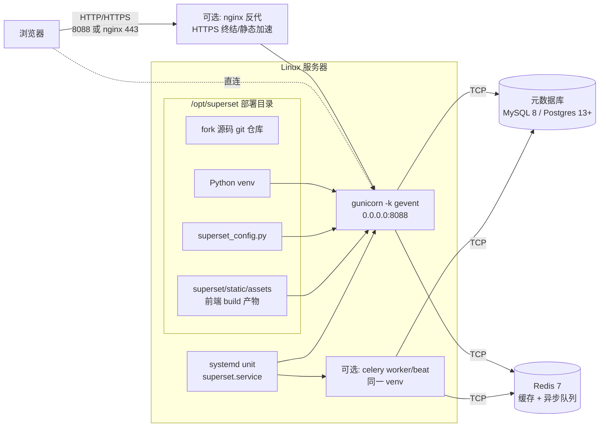

<!--
Licensed to the Apache Software Foundation (ASF) under one
or more contributor license agreements.  See the NOTICE file
distributed with this work for additional information
regarding copyright ownership.  The ASF licenses this file
to you under the Apache License, Version 2.0 (the
"License"); you may not use this file except in compliance
with the License.  You may obtain a copy of the License at

  http://www.apache.org/licenses/LICENSE-2.0

Unless required by applicable law or agreed to in writing,
software distributed under the License is distributed on an
"AS IS" BASIS, WITHOUT WARRANTIES OR CONDITIONS OF ANY
KIND, either express or implied.  See the License for the
specific language governing permissions and limitations
under the License.
-->

# 在 Linux 上以官方 pip install 方式部署 Superset Fork

本文档面向**生产 / 准生产**场景，给出一套把本仓库（apache/superset 的 fork，~6.1）以 Superset 官方推荐的「源码构建 wheel → pip install → systemd 托管」方式部署到 Linux 服务器的完整步骤。

对应开发与调试场景请看 [development-setup.zh.md](development-setup.zh.md)；英文官方部署指南见 [Installing Locally Using Docker Compose](https://superset.apache.org/docs/installation/docker-builds) 与 [Installing from PyPI](https://superset.apache.org/docs/installation/pypi)，本文是其针对**自有 fork 代码 + Linux 裸机 / VM** 落地的中文增强版。

## 一、整体架构

> **核心思路**：Linux 服务器上跑一个 `gunicorn -k gevent` 作为应用进程，由 `systemd` 托管自启；元数据库（MySQL 或 Postgres）、Redis 单独部署或复用已有实例；前端是**编译期产物**，运行时只是静态文件。



**为什么这种方式**：

- **可重复**：源码 → wheel → 安装，与官方 `pip install apache-superset` 等价；新机器 1 小时内复刻同一版本
- **可滚动升级**：`git pull && pip install . && systemctl restart superset`，30 秒切换版本
- **可回滚**：升级前 `git checkout <旧 commit>` 或保留旧目录改名为 `.bak`，秒级恢复
- **可独立扩缩**：进程数（gunicorn workers）、Celery 节点、数据库都解耦，不强耦合 docker 编排
- **不污染系统 Python**：所有依赖封在 `/opt/superset/venv` 中，与 OS 包管理零冲突

> 如果你**不需要修改任何代码**、只想看看 Superset，最快路径仍是 `docker compose up`，参考 [development-setup.zh.md](development-setup.zh.md#备选方案纯-docker-compose-一键启动) 末尾的备选方案。

---

## 二、前置条件

### Linux 服务器

| 项 | 最低要求 | 验证命令 |
|---|---|---|
| 操作系统 | Ubuntu 22.04 LTS / 24.04 LTS / Debian 12 / CentOS Stream 9 / RHEL 9+ | `cat /etc/os-release` |
| 架构 | x86_64 或 aarch64 | `uname -m` |
| 磁盘 | 系统盘空闲 ≥ 10 GB（venv 1G + node_modules 临时 3G + assets 300M + 备份预留） | `df -h /opt` |
| 内存 | ≥ 4 GB（前端构建峰值 ~2.5 GB；运行时稳态 ~1.5 GB） | `free -h` |
| CPU | ≥ 2 核（gunicorn 推荐 `workers = 2*核数+1`） | `nproc` |
| sudo | 当前用户可 sudo | `sudo -n whoami` |
| 网络 | 能访问 `github.com`、`pypi.org`、`registry.npmjs.org` | `curl -I https://pypi.org` |

### 元数据库（二选一，**生产强烈避免使用默认 SQLite**）

| 数据库 | 版本 | 字符集要求 |
|---|---|---|
| **MySQL** | 8.0+ | `utf8mb4` / `utf8mb4_unicode_ci` |
| **PostgreSQL** | 13+ | `UTF8` |

可以是同机 docker、同机原生服务，或独立的 RDS / 自建集群——只需 superset 能 TCP 直连。

### Redis

| 项 | 要求 |
|---|---|
| 版本 | Redis 6+ 或 7+ |
| 用途 | 应用缓存（`CACHE_CONFIG`、`DATA_CACHE_CONFIG`、表单状态缓存）+ Celery broker/backend |

> Redis 不强制，但生产强烈推荐——不开缓存时大 dashboard 渲染会重复查后端数据库。

### 部署用户

建议**专用账号**（如 `superset`）而非 root：

```bash
sudo useradd -m -s /bin/bash superset
sudo usermod -aG sudo superset    # 仅装依赖时需要，装完可移除
```

后文示例统一用 `superset` 用户、部署目录 `/opt/superset`，请按实际替换。

---

## 三、安装基础工具链（在部署服务器上）

### 1. 系统编译依赖（一次性）

**Ubuntu / Debian**：

```bash
sudo apt-get update
sudo apt-get install -y \
    build-essential libssl-dev libffi-dev \
    libsasl2-dev libldap2-dev \
    default-libmysqlclient-dev pkg-config \
    libpq-dev \
    python3.10-dev python3.10-venv python3-pip \
    git curl ca-certificates
```

**CentOS / RHEL 9**：

```bash
sudo dnf groupinstall -y "Development Tools"
sudo dnf install -y \
    openssl-devel libffi-devel \
    cyrus-sasl-devel openldap-devel \
    mysql-devel postgresql-devel \
    python3.11 python3.11-devel python3-pip \
    git curl
```

> **关键点**：`default-libmysqlclient-dev` / `mysql-devel` 必装，否则后面 `pip install mysqlclient` 会因找不到 `mysql_config` 而失败。

### 2. Python（项目支持 3.10 / 3.11 / 3.12）

Ubuntu 22.04 自带 3.10，可直接用。如需 3.11/3.12，推荐 [deadsnakes PPA](https://launchpad.net/~deadsnakes/+archive/ubuntu/ppa)：

```bash
sudo add-apt-repository -y ppa:deadsnakes/ppa
sudo apt-get install -y python3.11 python3.11-dev python3.11-venv
python3.11 --version
```

### 3. Node.js 22 + npm 10（**仅前端构建阶段需要**）

> **重要**：Node 仅用于一次性 build 前端产物，跑出 `superset/static/assets/` 后**生产服务器可以卸载 Node**。如果你在另一台机器构建好 wheel 再上传，部署机完全不需要 Node。

```bash
curl -fsSL https://raw.githubusercontent.com/nvm-sh/nvm/v0.40.1/install.sh | bash
export NVM_DIR="$HOME/.nvm" && . "$NVM_DIR/nvm.sh"

nvm install 22
nvm alias default 22
node -v   # v22.22.x
npm -v    # 10.9.x
```

### 4.（可选）docker，用于跑 MySQL/Redis 依赖

如果数据库和 Redis 用 docker 起，需装 docker：

```bash
docker --version            # 27.x 或更高
docker compose version      # v2.5+
```

否则跳过。

---

## 四、准备元数据库

> 按你选的数据库二选一执行。如果元数据库**已存在**（例如从旧版本升级，复用历史数据），跳到本节末尾的「**复用已有库**」。

### 方案 A：MySQL 8（自建或 docker）

#### 4.A.1 用 docker 起一个本地实例（最快）

```bash
docker run -d --name superset-mysql \
    -p 127.0.0.1:3306:3306 \
    -e MYSQL_ROOT_PASSWORD='<root-pwd>' \
    -e MYSQL_DATABASE=superset \
    -e MYSQL_USER=superset \
    -e MYSQL_PASSWORD='<superset-pwd>' \
    --restart unless-stopped \
    -v superset-mysql-data:/var/lib/mysql \
    mysql:8.0 \
    --character-set-server=utf8mb4 \
    --collation-server=utf8mb4_unicode_ci \
    --default-authentication-plugin=mysql_native_password
```

#### 4.A.2 或在已有 MySQL 上手动建库建账号

```sql
CREATE DATABASE superset DEFAULT CHARACTER SET utf8mb4 COLLATE utf8mb4_unicode_ci;
CREATE USER 'superset'@'%' IDENTIFIED BY '<superset-pwd>';
GRANT ALL PRIVILEGES ON superset.* TO 'superset'@'%';
FLUSH PRIVILEGES;
```

#### 4.A.3 验证连通

```bash
mysql -h <DB_HOST> -P 3306 -u superset -p superset -e "SELECT VERSION();"
```

期望输出 `8.0.x`。

### 方案 B：PostgreSQL 13+

#### 4.B.1 用 docker 起一个本地实例

```bash
docker run -d --name superset-postgres \
    -p 127.0.0.1:5432:5432 \
    -e POSTGRES_USER=superset \
    -e POSTGRES_PASSWORD='<superset-pwd>' \
    -e POSTGRES_DB=superset \
    --restart unless-stopped \
    -v superset-pg-data:/var/lib/postgresql/data \
    postgres:17
```

#### 4.B.2 验证

```bash
docker exec superset-postgres psql -U superset -d superset -c 'SELECT VERSION();'
```

### 复用已有库（升级场景）

如果新部署是要接管一个已有 MySQL/Postgres 元数据库：

```bash
# MySQL: 看当前 alembic 版本
mysql -h <DB_HOST> -u superset -p superset -e "SELECT version_num FROM alembic_version;"

# Postgres: 同理
psql -h <DB_HOST> -U superset -d superset -c "SELECT version_num FROM alembic_version;"
```

记下输出的版本号（如 `48cbb571fa3a`），后面的「升级元数据」一节会用到。

> **强烈建议**：执行任何后续步骤前，**完整 dump 一次**作为保险：
>
> ```bash
> # MySQL
> mysqldump --single-transaction --routines --triggers --events \
>     -h <DB_HOST> -u superset -p superset \
>     | gzip > /opt/backup/superset_db_$(date +%F).sql.gz
>
> # PostgreSQL
> pg_dump -h <DB_HOST> -U superset -Fc superset \
>     > /opt/backup/superset_db_$(date +%F).dump
> ```

---

## 五、准备 Redis

### 方案 A：docker 起一个本地 Redis

```bash
docker run -d --name superset-redis \
    -p 127.0.0.1:6379:6379 \
    --restart unless-stopped \
    -v superset-redis-data:/data \
    redis:7 \
    redis-server --appendonly yes
```

### 方案 B：复用已有 Redis

只需 superset 能 TCP 直连到 `<REDIS_HOST>:6379`，并知道 `<REDIS_PASSWORD>`（如果设了）。

### 验证

```bash
redis-cli -h <REDIS_HOST> -p 6379 ping       # 期望 PONG
```

---

## 六、克隆 Fork 仓库到部署目录

```bash
sudo mkdir -p /opt/superset
sudo chown -R superset:superset /opt/superset

# 切到部署用户
sudo -iu superset

cd /opt
git clone --depth=1 --single-branch --branch=master \
    https://github.com/250715122/superset.git /opt/superset

cd /opt/superset
git log --oneline -1     # 记下本次部署的 commit SHA
git rev-parse HEAD > /opt/superset/.deployed_commit
```

> **为什么浅克隆**：apache/superset 提交历史很长，全量 clone > 1 GB；部署机用不到完整历史，将来要切版本时再 `git fetch --unshallow`。

---

## 七、构建前端静态产物

前端是**编译期产物**：本节执行完后会在 `superset/static/assets/` 下生成压缩后的 JS/CSS/字体文件，运行时直接被 Flask 当静态文件读出。

```bash
cd /opt/superset/superset-frontend

# 严格按 package-lock 装依赖（首次约 5-10 分钟，~3 GB）
npm ci --no-audit --no-fund

# 生产构建（峰值内存 ~2.5 GB，约 8-15 分钟）
NODE_OPTIONS="--max-old-space-size=4096" npm run build

# 验证产物
ls -lh ../superset/static/assets/manifest.json
du -sh ../superset/static/assets/             # 期望 ~200-400 MB
```

构建完成后**可以删 `node_modules` 释放磁盘**（运行时不需要）：

```bash
rm -rf /opt/superset/superset-frontend/node_modules
```

> **省事方案**：如果你有多台同架构机器要部署，可以**在一台机器构建好产物**，然后用 `tar` 打包 `/opt/superset/superset/static/assets/` 复制到其他机器，避免每台都跑一次 npm。

---

## 八、创建 Python venv 并安装 Superset

```bash
cd /opt/superset

# 用与系统 Python 兼容的最高版本（3.10 / 3.11 / 3.12 均可）
python3.10 -m venv venv
source venv/bin/activate

# pip 26.x 当前存在 certifi 路径 bug，固定到稳定版本
python -m pip install --upgrade 'pip==25.2' 'setuptools<75' wheel
```

### 8.1 以非 editable 模式从源码安装

这是与官方 `pip install apache-superset` 等价的安装方式——pip 会读取 `pyproject.toml`，调用 setuptools 构建 wheel，然后把 wheel 装到 `venv/lib/python3.x/site-packages/superset/`：

```bash
# 在仓库根目录执行 pip install .（注意末尾那个点）
pip install . 2>&1 | tee /opt/backup/pip_install_$(date +%F).log
```

> **editable vs 非 editable**：开发模式用 `pip install -e .`，源码改了立即生效；生产部署用 `pip install .`，源码改完必须重装才生效。这是有意为之，避免 import 路径与日志不一致带来线上问题。

### 8.2 安装数据库驱动 + 生产 WSGI

按你的元数据库选择：

```bash
# MySQL
pip install 'mysqlclient>=2.2.0'
# 备选：PyMySQL（纯 Python，不需要编译，但性能略差）
# pip install 'PyMySQL>=1.1.0'

# PostgreSQL
pip install 'psycopg2-binary>=2.9.9'

# 生产 WSGI 与异步 worker
pip install 'gunicorn>=22.0.0' 'gevent>=24.2.1'
```

### 8.3 自检

```bash
which superset                  # 应输出 /opt/superset/venv/bin/superset
superset version                # 显示当前 Superset 版本
python -c "import superset; print(superset.__file__)"
# 应输出 /opt/superset/venv/lib/python3.X/site-packages/superset/__init__.py
```

> **关键点**：`superset.__file__` 指向的是 `venv/lib/.../site-packages/superset/`，**不是** `/opt/superset/superset/`。这意味着你修改 `/opt/superset/superset/*.py` 源码不会立即生效，**必须重新跑 `pip install .` 再 restart 服务**。这是生产稳定性的代价。

---

## 九、编写 `superset_config.py`

在 `/opt/superset/superset_config.py` 创建生产配置文件。**这是唯一与开发环境差别最大的地方**——生产必须显式设置 `SECRET_KEY`、关闭 `DEBUG`、启用 CSRF 与 talisman。

### 9.1 生成强 `SECRET_KEY`

```bash
openssl rand -base64 42
# 输出形如 tACUIugvzJlk6kA4Z3fDmlbn3LuYv4X8Xmu2pPWt+zhSgy3UAMleKomL
```

### 9.2 最小可用模板（MySQL 示例）

```python
# /opt/superset/superset_config.py
"""Production configuration for Superset.

Doc: https://superset.apache.org/docs/configuration/configuring-superset
"""
from cachelib.redis import RedisCache

# ---- 安全 -----------------------------------------------------------------

SECRET_KEY = "<把上面 openssl rand 的输出贴这里>"

# ---- 数据库 ---------------------------------------------------------------

SQLALCHEMY_DATABASE_URI = (
    "mysql+mysqldb://superset:<superset-pwd>@<DB_HOST>:3306/superset"
    "?charset=utf8mb4"
)

# 如果用 PostgreSQL：
# SQLALCHEMY_DATABASE_URI = "postgresql+psycopg2://superset:<pwd>@<DB_HOST>:5432/superset"

SQLALCHEMY_TRACK_MODIFICATIONS = False
SQLALCHEMY_ENGINE_OPTIONS = {
    "pool_pre_ping": True,
    "pool_recycle": 1800,
    "pool_size": 10,
    "max_overflow": 20,
}

# ---- 缓存与异步队列 --------------------------------------------------------

REDIS_HOST = "<REDIS_HOST>"
REDIS_PORT = 6379

CACHE_CONFIG = {
    "CACHE_TYPE": "RedisCache",
    "CACHE_DEFAULT_TIMEOUT": 300,
    "CACHE_KEY_PREFIX": "superset_",
    "CACHE_REDIS_HOST": REDIS_HOST,
    "CACHE_REDIS_PORT": REDIS_PORT,
    "CACHE_REDIS_DB": 1,
}
DATA_CACHE_CONFIG = CACHE_CONFIG
FILTER_STATE_CACHE_CONFIG = {**CACHE_CONFIG, "CACHE_DEFAULT_TIMEOUT": 86400}
EXPLORE_FORM_DATA_CACHE_CONFIG = {**CACHE_CONFIG, "CACHE_DEFAULT_TIMEOUT": 86400}

RESULTS_BACKEND = RedisCache(host=REDIS_HOST, port=REDIS_PORT, key_prefix="sql_results_", db=2)

class CeleryConfig:
    broker_url = f"redis://{REDIS_HOST}:{REDIS_PORT}/0"
    result_backend = f"redis://{REDIS_HOST}:{REDIS_PORT}/1"
    worker_prefetch_multiplier = 1
    task_acks_late = False

CELERY_CONFIG = CeleryConfig

# ---- 生产开关 -------------------------------------------------------------

DEBUG = False
WTF_CSRF_ENABLED = True
WTF_CSRF_TIME_LIMIT = 60 * 60 * 24 * 7   # 7 天
TALISMAN_ENABLED = True
TALISMAN_CONFIG = {
    "content_security_policy": None,     # 如果走 nginx 已配 CSP，这里保持 None
    "force_https": False,                # 由 nginx 处理 HTTPS 重定向
    "session_cookie_secure": False,      # nginx 终结 HTTPS 时设 True
}

# ---- 行为 -----------------------------------------------------------------

ROW_LIMIT = 100000
SUPERSET_WEBSERVER_TIMEOUT = 120
SUPERSET_WEBSERVER_PORT = 8088
ENABLE_PROXY_FIX = True                  # 走 nginx 时务必开

FEATURE_FLAGS = {
    "ALERT_REPORTS": False,              # 用到再开，需配 Celery beat
    "DASHBOARD_RBAC": True,
    "ENABLE_TEMPLATE_PROCESSING": True,
}

# ---- 邮件/告警（按需）-----------------------------------------------------
# SMTP_HOST = "smtp.example.com"
# SMTP_PORT = 587
# SMTP_STARTTLS = True
# SMTP_SSL = False
# SMTP_USER = "alerts@example.com"
# SMTP_PASSWORD = "..."
# SMTP_MAIL_FROM = "alerts@example.com"
```

### 9.3 自定义安全管理器（可选，例如对接公司 SSO）

如果你的 fork 改了认证，例如继承自 `SupersetSecurityManager` 写了自定义 OAuth/LDAP 类，把它**与 `superset_config.py` 放同目录**或作为 import：

```python
from superset.security import SupersetSecurityManager

class CompanySsoSecurityManager(SupersetSecurityManager):
    def oauth_user_info(self, provider, response=None):
        ...
    def auth_user_oauth(self, userinfo):
        ...

CUSTOM_SECURITY_MANAGER = CompanySsoSecurityManager
```

### 9.4 权限收紧 & 语法验证

```bash
chmod 600 /opt/superset/superset_config.py    # 含 SECRET_KEY 和密码

source /opt/superset/venv/bin/activate
export SUPERSET_CONFIG_PATH=/opt/superset/superset_config.py

# 语法 / import 检查
python -m py_compile /opt/superset/superset_config.py
python -c "
import sys; sys.path.insert(0, '/opt/superset')
import superset_config as c
print('DB:', c.SQLALCHEMY_DATABASE_URI.split('@')[-1])
print('SECRET_KEY length:', len(c.SECRET_KEY))
assert len(c.SECRET_KEY) >= 32, 'SECRET_KEY too short'
print('OK')
"
```

期望输出包含 `OK`、`SECRET_KEY length: 56`、数据库 host:port。

---

## 十、初始化或升级元数据库

### 场景 A：全新部署（首次安装）

```bash
cd /opt/superset
source venv/bin/activate
export SUPERSET_CONFIG_PATH=/opt/superset/superset_config.py
export FLASK_APP=superset.app:create_app

# 1. 跑全部 alembic 迁移，建出 50+ 张元数据表
superset db upgrade

# 2. 创建第一个管理员
superset fab create-admin \
    --username admin \
    --firstname Admin \
    --lastname User \
    --email admin@example.com \
    --password '<change-me>'

# 3. 同步默认角色与权限（Admin / Alpha / Gamma / sql_lab 等）
superset init
```

### 场景 B：从已有元数据库升级（含跨多个版本）

```bash
cd /opt/superset
source venv/bin/activate
export SUPERSET_CONFIG_PATH=/opt/superset/superset_config.py
export FLASK_APP=superset.app:create_app

# 1. 看当前数据库 alembic 版本
superset db current

# 2. 看从当前到 head 之间要跑哪些迁移（不执行，只列）
superset db history --rev-range=<current>:head | head -50

# 3. 真正执行迁移
superset db upgrade 2>&1 | tee /opt/backup/db_upgrade_$(date +%F).log

# 4. 同步新版本可能引入的新角色/权限
superset init
```

> **严重提示**：第 3 步若中断，alembic 可能卡在某个中间版本，**强烈建议提前用 `mysqldump` / `pg_dump` 整库备份**。失败时通过整库还原回滚到迁移前状态。

---

## 十一、systemd 托管

### 11.1 准备日志目录

```bash
sudo mkdir -p /var/log/superset
sudo chown superset:superset /var/log/superset
```

### 11.2 主服务 unit

`sudo vim /etc/systemd/system/superset.service`：

```ini
[Unit]
Description=Apache Superset
After=network.target mysqld.service postgresql.service redis.service

[Service]
Type=simple
User=superset
Group=superset
WorkingDirectory=/opt/superset

Environment="PATH=/opt/superset/venv/bin"
Environment="SUPERSET_CONFIG_PATH=/opt/superset/superset_config.py"
Environment="FLASK_APP=superset.app:create_app()"
Environment="PYTHONUNBUFFERED=1"

ExecStart=/opt/superset/venv/bin/gunicorn \
    --workers 4 \
    --worker-class gevent \
    --worker-connections 1000 \
    --timeout 120 \
    --keep-alive 5 \
    --max-requests 1000 \
    --max-requests-jitter 100 \
    --bind 0.0.0.0:8088 \
    --access-logfile /var/log/superset/access.log \
    --error-logfile /var/log/superset/error.log \
    --log-level info \
    "superset.app:create_app()"

Restart=always
RestartSec=5
LimitNOFILE=65536

[Install]
WantedBy=multi-user.target
```

| 参数 | 取值建议 | 说明 |
|---|---|---|
| `--workers` | `2 × CPU核数 + 1` | 8 核机器写 17，4 核写 9 |
| `--worker-class` | `gevent` | 异步 worker，长查询不会阻塞其他请求 |
| `--worker-connections` | 1000 | gevent 下每 worker 的并发上限 |
| `--timeout` | 120 | 超过这个秒数 worker 会被 master kill；大查询场景建议调大到 300 |
| `--max-requests` | 1000 | 每 worker 处理 N 请求后自动重启，防内存泄漏累积 |
| `LimitNOFILE` | 65536 | gevent + 大量 socket 时必须调高 |

### 11.3 启动 & 验证

```bash
sudo systemctl daemon-reload
sudo systemctl start superset
sudo systemctl status superset --no-pager
```

期望看到 `Active: active (running)`，下面有 4 个 `gunicorn` worker 进程。

```bash
# 健康检查
curl -fsS http://127.0.0.1:8088/health     # 应返回 OK
curl -o /dev/null -s -w "%{http_code}\n" http://127.0.0.1:8088/login/     # 应返回 200
```

### 11.4 开机自启

仅在功能完整验证后再 enable：

```bash
sudo systemctl enable superset
systemctl is-enabled superset      # 期望 enabled
```

### 11.5（可选）Celery worker / beat

只有用到 **Alert/Report、CSV 异步导出、SQL Lab 异步查询** 时才需要 Celery。

`sudo vim /etc/systemd/system/superset-worker.service`：

```ini
[Unit]
Description=Apache Superset Celery worker
After=network.target redis.service superset.service

[Service]
Type=simple
User=superset
Group=superset
WorkingDirectory=/opt/superset
Environment="PATH=/opt/superset/venv/bin"
Environment="SUPERSET_CONFIG_PATH=/opt/superset/superset_config.py"
ExecStart=/opt/superset/venv/bin/celery --app=superset.tasks.celery_app:app worker \
    --pool=prefork --loglevel=info --concurrency=4
Restart=always
RestartSec=5

[Install]
WantedBy=multi-user.target
```

`sudo vim /etc/systemd/system/superset-beat.service`：

```ini
[Unit]
Description=Apache Superset Celery beat (scheduler)
After=network.target redis.service superset.service

[Service]
Type=simple
User=superset
Group=superset
WorkingDirectory=/opt/superset
Environment="PATH=/opt/superset/venv/bin"
Environment="SUPERSET_CONFIG_PATH=/opt/superset/superset_config.py"
ExecStart=/opt/superset/venv/bin/celery --app=superset.tasks.celery_app:app beat \
    --loglevel=info
Restart=always
RestartSec=5

[Install]
WantedBy=multi-user.target
```

```bash
sudo systemctl daemon-reload
sudo systemctl enable --now superset-worker superset-beat
```

---

## 十二、（可选）nginx 反代 + HTTPS

裸 gunicorn 在 8088 直接暴露公网不是好做法。生产推荐 nginx 终结 HTTPS 并做静态加速。

```bash
sudo apt-get install -y nginx
```

`sudo vim /etc/nginx/sites-available/superset.conf`：

```nginx
upstream superset {
    server 127.0.0.1:8088;
    keepalive 32;
}

server {
    listen 80;
    server_name superset.example.com;
    return 301 https://$host$request_uri;
}

server {
    listen 443 ssl http2;
    server_name superset.example.com;

    ssl_certificate     /etc/letsencrypt/live/superset.example.com/fullchain.pem;
    ssl_certificate_key /etc/letsencrypt/live/superset.example.com/privkey.pem;
    ssl_protocols TLSv1.2 TLSv1.3;

    client_max_body_size 100M;

    # 静态资源直接由 nginx 出，绕开 gunicorn
    location /static/ {
        alias /opt/superset/venv/lib/python3.10/site-packages/superset/static/;
        expires 30d;
        add_header Cache-Control "public, immutable";
    }

    location / {
        proxy_pass http://superset;
        proxy_http_version 1.1;
        proxy_set_header Host              $host;
        proxy_set_header X-Real-IP         $remote_addr;
        proxy_set_header X-Forwarded-For   $proxy_add_x_forwarded_for;
        proxy_set_header X-Forwarded-Proto $scheme;
        proxy_set_header X-Forwarded-Host  $host;
        proxy_set_header Connection        "";
        proxy_read_timeout 120s;
        proxy_send_timeout 120s;
    }
}
```

```bash
sudo ln -s /etc/nginx/sites-available/superset.conf /etc/nginx/sites-enabled/
sudo nginx -t
sudo systemctl reload nginx
```

> **配套修改**：开 HTTPS 时把 `superset_config.py` 里：
>
> - `ENABLE_PROXY_FIX = True`（已默认建议开）
> - `TALISMAN_CONFIG["session_cookie_secure"] = True`
> - `TALISMAN_CONFIG["force_https"] = True`（可选，nginx 已重定向）
>
> 改完 `sudo systemctl restart superset`。

---

## 十三、升级与回滚剧本

### 13.1 滚动升级（fork master 推新版）

```bash
# 1. 备份当前 venv 与配置（5 秒）
TS=$(date +%F-%H%M)
sudo cp -a /opt/superset/venv /opt/backup/venv_${TS}
sudo cp /opt/superset/superset_config.py /opt/backup/superset_config_${TS}.py

# 2. 备份元数据库（必做）
mysqldump --single-transaction --routines --triggers \
    -h <DB_HOST> -u superset -p superset \
    | gzip > /opt/backup/db_${TS}.sql.gz

# 3. 拉新代码
sudo -iu superset
cd /opt/superset
git fetch origin master
git log --oneline HEAD..origin/master       # 确认要上线的 commits
git reset --hard origin/master
git rev-parse HEAD > /opt/superset/.deployed_commit

# 4. 如果前端有改动，重建产物
cd superset-frontend
npm ci --no-audit --no-fund
NODE_OPTIONS="--max-old-space-size=4096" npm run build
rm -rf node_modules

# 5. 重装后端
cd /opt/superset
source venv/bin/activate
pip install .

# 6. 跑 alembic 迁移（如果版本带 schema 变更）
export SUPERSET_CONFIG_PATH=/opt/superset/superset_config.py
export FLASK_APP=superset.app:create_app
superset db upgrade
superset init

# 7. 重启服务
sudo systemctl restart superset
sudo systemctl status superset --no-pager
curl -fsS http://127.0.0.1:8088/health
```

预计耗时：**10-25 分钟**（含前端 build）。如果只是后端改动，可跳过第 4 步，耗时 5-10 分钟。

### 13.2 整体回滚（升级失败时）

```bash
TS=<升级时的时间戳>

# 1. 停服务
sudo systemctl stop superset

# 2. 还原 venv（最快路径）
sudo rm -rf /opt/superset/venv
sudo mv /opt/backup/venv_${TS} /opt/superset/venv

# 3. 还原配置
sudo cp /opt/backup/superset_config_${TS}.py /opt/superset/superset_config.py

# 4. 还原代码（git）
cd /opt/superset
git reflog | head -10                # 找升级前的 commit
git reset --hard <旧 commit SHA>

# 5. 还原数据库（仅当跑过 db upgrade 时需要）
gunzip -c /opt/backup/db_${TS}.sql.gz | \
    mysql -h <DB_HOST> -u superset -p superset

# 6. 启服务
sudo systemctl start superset
curl -fsS http://127.0.0.1:8088/health
```

预计耗时：**3-5 分钟**。

---

## 十四、常见问题排查

### Q1. `pip install .` 报 `mysql_config: not found`

没装 MySQL 开发头文件：

```bash
sudo apt-get install -y default-libmysqlclient-dev pkg-config
# CentOS: sudo dnf install -y mysql-devel
```

### Q2. `pip install` 报 `Could not find a suitable TLS CA certificate bundle`

命中了 pip 26.x 的 certifi 路径 bug。重建 venv 并锁版本：

```bash
rm -rf venv
python3.10 -m venv venv
source venv/bin/activate
pip install --upgrade 'pip==25.2' wheel setuptools
pip install .
```

### Q3. `superset` 命令找不到

venv 没激活。生产环境直接用绝对路径：

```bash
/opt/superset/venv/bin/superset --help
```

或者 source 一下：

```bash
source /opt/superset/venv/bin/activate
which superset      # /opt/superset/venv/bin/superset
```

### Q4. 服务起不来，`status superset` 显示 `code=exited, status=3/NOTIMPLEMENTED`

通常是 `superset_config.py` 里 import 失败或 `SECRET_KEY` 没设。看 journalctl：

```bash
sudo journalctl -u superset -n 100 --no-pager
```

逐个修：

- `ImportError`：依赖没装全，回到第 8 节
- `SECRET_KEY` 报错：第 9.1 节
- 数据库连不上：检查 `SQLALCHEMY_DATABASE_URI` 与防火墙

### Q5. `superset db upgrade` 卡在某个 migration / 报死锁

跨大版本升级时大表 alter 可能要几分钟到几十分钟。**先看是不是真的卡住**：

```bash
# 另开终端看数据库进程列表
mysql -h <DB_HOST> -u superset -p superset -e "SHOW PROCESSLIST;"
```

如果有 `ALTER TABLE` 状态在跑，那是正常的，**不要中断**。如果真死锁了，按 13.2 步骤整库回滚。

### Q6. 修改源码后没生效

正常——这是 `pip install .` 非 editable 安装的特性。改完源码必须：

```bash
cd /opt/superset
source venv/bin/activate
pip install . --force-reinstall --no-deps     # 跳过依赖重装，更快
sudo systemctl restart superset
```

如果你**经常改源码**，可考虑改用 editable：`pip install -e .`。代价是 venv 与源码强绑定，迁移目录会破坏 import 路径。

### Q7. 浏览器登录后跳 404 / 静态资源 404

nginx `/static/` 路径写错了。`venv` 装完后正确路径是：

```bash
ls /opt/superset/venv/lib/python3.*/site-packages/superset/static/assets/manifest.json
```

把 nginx 的 `alias` 改成这个绝对路径（注意有 trailing `/`）。

### Q8. gunicorn worker 频繁 SIGKILL

```
[CRITICAL] WORKER TIMEOUT (pid:XXXX)
```

慢查询超过 `--timeout 120`。要么加大 timeout（如 300），要么定位慢 SQL 优化数据源。同时检查 `SQLALCHEMY_ENGINE_OPTIONS` 的连接池是否合理。

### Q9. `journalctl` 没日志 / 日志极少

gunicorn 默认把 access/error 写到了 `--access-logfile` / `--error-logfile` 指定的文件，不进 journal。看：

```bash
tail -f /var/log/superset/error.log
tail -f /var/log/superset/access.log
```

### Q10. 怎么验证「这次部署的代码就是我 fork 的最新提交」

```bash
cat /opt/superset/.deployed_commit                                 # 记录的 commit
cd /opt/superset && git rev-parse HEAD                             # 当前 git HEAD
/opt/superset/venv/bin/python -c "import superset; print(superset.__file__)"
/opt/superset/venv/bin/pip show apache-superset | grep Version
```

前两个应该一致；第三个指向 venv 内的副本；第四个显示版本号（如 `6.1.0` 或 `0.0.0.dev0`）。

---

## 附录 A：完整目录布局

升级稳定后的标准布局：

```
/opt/superset/
├── .deployed_commit                # 当前部署的 git commit SHA
├── .git/                           # 浅克隆的 git 元数据
├── superset/                       # 源码（pip install 后只用于 git pull 升级）
├── superset-frontend/              # 前端源码 + build 配置
│   └── (node_modules 已删)
├── superset_config.py              # 生产配置（chmod 600）
└── venv/                           # Python 虚拟环境（生产实际执行的代码在这里）
    └── lib/python3.10/site-packages/superset/
        ├── __init__.py
        └── static/assets/          # 前端 build 产物
/etc/systemd/system/
├── superset.service                # 主服务
├── superset-worker.service         # 可选: Celery worker
└── superset-beat.service           # 可选: Celery beat
/etc/nginx/sites-available/
└── superset.conf                   # 可选: HTTPS 反代
/var/log/superset/
├── access.log
└── error.log
/opt/backup/                        # 备份目录（建议放独立分区）
├── db_2026-05-18-1700.sql.gz
├── venv_2026-05-18-1700/
└── superset_config_2026-05-18-1700.py
```

## 附录 B：环境变量速查

| 变量 | 值 | 何时需要 |
|---|---|---|
| `SUPERSET_CONFIG_PATH` | `/opt/superset/superset_config.py` | 跑任何 `superset ...` 命令前 |
| `FLASK_APP` | `superset.app:create_app` | 跑 `superset db ...` 等命令前 |
| `PYTHONUNBUFFERED` | `1` | systemd 下让 print 立即冲刷到日志 |

systemd unit 已通过 `Environment=` 注入，所以服务运行时不依赖 shell 环境。手动跑 `superset` 命令时记得：

```bash
source /opt/superset/venv/bin/activate
export SUPERSET_CONFIG_PATH=/opt/superset/superset_config.py
export FLASK_APP=superset.app:create_app
```

## 附录 C：与开发模式的主要差异

| 维度 | 开发（[development-setup.zh.md](development-setup.zh.md)） | 生产（本文档） |
|---|---|---|
| 安装方式 | `pip install -e .`（editable） | `pip install .`（非 editable） |
| 前端 | `npm run dev-server`（HMR，9000 端口） | `npm run build` 一次性出产物 |
| Flask | `flask run --reload --debugger` | `gunicorn -k gevent` |
| 进程 | 手动启动两个终端 | systemd 托管 |
| 配置文件 | `superset_config_local.py`，弱密钥 | `superset_config.py`，强 `SECRET_KEY` + Talisman |
| `DEBUG` | `True` | `False` |
| 反代 | 不需要 | nginx（可选但推荐） |
| 端口 | 9000 (dev-server) / 8088 (flask) | 80/443 (nginx) → 8088 (gunicorn) |
| HTTPS | 不需要 | 必备 |

## 附录 D：构建机与部署机分离（高级）

如果部署机不能装 Node.js，或者你要部署到多台同构机器，可以「**一次构建，多机部署**」：

### D.1 在构建机上打 wheel + assets

```bash
# 构建机
cd /opt/superset
source venv/bin/activate
pip install build
python -m build --wheel              # 输出 dist/apache_superset-*.whl

# assets 已经在 superset/static/assets/ 下
tar czf superset-assets-$(git rev-parse --short HEAD).tar.gz superset/static/assets/
```

### D.2 把 wheel + assets + 配置上传到部署机

```bash
scp dist/apache_superset-*.whl  superset-deploy@<target>:/tmp/
scp superset-assets-*.tar.gz    superset-deploy@<target>:/tmp/
scp superset_config.py          superset-deploy@<target>:/tmp/
```

### D.3 部署机只装 Python 与系统依赖（**不需要 Node**）

```bash
# 部署机
python3.10 -m venv /opt/superset/venv
source /opt/superset/venv/bin/activate
pip install --upgrade 'pip==25.2'
pip install /tmp/apache_superset-*.whl
pip install mysqlclient gunicorn gevent

mkdir -p /opt/superset
tar xzf /tmp/superset-assets-*.tar.gz -C /opt/superset/
mv /tmp/superset_config.py /opt/superset/

# 后续步骤同主文档第十节起
```

> 这种方式特别适合**金融 / 内网严格限制公网访问**的场景——只让 1 台构建机能出公网拉依赖。
