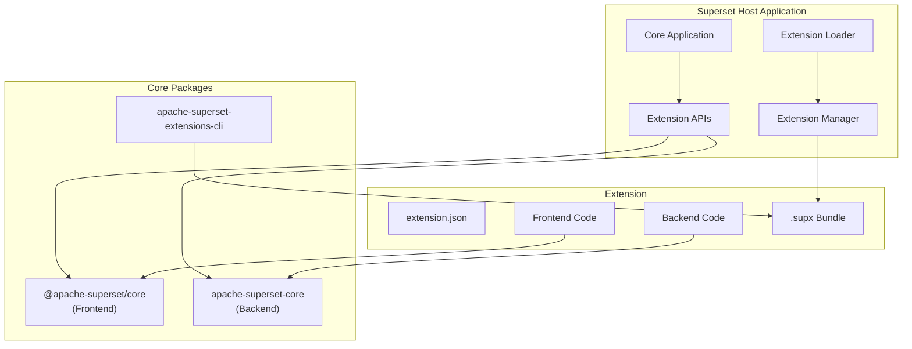

<!--
    Licensed to the Apache Software Foundation (ASF) under one
    or more contributor license agreements.  See the NOTICE file
    distributed with this work for additional information
    regarding copyright ownership.  The ASF licenses this file
    to you under the Apache License, Version 2.0 (the
    "License"); you may not use this file except in compliance
    with the License.  You may obtain a copy of the License at

      http://www.apache.org/licenses/LICENSE-2.0

    Unless required by applicable law or agreed to in writing,
    software distributed under the License is distributed on an
    "AS IS" BASIS, WITHOUT WARRANTIES OR CONDITIONS OF ANY
    KIND, either express or implied.  See the License for the
    specific language governing permissions and limitations
    under the License.
-->

# Extension Architecture Overview

The Superset extension architecture is designed to be modular, secure, and performant. This document provides a comprehensive overview of how extensions work and interact with the Superset host application.

## Core Principles

### 1. Lean Core
Superset's core remains minimal, with features delegated to extensions wherever possible. Built-in features use the same APIs as external extensions, ensuring API quality through dogfooding.

### 2. Explicit Contribution Points
All extension points are clearly defined and documented. Extensions declare their capabilities in metadata files, enabling predictable lifecycle management.

### 3. Versioned APIs
Public interfaces follow semantic versioning, ensuring backward compatibility and safe evolution of the platform.

### 4. Lazy Loading
Extensions load only when needed, minimizing performance impact and resource consumption.

### 5. Composability
Architecture patterns and APIs are reusable across different Superset modules, promoting consistency.

### 6. Community-Driven
The system evolves based on real-world feedback, with new extension points added as needs emerge.

## System Architecture



## Key Components

### Host Application

The Superset host application provides:

- **Extension APIs**: Well-defined interfaces for extensions to interact with Superset
- **Extension Manager**: Handles lifecycle, activation, and deactivation
- **Module Loader**: Dynamically loads extension code using Webpack Module Federation
- **Security Context**: Manages permissions and sandboxing for extensions

### Core Packages

#### @apache-superset/core (Frontend)
- Shared UI components and utilities
- TypeScript type definitions
- Frontend API implementations
- Event system and command registry

#### apache-superset-core (Backend)
- Python base classes and utilities
- Database access APIs
- Security and permission helpers
- REST API registration

#### apache-superset-extensions-cli
- Project scaffolding
- Build and bundling tools
- Development server
- Package management

### Extension Structure

Each extension consists of:

- **Metadata** (`extension.json`): Declares capabilities and requirements
- **Frontend**: React components and TypeScript code
- **Backend**: Python modules and API endpoints
- **Assets**: Styles, images, and other resources
- **Bundle** (`.supx`): Packaged distribution format

## Module Federation

Extensions use Webpack Module Federation for dynamic loading:

```javascript
// Extension webpack.config.js
new ModuleFederationPlugin({
  name: 'my_extension',
  filename: 'remoteEntry.[contenthash].js',
  exposes: {
    './index': './src/index.tsx',
  },
  externals: {
    '@apache-superset/core': 'superset',
  },
  shared: {
    react: { singleton: true },
    'react-dom': { singleton: true },
  }
})
```

This allows:
- **Independent builds**: Extensions compile separately from Superset
- **Shared dependencies**: Common libraries like React aren't duplicated
- **Dynamic loading**: Extensions load at runtime without rebuilding Superset
- **Version compatibility**: Extensions declare compatible core versions

## Extension Lifecycle

### 1. Registration
```typescript
// Extension registered with host
extensionManager.register({
  name: 'my-extension',
  version: '1.0.0',
  manifest: manifestData
});
```

### 2. Activation
```typescript
// activate() called when extension loads
export function activate(context: ExtensionContext) {
  // Register contributions
  const disposables = [];

  // Add panel
  disposables.push(
    context.core.registerView('my-panel', MyPanel)
  );

  // Register command
  disposables.push(
    context.commands.registerCommand('my-command', {
      execute: () => { /* ... */ }
    })
  );

  // Store for cleanup
  context.subscriptions.push(...disposables);
}
```

### 3. Runtime
- Extension responds to events
- Provides UI components when requested
- Executes commands when triggered
- Accesses APIs as needed

### 4. Deactivation
```typescript
// Automatic cleanup of registered items
export function deactivate() {
  // context.subscriptions automatically disposed
  // Additional cleanup if needed
}
```

## Contribution Types

### Views
Extensions can add panels and UI components:

```json
{
  "views": {
    "sqllab.panels": [{
      "id": "my-panel",
      "name": "My Panel",
      "icon": "ToolOutlined"
    }]
  }
}
```

### Commands
Define executable actions:

```json
{
  "commands": [{
    "command": "my-extension.run",
    "title": "Run Analysis",
    "icon": "PlayCircleOutlined"
  }]
}
```

### Menus
Add items to existing menus:

```json
{
  "menus": {
    "sqllab.editor": {
      "primary": [{
        "command": "my-extension.run",
        "when": "editorHasSelection"
      }]
    }
  }
}
```

### API Endpoints
Register backend REST endpoints:

```python
from superset_core.api import rest_api

@rest_api.route('/my-endpoint')
def my_endpoint():
    return {'data': 'value'}
```

## Security Model

### Permissions
- Extensions run with user's permissions
- No elevation of privileges
- Access controlled by Superset's RBAC

### Sandboxing
- Frontend code runs in browser context
- Backend code runs in Python process
- Future: Optional sandboxed execution

### Validation
- Manifest validation on upload
- Signature verification (future)
- Dependency scanning

## Performance Considerations

### Lazy Loading
- Extensions load only when features are accessed
- Code splitting for large extensions
- Cached after first load

### Bundle Optimization
- Tree shaking removes unused code
- Minification reduces size
- Compression for network transfer

### Resource Management
- Automatic cleanup on deactivation
- Memory leak prevention
- Event listener management

## Development vs Production

### Development Mode
```python
# superset_config.py
ENABLE_EXTENSIONS = True
LOCAL_EXTENSIONS = ['/path/to/extension']
```
- Hot reloading
- Source maps
- Debug logging

### Production Mode
- Optimized bundles
- Cached assets
- Performance monitoring

## Future Enhancements

### Planned Features
- Enhanced sandboxing
- Extension marketplace
- Inter-extension communication
- Theme contributions
- Chart type extensions

### API Expansion
- Dashboard extensions
- Database connector API
- Security provider interface
- Workflow automation

## Best Practices

### Do's
- ✅ Use TypeScript for type safety
- ✅ Follow semantic versioning
- ✅ Handle errors gracefully
- ✅ Clean up resources properly
- ✅ Document your extension

### Don'ts
- ❌ Access private APIs
- ❌ Modify global state directly
- ❌ Block the main thread
- ❌ Store sensitive data insecurely
- ❌ Assume API stability in 0.x versions

## Learn More

- [API Reference](../api/frontend)
- [Development Guide](../getting-started)
- [Security Guidelines](./security)
- [Performance Optimization](./performance)
