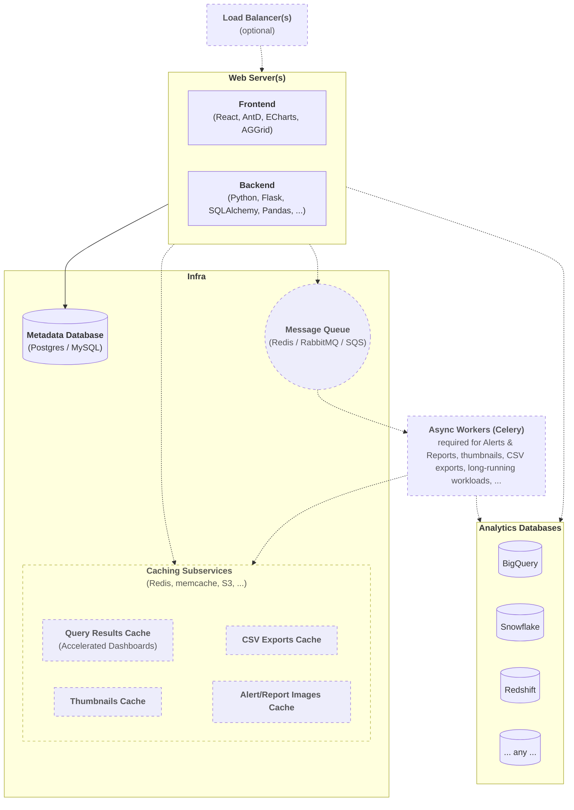

<!--
Licensed to the Apache Software Foundation (ASF) under one
or more contributor license agreements.  See the NOTICE file
distributed with this work for additional information
regarding copyright ownership.  The ASF licenses this file
to you under the Apache License, Version 2.0 (the
"License"); you may not use this file except in compliance
with the License.  You may obtain a copy of the License at

  http://www.apache.org/licenses/LICENSE-2.0

Unless required by applicable law or agreed to in writing,
software distributed under the License is distributed on an
"AS IS" BASIS, WITHOUT WARRANTIES OR CONDITIONS OF ANY
KIND, either express or implied.  See the License for the
specific language governing permissions and limitations
under the License.
-->

# Resources

## High Level Architecture

## Entity-Relationship Diagram

For the full interactive Entity-Relationship Diagram, please visit the [main documentation](https://superset.apache.org/docs/contributing/resources).

You can also [download the .svg](https://github.com/apache/superset/tree/master/docs/static/img/erd.svg) directly from GitHub.

## Additional Resources

### Official Documentation
- [Apache Superset Documentation](https://superset.apache.org/docs/intro)
- [API Documentation](https://superset.apache.org/docs/api)
- [Configuration Guide](https://superset.apache.org/docs/installation/configuring-superset)

### Community Resources
- [Apache Superset Blog](https://preset.io/blog/)
- [YouTube Channel](https://www.youtube.com/channel/UCMuwrvBsg_jjI2gLcm04R0g)
- [Twitter/X](https://twitter.com/ApacheSuperset)

### Development Tools
- [GitHub Repository](https://github.com/apache/superset)
- [PyPI Package](https://pypi.org/project/apache-superset/)
- [Docker Hub](https://hub.docker.com/r/apache/superset)
- [npm Packages](https://www.npmjs.com/search?q=%40superset-ui)
