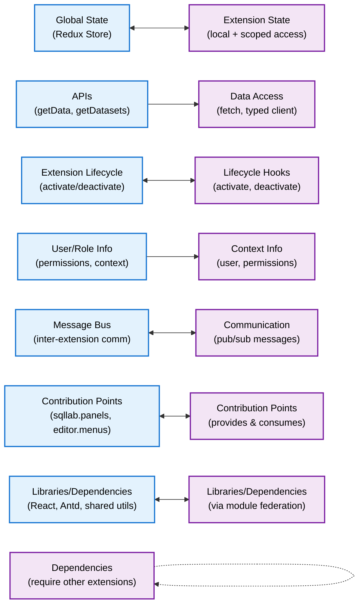

<!--
    Licensed to the Apache Software Foundation (ASF) under one
    or more contributor license agreements.  See the NOTICE file
    distributed with this work for additional information
    regarding copyright ownership.  The ASF licenses this file
    to you under the Apache License, Version 2.0 (the
    "License"); you may not use this file except in compliance
    with the License.  You may obtain a copy of the License at

      http://www.apache.org/licenses/LICENSE-2.0

    Unless required by applicable law or agreed to in writing,
    software distributed under the License is distributed on an
    "AS IS" BASIS, WITHOUT WARRANTIES OR CONDITIONS OF ANY
    KIND, either express or implied.  See the License for the
    specific language governing permissions and limitations
    under the License.
-->
---
title: Developer Portal
sidebar_position: 1
---

# Superset Developer Portal

Welcome to the Superset Developer Portal. Here you'll find step-by-step guides to help you get the most out of Superset.

## Getting Started

If you're new to Superset, start with our [Getting Started](/developer_portal/getting-started) guides.

## What's in this section?

This Developer Portal section is versioned independently from the main documentation and the component library. This means:

1. We can update developer guides for new Superset versions without affecting documentation for older versions
2. We can maintain guides for multiple Superset versions simultaneously
3. Users can easily find guides relevant to their specific Superset version

Use the version dropdown in the navbar to switch between different versions of the Developer Portal.

