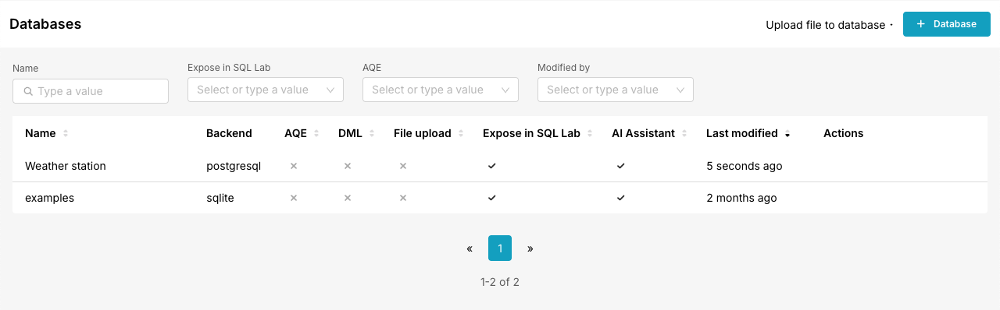

# AI Assistant

The text-to-SQL AI translator (AI Assistant) supports users of [SQLLab](https://incubator-superset.readthedocs.io/en/latest/sqllab.html) with writing SQL queries to connected databases. [Preset](https://preset.io/), the enterprise version of Superset, also offers a similar [AI Assist feature](https://docs.preset.io/docs/ai-assisted-sql-querying).

In a nutshell:
In Superset SQLLab a text bar positioned above the query editor can be used to type a natural language question and generate SQL using a configurable LLM provider. Superset automatically formulates an LLM prompt that comprises:
- configurable database information (tables, columns, descriptions, indexes, foreign keys, common text column values, etc.)
- customizable system instructions
- the content of the SQL query editor
- the user question
The prompt is sent to the [LLM API](#llm_api), the SQL query is extracted from the response, validated, and appended to the SQL query editor along with the user's question.
Configuration of the AI Assistant, which allows the user to set the LLM API provider and adjust how the LLM context is generated, is done within the database connection configuration window, distinctly for each database connection.

## Using the AI Assistant

Click the image to watch a demo video (m4v)

The AI Assistant text bar becomes visible in SQLLab only if the selected database connection has been configured to support the AI Assistant. Users can select a database from the dedicated dropdown menu, and if the AI Assistant is enabled for that connection, the text bar will appear, allowing them to interact with the feature. 

When the user types a question into the AI Assistant text bar and clicks **Generate SQL**, the AI Assistant constructs a prompt tailored for the configured [LLM API](#llm-api) associated with the selected database connection. It then interacts with the LLM API to generate a SQL query that translates the user's natural language question.

### Translation Mechanics

To ensure the AI Assistant generates precise SQL translations, the following steps are executed:

1. **Database Metadata**:  
The AI Assistant relies on comprehensive [database metadata](#database_metadata_data_pipeline) to construct accurate prompts for the LLM. This metadata is either cached by the LLM provider or directly included in the prompt, depending on the LLM provider's capabilities. 
   - If the configured LLM provider for the selected database supports explicit context caching (e.g., [Gemini](#cache)), the AI Assistant utilizes an LLM API session with cached database metadata. This approach eliminates the need to include the metadata directly in the prompt, thereby reducing the payload size of the API request, minimizing input token usage, and lowering associated costs.  
   - For providers that lack explicit context caching support, the database metadata is directly prepended to the LLM prompt, which may increase token usage and costs.

2. **Optional Schema Selection**:  
   - When schemas are selected using the dedicated dropdown menu, only the metadata for the selected schemas is included in the prompt. This metadata is directly prepended to the prompt without utilizing context caching functionality.  
   - An informational message displayed below the AI Assistant text bar informs users about this behavior.  
   - While this feature may enhance translation accuracy due to smaller context, it can also increase token usage and associated costs.  
    

3. **Prompt Construction**:  
   - Includes system instructions configured for the LLM. If an LLM context cache is available, these instructions are stored within the cache; otherwise, they are directly appended to the prompt following the database metadata.
   - Appends the content of the SQLLab query editor to the prompt. By including the SQL query editor's content, users can build upon or refine their previous questions, fostering a conversational workflow akin to interacting with a chatbot.
   - Includes the user's question from the AI Assistant text bar.  

4. **LLM Interaction**:  
   - Sends the constructed prompt to the [LLM API](#llm_api) for processing.  
   - Extracts the SQL query from the LLM response.  

5. **Error Handling**:  
   - If SQL extraction fails, the error message is appended to the prompt and resubmitted to the LLM API for correction.  
   - This retry mechanism is executed twice before displaying an error message to the user.  
     

6. **SQL Validation**:  
   - Executes an `EXPLAIN` statement to verify the syntax of the generated SQL query.  
   - If errors are detected, the retry mechanism is applied as described above.  

7. **Query Editor Update**:  
   - Comments out the existing content in the SQL query editor.  
   - Appends the user's question and the validated SQL query as a new entry.  
    
    

These steps ensure the AI Assistant delivers accurate and reliable SQL translations while maintaining a seamless user experience.

## Configuration

Configuration of the AI Assistant is managed within the database connection configuration panel, independently for each connection. As a result, the same permission rules that govern editing database connections (e.g., Admin role) apply.

### Supported Databases

The availability of the AI Assistant for supported [databases](databases.mdx) is primarily determined by the capability to construct the [database metadata context](#database_metadata_data_pipeline). If a specific configuration option is unavailable or the database type is unsupported, this is clearly indicated within the configuration panel. 

The AI Assistant currently supports the following databases:
- **PostgreSQL**: Full support  
- **SQLite**: Full support  
- **MySQL**: Full support  
- **TODO**: Additional databases to be added in future updates  

The **AI Assistant** panel in the **Edit database** modal provides administrators with all necessary configuration options. This panel includes:
- A toggle to enable or disable the AI Assistant for the selected database connection.
- Fields to configure the LLM API provider, API key, and model selection.
- Context settings for metadata generation, including periodicity, schema/table selection, and additional metadata options.
- A button to regenerate the database context on demand.

Click the image to watch a demo video (m4v)

This streamlined interface ensures administrators can efficiently manage AI Assistant settings for each database connection.

Below are two sections:

### Language Models

This is where the administrator configures the LLM API provider, the API key, and selects the one of the models the provider makes available via its API.  
Supported providers:  
   - Gemini  
   - OpenAI (WIP)  
   - Anthropic (WIP) 

These settings are stored in a new table of the Superset database called `llm_connection`.

  

### Context Settings

Contains configuration parameters for managing the periodic creation of the database metadata, which is locally cached in Redis as a JSON file. The available settings and information include:

- **Estimated Context Token Count**: Provides an estimate of the token count of the generated context.
- **Last Context Build Timestamp**: Displays the timestamp of the most recent context creation.
- **Automatic Context Creatin Periodicity**: Specifies the interval (in hours) for automatic context creation executed by a Celery worker (default: 12 hours).
- **Schema and Table/View Selection**: Allows users to select the specific schemas and tables/views to include in metadata retrieval using checkboxes.
- **Include Index Information**: Option to include details about column indexes in the metadata.
- **Top-K Most Common Column Values**: Configures the number of most common values (*top_k*, default: 10) to retrieve from the last *n* records (default: 50,000) for text columns.
- **LLM System Instructions**: Provides a text editor to define system instructions for the LLM, with a sensible default value.
- **Regenerate Context Button**: Enables users to manually trigger context regeneration on demand.

 
 
 

These settings ensure flexibility and control over the metadata generation process, optimizing the context for LLM interactions. In the database connection summary table, there’s a column showing if the AI Assistant is enabled and correctly configured.

These settings are stored in a new table of the Superset database called `llm_context_options`. 

 

## Back-end Architecture

### Dispatcher

All requests to LLM providers are managed by the LLM dispatcher, which acts as the unified interface for handling interactions with different LLM APIs. The dispatcher is responsible for:

- Managing initialization and state of LLM API wrapper classes, ensuring they are up-to-date with the latest database context.
- Handling prompt construction, including database metadata, system instructions, query editor content, and user input.
- Routing SQL generation requests to the appropriate LLM API based on the selected database connection and its configuration.
- Coordinating error handling and retry logic during SQL extraction and validation.

This centralized approach ensures consistent, efficient, and reliable communication between Superset and the configured LLMs.  

The dispatcher provides the following interfaces for other modules:

1. **Context Builder**:  
   Triggers a Celery worker to execute the database metadata data pipeline and generate a JSON file.

2. **LLM State Validation**:  
   Determines the state of the context worker and whether Superset is configured to call an LLM API for the selected database connection.

3. **SQL Generation**:  
   Routes SQL generation requests to the appropriate LLM API based on the selected database and configuration.

4. **Default Settings Interface**:  
   Supplies default configuration values for the settings page, tailored to the selected LLM and database type. Additionally, it provides a list of available models for each LLM.

These interfaces ensure seamless integration between Superset and the configured LLMs, enabling efficient and accurate SQL generation.

The dispatcher leverages the following inputs to construct prompts for SQL generation:

1. The selected database connection.  
2. The schemas chosen via the dropdown menu.  
3. The content of the SQL query editor.  
4. The user's input from the AI Assistant text bar.

The dispatcher adheres to a singleton pattern. When a SQL generation request is initiated, it ensures the appropriate LLM API wrapper class is initialized with the relevant database context. This initialization occurs either when the wrapper has not been previously set up or when the database context has been recently regenerated, rendering the current wrapper outdated.

### Context Builder

 

The database metadata context is periodically rebuilt by a Celery worker data pipeline, based on the AI Assistant configuration for each database connection. Metadata, such as schemas, tables, columns, indexes, and foreign keys, is collected by the context builder along with the most common values for text columns. The pipeline compiles all relevant metadata into a compact, nested JSON file, which is cached in Redis for fast and efficient access by the AI Assistant.

This comprehensive metadata ensures the LLM has the necessary context to generate accurate and efficient SQL queries.  
It constist of:
- **Schemas**: Schemas is the database.
   - **Description**: SQL comments describing the schema.
   - **Relations**: Tables and views within the schema.  
      - **Type**: Specifies whether the relation is a table or a view.  
      - **Description**: SQL comments describing the relation.  
      - **Columns**: Detailed information about each column in the relation.  
         - **Data Type**: The column's data type.  
         - **Nullable**: Indicates whether the column allows null values.  
         - **Description**: SQL comments describing the column.  
         - **Most Common Values**: The top-K most frequent values for text columns, derived from the last N records (default: 10 values from 50,000 records). This helps the LLM accurately filter columns based on approximate user input.  
      - **Indexes**: Information about indexes on the relation.  
         - **Uniqueness**: Specifies if the index enforces uniqueness.  
         - **Indexed Columns**: Lists the columns included in the index.  
         - **SQL Definition**: The SQL statement defining the index.  
      - **Foreign Keys**: Details about foreign key constraints.  
         - Helps construct accurate JOIN clauses by identifying relationships between tables.  

The context builder is triggered periodically by a scheduled Celery task. This scheduled task checks all the configured database connections for any that have the AI assistant enabled and for the status of that connection's context. If the context doesn't exist or is out of date, the context builder is triggered for that database connection.

Context builder task execution metadata is saved to a new table of the Superset database called `context_builder_task`.

### Caching Context

If the LLM API supports context caching (such as Gemini), Superset leverages this capability to optimize SQL generation. Context caching allows the database metadata and system instructions to be stored and reused across multiple requests, significantly reducing input token usage, improving response times, and lowering operational costs. When context caching is available, the AI Assistant uploads the metadata and instructions to the LLM provider once, then references this cached context for subsequent queries. If the LLM API does not support explicit context caching, the full metadata and instructions are included in every prompt, which may increase token consumption and latency.

On each request to generate SQL, the dispatcher hands the complete context to the Base LLM implementation that wraps the specific LLM API. The Base LLM implementation takes responsibility for managing the cache with the LLM API if that service is provided.

 

### SQL Generation

SQL Generation requests from the frontend provide a database ID, user input, and any prior relevant context, such as the content of the SQL editor. These inputs pass to the dispatcher, which adds the database context and calls the configured LLM implementation.

The Base LLM implementation receives the reponse from the LLM API, extracts the SQL from the response, and returns the SQL to the dispatcher. The dispatcher then checks to ensure the received SQL is free of errors before returning it to the frontend. If errors are found, the base LLM is called again and the error messages are included in the context to assist the LLM in correcting the mistake.

  

## LLM APIs

### Gemini

The supported Python SDK for the Gemini API is `google-genai`. To use this SDK, you must create a billable Gemini API key within a Google Cloud Platform (GCP) project. This API key is compatible only with the Gemini Developer API. With `google-genai`, you can configure the LLM client using your API key, create and manage multiple caches (each containing content such as the database metadata JSON file, system instructions, and cache settings), and interact with the LLM client by referencing these caches.

Gemini provides multiple Python SDKs for interacting with its APIs:

1. **APIs**:
   - [Gemini Developer API](https://ai.google.dev/gemini-api/docs)
   - [Vertex AI API](https://cloud.google.com/vertex-ai/generative-ai/docs/model-reference/inference)

2. **Python SDKs**:
   - [`google-generativeai`](https://pypi.org/project/google-generativeai/): Supports the Gemini Developer API.
   - [`google-genai`](https://pypi.org/project/google-genai/): Supports both the Gemini Developer API and Vertex AI API.
   - [`google-cloud-aiplatform`](https://pypi.org/project/google-cloud-aiplatform/): Supports the Vertex AI API.

#### Cache

For the Gemini API, we leverage Gemini’s native context caching APIs to improve performance and reduce costs. The Gemini LLM API wrapper manages cache creation and validation. On the first request after initialization, the wrapper creates a cache containing the database context.

Gemini’s [caching functionality](https://ai.google.dev/gemini-api/docs/caching?lang=python) allows persistent storage of long context — including system instructions and files — for a configurable duration (TTL). This means the context only needs to be processed once, significantly reducing input token usage and associated costs for subsequent queries.

The Gemini API user is responsible for managing cache validity: checking if the cache is still active and re-uploading documents if the cache has expired. The wrapper automates these tasks, ensuring the cache remains up to date and efficient.

### OpenAI

The Python SDK for interacting with the OpenAI API is [`openai`](https://pypi.org/project/openai/). All requests are made through the standard OpenAI endpoints as described in the [API reference](https://platform.openai.com/docs/api-reference/responses/create). 

For estimating prompt and context length, the [tiktoken](https://github.com/openai/tiktoken) package is used. This utility helps calculate token usage, which is important for managing API limits and costs.

#### Cache

OpenAI does not provide an API for explicit cache management. As a result, the complete database metadata context and system instructions must be included with every call to the API. However, OpenAI employs an [automatic prompt cache](https://platform.openai.com/docs/guides/prompt-caching) that matches incoming API requests against previous requests based on text similarity. To maximize cache effectiveness, the context and system prompt should always be placed at the beginning of the input prompt.

### Anthropic
The Python SDK for interacting with the Anthropic API is [`anthropic`](https://pypi.org/project/anthropic/). Integration is straightforward. All requests are made directly to the Anthropic API endpoints as described in their [API guide](https://docs.anthropic.com/en/api/overview).

#### Cache

Caching with the Anthropic API operates similarly to OpenAI, relying on prefix matching for prompt caching. However, Anthropic requires explicit [cache control blocks](https://docs.anthropic.com/en/docs/build-with-claude/prompt-caching) to be included within the system prompt to enable caching. The Anthropic module is responsible for managing cache behavior, ensuring that cache control blocks are properly inserted and maintained as part of the prompt construction process. This functionality was not utilized for this implementation.
