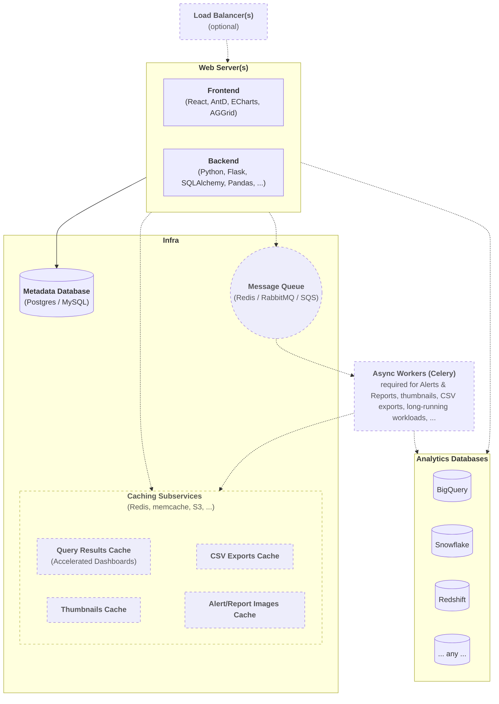

import InteractiveSVG from '../../src/components/InteractiveERDSVG';
import Mermaid from '@theme/Mermaid';

# Resources

## High Level Architecture

## Entity-Relationship Diagram

Here is our interactive ERD:

<InteractiveSVG />

 

[Download the .svg](https://github.com/apache/superset/tree/master/docs/static/img/erd.svg)
