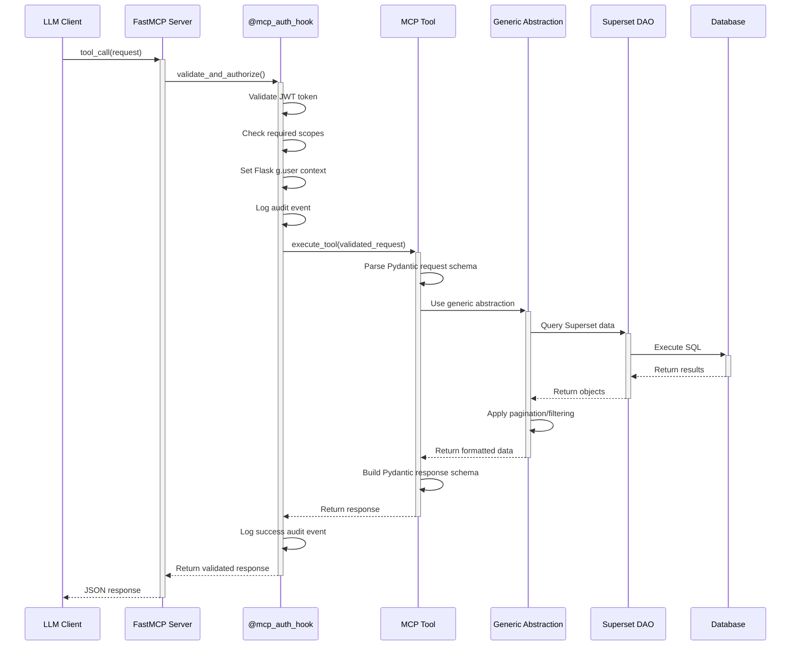

# MCP Service Development Guide

This guide covers the internal architecture, development workflows, and patterns for extending the Superset MCP service.

> 🚀 **New to MCP?** Start with the [Overview](./overview) to understand what the service does before diving into development.
>
> 📚 **Need API examples?** Check the [API Reference](./api-reference) to see how existing tools work.
>
> 🔐 **Planning production use?** Review [Authentication](./authentication) for security considerations.

## Internal Architecture

### Component Overview

The MCP service follows a layered architecture with clear separation of concerns:

```mermaid
graph TB
    subgraph "Transport Layer"
        HTTP[HTTP Server :5008]
        FastMCP[FastMCP Protocol Handler]
    end

    subgraph "Auth & Middleware Layer"
        AuthHook[@mcp_auth_hook]
        JWT[JWT Validator]
        RBAC[RBAC Engine]
        Audit[Audit Logger]
    end

    subgraph "Tool Layer"
        Tools[16 MCP Tools<br/>@mcp.tool decorated]
        Schemas[Pydantic Schemas]
        Validation[Request Validation]
    end

    subgraph "Business Logic Layer"
        Generic[Generic Tool Abstractions]
        ModelList[ModelListTool]
        ModelGet[ModelGetInfoTool]
        ModelFilter[ModelGetAvailableFiltersTool]
    end

    subgraph "Data Access Layer"
        DAOs[Superset DAOs]
        Commands[Superset Commands]
        Cache[Cache Manager]
    end

    subgraph "Storage Layer"
        MetaDB[(Metadata DB)]
        DataWH[(Data Warehouse)]
        Redis[(Redis Cache)]
    end

    HTTP --> FastMCP
    FastMCP --> AuthHook
    AuthHook --> JWT
    JWT --> RBAC
    RBAC --> Audit
    Audit --> Tools

    Tools --> Schemas
    Schemas --> Validation
    Validation --> Generic

    Generic --> ModelList
    Generic --> ModelGet
    Generic --> ModelFilter

    ModelList --> DAOs
    ModelGet --> DAOs
    ModelFilter --> DAOs

    Tools --> Commands
    Commands --> Cache

    DAOs --> MetaDB
    Commands --> MetaDB
    Commands --> DataWH
    Cache --> Redis
```

### Request Flow

Every MCP tool call follows this execution pattern:



### Tool Registration System

Tools are automatically discovered and registered through the decorator pattern:

```python
# superset/mcp_service/mcp_app.py
from fastmcp import FastMCP

# Global MCP instance
mcp = FastMCP("Superset MCP Service")

# Tools register themselves via decorators
@mcp.tool
@mcp_auth_hook(['chart:read'])
def get_chart_info(request: GetChartInfoRequest) -> GetChartInfoResponse:
    # Tool implementation
    pass

# All tool modules imported to trigger registration
from superset.mcp_service.chart.tool import *
from superset.mcp_service.dashboard.tool import *
from superset.mcp_service.dataset.tool import *
from superset.mcp_service.system.tool import *
```

## Development Patterns

### Tool Implementation Pattern

All tools follow this standardized pattern:

```python
# Example: superset/mcp_service/chart/tool/get_chart_info.py
from superset.mcp_service.auth import mcp_auth_hook
from superset.mcp_service.mcp_app import mcp
from superset.mcp_service.schemas.chart_schemas import (
    GetChartInfoRequest,
    GetChartInfoResponse,
    ChartError
)

@mcp.tool
@mcp_auth_hook(['chart:read'])
def get_chart_info(request: GetChartInfoRequest) -> GetChartInfoResponse:
    """
    Get detailed information about a specific chart.

    Supports lookup by ID or UUID with comprehensive metadata.
    """
    try:
        # CRITICAL: Import Superset modules inside function
        from superset.daos.chart import ChartDAO
        from superset.models.slice import Slice

        # Use generic abstraction for common operations
        from superset.mcp_service.generic_tools import ModelGetInfoTool

        tool = ModelGetInfoTool(
            dao=ChartDAO,
            model=Slice,
            response_schema=GetChartInfoResponse,
            identifier_field_map={
                'id': 'id',
                'uuid': 'uuid'
            }
        )

        return tool.execute(request)

    except Exception as e:
        return ChartError(
            error=f"Failed to get chart info: {str(e)}",
            error_type="ChartInfoError"
        )
```

### Schema Design Patterns

Pydantic schemas follow these conventions:

```python
# Request Schema Pattern
class GetChartInfoRequest(BaseModel):
    """Request to get detailed chart information."""

    identifier: Union[int, str] = Field(
        ...,
        description="Chart ID (numeric) or UUID (string)"
    )

    include_form_data: bool = Field(
        default=True,
        description="Whether to include chart configuration"
    )

    use_cache: bool = Field(
        default=True,
        description="Whether to use cached data"
    )

# Response Schema Pattern
class GetChartInfoResponse(BaseModel):
    """Detailed chart information response."""

    chart_id: int = Field(description="Chart numeric ID")
    uuid: Optional[str] = Field(description="Chart UUID")
    slice_name: str = Field(description="Chart display name")
    viz_type: str = Field(description="Visualization type")
    datasource_id: Optional[int] = Field(description="Dataset ID")
    form_data: Optional[Dict[str, Any]] = Field(description="Chart configuration")
    explore_url: Optional[str] = Field(description="Explore URL for editing")

    # Cache status for transparency
    cache_status: Optional[CacheStatus] = Field(description="Cache hit information")

# Error Schema Pattern
class ChartError(BaseModel):
    """Chart operation error response."""

    error: str = Field(description="Error message")
    error_type: str = Field(description="Error type identifier")
    suggestions: Optional[List[str]] = Field(description="Suggested fixes")
```

### Generic Tool Abstractions

Common operations are abstracted into reusable classes:

```python
# superset/mcp_service/generic_tools.py
from typing import Type, Dict, Any, List, Optional
from pydantic import BaseModel

class ModelListTool:
    """Generic tool for list operations with pagination and filtering."""

    def __init__(self,
                 dao: Type,
                 model: Type,
                 response_schema: Type[BaseModel],
                 default_columns: List[str] = None,
                 searchable_columns: List[str] = None):
        self.dao = dao
        self.model = model
        self.response_schema = response_schema
        self.default_columns = default_columns or []
        self.searchable_columns = searchable_columns or []

    def execute(self, request: BaseModel) -> BaseModel:
        """Execute list operation with pagination and filtering."""

        # Build query with filters
        query = self.dao.find_all()

        # Apply search if provided
        if hasattr(request, 'search') and request.search:
            query = self._apply_search(query, request.search)

        # Apply filters if provided
        if hasattr(request, 'filters') and request.filters:
            query = self._apply_filters(query, request.filters)

        # Apply pagination
        total = query.count()

        if hasattr(request, 'page') and hasattr(request, 'page_size'):
            offset = (request.page - 1) * request.page_size
            query = query.offset(offset).limit(request.page_size)

        # Execute query and serialize
        results = query.all()
        serialized = [self._serialize_model(obj) for obj in results]

        return self.response_schema(
            results=serialized,
            total_count=total,
            page=getattr(request, 'page', 1),
            page_size=getattr(request, 'page_size', len(serialized))
        )

class ModelGetInfoTool:
    """Generic tool for getting single object by multiple identifier types."""

    def __init__(self,
                 dao: Type,
                 model: Type,
                 response_schema: Type[BaseModel],
                 identifier_field_map: Dict[str, str]):
        self.dao = dao
        self.model = model
        self.response_schema = response_schema
        self.identifier_field_map = identifier_field_map

    def execute(self, request: BaseModel) -> BaseModel:
        """Execute get operation with multi-identifier support."""

        identifier = request.identifier

        # Determine identifier type and field
        if isinstance(identifier, int):
            field = self.identifier_field_map.get('id', 'id')
            obj = self.dao.find_by_id(identifier)
        elif isinstance(identifier, str):
            if len(identifier) == 36 and '-' in identifier:  # UUID format
                field = self.identifier_field_map.get('uuid', 'uuid')
                obj = self.dao.find_by_uuid(identifier)
            else:  # Assume slug
                field = self.identifier_field_map.get('slug', 'slug')
                obj = getattr(self.dao, 'find_by_slug', lambda x: None)(identifier)

        if not obj:
            raise ValueError(f"Object not found with identifier: {identifier}")

        # Serialize and return
        serialized = self._serialize_model(obj)
        return self.response_schema(**serialized)
```

## Adding New Tools

### Step-by-Step Process

1. **Define the Domain**

   Choose the appropriate domain folder:
   - `dashboard/` - Dashboard operations
   - `chart/` - Chart operations
   - `dataset/` - Dataset operations
   - `system/` - System-level operations

2. **Create Schemas**

   ```bash
   # Create schema file
   touch superset/mcp_service/schemas/my_domain_schemas.py
   ```

   ```python
   # Define request/response schemas
   class MyToolRequest(BaseModel):
       param1: str = Field(description="Parameter description")
       param2: Optional[int] = Field(default=None, description="Optional parameter")

   class MyToolResponse(BaseModel):
       result: str = Field(description="Result description")
       metadata: Dict[str, Any] = Field(description="Additional metadata")
   ```

3. **Implement the Tool**

   ```bash
   # Create tool file
   touch superset/mcp_service/my_domain/tool/my_tool.py
   ```

   ```python
   @mcp.tool
   @mcp_auth_hook(['required:scope'])
   def my_tool(request: MyToolRequest) -> MyToolResponse:
       """Tool description for LLM."""

       # Import Superset modules inside function
       from superset.daos.my_dao import MyDAO

       # Implement business logic
       result = MyDAO.do_something(request.param1)

       return MyToolResponse(
           result=result,
           metadata={"processed_at": datetime.utcnow()}
       )
   ```

4. **Register the Tool**

   ```python
   # Add to superset/mcp_service/my_domain/tool/__init__.py
   from .my_tool import my_tool

   __all__ = ['my_tool']
   ```

   ```python
   # Import in superset/mcp_service/mcp_app.py
   from superset.mcp_service.my_domain.tool import *
   ```

5. **Add Tests**

   ```bash
   # Create test file
   touch tests/unit_tests/mcp_service/test_my_tool.py
   ```

   ```python
   import pytest
   from superset.mcp_service.my_domain.tool.my_tool import my_tool
   from superset.mcp_service.schemas.my_domain_schemas import MyToolRequest

   class TestMyTool:
       def test_my_tool_success(self):
           request = MyToolRequest(param1="test")
           response = my_tool(request)
           assert response.result == "expected_result"
   ```

### Tool Best Practices

1. **Import Inside Functions**
   ```python
   # ❌ DON'T: Import at module level
   from superset.daos.chart import ChartDAO

   @mcp.tool
   def my_tool():
       # Tool implementation
       pass

   # ✅ DO: Import inside function
   @mcp.tool
   def my_tool():
       from superset.daos.chart import ChartDAO
       # Tool implementation
       pass
   ```

2. **Use Generic Abstractions**
   ```python
   # ✅ Leverage existing patterns
   @mcp.tool
   def list_my_objects(request):
       from superset.mcp_service.generic_tools import ModelListTool

       tool = ModelListTool(
           dao=MyDAO,
           model=MyModel,
           response_schema=ListMyObjectsResponse
       )
       return tool.execute(request)
   ```

3. **Comprehensive Error Handling**
   ```python
   @mcp.tool
   def my_tool(request):
       try:
           # Tool implementation
           return success_response
       except PermissionError as e:
           return MyToolError(
               error="Permission denied",
               error_type="PermissionError",
               suggestions=["Check user permissions"]
           )
       except Exception as e:
           return MyToolError(
               error=f"Unexpected error: {str(e)}",
               error_type="InternalError"
           )
   ```

## Testing Patterns

### Unit Test Structure

```python
# tests/unit_tests/mcp_service/test_chart_tools.py
import pytest
from unittest.mock import Mock, patch
from superset.mcp_service.chart.tool.get_chart_info import get_chart_info
from superset.mcp_service.schemas.chart_schemas import GetChartInfoRequest

class TestGetChartInfo:
    """Test suite for get_chart_info tool."""

    @patch('superset.mcp_service.chart.tool.get_chart_info.ChartDAO')
    def test_get_chart_info_by_id_success(self, mock_dao):
        """Test successful chart lookup by ID."""

        # Setup mock
        mock_chart = Mock()
        mock_chart.id = 1
        mock_chart.slice_name = "Test Chart"
        mock_chart.viz_type = "line"
        mock_dao.find_by_id.return_value = mock_chart

        # Execute
        request = GetChartInfoRequest(identifier=1)
        response = get_chart_info(request)

        # Verify
        assert response.chart_id == 1
        assert response.slice_name == "Test Chart"
        mock_dao.find_by_id.assert_called_once_with(1)

    @patch('superset.mcp_service.chart.tool.get_chart_info.ChartDAO')
    def test_get_chart_info_not_found(self, mock_dao):
        """Test chart not found scenario."""

        # Setup mock
        mock_dao.find_by_id.return_value = None

        # Execute
        request = GetChartInfoRequest(identifier=999)
        response = get_chart_info(request)

        # Verify error response
        assert hasattr(response, 'error')
        assert "not found" in response.error.lower()
```

### Integration Test Patterns

```python
# tests/integration_tests/mcp_service/test_chart_integration.py
import pytest
from superset.app import create_app
from superset.mcp_service.mcp_app import mcp
from tests.integration_tests.base_tests import SupersetTestCase

class TestChartIntegration(SupersetTestCase):
    """Integration tests for chart tools."""

    def setUp(self):
        super().setUp()
        self.app = create_app()
        self.app_context = self.app.app_context()
        self.app_context.push()

    def tearDown(self):
        self.app_context.pop()
        super().tearDown()

    def test_chart_workflow_integration(self):
        """Test complete chart workflow."""

        # Create chart
        create_request = {
            "dataset_id": "1",
            "config": {
                "chart_type": "table",
                "columns": [{"name": "region"}]
            }
        }

        create_response = mcp.call_tool("generate_chart", create_request)
        chart_id = create_response["chart_id"]

        # Get chart info
        info_request = {"identifier": chart_id}
        info_response = mcp.call_tool("get_chart_info", info_request)

        assert info_response["chart_id"] == chart_id
        assert info_response["viz_type"] == "table"

        # Get chart data
        data_request = {"identifier": chart_id, "limit": 10}
        data_response = mcp.call_tool("get_chart_data", data_request)

        assert "data" in data_response
        assert len(data_response["data"]) <= 10
```

## Performance Considerations

### Caching Strategy

The MCP service leverages Superset's existing cache layers:

```python
# Cache control in tools
@mcp.tool
def get_chart_data(request: GetChartDataRequest):
    """Tool with cache control."""

    cache_config = {
        'use_cache': request.use_cache,
        'force_refresh': request.force_refresh,
        'cache_timeout': request.cache_timeout
    }

    # Use Superset's cache infrastructure
    result = execute_with_cache(query, cache_config)

    return ChartDataResponse(
        data=result.data,
        cache_status=result.cache_status
    )
```

### Query Optimization

```python
# Efficient pagination
def list_objects(query, page, page_size):
    """Optimized pagination pattern."""

    # Count query optimization
    total = query.count()

    # Limit columns for list operations
    query = query.options(load_only('id', 'name', 'created_on'))

    # Apply pagination
    offset = (page - 1) * page_size
    results = query.offset(offset).limit(page_size).all()

    return results, total
```

## Security Considerations

### Authentication Flow

```python
# JWT validation and user context
@mcp_auth_hook(['chart:read'])
def secure_tool(request):
    """Tool with proper security context."""

    # g.user is set by auth hook
    user_id = g.user.id

    # Apply user-specific filtering
    query = ChartDAO.find_all().filter(
        Chart.owners.contains(g.user)
    )

    return execute_query(query)
```

### Input Validation

```python
# Comprehensive request validation
class CreateChartRequest(BaseModel):
    """Validated chart creation request."""

    dataset_id: Union[int, str] = Field(
        ...,
        description="Dataset ID or UUID"
    )

    config: ChartConfig = Field(
        ...,
        description="Chart configuration"
    )

    @validator('dataset_id')
    def validate_dataset_id(cls, v):
        """Validate dataset exists and user has access."""
        # Validation logic
        return v

    @validator('config')
    def validate_chart_config(cls, v):
        """Validate chart configuration."""
        # Configuration validation
        return v
```

This development guide provides comprehensive coverage of the MCP service's internal architecture and development patterns, enabling team members to effectively extend and maintain the system.

## Related Documentation

### 📚 **Ready to Use Your New Tools?**
Test your implementations with examples from the [API Reference](./api-reference).

### 🔐 **Securing Your Extensions?**
Add authentication to your tools using the [Authentication Guide](./authentication).

### 🏗️ **Understanding the Big Picture?**
See the complete system design in the [Architecture Overview](./architecture).

### 🏢 **Building Enterprise Features?**
Explore advanced patterns in the [Preset Integration Guide](./preset-integration).

> 📖 **Back to Documentation Index**: [MCP Service](./intro)
