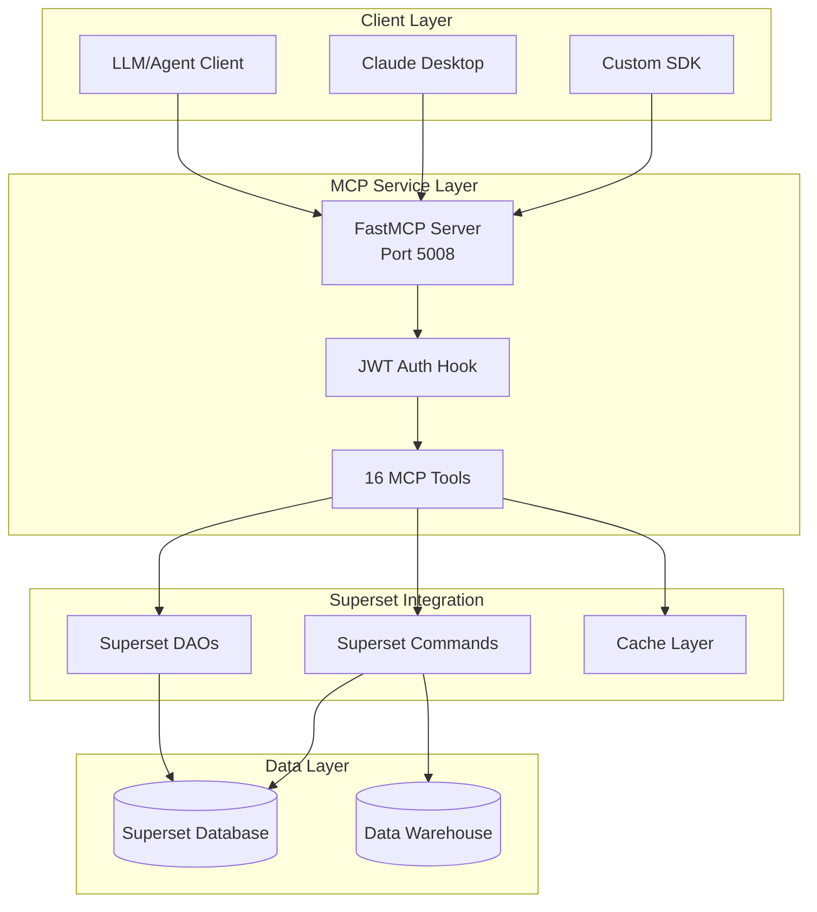

# Superset MCP Service

The Superset Model Context Protocol (MCP) service provides a modular, schema-driven interface for programmatic access to Superset dashboards, charts, datasets, and instance metadata. Built on FastMCP, it's designed for LLM agents and automation tools.

**Status:** ✅ Phase 1 Complete. Core functionality stable, authentication production-ready, comprehensive testing coverage.

## What is MCP?

The Model Context Protocol (MCP) is an open standard for connecting AI assistants to data sources and tools. Superset's MCP service exposes 17 tools, 2 prompts, and 2 resources that allow LLM agents to:

- **Explore data**: List and query dashboards, charts, and datasets
- **Create visualizations**: Generate charts and dashboards programmatically
- **Export data**: Extract chart data in multiple formats
- **Navigate interfaces**: Generate explore links and SQL Lab sessions

## Key Features

### 🔧 **17 Production-Ready Tools**
- **Dashboard Tools (5)**: List, get info, create dashboards, add charts
- **Chart Tools (8)**: Full CRUD operations, data export, screenshot previews
- **Dataset Tools (3)**: List, get info, discover filterable columns
- **System Tools (2)**: Instance info, explore link generation
- **SQL Lab Tools (2)**: Pre-configured SQL sessions, direct SQL execution

### 🚀 **2 Guided Prompts**
- **Quickstart**: Personalized onboarding for analysts, executives, and developers
- **Chart Creation**: Step-by-step guidance based on business goals

### 🌐 **2 Contextual Resources**
- **Instance Metadata**: Real-time stats, popular content, and configuration
- **Chart Templates**: Pre-configured templates and best practices

### 🔐 **Enterprise Authentication**
- **JWT Bearer Authentication**: Production-ready with configurable factory pattern
- **RBAC Integration**: Scope-based permissions with Superset's security model
- **Audit Logging**: Comprehensive MCP context tracking with impersonation support

### 📊 **Advanced Capabilities**
- **Multi-format Export**: JSON, CSV, Excel data export
- **Chart Previews**: Screenshots, ASCII art, and table representations
- **Cache Control**: Comprehensive control over Superset's cache layers
- **Request Schema Pattern**: Eliminates LLM parameter validation issues

## Architecture Overview



## Getting Started

### Quick Setup

```bash
# Clone and install Superset
git clone https://github.com/apache/superset.git
cd superset
make venv && source venv/bin/activate
make install

# Start Superset
superset run -p 8088 --with-threads --reload --debugger

# Start MCP service (in separate terminal)
source venv/bin/activate
superset mcp run --port 5008 --debug
```

### Connect to Claude Desktop

:::note
The MCP service runs on HTTP and requires a proxy for Claude Desktop integration.
:::

```bash
# Install FastMCP proxy
pip install fastmcp
```

Configure Claude Desktop (`~/.config/Claude/claude_desktop_config.json`):

```json
{
  "mcpServers": {
    "Superset MCP": {
      "command": "/path/to/superset/superset/mcp_service/run_proxy.sh",
      "args": [],
      "env": {}
    }
  }
}
```

## Use Cases

### Data Exploration
- "List all dashboards related to sales"
- "Show me the charts in the Q4 Performance dashboard"
- "What datasets are available for customer analysis?"

### Chart Creation
- "Create a line chart showing revenue trends by month"
- "Generate a table showing top 10 products by sales"
- "Build a bar chart comparing regional performance"

### SQL Execution
- "Run a query to get total sales by region"
- "Execute SQL to find top customers with parameters"
- "Query the database for inventory levels"

### Data Export
- "Export the sales data from this chart as CSV"
- "Get the underlying data for this dashboard as JSON"
- "Show me a preview of this chart as ASCII art"

### Dashboard Management
- "Create a new dashboard with these 4 charts"
- "Add this revenue chart to the executive dashboard"
- "Generate an explore link for this chart configuration"

## Example Workflow

```python
# List available dashboards
dashboards = client.call_tool("list_dashboards", {
    "search": "sales",
    "page_size": 10
})

# Get detailed dashboard info
dashboard = client.call_tool("get_dashboard_info", {
    "identifier": dashboards["dashboards"][0]["id"]
})

# Create a new chart
chart = client.call_tool("generate_chart", {
    "dataset_id": "1",
    "config": {
        "chart_type": "line",
        "x": {"name": "date"},
        "y": [{"name": "revenue", "aggregate": "SUM"}]
    }
})

# Export chart data
data = client.call_tool("get_chart_data", {
    "identifier": chart["chart_id"],
    "format": "json",
    "limit": 1000
})
```

### Using Prompts and Resources

```python
# Get personalized onboarding
prompt = client.get_prompt("superset_quickstart", {
    "user_type": "analyst",
    "focus_area": "sales"
})
# Claude receives a customized introduction focusing on sales analytics

# Access instance metadata
metadata = client.read_resource("superset://instance/metadata")
# Returns real-time stats, popular datasets, and configuration

# Get chart best practices
templates = client.read_resource("superset://chart/templates")
# Returns pre-configured templates and visualization guidelines
```

In Claude Desktop, these work automatically:
- Ask "Help me get started with Superset" → triggers quickstart prompt
- Ask "What data is available?" → uses instance metadata resource
- Ask "How should I visualize sales trends?" → uses chart templates resource

## Next Steps

### Ready to Use MCP?
- **[📚 API Reference](./api-reference)** - Try all 17 tools, 2 prompts, and 2 resources with examples
- **[🔐 Authentication](./authentication)** - Set up JWT security for production use

### Want to Extend MCP?
- **[🔧 Development Guide](./development)** - Learn internal architecture and add new tools
- **[🏗️ Architecture](./architecture)** - Understand system design and deployment patterns

### Enterprise Deployment?
- **[🏢 Preset Integration](./preset-integration)** - RBAC extensions and OIDC integration for enterprise

> 💡 **Getting started?** Return to the [MCP Service intro](./intro) for a complete overview.
