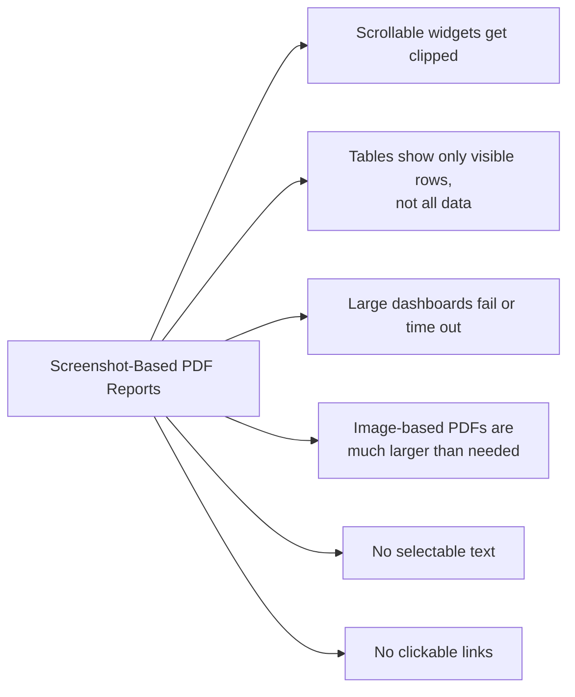
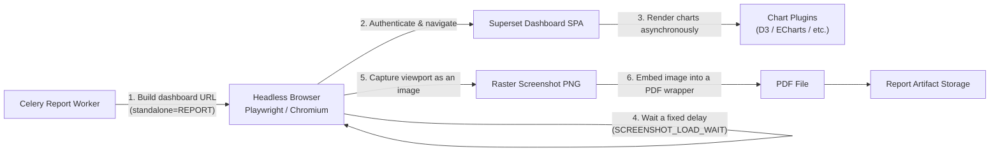
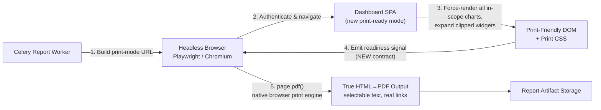
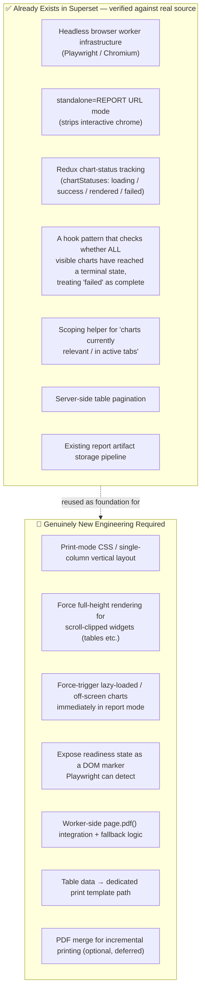
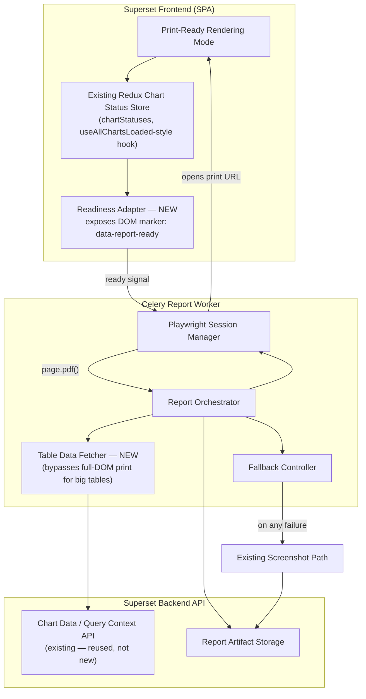
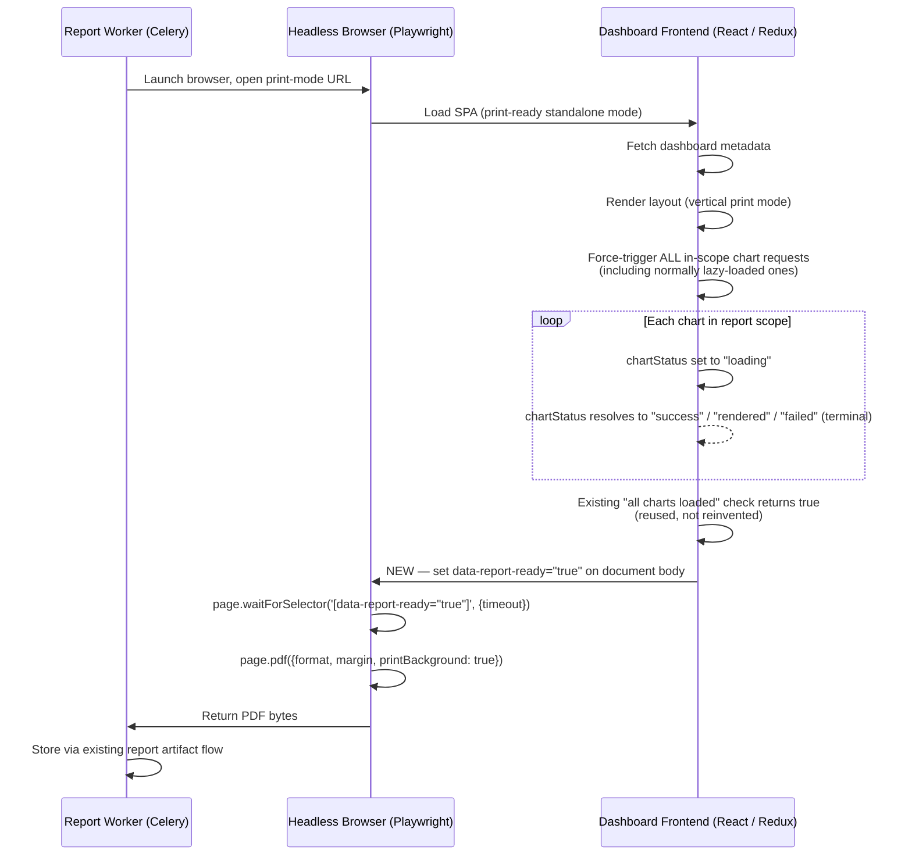
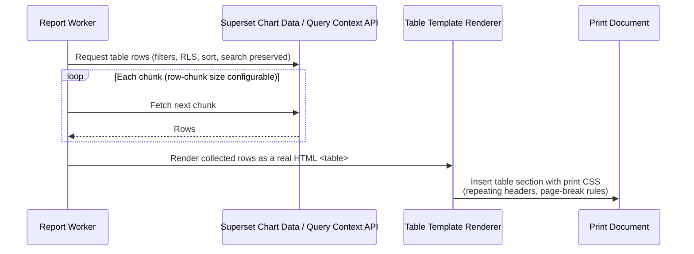
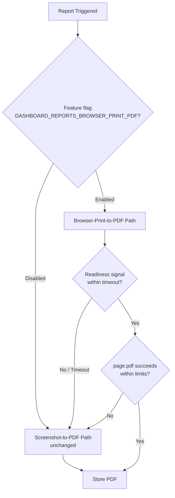

# Browser-Print PDF Dashboard Reports
## Analysis of SIP-212 and a Theoretical Implementation Plan

**Subject:** Apache Superset — [SIP-212] Browser Print PDF Dashboard Reports (Issue #39965)
**Document type:** Technical analysis + proposed implementation theory
**Status of source SIP:** Pre-discussion, no branches/PRs attached (as of this analysis)
**Prepared for:** Mentor review / implementation kickoff

---

## Table of Contents

1. [Executive Summary](#1-executive-summary)
2. [Problem Statement](#2-problem-statement)
3. [Current Architecture (As-Is)](#3-current-architecture-as-is)
4. [SIP-212 Proposed Architecture](#4-sip-212-proposed-architecture)
5. [Feasibility Analysis — What Already Exists vs. What Must Be Built](#5-feasibility-analysis--what-already-exists-vs-what-must-be-built)
6. [Comparing Alternative Solutions](#6-comparing-alternative-solutions)
7. [Recommended Solution: The Hybrid Approach](#7-recommended-solution-the-hybrid-approach)
8. [Detailed Component Design](#8-detailed-component-design)
9. [Fallback & Safety Design](#9-fallback--safety-design)
10. [Risk Assessment](#10-risk-assessment)
11. [Phased Implementation Roadmap](#11-phased-implementation-roadmap)
12. [Open Questions](#12-open-questions)
13. [Talking Points for Mentor Discussion](#13-talking-points-for-mentor-discussion)
14. [Sources & Evidence](#14-sources--evidence)

---

## 1. Executive Summary

Apache Superset currently generates PDF dashboard reports by taking a **screenshot** of the rendered dashboard in a headless browser and embedding that image into a PDF. This produces clipped tables, oversized files, and non-selectable/non-clickable content.

**SIP-212** proposes an alternative: render the dashboard as real HTML in a "print-ready" mode and use the browser's **native print engine** (e.g. Playwright/Chromium's `page.pdf()`) to generate a true document-style PDF, instead of a picture of one.

This report concludes:

> **SIP-212's core mechanism is sound and largely buildable with infrastructure Superset already has.** The single hardest-sounding requirement in the SIP — a reliable "is the dashboard ready to print?" signal — is **already substantially implemented** in Superset's frontend state management, and just needs to be exposed to the reporting worker rather than invented from scratch.

This document proposes a **hybrid refinement** of SIP-212 that keeps its core architecture but de-risks its two most complex open items (incremental multi-page chunking, and huge tables) by handling large tables as a special case rather than forcing them through the same DOM-print pipeline as everything else.

Everything below is **theoretical design** — nothing here has been implemented. Claims about Superset's *existing* code are backed by real source citations (Section 14); everything else is explicitly marked as proposed/recommended.

---

## 2. Problem Statement

Superset's current dashboard PDF reports are screenshots, which creates six concrete limitations:



These are not hypothetical — real user bug reports against Superset show timeouts requiring manual tuning of `SCREENSHOT_LOCATE_WAIT` / `SCREENSHOT_LOAD_WAIT`, and outright screenshot failures on certain tables and charts (see Section 14).

---

## 3. Current Architecture (As-Is)

This is Superset's real, shipped reporting pipeline today.



**Key mechanics (verified against real Superset source):**

- The `DashboardScreenshot` class forces every dashboard capture into a special `standalone=REPORT` URL mode that strips interactive UI before the browser navigates there.
- Readiness today is essentially **time-based, not state-based** — the worker waits a configured delay rather than querying "is the app actually done rendering." This is exactly why timeouts and partial renders are a recurring real-world support issue.
- Output is a **raster image**, wrapped in a PDF container — not real text, not real vector content.

---

## 4. SIP-212 Proposed Architecture

SIP-212's core idea: replace step 5–6 above (screenshot → image-in-PDF) with a **native browser print pass** on real HTML.



The proposal breaks down into five sub-systems:

| Sub-system | Purpose |
|---|---|
| Feature flag `DASHBOARD_REPORTS_BROWSER_PRINT_PDF` | Opt-in gate; default OFF |
| Print-ready rendering mode | Strips interactive chrome, applies print CSS, expands clipped content |
| Readiness lifecycle | Tells the worker when the DOM is actually final |
| Optional incremental printing | Chunk-and-merge for dashboards too large for one DOM/print pass |
| Table-specific print behavior | Avoids truncated/clipped table output |

---

## 5. Feasibility Analysis — What Already Exists vs. What Must Be Built

This is the most important section for deciding whether SIP-212 is realistic. Rather than assuming the "readiness lifecycle" would need to be invented, I checked Superset's actual frontend code and history.



**Why this matters:** SIP-212's own text treats the readiness lifecycle as an open design question ("may use a DOM marker, browser evaluation callback, Redux state, or another internal mechanism"). The evidence shows the *Redux state* option isn't speculative — a chart-status reducer and a "wait for every visible chart to be loaded-or-failed" pattern **already exist in the codebase** for a different purpose (avoiding stuck loading spinners). The new work is primarily an **adapter**: surface that existing computed boolean to the DOM so Playwright can see it, not build a new state machine from zero.

---

## 6. Comparing Alternative Solutions

Before committing to SIP-212's exact design, five realistic approaches were compared:

| Option | Description | Reuses existing chart rendering? | Handles huge tables well? | New dependency risk |
|---|---|---|---|---|
| **A — Status quo** | Screenshot → image in PDF | Yes (trivially) | No | None |
| **B — SIP-212 as written** | Native browser print (`page.pdf()`) on the live SPA | Yes | Only via optional, complex chunking | Low–Medium |
| **C — Server-side HTML + PDF library** (e.g. WeasyPrint/Prince) on a separate non-SPA template | No — would require re-implementing chart rendering server-side | Yes (real HTML tables) | Medium (new render stack) |
| **D — Per-widget headless capture + programmatic PDF composition** | Yes, per-widget | Yes, naturally (no single giant DOM) | Medium (custom layout/pagination code) |
| **E — Hybrid** (recommended) | Native print for layout/charts + dedicated data path for large tables | Yes | Yes, without needing full chunk/merge system | Low |

```mermaid
quadrantChart
    title Solution Comparison: Implementation Complexity vs Output Quality
    x-axis Low Complexity --> High Complexity
    y-axis Low Output Quality --> High Output Quality
    quadrant-1 Ideal zone
    quadrant-2 High quality, high effort
    quadrant-3 Avoid
    quadrant-4 Quick but limited
    Screenshot (current): [0.15, 0.20]
    SIP-212 as written: [0.55, 0.80]
    Server-side HTML + PDF lib: [0.50, 0.45]
    Per-widget capture + compose: [0.65, 0.60]
    Hybrid (recommended): [0.60, 0.90]
```

**Why Option C (full server-side re-render) is rejected**, and this is a genuinely sound engineering argument, not just SIP author preference: Superset's chart rendering logic lives entirely inside frontend plugins (theme-aware, plugin-extensible, sometimes Canvas/SVG/browser-API dependent). Re-implementing that server-side means permanently maintaining two renderers in parallel. This is the same conclusion the SIP itself reaches in its "Rejected Alternatives" section.

**Why pure Option B (as literally written) is riskier than necessary:** its optional incremental chunk-and-merge system is real distributed-coordination complexity (frontend/worker back-and-forth, temp file management, PDF merge dependency) — and it exists specifically to handle the case of one oversized table or one oversized dashboard. Handling that case *directly*, rather than through general-purpose chunking, is simpler.

---

## 7. Recommended Solution: The Hybrid Approach



**Core principle:** use native browser print (SIP-212's mechanism) for everything the browser is good at — layout, charts, links, general content fidelity — and route only the one genuinely hard case (very large tables) through a separate, simpler, deterministic path that never has to fit tens of thousands of rows into a single browser DOM.

---

## 8. Detailed Component Design

### 8.1 Print-Ready Rendering Mode

- New (or extended) standalone-mode value, reusing the existing pattern Superset already applies for report screenshots.
- Applies print-specific CSS: single vertical column, dashboard blocks in original layout order, no drag handles/filter bar/edit affordances.
- Widgets with internal scroll/overflow (tables, long text) switch to an "expand to full content" mode instead of a fixed, clipped height.
- Charts with no natural intrinsic height (canvas/SVG-based) fall back to a calculated or dashboard-defined height so they don't collapse to zero in a flowing layout.

### 8.2 Readiness Lifecycle (built on existing infrastructure)



A **failed chart is treated as terminal**, not retried indefinitely — this mirrors behavior that already exists in Superset's chart-loading logic (a failed chart displays an error card rather than hanging forever), so print mode inherits that same guarantee rather than needing new failure-handling rules.

### 8.3 Table Handling (the hybrid's key refinement)

Rather than forcing a large table to render its full row set into the printed DOM (risking a huge/slow page or a crashed tab), large tables are special-cased:



This reuses the **existing** chart-data/query-context API (the same mechanism already used for CSV export), so filter state, row-level security, sorting, and search state are inherited automatically rather than reimplemented.

### 8.4 Worker-Side Integration

```
1. Build dashboard print URL (feature-flagged).
2. Open URL in an authenticated Playwright session.
3. Wait for the readiness DOM marker (Section 8.2), with a timeout.
4. If any table exceeds the configured row/size threshold:
      -> fetch and render it via the Table Data path (Section 8.3)
         instead of relying on the in-DOM table.
5. Call page.pdf() with configured page format, orientation, margins.
6. On ANY failure at steps 3–5 (timeout, render error, size limit exceeded):
      -> fall back to the existing screenshot-to-PDF path.
7. Store the resulting PDF via the existing report artifact pipeline.
```

---

## 9. Fallback & Safety Design



This preserves the SIP's explicit backward-compatibility requirement: the new path is strictly additive, and any failure degrades gracefully to the proven screenshot path rather than failing the report outright.

---

## 10. Risk Assessment

| Risk | Likelihood | Impact | Mitigation |
|---|---|---|---|
| Readiness signal never fires (stuck chart, infinite loading) | Medium | High (report hangs) | Hard timeout at worker level; timeout triggers fallback to screenshot path |
| Large dashboard exceeds single-DOM print capacity | Medium | Medium | Table special-casing (Section 8.3) removes the dominant cause; general chunking deferred until proven necessary |
| Print CSS doesn't correctly handle every existing chart plugin | Medium | Medium | Start with a small allow-list of chart types (matches SIP's own phased scope); expand incrementally |
| PDF merge dependency needed later | Low (deferred) | Low | Not required for v1 under this hybrid design; revisit only if evidence shows it's needed |
| Security: report worker must preserve RLS/filters when fetching table data directly | Medium | High | Reuse existing authenticated chart-data API rather than building a new data-access path |
| Feature flag left on in production prematurely | Low | Medium | Default OFF, explicit fallback-on-failure behavior, documented as experimental |

---

## 11. Phased Implementation Roadmap

```mermaid
flowchart TB

    P0["Phase 0 — Validation<br/><br/>
    • Spike<br/>
    • Validate browser-print feasibility"]

    P1["Phase 1 — Print Layout<br/><br/>
    • Print CSS / vertical single-column mode<br/>
    • Force full-height rendering for clipped widgets<br/>
    • Force-trigger lazy-loaded charts in report mode"]

    P2["Phase 2 — Worker Integration<br/><br/>
    • Feature flag + page.pdf() call in worker<br/>
    • Fallback-to-screenshot logic"]

    P3["Phase 3 — Table Handling<br/><br/>
    • Table data fetch path (reuse chart-data API)<br/>
    • Print-template table rendering + page-break CSS"]

    P4["Phase 4 — Hardening<br/><br/>
    • Safety limits (max pages, time, file size)<br/>
    • Testing across chart types + error states"]

    P5["Phase 5 — Optional / Deferred<br/><br/>
    • General incremental chunk-and-merge (only if needed)"]

    P0 -->|"~2–3 days"| P1
    P1 -->|"~1–2 weeks"| P2
    P2 -->|"~1 week"| P3
    P3 -->|"~1 week"| P4
    P4 -->|"~1 week"| P5

    classDef optional fill:#2b2b2b,stroke:#888,stroke-dasharray:5 5;
    class P5 optional;
```



**Estimated implementation time:** Approximately **5–6 weeks** for Phases 0–4. Phase 5 remains optional and should only be implemented if Phase 3's table-specific handling proves insufficient during real-world dashboard testing.

**Phase gate:** Phase 5 is explicitly optional and should only be started if Phase 3's table special-casing proves insufficient for real dashboards in practice—not built speculatively.

---

## 12. Open Questions

These are genuinely unresolved and worth raising with your mentor directly rather than presenting as decided:

1. What row/size threshold should trigger the "special-case table" path vs. letting a table render normally in-DOM?
2. Which chart types get print support first beyond the standard Table visualization (the SIP explicitly scopes v1 down to just Table)?
3. Should the print-ready mode be a brand-new standalone-mode value, or an extension of the existing `REPORT` mode? (Both are floated as options in the SIP itself.)
4. What are sane default safety limits (max pages, max execution time, max output size) for the reporting config?
5. Is a PDF-merge dependency actually needed under this hybrid design, or does deferring Phase 5 make it unnecessary entirely?

---

## 13. Talking Points for Mentor Discussion

- **The problem is real and well-documented**: screenshot-based PDFs clip content, balloon in size, and produce non-interactive output — this is corroborated by real user-reported issues, not just the SIP's own framing.
- **SIP-212's core idea (native browser print instead of screenshot) is the technically correct direction** — and its rejection of a full backend re-render approach is a sound argument (duplicate rendering logic across two stacks is a maintenance trap), not just a stylistic choice.
- **The scariest part of the SIP is already mostly built.** Superset's frontend already tracks per-chart load/failure state and already has logic to determine "are all currently-relevant charts done (loaded or failed)?" — the new work is exposing that to the report worker, not inventing a new lifecycle.
- **The proposed hybrid refinement reduces risk** by avoiding the SIP's most complex optional piece (general incremental chunk-and-merge) and instead solving the one case that actually needs it (huge tables) directly and simply.
- **Everything is additive and reversible**: feature-flagged, off by default, automatic fallback to the existing proven path on any failure.

---

## 14. Sources & Evidence

Claims about Superset's *current, real* codebase in this document are based on the following sources (reviewed directly, not from memory):

- `apache/superset` — `superset/utils/screenshots.py` (DashboardScreenshot, standalone mode forcing)
- `apache/superset` — `superset/commands/report/execute.py` / legacy `superset/reports/commands/execute.py` (report execution flow)
- `apache/superset` docs — Alerts and Reports configuration (`superset.apache.org/docs/configuration/alerts-reports/`)
- `apache/superset` PR #19327 — chart error-state handling during dataset load failure
- Superset frontend commit (`useAllChartsLoaded` hook) — chart status tracking with terminal states `success` / `rendered` / `failed`, and scoping via `useChartsInActiveTabs`
- Real user-reported issues: #30866 (screenshot PDF 404), #34796 (worker screenshot failures), Discussion #34685 (screenshot timeouts and tuning), #32037 (filtered screenshot limitations)
- The source proposal itself: `apache/superset` Issue #39965, "[SIP-212] Browser Print PDF Dashboard Reports"

Anything not attributable to the above is explicitly this document's own theoretical design and recommendation, not a claim about existing Superset behavior.
