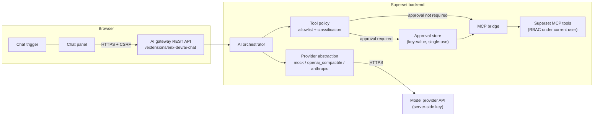

<!--
Licensed to the Apache Software Foundation (ASF) under one
or more contributor license agreements.  See the NOTICE file
distributed with this work for additional information
regarding copyright ownership.  The ASF licenses this file
to you under the Apache License, Version 2.0 (the
"License"); you may not use this file except in compliance
with the License.  You may obtain a copy of the License at

  http://www.apache.org/licenses/LICENSE-2.0

Unless required by applicable law or agreed to in writing,
software distributed under the License is distributed on an
"AS IS" BASIS, WITHOUT WARRANTIES OR CONDITIONS OF ANY
KIND, either express or implied.  See the License for the
specific language governing permissions and limitations
under the License.
-->

# Superset AI Assistant (chat extension)

An AI assistant inside the Superset chat host. The extension registers a
trigger and panel through the public `chat` contribution API (SIP-214) and
talks to a server-side gateway (`backend/`) that invokes a
configured model provider and orchestrates the Superset MCP tools under the
current user's own permissions. Tool calls can optionally be gated behind an
explicit, server-enforced user approval; see
[Tool approval](#tool-approval-optional).

## Architecture



Every call passes through the tool policy, which asks one question: does the
configured `TOOL_APPROVAL_MODE` gate a tool of this class? In the default
`disabled` mode the answer is always no, the left-hand branch is the only one
taken, and **the approval store is never reached** — no row is written, no
token is minted, and the approval endpoint refuses requests outright.

- **Frontend** (`frontend/`): conversation UI, tool-activity cards, approval
  cards, page-context awareness (`navigation` API), file attachments, local
  persistence, retry and cancellation. It holds no secrets and performs no
  Superset operations itself. It renders approval controls strictly in
  response to a `tool.approval_required` event, never from what it knows
  about the configured mode.

- **Gateway** (`backend/`): authenticates the session user (CSRF
  enforced), validates payloads, calls the provider, executes allowlisted
  MCP tools in-process through the in-memory FastMCP client (full RBAC
  middleware chain), enforces approvals where the mode calls for them, caps
  sizes, sanitizes errors.

- **Protocol**: one POST per turn returning an ordered list of typed events
  (`message.completed`, `tool.running`, `tool.completed`, `tool.failed`,
  `tool.approval_required`, `tool.rejected`, `request.completed`,
  `request.failed`). A directly executed call produces `tool.running` then
  `tool.completed`; `tool.approval_required` is emitted only for calls the
  configured mode gates, and never at all in `disabled` mode. The event
  vocabulary is transport-agnostic so a future SSE transport can stream the
  same events; see Limitations.

## Registration

The entry point (`frontend/src/index.tsx`) registers as a module-level side
effect:

```tsx
import { chat } from "@apache-superset/core";
chat.registerChat({ id: "enx-dev.ai-chat", name: "…" }, ChatTrigger, ChatPanel);
```

No manifest contribution entry is required for chat.

The backend registers the same way, by import side effect. The host imports
`backend/src/enx_dev/ai_chat/entrypoint.py` — the conventional path
derived from the publisher and name in `extension.json` — and the `@api`
decorator on `AiChatRestApi` mounts the routes under
`/extensions/enx-dev/ai-chat/` as the class is created.

```
extension.json           publisher, name, version, license
frontend/src/index.tsx   frontend entry point (registers the chat)
backend/pyproject.toml   Python package metadata and build includes
backend/src/enx_dev/ai_chat/entrypoint.py
                         backend entry point (registers the API)
backend/tests/           pytest suite, run against a Superset checkout
```

## Enabling the feature

Four independent switches, all server-side:

1. **Extension framework**: `FEATURE_FLAGS = {"ENABLE_EXTENSIONS": True}`.
2. **Extension loading**: add this directory to `LOCAL_EXTENSIONS` (after
   building) or install the packaged `.supx` via `EXTENSIONS_PATH`.
3. **AI chat gateway**: `AI_CHAT_CONFIG = {"ENABLED": True, ...}`.
4. **MCP tools**: install the `fastmcp` extra
   (`pip install apache_superset[fastmcp]`); without it the assistant is
   chat-only.

When configuration is incomplete the panel shows an administrator-friendly
disabled state; no secrets are ever included in any response.

Approval is not one of these switches: with the above in place the assistant
works, and tools run directly. Turning approval on is a separate, optional
decision — see [Tool approval](#tool-approval-optional).

## Provider configuration

Everything lives in `AI_CHAT_CONFIG` in `superset_config.py`. Superset
itself carries no default for it; whatever you set is merged over the
defaults the extension ships in
`backend/src/enx_dev/ai_chat/settings.py`, so naming only the keys
you care about leaves the curated tool allowlist and the size limits intact.
The provider API key is read at request time from the environment variable
named by `API_KEY_ENV_VAR` — it is never stored in config, never logged, and
never sent to the browser.

### Mock (development and tests — no credentials)

```python
AI_CHAT_CONFIG = {
    "ENABLED": True,
    "PROVIDER": "mock",
}
```

The mock provider is deterministic: `list dashboards` runs a read-only tool,
`delete dashboard <id>` calls a destructive tool, `run sql: <query> on
database <id>` calls SQL execution, and anything else returns a help
message. Whether the two tool-calling phrases execute directly or stop for
an approval card depends on `TOOL_APPROVAL_MODE`, which makes the mock a
convenient way to try each mode.

### OpenAI-compatible endpoint

```python
AI_CHAT_CONFIG = {
    "ENABLED": True,
    "PROVIDER": "openai_compatible",
    "MODEL": "gpt-4o-mini",
    "API_KEY_ENV_VAR": "OPENAI_API_KEY",   # export OPENAI_API_KEY=<your-key>
    # Optional: any /chat/completions-compatible server (vLLM, llama.cpp,
    # OpenRouter, an internal gateway). Operator-configured only.
    # "BASE_URL": "https://internal-llm.example.com/v1",
    # Recommended where mutating MCP tools are exposed; defaults to
    # "disabled". See Tool approval.
    # "TOOL_APPROVAL_MODE": "mutations_only",
}
```

### Anthropic

```python
AI_CHAT_CONFIG = {
    "ENABLED": True,
    "PROVIDER": "anthropic",
    "MODEL": "claude-sonnet-4-5",
    "API_KEY_ENV_VAR": "ANTHROPIC_API_KEY",  # export ANTHROPIC_API_KEY=<your-key>
}
```

> **About subscriptions vs API access**: a ChatGPT Plus subscription does
> not include OpenAI API usage, and a Claude consumer subscription does not
> include Anthropic API usage. Production use requires a separately
> provisioned API credential (or a compatible internally hosted model
> endpoint). The deterministic mock provider requires no credential at all.

### Why keys must stay server-side

A key shipped to the browser is readable by every user of the page (and by
any injected content). The gateway therefore performs all provider calls
server-side; the browser only ever talks to Superset with its session
cookie and CSRF token. Do not proxy or embed provider keys client-side.

## MCP integration and tool classification

The gateway lists tools through the in-memory FastMCP client, so the MCP
service's own authentication, RBAC and visibility filtering all apply under
the requesting user. On top of that:

- `ALLOWED_MCP_TOOLS` is an explicit allowlist — the model never sees tools
  outside it. An empty list disables tool use.

- Every tool is classified from its declared `ToolAnnotations`:
  `readOnlyHint=True` → **read-only**; `destructiveHint=True` →
  **destructive**; `readOnlyHint=False` → **mutating**; missing or
  unrecognizable annotations → **unknown**, which is gated wherever mutating
  tools are, so an unannotated tool is never the cheapest way past a gate.
  What the class then means for execution is decided by `TOOL_APPROVAL_MODE`
  below.

- SQL execution goes through the MCP `execute_sql` tool, which fail-closes
  on unparseable SQL, blocks destructive DDL unconditionally and leaves DML
  to the per-database `allow_dml` flag — classification by code, not by the
  model. These limits are part of the tool and apply in every approval mode.

**Adding a tool**: append its name to `ALLOWED_MCP_TOOLS`. Its class is
derived automatically from its annotations. Optional presentation-only
warnings can be added in
`backend/src/enx_dev/ai_chat/tool_policy.py::TOOL_APPROVAL_WARNINGS`.

## Tool approval (optional)

Approval is an **optional confirmation step, disabled by default**. It does
not replace any other control: session authentication, the `can read on
AiChat` permission, the `ALLOWED_MCP_TOOLS` allowlist, schema and argument
validation, and Superset's own RBAC inside each MCP tool apply to every call
in every mode. What approval adds is a human saying yes first.

Configure it with a single key, and only an administrator can:

```python
AI_CHAT_CONFIG = {
    "ENABLED": True,
    "PROVIDER": "openai_compatible",
    "MODEL": "gpt-4o-mini",
    "API_KEY_ENV_VAR": "OPENAI_API_KEY",
    "TOOL_APPROVAL_MODE": "disabled",  # or "mutations_only", "all_tools"
}
```

| Mode | Read-only tools | Mutating / destructive / unknown | Approval store |
| --- | --- | --- | --- |
| `disabled` *(default)* | run directly | run directly | never touched |
| `mutations_only` | run directly | require approval | used when gated |
| `all_tools` | require approval | require approval | used for every call |

- **`disabled`** is the default and what you get by saying nothing about
  approval. Every allowlisted tool executes as soon as authentication, the
  allowlist, argument and schema validation, and RBAC have passed. No
  approval row is written, no approval token is minted, no
  `tool.approval_required` event is emitted, and the `/tool_approval`
  endpoint refuses requests — a forged approval has nothing to consume.

- **`mutations_only`** is recommended for production instances that expose
  mutating MCP tools. Read-only tools stay immediate, so the assistant is
  still quick to ask questions of, while anything that writes waits for a
  person.

- **`all_tools`** gates every call, read-only ones included. Intended for
  highly restricted environments where even a read is worth confirming; it
  makes ordinary use slow by design.

An unrecognized value is a configuration error: the gateway refuses the
request rather than silently choosing a mode, in either direction.

### What an approval is, when one is used

In a gating mode, the gateway creates a single-use approval record in the
metadata database bound to the user id, conversation id, tool name and a
SHA-256 hash of the canonicalized arguments, with a TTL
(`APPROVAL_TTL_SECONDS`, default 5 minutes). Storage is shared, so
enforcement holds across workers. The panel shows the exact action, target
arguments, classification, reversibility hint and warnings with
Approve/Reject buttons.

- Approving sends the approval id; the server re-validates every bound
  property and consumes the record atomically before executing. Changing
  the arguments, tool, user or conversation invalidates it; replay after
  use fails.

- Rejecting burns the approval and returns a structured rejection to the
  model, which responds without executing.

- Approval is enforced server-side; nothing the model, the page content or
  the client sends can bypass it. `/config` reports `tool_approval_mode` so
  the UI can describe the instance, but that value is informational — the
  browser renders approval controls only in response to a
  `tool.approval_required` event, and lying to itself about the mode changes
  nothing about which calls are gated.

### Migrating from `REQUIRE_APPROVAL_FOR_MUTATIONS`

The previous `REQUIRE_APPROVAL_FOR_MUTATIONS` boolean is deprecated and read
only when `TOOL_APPROVAL_MODE` is unset. It logs a warning and will be
removed.

| Old setting | Resolves to | Why |
| --- | --- | --- |
| `True` | `mutations_only` | Exactly the old behavior. |
| `False` | `mutations_only` | The old `False` still gated destructive and unknown tools while letting plain mutations through. No mode expresses that, so it resolves to the stricter neighbour rather than quietly ungating deletions. Set `TOOL_APPROVAL_MODE` explicitly to choose. |

**Behavior change**: approval used to be mandatory for mutating and
destructive tools and is now off unless configured. An instance that relied
on the old default should set `TOOL_APPROVAL_MODE = "mutations_only"`.

## Security model

- Session authentication + CSRF on every route; a dedicated `can read on
AiChat` permission lets operators grant the assistant per role.

- All Superset operations run through MCP tools under the requesting user —
  the gateway adds no privileged path, in any approval mode. If
  `MCP_DEV_USERNAME` is set to a different user than the session user, tool
  execution fails closed (identity alignment guard). A user can therefore
  only ever reach, through the assistant, what they could reach themselves;
  approval narrows that further when enabled, and never widens it.

- Prompt-injection defense in depth: trusted system prompt kept separate
  from all retrieved data; MCP wraps user-authored strings in
  `<UNTRUSTED-CONTENT>` tags; tool output is size-capped and carried only
  as tool-role data; the tool allowlist, classification and approval policy
  are code-enforced, and the model is told what the policy is but never
  consulted about it; no shell/filesystem/URL-fetch/code-execution tools
  exist.

- The frontend renders Markdown through a minimal React-element renderer:
  no raw HTML, no `dangerouslySetInnerHTML`, unsafe link schemes refused.

- Attached files are read in the browser and travel inside the user turn as
  delimited `<ATTACHED-FILE>` blocks, which the system prompt declares to be
  reference data and never instructions — including any text written inside
  an attached image. Block markers are stripped from the file text so a file
  cannot close its own block, file names are stripped of quotes and angle
  brackets, and each attachment is capped (see Limitations). Images are
  accepted only as base64 with an allowlisted media type, are attached to
  user turns only (the gateway drops any others), and are bounded per image
  and per request. Nothing is uploaded or stored server-side.

- Errors returned to the browser are sanitized (no tracebacks, no provider
  response bodies); secret-looking argument values are redacted in events
  and logs.

## Development

```bash
# Frontend: install, test, typecheck, build
cd extensions/ai-chat/frontend
npm install
npm test                 # jest
npm run type             # tsc --noEmit over src + tests
npm run build            # webpack production build into dist/

# Backend tests (from the repo root, in the Superset venv)
pytest extensions/ai-chat/backend/tests/
```

When the host is configured to load this extension, it imports the backend
out of `dist/`, which shadows the working tree — so build before running the
backend tests. They refuse to run against a stale `dist/` rather than report
a pass on code you did not write.

To load the extension locally, run `superset-extensions build` in this
directory (produces `dist/manifest.json` + `dist/frontend/dist/*`) and add
the directory to `LOCAL_EXTENSIONS`. `superset-extensions bundle` packages
it as a `.supx` for `EXTENSIONS_PATH`-based deployments.

### Manual testing steps

1. `FEATURE_FLAGS["ENABLE_EXTENSIONS"] = True`, `AI_CHAT_CONFIG["ENABLED"] =
True` with the mock provider, and this extension in `LOCAL_EXTENSIONS`.
2. Log in; the robot trigger appears bottom-right. Click it — the panel
   opens in floating mode; the header toggle docks it as a sidebar.
3. Send `list dashboards` — a read-only tool card runs and the mock
   summarizes the result.
4. Send `delete dashboard <id>` — with the default
   `TOOL_APPROVAL_MODE`, the tool runs straight away and reports its result.
   Set `"TOOL_APPROVAL_MODE": "mutations_only"`, restart, and send it again:
   an approval card appears; Reject and verify nothing was deleted, then
   repeat and Approve to execute.
5. Navigate between pages — the header context tag updates and a note marks
   the transition; the conversation is retained.
6. Set `"PROVIDER": "openai_compatible"` without a key — the panel shows the
   misconfigured state and the input is disabled.

### Adding another provider

Implement `BaseChatProvider` (`backend/src/enx_dev/ai_chat/providers/base.py`) — one
async `complete(messages, tools) -> ProviderResult` translating the neutral
message format to your wire format — and register the class in
`PROVIDERS` (`backend/src/enx_dev/ai_chat/providers/__init__.py`). Raise
`AiChatProviderError` with browser-safe messages on failure. The UI is
provider-agnostic and needs no changes.

## Limitations

- **One host import**: the MCP bridge imports `superset.mcp_service.app` to
  reach the server the host already runs. `apache-superset-core` exposes
  decorators for contributing MCP tools but no client for calling them, and
  a second server would mean a second copy of the middleware chain the
  bridge exists to go through. The import is lazy and guarded, so a host
  that moves it costs tool use rather than the whole assistant. Everything
  else in `backend/` goes through `apache-superset-core`.

- **Unreleased frontend APIs**: `chat` and `navigation` are not in
  `@apache-superset/core` 0.1.0 on npm, so the frontend builds against a
  Superset checkout and needs a host recent enough to provide the chat
  contribution point.

- **No token streaming**: the backend has no SSE convention; each turn
  returns its events at once. The typed event protocol is
  transport-agnostic so streaming can be added without changing the UI
  event model.

- **Cancellation is client-side**: cancelling aborts the fetch and recovers
  the UI; the in-flight server work completes and is discarded.

- **Page context is a hint**: the public navigation API exposes only the
  page type; the dashboard id is parsed from the URL and verified via tools.

- **No multi-step atomicity**: dashboard/chart creation reports per-step
  results honestly; there is no transaction across MCP tools.

- **History replay**: the server is stateless; the client replays trimmed
  history, so very long conversations lose their oldest turns and tool
  results are replayed as bounded excerpts.

- **Conversation storage** is browser-local (namespaced localStorage via
  the extension storage API), capped in size, cleared by "New conversation".

- **Attachments**: up to 3 per message. Text files (`.csv`, `.json`, `.log`,
  `.md`, `.py`, `.sql`, `.tsv`, `.txt`, `.yaml`, `.yml`) are capped at 1 MB
  and 20 000 characters each, longer ones truncated with a note the model is
  told to surface; there is no PDF or spreadsheet parsing. Images (`.png`,
  `.jpg`, `.jpeg`, `.gif`, `.webp`) are capped at 8 MB and require a
  vision-capable configured model — a text-only model rejects the request
  and the error surfaces with a retry. An image whose encoded payload
  exceeds \~300 KB is re-encoded in the browser with its longest edge bounded
  to 1400 px; smaller ones are sent as they are, whatever their pixel
  dimensions, and re-encoding is best-effort (the original is kept if it
  fails or does not come out smaller).

- **Dropped objects**: dragging a chart title, dashboard card or dataset
  link into the composer attaches it as context (up to 5). Identity comes
  from the dropped URL, so no host-side drag source is needed, and only
  same-origin URLs are read. They stay attached until removed with the chip's
  X or until the conversation is cleared, and travel as page context on every
  turn — so they are hints the assistant verifies with a tool, exactly like
  the page's own resource. Each message records the objects it was sent with
  above the question, as links back to them: a snapshot of the context that
  turn carried, kept even after the object is detached.

- **Attachments live in the turn**: file text counts toward
  `MAX_INPUT_CHARS`, and both files and images leave context once history
  trimming reaches that message. Images are stripped before the conversation
  is written to browser storage (a screenshot dwarfs the persistence
  budget), so a reloaded conversation keeps the message and the attachment's
  name but not the image itself.
