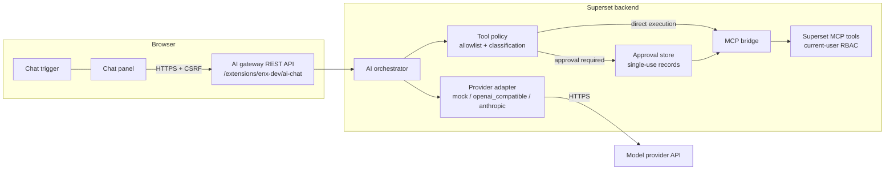

<!--
Licensed to the Apache Software Foundation (ASF) under one
or more contributor license agreements.  See the NOTICE file
distributed with this work for additional information
regarding copyright ownership.  The ASF licenses this file
to you under the Apache License, Version 2.0 (the
"License"); you may not use this file except in compliance
with the License.  You may obtain a copy of the License at

  http://www.apache.org/licenses/LICENSE-2.0

Unless required by applicable law or agreed to in writing,
software distributed under the License is distributed on an
"AS IS" BASIS, WITHOUT WARRANTIES OR CONDITIONS OF ANY
KIND, either express or implied.  See the License for the
specific language governing permissions and limitations
under the License.
-->

# Superset AI Assistant Extension

A Superset extension that adds an AI chat assistant to the Superset UI. It
registers a chat trigger and panel through the public `chat` contribution API
and uses a backend gateway to call a configured model provider and Superset MCP
tools under the current user's permissions.

This directory is meant to be used as a standalone Superset extension, in the
same style as the examples in the
[Superset extensions collection](https://github.com/michael-s-molina/superset-extensions/tree/main).

## Features

- **Chat contribution**: adds a floating chat trigger and panel to Superset.
- **Server-side provider calls**: keeps OpenAI-compatible and Anthropic API
  keys on the server.
- **Mock provider**: deterministic local mode for development and tests with
  no external credentials.
- **MCP tool orchestration**: lets the assistant inspect and manage Superset
  objects through allowlisted MCP tools.
- **Current-user RBAC**: tool calls run as the requesting Superset user.
- **Optional tool approval**: can require user confirmation for mutations or
  for every tool call.
- **Context handling**: includes page context, dragged Superset objects, and
  bounded file/image attachments in user turns.

## Installation

1. Build and bundle the extension:

```bash
cd extensions/ai-chat
superset-extensions bundle
```

2. Copy the generated `.supx` file into the directory configured by
   `EXTENSIONS_PATH`:

```python
FEATURE_FLAGS = {
    "ENABLE_EXTENSIONS": True,
}

EXTENSIONS_PATH = "/path/to/extensions"
```

3. Enable the AI chat gateway in `superset_config.py`:

```python
AI_CHAT_CONFIG = {
    "ENABLED": True,
    "PROVIDER": "mock",
}
```

4. Restart Superset. The assistant appears as a chat trigger in the Superset
   UI.

To load the working directory during local development, build it and add the
extension directory to `LOCAL_EXTENSIONS` instead of packaging a `.supx`:

```python
FEATURE_FLAGS = {
    "ENABLE_EXTENSIONS": True,
}

LOCAL_EXTENSIONS = [
    "/path/to/superset/extensions/ai-chat",
]
```

## Provider Configuration

All extension settings live under `AI_CHAT_CONFIG` in `superset_config.py`.
Values you define are merged over the extension defaults in
`backend/src/enx_dev/ai_chat/settings.py`.

### Mock

Use the mock provider for development and automated tests:

```python
AI_CHAT_CONFIG = {
    "ENABLED": True,
    "PROVIDER": "mock",
}
```

The mock understands a few deterministic prompts:

- `list dashboards`
- `delete dashboard <id>`
- `run sql: <query> on database <id>`

### OpenAI-Compatible

```python
AI_CHAT_CONFIG = {
    "ENABLED": True,
    "PROVIDER": "openai_compatible",
    "MODEL": "gpt-4o-mini",
    "API_KEY_ENV_VAR": "OPENAI_API_KEY",
    # Optional: any /chat/completions-compatible server.
    # "BASE_URL": "https://internal-llm.example.com/v1",
}
```

Export the key outside Superset:

```bash
export OPENAI_API_KEY="<your-key>"
```

### Anthropic

```python
AI_CHAT_CONFIG = {
    "ENABLED": True,
    "PROVIDER": "anthropic",
    "MODEL": "claude-sonnet-4-5",
    "API_KEY_ENV_VAR": "ANTHROPIC_API_KEY",
}
```

Export the key outside Superset:

```bash
export ANTHROPIC_API_KEY="<your-key>"
```

API keys are read from the named environment variable at request time. They are
not stored in Superset config, logged, or sent to the browser.

## MCP Tools

The assistant can call MCP tools only when the Superset MCP extra is installed:

```bash
pip install apache_superset[fastmcp]
```

Tool access is controlled by `ALLOWED_MCP_TOOLS`. The configured list is the
only tool surface the model can see. An empty list leaves the extension in
chat-only mode.

Each tool is classified from its MCP annotations:

| Classification | Source annotation                   |
| -------------- | ----------------------------------- |
| Read-only      | `readOnlyHint=True`                 |
| Destructive    | `destructiveHint=True`              |
| Mutating       | `readOnlyHint=False`                |
| Unknown        | Missing or unrecognized annotations |

Unknown tools are treated like mutating tools for approval policy purposes.
SQL execution goes through the MCP `execute_sql` tool, which blocks destructive
DDL and honors each database's `allow_dml` setting.

## Tool Approval

Tool approval is optional and disabled by default. It never replaces Superset
RBAC, CSRF, schema validation, or the MCP allowlist. It only adds a server-side
confirmation step before selected tools execute.

```python
AI_CHAT_CONFIG = {
    "ENABLED": True,
    "PROVIDER": "openai_compatible",
    "MODEL": "gpt-4o-mini",
    "API_KEY_ENV_VAR": "OPENAI_API_KEY",
    "TOOL_APPROVAL_MODE": "mutations_only",
}
```

| Mode             | Read-only tools  | Mutating, destructive, unknown tools | Tool cards    |
| ---------------- | ---------------- | ------------------------------------ | ------------- |
| `disabled`       | Run directly     | Run directly                         | Failures only |
| `mutations_only` | Run directly     | Require approval                     | Shown         |
| `all_tools`      | Require approval | Require approval                     | Shown         |

`REQUIRE_APPROVAL_FOR_MUTATIONS` is deprecated. Set `TOOL_APPROVAL_MODE`
explicitly for new deployments.

## Usage

1. Open Superset and log in as a user with `can read on AiChat`.
2. Click the chat trigger.
3. Ask about dashboards, charts, datasets, databases, metrics, or SQL.
4. If approval is enabled and the assistant requests a gated tool call, approve
   or reject the action in the chat panel.

Example prompts for the mock provider:

- `list dashboards`
- `delete dashboard 12`
- `run sql: select count(*) from logs on database 1`

## Development

### Frontend

```bash
cd extensions/ai-chat/frontend
npm install
npm test
npm run type
npm run build
```

### Backend

Run backend tests from the Superset repository root, inside the Superset Python
environment:

```bash
pytest extensions/ai-chat/backend/tests/
```

The backend tests compare the source tree with the built `dist/` copy because
Superset imports extension backend code from `dist/`. Run
`superset-extensions build` from `extensions/ai-chat` after backend changes.

### Build

```bash
cd extensions/ai-chat
superset-extensions build
```

### Bundle

```bash
cd extensions/ai-chat
superset-extensions bundle
```

## Project Structure

```text
ai-chat/
|-- extension.json
|-- frontend/
|   |-- src/
|   |   |-- index.tsx
|   |   |-- components/
|   |   |-- hooks/
|   |   |-- state/
|   |   `-- utils/
|   |-- package.json
|   |-- tsconfig.json
|   `-- webpack.config.js
|-- backend/
|   |-- pyproject.toml
|   |-- src/enx_dev/ai_chat/
|   |   |-- api.py
|   |   |-- entrypoint.py
|   |   |-- orchestrator.py
|   |   |-- providers/
|   |   |-- settings.py
|   |   `-- tool_policy.py
|   `-- tests/
`-- README.md
```

## Architecture



The frontend holds no provider secrets and performs no Superset operations on
its own. It sends chat turns to the extension backend, receives typed events,
and renders assistant messages, tool activity, approval cards, and failures.

The backend mounts routes under `/extensions/enx-dev/ai-chat/`, validates the
session user and CSRF token, calls the configured provider, enforces the MCP
tool allowlist and approval policy, and executes MCP tools in process.

## Security Notes

- Session authentication and CSRF are required on every route.
- A dedicated `can read on AiChat` permission controls access to the assistant.
- MCP tools run under the requesting Superset user, not a privileged extension
  account.
- If `MCP_DEV_USERNAME` points at a different user than the session user, tool
  execution fails closed.
- Provider API keys stay server-side.
- Prompt-injection defenses include a trusted system prompt, untrusted-content
  wrappers for retrieved data, bounded tool output, and a code-enforced tool
  allowlist.
- The frontend Markdown renderer does not render raw HTML and refuses unsafe
  link schemes.
- Browser-visible errors are sanitized.

## Limitations

- The frontend depends on Superset builds that expose the `chat` and
  `navigation` APIs from `@apache-superset/core`.
- Tool use requires the Superset MCP service and the `fastmcp` optional
  dependency.
- Responses are returned one turn at a time; there is no token streaming.
- Cancellation aborts the browser request, but any already-started server work
  may finish and be discarded.
- Conversation history is browser-local and trimmed to stay under configured
  request limits.
- Attachments are bounded and sent only as part of the relevant user turn.

## License

Apache-2.0
