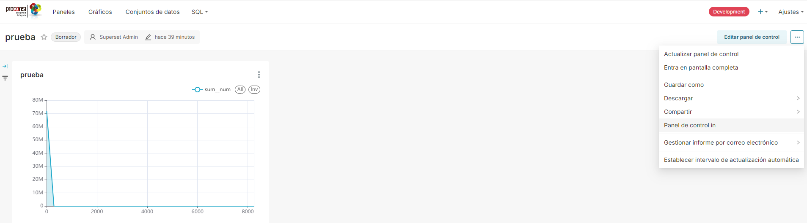

# Obtención de tokens via api
Para la obtención de tokens directamente vía api, ir a la dirección http://localhost:8088/swagger/v1 y, ahí, a la sección Security. Para poder acceder usar admin/admin de user/password.
El token que necesita el html es de tipo guest token, y se realiza la petición con un json como sigue:

```json
{
  "resources": [
    {
      "id": "526b0f7a-8a07-40f8-b84c-52249aee8535",
      "type": "dashboard"
    }
  ],
  "rls": [],
  "user": {
    "first_name": "",
    "last_name": "",
    "username": "u1"
  }
}
```
donde "username" se puede cambiar al nombre de usuario que se quiera (mejor que sea único para distintas peticiones) y el "id" se refiere al id que se obtiene en superset en la opción de embeber el dashboard.

*¡¡Importante!!* Para embeber los dashboards hay que proporcionar los dominios desde los que se puede acceder a ellos dentro de superset. Comprobar, al poner un dominio nuevo, que la conexión se realiza efectivamente antes de realizar más cambios.
La configuración de embebido de un panel en superset se hace en la opción remarcada en la imagen:



Además, hay que cambiar configuraciones del config.py. Para dejar todos los cambios de parámetros acotados, se han añadido a superset_config.py en una sección acotada, para que se puedan eliminar si en algún momento es necesario. El fichero superset_config.py está en superset/docker/pythopath_dev. Además, en config.py se han cambiado, dentro de la sección DEFAULT_FEATURE_FLAGS las siguientes: "EMBEDDED_SUPERSET": True, "ALERT_REPORTS": True, "DASHBOARD_RBAC": True

# Uso de fichero html para embeber un panel.
En embebido_html.html está el código necesario para embeber un panel. Para que funcione, cambiar en ese código los parámetros referenciados en mayúscula en la siguiente porción de código con los valores apropiados de los parámetros 
```html
supersetEmbeddedSdk.embedDashboard(
    { 
      id: ID_PANEL_EMBEBIDO, // string, el que devuelve superset al embeber panel según la imagen mostrada en la sección anterior 
      supersetDomain: URL_DOMINIO, //por defecto, el docker lo tenemos montado en http://localhost:8088  
      mountPoint: document.getElementById("my-superset-container"),
      fetchGuestToken: () => GUEST_TOKEN, # tipo string, es el token que se devuelve vía api con la consulta anterior (se puede consultar a la api con get/post) 
      dashboardUiConfig: { // dashboard UI config: hideTitle, hideTab, hideChartControls, filters.visible, filters.expanded (optional)
        hideTitle: true,
        hideChartControls: true,
        hideTab: true,
            filters: {
            expanded: false,
        }
      },
    }
   );
```

# Uso de React para embeber paneles
Alternativamente, puede usarse React para embeber los paneles en vez del código html referenciado antes.

Para hacerlo, intalar node.js, npm, y crear un proyecto de React mediante la ejecución en el windows cmd de
```console
npx create-react-app nombre_app
```

Tras la creación del proyecto, hay que sustituir el código del fichero App.js en la carpeta src por
```javascript

import './App.css';
import {getToken} from './Dashboard.js'

function App() {
  getToken()
  return (
    <div className="component-dashboard">
      <div id='superset-container'></div>
      </div>
  );
}

export default App;
```
y añadir en esa misma carpeta src el archivo Dashboard.js que hemos dejado en este directorio de integracion_transparente. En este fichero se pueden ver los modelos de peticiones a la api para obtener los tokens, que pueden usarse como referencia para hacer las peticiones de tokens para la versión html si no se quiere depender de la api.
