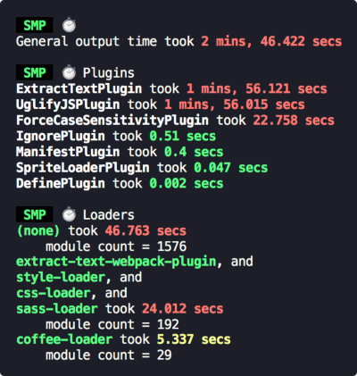

<div align="center">
  
  <h1>
    Speed Measure Plugin
    <div><sup><em>(for webpack)</em></sup></div>
  </h1>

  <a href="https://travis-ci.org/stephencookdev/speed-measure-webpack-plugin"></a>
  <a href="https://npmjs.com/package/speed-measure-webpack-plugin"></a>
  <a href="https://npmjs.com/package/speed-measure-webpack-plugin"></a>
</div>
<br>

The first step to optimising your webpack build speed, is to know where to focus your attention.

This plugin measures your webpack build speed, giving an output like this:



## Install

```bash
npm install --save-dev speed-measure-webpack-plugin
```

or

```bash
yarn add -D speed-measure-webpack-plugin
```

## Migrating

SMP follows [semver](https://semver.org/). If upgrading a major version, you can consult [the migration guide](./migration.md).

## Requirements

SMP requires at least **Node v6**. But otherwise, accepts **all webpack** versions (1, 2, 3, and 4).

## Usage

Change your webpack config from

```javascript
const webpackConfig = {
  plugins: [
    new MyPlugin(),
    new MyOtherPlugin()
  ]
}
```

to

```javascript
const SpeedMeasurePlugin = require("speed-measure-webpack-plugin");

const smp = new SpeedMeasurePlugin();

const webpackConfig = smp.wrap({
  plugins: [
    new MyPlugin(),
    new MyOtherPlugin()
  ]
});
```

and you're done! SMP will now be printing timing output to the console by default.

Check out the [examples folder](/examples) for some more examples.

## Options

Pass these into the constructor, as an object:

```javascript
const smp = new SpeedMeasurePlugin(options);
```

### `options.disable`

Type: `Boolean`<br>
Default: `false`

If truthy, this plugin does nothing at all.

`{ disable: !process.env.MEASURE }` allows opt-in measurements with `MEASURE=true npm run build`.

### `options.outputFormat`

Type: `String|Function`<br>
Default: `"human"`

Determines in what format this plugin prints its measurements

 * `"json"` - produces a JSON blob
 * `"human"` - produces a human readable output
 * `"humanVerbose"` - produces a more verbose version of the human readable output
 * If a function, it will call the function with the JSON blob, and output the response

### `options.outputTarget`

Type: `String|Function`<br>
Default: `console.log`

* If a string, it specifies the path to a file to output to.
* If a function, it will call the function with the output as the first parameter

### `options.pluginNames`

Type: `Object`<br>
Default: `{}`

By default, SMP derives plugin names through `plugin.constructor.name`. For some
plugins this doesn't work (or you may want to override this default). This option
takes an object of `pluginName: PluginConstructor`, e.g.

```javascript
const uglify = new UglifyJSPlugin();
const smp = new SpeedMeasurePlugin({
  pluginNames: {
    customUglifyName: uglify
  }
});

const webpackConfig = smp.wrap({
  plugins: [
    uglify
  ]
});
```

### `options.granularLoaderData` _(experimental)_

Type: `Boolean`<br>
Default: `false`

By default, SMP measures loaders in groups. If truthy, this plugin will give per-loader timing information.

This flag is _experimental_. Some loaders will have inaccurate results:

 * loaders using separate processes (e.g. `thread-loader`)
 * loaders emitting file output (e.g. `file-loader`)

We will find solutions to these issues before removing the _(experimental)_ flag on this option.

## License

[MIT](/LICENSE)
