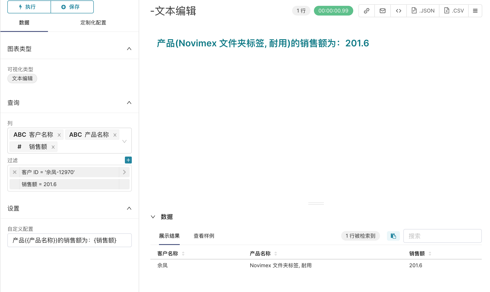

# input-text-plugin

This is the Input Text Plugin Superset Chart Plugin.

### Usage

To build the plugin, run the following commands:

```
npm ci
npm run build
```

Alternatively, to run the plugin in development mode (=rebuilding whenever changes are made), start the dev server with the following command:

```
npm run dev
```

To add the package to Superset, go to the `superset-frontend` subdirectory in your Superset source folder (assuming both the `input-text-plugin` plugin and `superset` repos are in the same root directory) and run
```
npm i -S ../../input-text-plugin
```

After this edit the `superset-frontend/src/visualizations/presets/MainPreset.js` and make the following changes:

```js
import { InputTextPlugin } from 'input-text-plugin';
```

to import the plugin and later add the following to the array that's passed to the `plugins` property:
```js
new InputTextPlugin().configure({ key: 'input-text-plugin' }),
```

After that the plugin should show up when you run Superset, e.g. the development server:

```
npm run dev-server
```


###    input-text插件

- 名称: **文本编辑**
- 描述：自定义文本编辑插件，可以把数据以插值的形式替换展示，默认为平铺展示
#### 左侧工具栏

| 名称 | 功能 | 描述|
|:----  |:---:|----:|
| 列|展示的数据|可以多选，在图表右侧内容区域默认展示的数据列|
|过滤 | 对所选数据的过滤| 右侧展示的是添加过滤筛选的数据|
| 设置 | 对内容区域进行插值排版| 所需要展示的内容里需要插入的数据用{字段名}，如果需要添加换行用 br |

如图所示：

