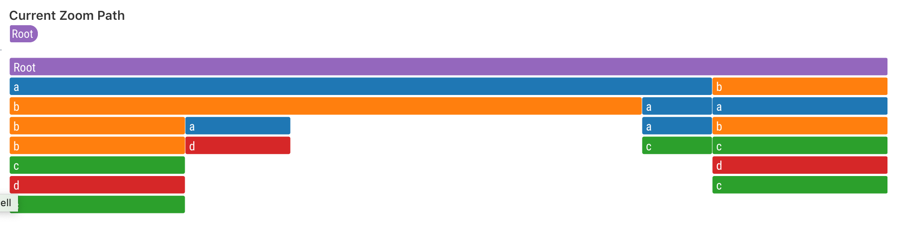

## @superset-ui/plugin-chart-icicle

## WIP

This is a work in progress with the design being finalized.

This plugin provides Icicle Event Chart for Superset.

### Usage

Configure `key`, which can be any `string`, and register the plugin. This `key` will be used to lookup this chart throughout the app.

```js
import IcicleEventVizPlugin from '@superset-ui/plugin-chart-icicle-event';

new IcicleEventVizPlugin()
  .configure({ key: 'icicle' })
  .register();
```

Then use it via `SuperChart`. A link to Storybook for the Icicle Event Chart will be available here in the future for more details.

```js
<SuperChart
  chartType="icicle"
  width={600}
  height={600}
  formData={...}
  queryData={{
    data: {...},
  }}
/>
```

### Current Prototype (Subject to Change)


