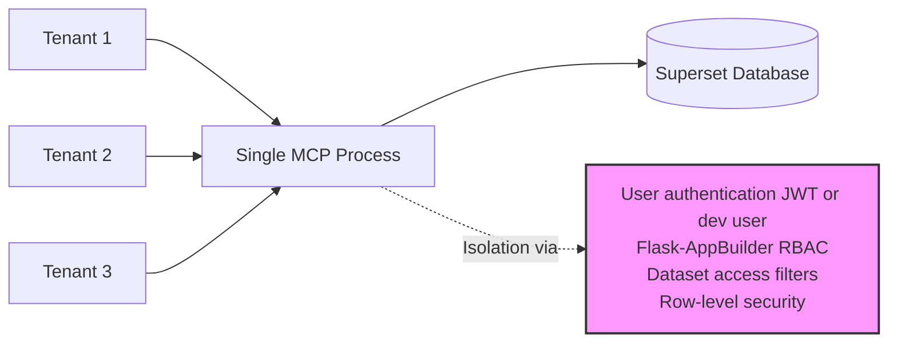
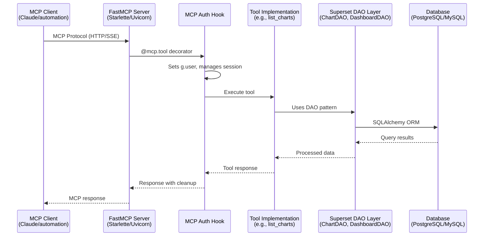
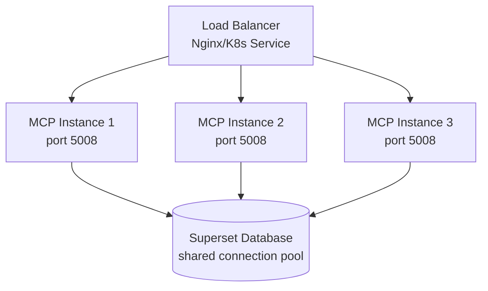

<!--
Licensed to the Apache Software Foundation (ASF) under one
or more contributor license agreements.  See the NOTICE file
distributed with this work for additional information
regarding copyright ownership.  The ASF licenses this file
to you under the Apache License, Version 2.0 (the
"License"); you may not use this file except in compliance
with the License.  You may obtain a copy of the License at

  http://www.apache.org/licenses/LICENSE-2.0

Unless required by applicable law or agreed to in writing,
software distributed under the License is distributed on an
"AS IS" BASIS, WITHOUT WARRANTIES OR CONDITIONS OF ANY
KIND, either express or implied.  See the License for the
specific language governing permissions and limitations
under the License.
-->

# MCP Service Architecture

## Overview

The Apache Superset MCP (Model Context Protocol) service provides programmatic access to Superset functionality through a standardized protocol that enables AI assistants and automation tools to interact with dashboards, charts, datasets, and SQL Lab.

The MCP service runs as a **separate process** from the Superset web server, using its own Flask application instance and HTTP server while sharing the same database and configuration with the main Superset application.

## Flask Singleton Pattern

### Why Module-Level Singleton?

The MCP service uses a module-level singleton Flask application instance rather than creating a new app instance per request. This design decision is based on several important considerations:

**Separate Process Architecture**:
- The MCP service runs as an independent process from the Superset web server
- It has its own HTTP server (via FastMCP/Starlette) handling MCP protocol requests
- Each MCP tool invocation occurs within the context of this single, long-lived Flask app

**Benefits of Module-Level Singleton**:

1. **Consistent Database Connection Pool**
   - A single SQLAlchemy connection pool is maintained across all tool calls
   - Connections are efficiently reused rather than recreated
   - Connection pool configuration (size, timeout, etc.) behaves predictably

2. **Shared Configuration Access**
   - Flask app configuration is loaded once at startup
   - All tools access the same configuration state
   - Changes to runtime config affect all subsequent tool calls consistently

3. **Thread-Safe Initialization**
   - The Flask app is created exactly once using `threading.Lock()`
   - Multiple concurrent requests safely share the same app instance
   - No risk of duplicate initialization or race conditions

4. **Lower Resource Overhead**
   - No per-request app creation/teardown overhead
   - Memory footprint remains constant regardless of request volume
   - Extension initialization (Flask-AppBuilder, Flask-Migrate, etc.) happens once

**When Module-Level Singleton Is Appropriate**:
- Service runs as dedicated daemon/process
- Application state is consistent across all requests
- No per-request application context needed
- Long-lived server process with many requests

**When Module-Level Singleton Is NOT Appropriate**:
- Testing with different configurations (use app fixtures instead)
- Multi-tenant deployments requiring different app configs per tenant
- Dynamic plugin loading requiring app recreation
- Development scenarios requiring hot-reload of app configuration

### Implementation Details

The singleton is implemented in `flask_singleton.py`:

```python
# Module-level instance - created once on import
from superset.app import create_app
from superset.mcp_service.mcp_config import get_mcp_config

_temp_app = create_app()

with _temp_app.app_context():
    mcp_config = get_mcp_config(_temp_app.config)
    _temp_app.config.update(mcp_config)

app = _temp_app

def get_flask_app() -> Flask:
    """Get the Flask app instance."""
    return app
```

**Key characteristics**:
- No complex patterns or metaclasses needed
- The module itself acts as the singleton container
- Clean, Pythonic approach following Stack Overflow recommendations
- Application context pushed during initialization to avoid "Working outside of application context" errors

## Multitenant Architecture

### Current Implementation

The MCP service uses **Option B: Shared Process with Tenant Isolation**:



### Tenant Isolation Mechanisms

#### Database Level

**Superset's Existing RLS (Row-Level Security)**:
- RLS rules are defined at the dataset level
- Rules filter queries based on user attributes (e.g., `department = '{{ current_user.department }}'`)
- The MCP service respects all RLS rules automatically through Superset's query execution layer

**No Schema-Based Isolation**:
- The current implementation does NOT use separate database schemas per tenant
- All Superset metadata (dashboards, charts, datasets) exists in the same database schema
- Database-level isolation is achieved through Superset's permission system rather than physical schema separation

#### Application Level

**Flask-AppBuilder Security Manager**:
- Every MCP tool call uses `@mcp_auth_hook` decorator
- The auth hook sets `g.user` to the authenticated user (from JWT or `MCP_DEV_USERNAME`)
- Superset's security manager then enforces permissions based on this user's roles

**User-Based Access Control**:
- Users can only access resources they have permissions for
- Dashboard ownership and role-based permissions are enforced
- The `can_access_datasource()` method validates dataset access

**Dataset Access Filters**:
- All list operations (dashboards, charts, datasets) use Superset's access filters:
  - `DashboardAccessFilter` - filters dashboards based on user permissions
  - `ChartAccessFilter` - filters charts based on user permissions
  - `DatasourceFilter` - filters datasets based on user permissions

**Row-Level Security Enforcement**:
- RLS rules are applied transparently during query execution
- The MCP service makes no modifications to bypass RLS
- SQL queries executed through `execute_sql` tool respect RLS policies

#### JWT Tenant Claims

**Development Mode** (single user):
```python
# superset_config.py
MCP_DEV_USERNAME = "admin"
```

**Production Mode** (JWT-based):
```json
{
  "sub": "user@company.com",
  "email": "user@company.com",
  "scopes": ["superset:read", "superset:chart:create"],
  "exp": 1672531200
}
```

**Future Enhancement** (multi-tenant JWT):
```json
{
  "sub": "user@tenant-a.com",
  "tenant_id": "tenant-a",
  "scopes": ["superset:read"],
  "exp": 1672531200
}
```

The `tenant_id` claim could be used in future versions to:
- Further isolate data by tenant context
- Apply tenant-specific RLS rules
- Log and audit actions by tenant
- Implement tenant-specific rate limits

## Process Model

### Single Process Deployment

**When to Use**:
- Development and testing environments
- Small deployments with low request volume (< 100 requests/minute)
- Single-tenant installations
- Resource-constrained environments

**Resource Characteristics**:
- Memory: ~500MB-1GB (includes Flask app, SQLAlchemy, screenshot pool)
- CPU: Mostly I/O bound (database queries, screenshot generation)
- Database connections: Configurable via `SQLALCHEMY_POOL_SIZE` (default: 5)

**Scaling Limitations**:
- Single Python process = GIL limitations for CPU-bound operations
- Screenshot generation can block other requests
- Limited horizontal scalability without load balancer

**Example Command**:
```bash
superset mcp run --port 5008
```

### Multi-Process Deployment

**Using Gunicorn Workers**:
```bash
gunicorn \
  --workers 4 \
  --bind 0.0.0.0:5008 \
  --worker-class uvicorn.workers.UvicornWorker \
  superset.mcp_service.server:app
```

**Configuration Considerations**:
- Worker count: `2-4 x CPU cores` (typical recommendation)
- Each worker has its own Flask app instance via module-level singleton
- Workers share nothing - fully isolated processes
- Database connection pool per worker (watch total connections)

**Process Pool Management**:
- Use process manager (systemd, supervisord) for auto-restart
- Health checks to detect and restart failed workers
- Graceful shutdown to complete in-flight requests

**Load Balancing**:
- Use nginx/HAProxy to distribute requests across workers
- Round-robin or least-connections algorithms work well
- Sticky sessions NOT required (stateless API)

### Containerized Deployment

**Docker**:
```dockerfile
FROM apache/superset:latest
CMD ["superset", "mcp", "run", "--port", "5008"]
```

**Kubernetes Deployment**:
```yaml
apiVersion: apps/v1
kind: Deployment
metadata:
  name: superset-mcp
spec:
  replicas: 3
  selector:
    matchLabels:
      app: superset-mcp
  template:
    metadata:
      labels:
        app: superset-mcp
    spec:
      containers:
      - name: mcp
        image: apache/superset:latest
        command: ["superset", "mcp", "run", "--port", "5008"]
        ports:
        - containerPort: 5008
        env:
        - name: SUPERSET_CONFIG_PATH
          value: /app/pythonpath/superset_config.py
        resources:
          requests:
            memory: "512Mi"
            cpu: "500m"
          limits:
            memory: "1Gi"
            cpu: "1000m"
```

**Horizontal Pod Autoscaling**:
```yaml
apiVersion: autoscaling/v2
kind: HorizontalPodAutoscaler
metadata:
  name: superset-mcp-hpa
spec:
  scaleTargetRef:
    apiVersion: apps/v1
    kind: Deployment
    name: superset-mcp
  minReplicas: 2
  maxReplicas: 10
  metrics:
  - type: Resource
    resource:
      name: cpu
      target:
        type: Utilization
        averageUtilization: 70
```

**Service Mesh Integration**:
- Istio/Linkerd can provide:
  - Automatic retries and circuit breaking
  - Distributed tracing
  - Mutual TLS between pods
  - Advanced traffic routing

## Database Connection Management

### Connection Pooling

The MCP service uses SQLAlchemy's connection pooling with configuration inherited from Superset:

```python
# superset_config.py
SQLALCHEMY_POOL_SIZE = 5        # Max connections per worker
SQLALCHEMY_POOL_TIMEOUT = 30    # Seconds to wait for connection
SQLALCHEMY_MAX_OVERFLOW = 10    # Extra connections beyond pool_size
SQLALCHEMY_POOL_RECYCLE = 3600  # Recycle connections after 1 hour
```

**Connection Lifecycle**:
1. Request arrives at MCP tool
2. Tool calls DAO method which accesses `db.session`
3. SQLAlchemy checks out connection from pool
4. Query executes on borrowed connection
5. Connection returns to pool (not closed)
6. Connection reused for next request

**Pool Size Recommendations**:
- **Single process**: 5-10 connections
- **Multi-worker (4 workers)**: 3-5 connections per worker = 12-20 total
- **Monitor**: Database max_connections setting must exceed total pool size across all MCP workers

**Example with 4 Gunicorn workers**:
```python
SQLALCHEMY_POOL_SIZE = 5
SQLALCHEMY_MAX_OVERFLOW = 5
# Total potential connections: 4 workers × (5 + 5) = 40 connections
# Ensure database supports 40+ connections
```

### Transaction Handling

**MCP Tool Transaction Pattern**:
```python
@mcp.tool
@mcp_auth_hook
def my_tool(param: str) -> Result:
    # Auth hook sets g.user and manages session
    try:
        # Tool executes within implicit transaction
        result = DashboardDAO.find_by_id(123)
        return Result(data=result)
    except Exception:
        # On error: rollback happens in auth hook's except block
        raise
    finally:
        # On success: rollback happens in auth hook's finally block
        # (read-only operations don't commit)
        pass
```

**Session Cleanup in Auth Hook**:

The `@mcp_auth_hook` decorator manages session lifecycle:

```python
# On error path
except Exception:
    try:
        db.session.rollback()
        db.session.remove()
    except Exception as e:
        logger.warning("Error cleaning up session: %s", e)
    raise

# On success path (finally block)
finally:
    try:
        if db.session.is_active:
            db.session.rollback()  # Cleanup, don't commit
    except Exception as e:
        logger.warning("Error in finally block: %s", e)
```

**Why Rollback on Success?**
- MCP tools are primarily **read-only operations**
- No explicit commits needed for queries
- Rollback ensures clean slate for next request
- Write operations (create chart, etc.) use Superset's command pattern which handles commits internally

## Deployment Considerations

### Resource Requirements

**Memory Per Process**:
- Base Flask app: ~200MB
- SQLAlchemy + models: ~100MB
- WebDriver pool (if screenshots enabled): ~200MB
- Request processing overhead: ~50MB per concurrent request
- **Total**: 500MB-1GB per process

**CPU Usage Patterns**:
- I/O bound: Most time spent waiting on database/screenshots
- Low CPU during normal operations (< 20% per core)
- CPU spikes during:
  - Screenshot generation (WebDriver rendering)
  - Large dataset query processing
  - Complex chart configuration validation

**Database Connections**:
- **Single process**: 5-10 connections (pool_size + max_overflow)
- **Multi-process**: `(pool_size + max_overflow) × worker_count`
- **Example**: 4 workers × 10 max connections = 40 total database connections

### Scaling Strategy

**When to Scale Horizontally**:
- Request latency increases beyond acceptable threshold (e.g., p95 > 2 seconds)
- CPU utilization consistently > 70%
- Request queue depth growing
- Database connection pool frequently exhausted

**Load Balancing Between MCP Instances**:

**Option 1: Nginx Round-Robin**:
```nginx
upstream mcp_backend {
    server mcp-1:5008;
    server mcp-2:5008;
    server mcp-3:5008;
}

server {
    location / {
        proxy_pass http://mcp_backend;
    }
}
```

**Option 2: Kubernetes Service**:
```yaml
apiVersion: v1
kind: Service
metadata:
  name: superset-mcp
spec:
  selector:
    app: superset-mcp
  ports:
  - port: 5008
    targetPort: 5008
  type: ClusterIP
```

**Session Affinity**:
- NOT required - MCP service is stateless
- Each request is independent
- No session state maintained between requests
- Load balancer can freely distribute requests

### High Availability

**Multiple MCP Instances**:
- Deploy at least 2 instances for redundancy
- Use load balancer health checks to detect failures
- Failed instances automatically removed from rotation

**Health Checks**:

The MCP service provides a health check tool:

```python
# Internal health check
@mcp.tool
def health_check() -> HealthCheckResponse:
    return HealthCheckResponse(
        status="healthy",
        timestamp=datetime.now(timezone.utc),
        database_connection="ok"
    )
```

**Load balancer health check**:
```nginx
# Nginx example
upstream mcp_backend {
    server mcp-1:5008 max_fails=3 fail_timeout=30s;
    server mcp-2:5008 max_fails=3 fail_timeout=30s;
}
```

**Kubernetes health check**:
```yaml
livenessProbe:
  httpGet:
    path: /health
    port: 5008
  initialDelaySeconds: 30
  periodSeconds: 10
readinessProbe:
  httpGet:
    path: /health
    port: 5008
  initialDelaySeconds: 10
  periodSeconds: 5
```

**Failover Handling**:
- Load balancer automatically routes around failed instances
- MCP clients should implement retry logic for transient failures
- Use circuit breaker pattern for repeated failures
- Monitor and alert on instance failures

### Database Considerations

**Shared Database with Superset**:
- MCP service and Superset web server share the same database
- Same SQLAlchemy models and schema
- Database migrations applied once, affect both services

**Connection Pool Sizing**:
```
Total DB Connections =
  Superset Web (workers × pool_size) +
  MCP Service (workers × pool_size) +
  Other services

Must be < Database max_connections
```

**Example Calculation**:
- Superset web: 8 workers × 10 connections = 80
- MCP service: 4 workers × 10 connections = 40
- Other: 20 reserved
- **Total**: 140 connections
- **Database**: Set max_connections >= 150

### Monitoring Recommendations

**Key Metrics to Track**:
- Request rate per tool
- Request latency (p50, p95, p99)
- Error rate by tool and error type
- Database connection pool utilization
- Memory usage per process
- Active concurrent requests

**Example Prometheus Metrics** (future implementation):
```python
mcp_requests_total{tool="list_charts", status="success"}
mcp_request_duration_seconds{tool="list_charts", quantile="0.95"}
mcp_database_connections_active
mcp_database_connections_idle
mcp_memory_usage_bytes
```

**Log Aggregation**:
- Centralize logs from all MCP instances
- Use structured logging (JSON format)
- Include trace IDs for request correlation
- Alert on error rate spikes

## Architecture Diagrams

### Request Flow



### Multi-Instance Deployment



### Tenant Isolation

```mermaid
graph TD
    UserA[User A<br/>JWT: tenant=acme]
    UserB[User B<br/>JWT: tenant=beta]
    MCP[MCP Service<br/>single process]
    Auth[@mcp_auth_hook<br/>Sets g.user from JWT]
    RBAC[Flask-AppBuilder<br/>RBAC]
    Filters[Dataset Access<br/>Filters]
    DB[(Superset Database<br/>single schema, filtered by permissions)]

    UserA --> MCP
    UserB --> MCP
    MCP --> Auth
    Auth --> RBAC
    Auth --> Filters
    RBAC --> |User A sees only<br/>acme dashboards| DB
    Filters --> |User A queries filtered<br/>by RLS rules for acme| DB
```

## Comparison with Alternative Architectures

### Module-Level Singleton (Current) vs Per-Request App

| Aspect | Module-Level Singleton | Per-Request App |
|--------|----------------------|-----------------|
| Connection Pool | Single shared pool | New pool per request |
| Memory Overhead | Constant (~500MB) | 500MB × concurrent requests |
| Thread Safety | Must ensure thread-safe access | Each request isolated |
| Configuration | Loaded once at startup | Can vary per request |
| Performance | Fast (no setup overhead) | Slow (initialization cost) |
| Use Case | Production daemon | Testing/multi-config scenarios |

### Shared Process (Current) vs Separate Process Per Tenant

| Aspect | Shared Process | Process Per Tenant |
|--------|---------------|-------------------|
| Isolation | Application-level (RBAC/RLS) | Process-level (OS isolation) |
| Resource Usage | Efficient (shared resources) | Higher (duplicate resources) |
| Scaling | Horizontal (add instances) | Vertical (more processes) |
| Complexity | Simpler deployment | Complex orchestration |
| Security | Depends on Superset RBAC | Stronger isolation |
| Use Case | Most deployments | High-security multi-tenant |

## Future Architectural Considerations

### Async/Await Support

The current implementation uses synchronous request handling. Future versions could:
- Use `async`/`await` for I/O operations
- Implement connection pooling with `asyncpg` (PostgreSQL) or `aiomysql`
- Improve throughput for I/O-bound operations

### Caching Layer

Adding caching between MCP service and database:
- Redis cache for frequently accessed resources (dashboards, charts, datasets)
- Cache invalidation on updates
- Reduced database load for read-heavy workloads

### Event-Driven Updates

WebSocket support for real-time updates:
- Push notifications when dashboards/charts change
- Streaming query results for large datasets
- Live dashboard editing collaboration

## References

- **Flask Application Context**: https://flask.palletsprojects.com/en/stable/appcontext/
- **SQLAlchemy Connection Pooling**: https://docs.sqlalchemy.org/en/stable/core/pooling.html
- **FastMCP Documentation**: https://github.com/jlowin/fastmcp
- **Superset Security Model**: https://superset.apache.org/docs/security
