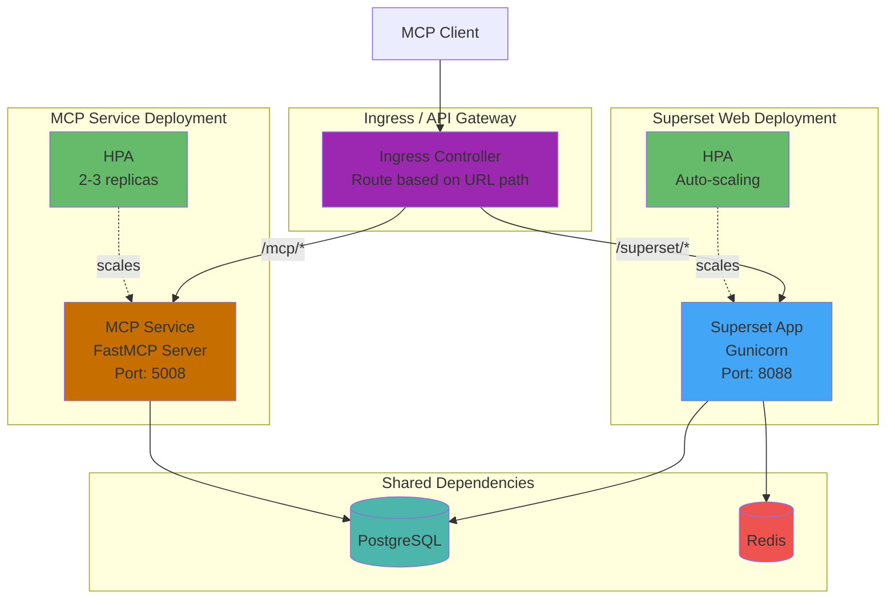
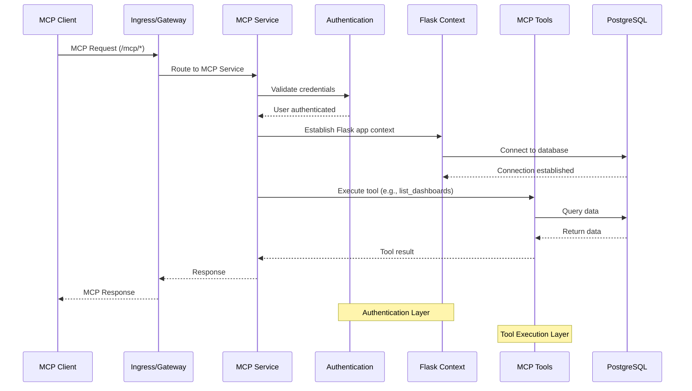

<!--
Licensed to the Apache Software Foundation (ASF) under one
or more contributor license agreements.  See the NOTICE file
distributed with this work for additional information
regarding copyright ownership.  The ASF licenses this file
to you under the Apache License, Version 2.0 (the
"License"); you may not use this file except in compliance
with the License.  You may obtain a copy of the License at

  http://www.apache.org/licenses/LICENSE-2.0

Unless required by applicable law or agreed to in writing,
software distributed under the License is distributed on an
"AS IS" BASIS, WITHOUT WARRANTIES OR CONDITIONS OF ANY
KIND, either express or implied.  See the License for the
specific language governing permissions and limitations
under the License.
-->

# Superset MCP Service

> **What is this?** The MCP service allows an AI Agent to directly interact with Apache Superset, enabling natural language queries and commands for data visualization.

> **How does it work?** This service is part of the Apache Superset codebase. You need to:
> 1. Have Apache Superset installed and running
> 2. Connect an agent such as Claude Desktop to your Superset instance using this MCP service
> 3. Then Claude can create charts, query data, and manage dashboards

The Superset Model Context Protocol (MCP) service provides a modular, schema-driven interface for programmatic access to Superset dashboards, charts, datasets, and instance metadata. It is designed for LLM agents and automation tools, and is built on the FastMCP protocol.

## 🚀 Quickstart

### Option 1: Docker Setup (Recommended) 🎯

The fastest way to get everything running with Docker:

**Prerequisites:** Docker and Docker Compose installed

```bash
# 1. Clone the repository
git clone https://github.com/apache/superset.git
cd superset

# 2. Start Superset and MCP service with docker-compose-light
docker-compose -f docker-compose-light.yml --profile mcp build
docker-compose -f docker-compose-light.yml --profile mcp up -d

# 3. Initialize Superset (first time only)
docker exec -it superset-superset-light-1 superset fab create-admin \
  --username admin \
  --firstname Admin \
  --lastname Admin \
  --email admin@localhost \
  --password admin

docker exec -it superset-superset-light-1 superset db upgrade
docker exec -it superset-superset-light-1 superset init
```

**That's it!** ✨
- Superset frontend is running at http://localhost:9001 (login: admin/admin)
- MCP service is running on port 5008
- Now configure Claude Desktop (see Step 2 below)

#### What Docker Compose does:
- Sets up PostgreSQL database
- Builds and runs Superset containers
- Starts the MCP service (with `--profile mcp`)
- Handles all networking and dependencies
- Provides hot-reload for development

#### Customizing ports:
```bash
# Use different ports if defaults are in use
NODE_PORT=9002 MCP_PORT=5009 docker-compose -f docker-compose-light.yml --profile mcp up -d
```

### Option 2: Manual Setup

If Docker is not available, you can set up manually:

```bash
# 1. Clone the repository
git clone https://github.com/apache/superset.git
cd superset

# 2. Set up Python environment (Python 3.10 or 3.11 required)
python3 -m venv venv
source venv/bin/activate

# 3. Install dependencies
pip install -e .[development,fastmcp]
cd superset-frontend && npm ci && npm run build && cd ..

# 4. Configure Superset manually
# Create superset_config.py in your current directory:
cat > superset_config.py << 'EOF'
# Apache Superset Configuration
SECRET_KEY = '<your secret here - hint: `secrets.token_urlsafe(42)`>'

# Session configuration for local development
SESSION_COOKIE_HTTPONLY = True
SESSION_COOKIE_SECURE = False
SESSION_COOKIE_SAMESITE = 'Lax'
SESSION_COOKIE_NAME = 'superset_session'
PERMANENT_SESSION_LIFETIME = 86400

# CSRF Protection (disable if login loop occurs)
WTF_CSRF_ENABLED = True
WTF_CSRF_TIME_LIMIT = None

# MCP Service Configuration
# REQUIRED: Set this to your actual Superset username
# The service will fail if not configured
MCP_DEV_USERNAME = 'admin'
SUPERSET_WEBSERVER_ADDRESS = 'http://localhost:9001'

# WebDriver Configuration for screenshots
WEBDRIVER_BASEURL = 'http://localhost:9001/'
WEBDRIVER_BASEURL_USER_FRIENDLY = WEBDRIVER_BASEURL

EOF

# 5. Initialize database
export FLASK_APP=superset
superset db upgrade
superset init

# 6. Create admin user
superset fab create-admin \
  --username admin \
  --firstname Admin \
  --lastname Admin \
  --email admin@localhost \
  --password admin

# 7. Start Superset (in one terminal)
superset run -p 9001 --with-threads --reload --debugger

# 8. Start frontend (in another terminal)
cd superset-frontend && npm run dev

# 9. Start MCP service (in another terminal, only if you want MCP features)
source venv/bin/activate
superset mcp run --port 5008 --debug
```

Access Superset at http://localhost:9001 (login: admin/admin)

## 🔌 Step 2: Connect Claude Desktop

### For Docker Setup

Since the MCP service runs inside Docker on port 5008, you need to connect Claude Desktop to the HTTP endpoint:

Add this to your Claude Desktop config file:

**macOS**: `~/Library/Application Support/Claude/claude_desktop_config.json`

Since claude desktop doesnt like non https mcp servers you can use this proxy:
```json
{
  "mcpServers": {
    "Superset MCP Proxy": {
      "command": "/<superset folder>/superset/mcp_service/run_proxy.sh",
      "args": [],
      "env": {}
    }
  }
}
```

### For Local Setup (Make/Manual)

If running MCP locally (not in Docker), use the direct connection:

```json
{
  "mcpServers": {
    "superset": {
      "command": "npx",
      "args": ["/path/to/your/superset/superset/mcp_service"],
      "env": {
        "PYTHONPATH": "/path/to/your/superset"
      }
    }
  }
}
```

Then restart Claude Desktop. That's it! ✨


### Alternative Connection Methods

<details>
<summary>Direct STDIO with npx</summary>

```json
{
  "mcpServers": {
    "superset": {
      "command": "npx",
      "args": ["/absolute/path/to/your/superset/superset/mcp_service", "--stdio"],
      "env": {
        "PYTHONPATH": "/absolute/path/to/your/superset",
        "MCP_DEV_USERNAME": "admin"
      }
    }
  }
}
```
Note: Replace "admin" with your actual Superset username. These environment variables override the values in superset_config.py.
</details>

<details>
<summary>Direct STDIO with Python</summary>

```json
{
  "mcpServers": {
    "superset": {
      "command": "/absolute/path/to/your/superset/venv/bin/python",
      "args": ["-m", "superset.mcp_service"],
      "env": {
        "PYTHONPATH": "/absolute/path/to/your/superset"
      }
    }
  }
}
```
</details>

### 📍 Claude Desktop Config Location

- **macOS**: `~/Library/Application Support/Claude/claude_desktop_config.json`

---

## ☸️ Kubernetes Deployment

This section covers deploying the MCP service on Kubernetes for production environments. The MCP service runs as a separate deployment alongside Superset, connected via an API gateway or ingress controller.

### Architecture Overview



### Request Flow



### Prerequisites

- Kubernetes cluster (1.19+)
- Helm 3.x installed
- kubectl configured with cluster access
- PostgreSQL database (can use the bundled chart or external)
- Redis (optional, for caching and Celery)

### Option 1: Using the Official Superset Helm Chart

The simplest approach is to extend the existing Superset Helm chart to include the MCP service as a sidecar or separate deployment.

#### Step 1: Add the Superset Helm Repository

```bash
helm repo add superset http://apache.github.io/superset/
helm repo update
```

#### Step 2: Create a Custom Values File

Create `mcp-values.yaml` with MCP-specific configuration:

```yaml
# mcp-values.yaml
# Extend the Superset Helm chart to include MCP service

# Image configuration - ensure fastmcp extra is installed
image:
  repository: apache/superset
  tag: latest
  pullPolicy: IfNotPresent

# MCP Service configuration via extraContainers
supersetNode:
  extraContainers:
    - name: mcp-service
      image: "apache/superset:latest"
      imagePullPolicy: IfNotPresent
      command:
        - "/bin/sh"
        - "-c"
        - |
          pip install fastmcp && \
          superset mcp run --host 0.0.0.0 --port 5008
      ports:
        - name: mcp
          containerPort: 5008
          protocol: TCP
      env:
        - name: FLASK_APP
          value: superset
        - name: PYTHONPATH
          value: /app/pythonpath
        # MCP-specific environment variables
        - name: MCP_DEV_USERNAME
          value: "admin"  # Override with your admin username
      envFrom:
        - secretRef:
            name: '{{ template "superset.fullname" . }}-env'
      volumeMounts:
        - name: superset-config
          mountPath: /app/pythonpath
          readOnly: true
      resources:
        requests:
          cpu: 100m
          memory: 256Mi
        limits:
          cpu: 500m
          memory: 512Mi
      livenessProbe:
        httpGet:
          path: /health
          port: 5008
        initialDelaySeconds: 30
        periodSeconds: 15
      readinessProbe:
        httpGet:
          path: /health
          port: 5008
        initialDelaySeconds: 15
        periodSeconds: 10

# Superset configuration overrides for MCP
configOverrides:
  mcp_config: |
    # MCP Service Configuration
    MCP_DEV_USERNAME = 'admin'
    SUPERSET_WEBSERVER_ADDRESS = 'http://localhost:8088'

    # WebDriver for screenshots (adjust based on your setup)
    WEBDRIVER_BASEURL = 'http://localhost:8088/'
    WEBDRIVER_BASEURL_USER_FRIENDLY = WEBDRIVER_BASEURL

# Secret configuration
extraSecretEnv:
  SUPERSET_SECRET_KEY: 'your-secret-key-here'  # Use a strong secret!

# Database configuration (using bundled PostgreSQL)
postgresql:
  enabled: true
  auth:
    username: superset
    password: superset
    database: superset

# Redis configuration
redis:
  enabled: true
  architecture: standalone
```

#### Step 3: Deploy with Helm

```bash
# Create namespace
kubectl create namespace superset

# Install the chart
helm install superset superset/superset \
  --namespace superset \
  --values mcp-values.yaml \
  --wait

# Verify deployment
kubectl get pods -n superset
kubectl get svc -n superset
```

### Option 2: Dedicated MCP Service Deployment

For production environments requiring independent scaling and isolation, deploy the MCP service as a separate Kubernetes deployment.

#### Step 1: Create MCP Deployment Manifest

Create `mcp-deployment.yaml`:

```yaml
# mcp-deployment.yaml
apiVersion: apps/v1
kind: Deployment
metadata:
  name: superset-mcp
  namespace: superset
  labels:
    app: superset-mcp
    component: mcp-service
spec:
  replicas: 2
  selector:
    matchLabels:
      app: superset-mcp
  template:
    metadata:
      labels:
        app: superset-mcp
        component: mcp-service
    spec:
      containers:
        - name: mcp-service
          image: apache/superset:latest
          imagePullPolicy: IfNotPresent
          command:
            - "/bin/sh"
            - "-c"
            - |
              pip install fastmcp && \
              superset mcp run --host 0.0.0.0 --port 5008
          ports:
            - name: mcp
              containerPort: 5008
              protocol: TCP
          env:
            - name: FLASK_APP
              value: superset
            - name: PYTHONPATH
              value: /app/pythonpath
            - name: MCP_DEV_USERNAME
              value: "admin"
            # Database connection (must match Superset's config)
            - name: DATABASE_URI
              valueFrom:
                secretKeyRef:
                  name: superset-env
                  key: DATABASE_URI
          envFrom:
            - secretRef:
                name: superset-env
          volumeMounts:
            - name: superset-config
              mountPath: /app/pythonpath
              readOnly: true
          resources:
            requests:
              cpu: 200m
              memory: 512Mi
            limits:
              cpu: 1000m
              memory: 1Gi
          livenessProbe:
            httpGet:
              path: /health
              port: 5008
            initialDelaySeconds: 30
            timeoutSeconds: 5
            failureThreshold: 3
            periodSeconds: 15
          readinessProbe:
            httpGet:
              path: /health
              port: 5008
            initialDelaySeconds: 15
            timeoutSeconds: 5
            failureThreshold: 3
            periodSeconds: 10
          startupProbe:
            httpGet:
              path: /health
              port: 5008
            initialDelaySeconds: 10
            timeoutSeconds: 5
            failureThreshold: 30
            periodSeconds: 5
      volumes:
        - name: superset-config
          secret:
            secretName: superset-config
---
apiVersion: v1
kind: Service
metadata:
  name: superset-mcp
  namespace: superset
  labels:
    app: superset-mcp
spec:
  type: ClusterIP
  ports:
    - port: 5008
      targetPort: 5008
      protocol: TCP
      name: mcp
  selector:
    app: superset-mcp
---
apiVersion: autoscaling/v2
kind: HorizontalPodAutoscaler
metadata:
  name: superset-mcp-hpa
  namespace: superset
spec:
  scaleTargetRef:
    apiVersion: apps/v1
    kind: Deployment
    name: superset-mcp
  minReplicas: 2
  maxReplicas: 5
  metrics:
    - type: Resource
      resource:
        name: cpu
        target:
          type: Utilization
          averageUtilization: 70
    - type: Resource
      resource:
        name: memory
        target:
          type: Utilization
          averageUtilization: 80
---
apiVersion: policy/v1
kind: PodDisruptionBudget
metadata:
  name: superset-mcp-pdb
  namespace: superset
spec:
  minAvailable: 1
  selector:
    matchLabels:
      app: superset-mcp
```

#### Step 2: Create Ingress for Routing

Create `mcp-ingress.yaml` to route `/mcp/*` requests to the MCP service:

```yaml
# mcp-ingress.yaml
apiVersion: networking.k8s.io/v1
kind: Ingress
metadata:
  name: superset-ingress
  namespace: superset
  annotations:
    nginx.ingress.kubernetes.io/proxy-connect-timeout: "300"
    nginx.ingress.kubernetes.io/proxy-read-timeout: "300"
    nginx.ingress.kubernetes.io/proxy-send-timeout: "300"
    # Enable WebSocket support for MCP
    nginx.ingress.kubernetes.io/proxy-http-version: "1.1"
    nginx.ingress.kubernetes.io/proxy-set-header-upgrade: "$http_upgrade"
    nginx.ingress.kubernetes.io/proxy-set-header-connection: "upgrade"
spec:
  ingressClassName: nginx
  rules:
    - host: superset.example.com
      http:
        paths:
          # Route MCP requests to MCP service
          - path: /mcp
            pathType: Prefix
            backend:
              service:
                name: superset-mcp
                port:
                  number: 5008
          # Route all other requests to Superset
          - path: /
            pathType: Prefix
            backend:
              service:
                name: superset
                port:
                  number: 8088
  tls:
    - hosts:
        - superset.example.com
      secretName: superset-tls
```

#### Step 3: Apply the Manifests

```bash
# Apply the deployment
kubectl apply -f mcp-deployment.yaml

# Apply the ingress
kubectl apply -f mcp-ingress.yaml

# Verify
kubectl get pods -n superset -l app=superset-mcp
kubectl get svc -n superset
kubectl get ingress -n superset
```

### Configuration Reference

#### Environment Variables

| Variable | Description | Default |
|----------|-------------|---------|
| `MCP_DEV_USERNAME` | Superset username for MCP authentication | `admin` |
| `MCP_AUTH_ENABLED` | Enable/disable authentication | `true` |
| `MCP_JWT_PUBLIC_KEY` | JWT public key for token validation | - |
| `SUPERSET_WEBSERVER_ADDRESS` | Internal Superset URL | `http://localhost:8088` |
| `WEBDRIVER_BASEURL` | URL for screenshot generation | Same as webserver |

#### superset_config.py Options

```python
# MCP Service Configuration
MCP_DEV_USERNAME = 'admin'                    # Username for development/testing
MCP_AUTH_ENABLED = True                       # Enable authentication
MCP_JWT_PUBLIC_KEY = 'your-public-key'        # For JWT token validation

# For production with JWT authentication
MCP_AUTH_FACTORY = 'your.custom.auth_factory'
MCP_USER_RESOLVER = 'your.custom.user_resolver'

# WebDriver for chart screenshots
WEBDRIVER_BASEURL = 'http://superset:8088/'
WEBDRIVER_TYPE = 'chrome'
WEBDRIVER_OPTION_ARGS = ['--headless', '--no-sandbox']
```

### Production Considerations

#### Security

1. **Authentication**: Configure proper JWT authentication for production:
   ```python
   # superset_config.py
   MCP_AUTH_ENABLED = True
   MCP_JWT_PUBLIC_KEY = """-----BEGIN PUBLIC KEY-----
   Your RSA public key here
   -----END PUBLIC KEY-----"""
   ```

2. **Network Policies**: Restrict MCP service network access:
   ```yaml
   apiVersion: networking.k8s.io/v1
   kind: NetworkPolicy
   metadata:
     name: mcp-network-policy
     namespace: superset
   spec:
     podSelector:
       matchLabels:
         app: superset-mcp
     policyTypes:
       - Ingress
       - Egress
     ingress:
       - from:
           - namespaceSelector:
               matchLabels:
                 name: ingress-nginx
         ports:
           - protocol: TCP
             port: 5008
     egress:
       - to:
           - podSelector:
               matchLabels:
                 app: postgresql
         ports:
           - protocol: TCP
             port: 5432
   ```

3. **TLS**: Always use TLS in production via ingress or service mesh.

#### Resource Allocation

Recommended resources for production:

```yaml
resources:
  requests:
    cpu: 500m
    memory: 1Gi
  limits:
    cpu: 2000m
    memory: 2Gi
```

#### Monitoring

Add Prometheus annotations for metrics scraping:

```yaml
metadata:
  annotations:
    prometheus.io/scrape: "true"
    prometheus.io/port: "5008"
    prometheus.io/path: "/metrics"
```

### Troubleshooting

#### Check MCP Service Logs

```bash
kubectl logs -n superset -l app=superset-mcp -f
```

#### Verify Service Connectivity

```bash
# Port-forward to test locally
kubectl port-forward -n superset svc/superset-mcp 5008:5008

# Test health endpoint
curl http://localhost:5008/health
```

#### Common Issues

1. **Database Connection Errors**: Ensure the MCP service has the same database credentials as Superset
2. **Authentication Failures**: Verify `MCP_DEV_USERNAME` matches an existing Superset user
3. **Screenshot Generation Fails**: Check WebDriver configuration and ensure Chrome/Firefox is available in the container
