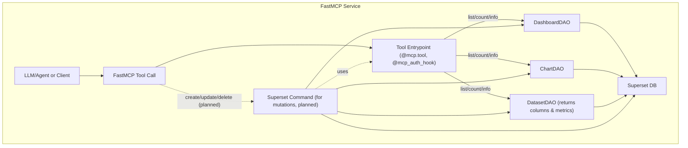

# Superset MCP Service Architecture

The Superset Model Context Protocol (MCP) service provides a modular, schema-driven interface for programmatic access to Superset dashboards, charts, datasets, and instance metadata. It is designed for LLM agents and automation tools, and is built on the FastMCP protocol.

**Status:** Phase 1 nearing completion (85% done). Core functionality stable, authentication production-ready. See [SIP-171](https://github.com/apache/superset/issues/33870) for the roadmap.

---

## Overview

- **All tools are Python functions decorated with `@mcp.tool` and `@mcp_auth_hook`.**
- **All Superset DAOs, command classes, and most Superset modules must be imported inside the function body, not at the top of the file.** This ensures proper app context and avoids initialization errors.
- Tools are grouped by domain: `dashboard/`, `dataset/`, `chart/`, `system/`.
- Shared abstractions live in `model_tools.py` (for list/info/filter tools) and `middleware.py` (for logging, RBAC, etc).
- All input/output is validated with Pydantic v2 models, with field descriptions for LLM/OpenAPI compatibility.

---

## Tool Registration and Structure

- The global FastMCP instance (`mcp`) is defined in `mcp_app.py`.
- Tool modules must import `mcp` and decorate each tool function with `@mcp.tool` (for registration) and `@mcp_auth_hook` (for user context, RBAC, and logging).
- All tool modules are imported in `mcp_app.py` to ensure registration.
- Example tool function:
  ```python
  @mcp.tool
  @mcp_auth_hook
  def list_dashboards(...):
      from superset.daos.dashboard import DashboardDAO
      ...
  ```

---

## Enhanced Parameter Handling

All MCP tools now use the **FastMCP Complex Inputs Pattern** to eliminate LLM parameter validation issues:

### Request Schema Pattern
Instead of individual parameters, tools use structured request objects with clear, unambiguous types:
```python
# New approach (current)
get_dataset_info(request={"identifier": 123})  # ID
get_dataset_info(request={"identifier": "a1b2c3d4-e5f6-7890-abcd-ef1234567890"})  # UUID

# Old approach (replaced)
get_dataset_info(dataset_id=123)
```

### Multi-Identifier Support
All `get_*_info` tools now support multiple identifier types:
- **Datasets/Charts**: ID (numeric) or UUID (string)
- **Dashboards**: ID (numeric), UUID (string), or slug (string)

### Validation Logic
All `list_*` tools include validation to prevent conflicting parameters:
- Cannot use both `search` and `filters` simultaneously
- Clear error messages guide LLMs to use either text search OR structured filters

---

## Tool Abstractions

- **ModelListTool**: Generic class for list/search/filter tools (dashboards, charts, datasets). Handles pagination, column selection, and serialization. Now serializes columns and metrics for datasets. Uses FastMCP Complex Inputs Pattern with request schemas.
- **ModelGetInfoTool**: Enhanced class for retrieving a single object by multiple identifier types (ID, UUID, slug). Supports intelligent identifier detection and lookup.
- **ModelGetAvailableFiltersTool**: Generic class for returning available filterable columns/operators for a DAO.

---

## Middleware

- **LoggingMiddleware**: Logs every tool call to Superset's event logger, including user, agent, and resource IDs.
- **PrivateToolMiddleware**: Blocks access to tools tagged as "private".

---

## Authentication, RBAC, and User Context

The MCP service supports **configurable production-ready authentication** with JWT Bearer tokens:

### Authentication Features
- **JWT Bearer Authentication**: RS256 tokens validated against JWKS or public key
- **Configurable Factory Pattern**: Follows Superset's configuration patterns per @dpgaspar's design
- **User Context**: JWT claims mapped to Superset users with proper Flask `g.user` context
- **Scope-Based Authorization**: Tool-level permissions based on JWT scopes
- **Flexible User Resolution**: Configurable JWT claim extraction (subject, client_id, email, username)
- **Audit Logging**: All operations logged with JWT user context
- **Development Mode**: Authentication disabled by default for local development

### Configuration
```python
# Enable authentication in superset_config.py
MCP_AUTH_ENABLED = True
MCP_JWKS_URI = "https://auth.company.com/.well-known/jwks.json"
MCP_JWT_ISSUER = "https://auth.company.com/"
MCP_JWT_AUDIENCE = "superset-mcp-api"
```

### Tool Authorization
| Tool | Required Scope |
|------|----------------|
| `list_dashboards`, `get_dashboard_info` | `dashboard:read` |
| `list_charts`, `get_chart_info` | `chart:read` |
| `create_chart` | `chart:write` |
| `list_datasets`, `get_dataset_info` | `dataset:read` |
| `get_superset_instance_info` | `instance:read` |

The `@mcp_auth_hook` decorator handles user extraction, scope validation, impersonation support, and audit logging.

---

## How to Add a New Tool

1. **Choose the Right Domain**
   - Place your tool in the appropriate subfolder: `dashboard/`, `dataset/`, `chart/`, or `system/`.
2. **Define Schemas**
   - Use Pydantic models for all input and output. Add `description` to every field.
   - Make info schemas have all optional fields to handle missing data gracefully.
   - Design schemas to exclude null values that weren't in the select statement.
   - Place shared schemas in `pydantic_schemas/`.
3. **Implement the Tool**
   - Decorate with `@mcp.tool` and `@mcp_auth_hook`.
   - **Import all Superset DAOs, command classes, and most Superset modules inside the function body.**
   - Use `ModelListTool`, `ModelGetInfoTool`, or `ModelGetAvailableFiltersTool` as appropriate.
   - Follow the style and conventions of existing tools.
4. **Register the Tool**
   - Add your tool to the appropriate `__init__.py` in the tool directory.
5. **Test**
   - Add unit tests in `tests/unit_tests/mcp_service/`.
   - Add integration tests in `tests/integration_tests/mcp_service/` if needed.

> **Tip:** See existing tools for examples of correct decorator usage and import placement.

## Configuration Best Practices

### URL Generation
Configure host prefix for proper chart and explore URL generation:
```python
# In superset_config.py
SUPERSET_HOST_PREFIX = "http://localhost:8088"  # Development
SUPERSET_HOST_PREFIX = "https://superset.company.com"  # Production
```

### Schema Optimization
- **Minimal Columns**: List tools show only essential columns by default
- **Optional Fields**: Info schemas use `Optional[]` for all fields to handle missing data
- **Null Handling**: Schemas exclude keys for null values not in original select statement
- **Type Safety**: Prevent LLMs from passing incorrect types with clear Pydantic validation

---

## Security and Permissions

The MCP service provides enterprise-grade security features:

### Authentication Security
- **JWT Validation**: RS256 signature verification with JWKS or public key
- **Token Expiration**: Standard JWT exp claim validation
- **Audience Validation**: Prevents token reuse across services
- **Issuer Validation**: Ensures tokens from trusted identity providers

### Authorization & Access Control
- **Scope-Based Permissions**: Fine-grained access control per tool
- **User Impersonation**: Support for `run_as` parameter with proper auditing
- **Fallback Admin**: Graceful degradation to admin users when JWT user not found
- **Active User Validation**: Inactive users automatically denied access

### Audit & Monitoring
- **Comprehensive Logging**: All tool calls logged with user context
- **JWT Context**: Access logs include JWT user, scopes, and token metadata
- **Error Tracking**: Authentication failures logged with debug information
- **Permission Denials**: Clear audit trail for access control decisions

All security features are implemented in `auth.py` with 149 passing unit tests ensuring robust operation.

---

## Data Flow

- Chart creation tools now support chart types including line, bar, area, scatter, and table charts with  SQL aggregator support.
- The `create_chart` tool intelligently handles both simple metrics (like `["count"]`) and complex SQL aggregations (like `SUM`, `COUNT`, `AVG`, `MIN`, `MAX`).



---

## Tool/DAO Mapping

| Tools | DAO | Features |
|-------|-----|----------|
| `list_dashboards`, `get_dashboard_info`, `get_dashboard_available_filters` | DashboardDAO | ID/UUID/slug lookup, UUID/slug search |
| `list_datasets`, `get_dataset_info`, `get_dataset_available_filters` | DatasetDAO | ID/UUID lookup, columns & metrics, UUID search |
| `list_charts`, `get_chart_info`, `get_chart_available_filters`, `create_chart` | ChartDAO | ID/UUID lookup, chart creation, UUID search |
| `get_superset_instance_info` | System | Instance metadata |
| `generate_explore_link` | Chart | Temporary chart exploration |

---

## Filtering & Search

- All list tools support advanced (object-based) and simple (field=value) filters, as well as free-text search.
- **Enhanced Search**: UUID and slug fields are included in search columns for better discoverability
- **Validation**: Tools prevent using both `search` and `filters` simultaneously to avoid query conflicts
- **Request Schemas**: All filtering uses structured request objects with clear validation rules
- Use the available filters tool for each domain to discover supported fields and operators.

---

## Test Coverage

- All dataset tools now have unit tests verifying columns and metrics are included in responses.
- Chart creation tools have comprehensive tests covering all supported chart types and SQL aggregators.
- **Multi-identifier Testing**: All get_*_info tools have tests for ID, UUID, and slug (where applicable) lookup
- **Request Schema Testing**: All list tools tested with new request schema pattern
- **Validation Testing**: Tests verify that search+filters conflicts are properly prevented
- Improved test mocks and LLM/OpenAPI compatibility for all dataset-related tools.

---

## Current Status & Roadmap

### ✅ Completed (Phase 1 Core)
- **Service Infrastructure**: FastMCP server, CLI, configuration
- **Production Authentication**: JWT Bearer with configurable factory pattern
- **All List/Info Tools**: Dashboards, datasets, charts with multi-identifier support
- **Chart Creation**: `create_chart` with line, bar, area, scatter, table support
- **Navigation Tools**: `generate_explore_link` for explore URLs
- **System Tools**: Instance info and available filters
- **Request Schema Pattern**: Eliminates LLM parameter validation issues
- **Comprehensive Testing**: 149 unit tests, full pre-commit compliance

### 🟡 In Progress (Phase 1 Completion)
- **Backend Chart Rendering**: Screenshot URLs for LLM chat integration
- **SQL Lab Integration**: `open_sql_lab_with_context` for pre-loaded queries
- **Enhanced Bearer Auth**: Additional JWT authentication features

### 🎯 Phase 1 Stretch Goals
- **Demo Script/Notebook**: Interactive bot capabilities showcase
- **OAuth Integration**: User impersonation with secure authentication flows
- **LLM-Friendly Rendering**: Vega-Lite/Plotly JSON for chat embedding

**Phase 1 Progress**: 85% complete, on track for end of July 2025

### Integration Examples
- **Claude Agent SDK**: Create cloud agents connecting to MCP service
- **LangChain Integration**: Use `langchain-mcp` toolkit for chatbot connections
- **End-to-End Testing**: Synthetic environments with example database for comprehensive testing
- **Video Demonstrations**: Complete tool workflows for community engagement

---

For more, see the main [README](./README.md) and [SIP-171](https://github.com/apache/superset/issues/33870).
