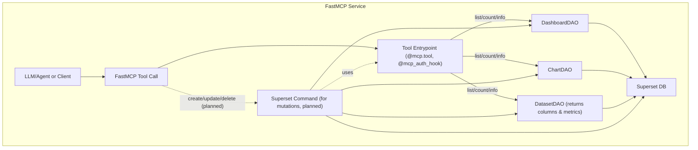

# Superset MCP Service Architecture

The Superset Model Context Protocol (MCP) service provides a modular, schema-driven interface for programmatic access to Superset dashboards, charts, datasets, and instance metadata. It is designed for LLM agents and automation tools, and is built on the FastMCP protocol.

**Status:** Under active development. Expect breaking changes and evolving APIs. See [SIP-171](https://github.com/apache/superset/issues/33870) for the roadmap.

---

## Overview

- **All tools are Python functions decorated with `@mcp.tool` and `@mcp_auth_hook`.**
- **All Superset DAOs, command classes, and most Superset modules must be imported inside the function body, not at the top of the file.** This ensures proper app context and avoids initialization errors.
- Tools are grouped by domain: `dashboard/`, `dataset/`, `chart/`, `system/`.
- Shared abstractions live in `model_tools.py` (for list/info/filter tools) and `middleware.py` (for logging, RBAC, etc).
- All input/output is validated with Pydantic v2 models, with field descriptions for LLM/OpenAPI compatibility.

---

## Tool Registration and Structure

- The global FastMCP instance (`mcp`) is defined in `mcp_app.py`.
- Tool modules must import `mcp` and decorate each tool function with `@mcp.tool` (for registration) and `@mcp_auth_hook` (for user context, RBAC, and logging).
- All tool modules are imported in `mcp_app.py` to ensure registration.
- Example tool function:
  ```python
  @mcp.tool
  @mcp_auth_hook
  def list_dashboards(...):
      from superset.daos.dashboard import DashboardDAO
      ...
  ```

---

## Tool Abstractions

- **ModelListTool**: Generic class for list/search/filter tools (dashboards, charts, datasets). Handles pagination, column selection, and serialization. Now serializes columns and metrics for datasets.
- **ModelGetInfoTool**: Generic class for retrieving a single object by ID, with error handling.
- **ModelGetAvailableFiltersTool**: Generic class for returning available filterable columns/operators for a DAO.

---

## Middleware

- **LoggingMiddleware**: Logs every tool call to Superset's event logger, including user, agent, and resource IDs.
- **PrivateToolMiddleware**: Blocks access to tools tagged as "private".

---

## Authentication, RBAC, and User Context

- The `@mcp_auth_hook` decorator sets up Flask user context (`g.user`), supports impersonation, and enforces RBAC (overridable).
- By default, all access is allowed (admin mode). Override `has_permission` and related hooks in `auth.py` for enterprise RBAC.

---

## How to Add a New Tool

1. **Choose the Right Domain**
   - Place your tool in the appropriate subfolder: `dashboard/`, `dataset/`, `chart/`, or `system/`.
2. **Define Schemas**
   - Use Pydantic models for all input and output. Add `description` to every field.
   - Place shared schemas in `pydantic_schemas/`.
3. **Implement the Tool**
   - Decorate with `@mcp.tool` and `@mcp_auth_hook`.
   - **Import all Superset DAOs, command classes, and most Superset modules inside the function body.**
   - Use `ModelListTool`, `ModelGetInfoTool`, or `ModelGetAvailableFiltersTool` as appropriate.
   - Follow the style and conventions of existing tools.
4. **Register the Tool**
   - Add your tool to the appropriate `__init__.py` in the tool directory.
5. **Test**
   - Add unit tests in `tests/unit_tests/mcp_service/`.
   - Add integration tests in `tests/integration_tests/mcp_service/` if needed.

> **Tip:** See existing tools for examples of correct decorator usage and import placement.

---

## Security and Permissions

- All authentication, impersonation, RBAC, and access logging is handled by `@mcp_auth_hook` and middleware.
- Hooks for RBAC and logging are overridable in `auth.py` and `middleware.py`.

---

## Data Flow



---

## Tool/DAO Mapping

- `list_dashboards`, `get_dashboard_info`, `get_dashboard_available_filters`: DashboardDAO
- `list_datasets`, `get_dataset_info`, `get_dataset_available_filters`: DatasetDAO (now returns columns and metrics for each dataset)
- `list_charts`, `get_chart_info`, `get_chart_available_filters`, `create_chart_simple`: ChartDAO
- `get_superset_instance_info`: System metadata

---

## Filtering & Search

- All list tools support advanced (object-based) and simple (field=value) filters, as well as free-text search.
- Use the available filters tool for each domain to discover supported fields and operators.

---

## Test Coverage

- All dataset tools now have unit tests verifying columns and metrics are included in responses.
- Improved test mocks and LLM/OpenAPI compatibility for all dataset-related tools.

---

## Roadmap

- All list/info tools for dashboards, datasets, and charts are implemented.
- Chart creation (`create_chart_simple`) is available.
- System info and available filters are implemented.
- Mutations (create/update/delete) and navigation tools are planned.
- Full unit and integration test coverage.
- Protocol-level tests for agent compatibility.

---

For more, see the main [README](./README.md) and [SIP-171](https://github.com/apache/superset/issues/33870).
