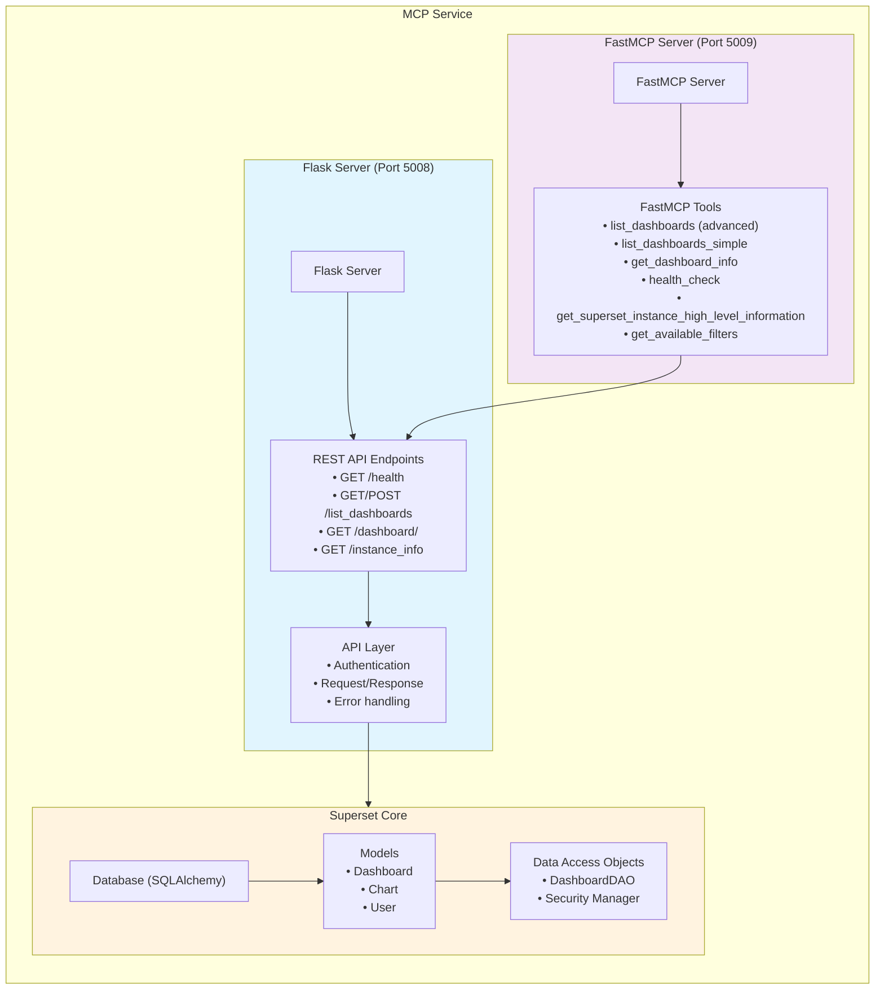

# MCP Service Architecture

The Superset MCP (Model Context Protocol) service provides programmatic access to Superset dashboards through both REST API and FastMCP interfaces.

## Architecture Overview

## Components

### 1. Flask Server (`server.py`)
- **Purpose**: Main HTTP server providing REST API endpoints
- **Port**: 5008 (configurable)
- **Features**:
  - Flask application with Superset integration
  - Database connection management
  - Authentication middleware
  - Automatic FastMCP server startup

### 2. FastMCP Server (`fastmcp_server.py`)
- **Purpose**: Model Context Protocol server for AI tool integration
- **Port**: 5009 (server port + 1)
- **Features**:
  - 6 FastMCP tools for dashboard operations
  - Direct HTTP calls to REST API endpoints
  - JSON parsing and error handling
  - Authentication via API headers

### 3. REST API (`api/v1/endpoints.py`)
- **Purpose**: HTTP endpoints for dashboard operations
- **Endpoints**:
  - `GET /health` - Service health check
  - `GET /list_dashboards` - Simple filtering with query parameters
  - `POST /list_dashboards` - Advanced filtering with JSON payload
  - `GET /dashboard/<id>` - Get specific dashboard details
  - `GET /instance_info` - Get Superset instance information

### 4. Data Schemas (`schemas.py`)
- **Purpose**: Request/response validation and serialization
- **Features**:
  - Pydantic models for API contracts
  - Filter validation and parsing
  - Response formatting
  - Column selection handling

### 5. Proxy Scripts
- **`run_proxy.sh`**: Shell script for local proxy setup for Claude Desktop
- **`simple_proxy.py`**: Python proxy for background operation
- **Purpose**: Enable Claude Desktop integration for free users (not part of core architecture)

## Data Flow

### REST API Flow
1. **Client Request** → Flask Server (REST API)
2. **Authentication** → API key validation
3. **Request Processing** → Parameter parsing and validation
4. **Database Query** → Superset models and DAOs
5. **Response Formatting** → Schema validation and serialization
6. **Client Response** → JSON format

### FastMCP Flow
1. **Client Request** → FastMCP Server
2. **Tool Execution** → FastMCP tool processes request
3. **HTTP Call** → Internal HTTP request to REST API
4. **REST Processing** → Same as REST API flow (steps 2-5)
5. **Client Response** → FastMCP format

## Key Features

- **Dual Interface**: REST API + FastMCP for maximum compatibility
- **Flexible Filtering**: Simple query params + advanced JSON filters
- **Column Selection**: Dynamic column loading based on requests
- **Authentication**: API key-based security
- **Standalone Operation**: Independent of main Superset web server
- **FastMCP Tools**: 6 tools covering all dashboard operations
- **Error Handling**: Comprehensive error handling and logging

## Configuration

- **API Key**: `MCP_API_KEY` environment variable
- **Ports**: Configurable via CLI arguments
- **Debug Mode**: SQL and application logging
- **Database**: Uses Superset's existing database connection 
