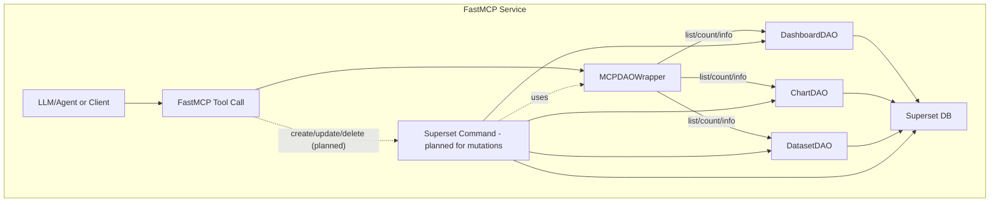
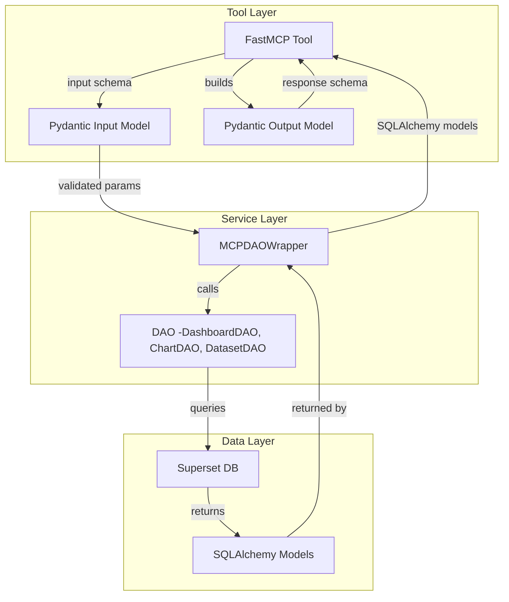

# Superset MCP Service Architecture

**⚠️ The Superset MCP service is under active development and not yet complete. Functionality, APIs, and tool coverage are evolving rapidly. See [SIP-171](https://github.com/apache/superset/issues/33870) for the roadmap and proposal.**

The Superset MCP service exposes high-level tools for dashboards, charts, and datasets via the FastMCP protocol. All read/list/count operations use Superset DAOs, wrapped by `MCPDAOWrapper` to enforce security and user context. Mutations (create/update/delete) will use Superset command objects in future versions.

## Flow Overview

## Modular Tool Structure

All tools are organized by domain for clarity and maintainability:

- `superset/mcp_service/tools/dashboard/`
- `superset/mcp_service/tools/dataset/`
- `superset/mcp_service/tools/chart/`
- `superset/mcp_service/tools/system/`

Each tool is a standalone Python module. Shared utilities live in `tools/base.py`.

## Pydantic Model/Data Flow

- **Pydantic Input Model**: Defines and validates tool input parameters.
- **MCPDAOWrapper**: Calls the DAO and returns SQLAlchemy models.
- **FastMCP Tool**: Converts SQLAlchemy models to the Pydantic output model for the response.
- **Pydantic Output Model**: Defines the structured response returned by each tool.
- All tool contracts are strongly typed, ensuring robust agent and client integration for dashboards, charts, and datasets.

## How to Add a New Tool

1. **Choose the Right Domain**
   - Place your tool in the appropriate subfolder under `tools/` (e.g., `tools/chart/`).
2. **Define Schemas**
   - Use Pydantic models for all input and output.
   - Add `description` to every field for LLM/OpenAPI friendliness.
   - Place shared schemas in `pydantic_schemas/`.
3. **Implement the Tool**
   - Use `log_tool_call` from `tools/base.py` for logging.
   - Use `MCPDAOWrapper` for DAO access and security.
   - Follow the style and conventions of existing tools.
4. **Register the Tool**
   - Add your tool to `tools/__init__.py` in the `MCP_TOOLS` dict and `__all__` list.
5. **Test**
   - Add unit tests in `tests/unit_tests/mcp_service/`.
   - Add integration tests in `tests/integration_tests/mcp_service/` if needed.

See existing tools in each domain for examples and best practices.

## Security and Permissions

All authentication, impersonation, RBAC, and access logging for MCP tools is now handled by the `mcp_auth_hook` decorator. This decorator:

- Sets up the Flask user context (`g.user`) for every tool call, so all downstream DAO/model code sees the correct user.
- Supports impersonation ("run as this user") and is ready for OIDC/OAuth/Okta integration.
- Provides hooks for endpoint-level permissioning and RBAC (role-based access control).
- Provides a hook for access and action logging (for observability/audit).

By default, all access is allowed (admin mode), but you can override the hooks in `dao_wrapper.py` for enterprise integration. The `MCPDAOWrapper` no longer manages user context directly; all context is set up by the decorator at the tool entrypoint.

See `superset/mcp_service/dao_wrapper.py` for details and extension points.

## Tool/DAO Mapping
- **list_dashboards, get_dashboard_info**: DashboardDAO
- **list_dashboards_simple**: DashboardDAO
- **list_datasets, list_datasets_simple**: DatasetDAO
- **list_charts, get_chart_info, list_charts_simple**: ChartDAO
- **get_superset_instance_info**: System metadata
- **Mutations (planned)**: Use Superset command objects for all create/update/delete actions

## Filtering & Search

All list tools support both advanced (object-based) and simple (field-based) filters, as well as free-text search across key fields. See the README for usage examples.

## Current Status & Roadmap

- All list/info tools for dashboards, datasets, and charts are implemented, with full search and filter support.
- Chart creation (`create_chart_simple`) is available.
- System info and available filters are implemented.
- Full unit and integration test coverage for all tools, including search and error handling.
- Protocol-level tests for agent compatibility.
- **Planned:** Mutations (create/update/delete) via Superset command objects, more granular RBAC, and richer system tools.

## References
- [SIP-171: MCP Service Proposal](https://github.com/apache/superset/issues/33870)
- [Main README](./README.md)
