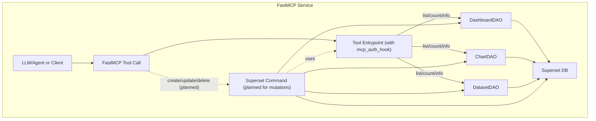
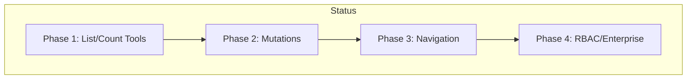

# Superset MCP Service – Phase 1 Status Update

Background:  
The Model Context Protocol (MCP) is a new standard for exposing high-level, structured actions in Superset, designed for AI agents and automation. The goal is to deliver a foundational, extensible MCP service within Superset, leveraging internal APIs (DAOs/commands), and providing a versioned, developer-friendly interface for both Apache and Preset use cases.  
See original SIP-171/SoW: https://github.com/apache/superset/issues/33870

## Phase 1 Objectives (from SoW)

- Implement a standalone MCP service (config flag, CLI, modular, stateless)
- Use DAOs/commands and strong typing for all actions
- Provide clear extension points for Preset-specific auth, RBAC, and logging
- Deliver at least 3 high-value MCP actions (list, navigation, mutation)
- Document architecture, extension, and usage
- Stub out (but not fully implement) auth, impersonation, and logging hooks

## Current Status

What's Done:

- Unified FastMCP Server:  
  The service now runs as a single, modular FastMCP server (ASGI, uvicorn-ready), replacing the dual Flask/FastAPI setup.
- DAO-Based, Strongly-Typed Tools:  
  All core read/list/count operations use DAOs, orchestrated by the ModelListTool abstraction for secure, context-aware access.  
  Tools are modular, domain-organized, and use Pydantic schemas for all input/output.
- Documentation & Architecture:  
  Architecture and extension guides are up-to-date, with diagrams and clear instructions for adding new tools or extending the service.
- Test Coverage:  
  Unit and integration test scaffolding is in place for all core tools, including search and error handling.

Core MCP Actions Implemented (3):

- List/count dashboards
- List/count datasets
- List/count charts

(List/count are counted as one tool per domain, as per SoW.)

## What's Next for Phase 1

- Mutations (Create/Update/Delete):  
  The groundwork is laid for command-based mutations (e.g., create_chart_simple), but these are not yet fully implemented for all domains.
- Navigation Actions:  
  Tools like generate_explore_link and open_sql_lab_with_context are planned but not yet available.
- Auth, Impersonation, Logging:  
  Hooks are stubbed, but full RBAC, impersonation, and logging are out of scope for Phase 1.
- Demo Script/PoC:  
  A demo script to showcase agent-driven workflows is in progress.

## Phase 1 Deliverables (per SoW)

- Standalone MCP service
- 3 core actions (list/count)
- Modular, typed schemas
- Unit/integration tests
- Mutations (create/update) – in progress
- Navigation actions – planned
- Auth/RBAC hooks (stubbed)
- Documentation
- Demo script/notebook – planned

## Architecture Diagram

## Roadmap/Phases

## Summary

Phase 1 is on track: the FastMCP server and 3 core list/count tools are live, modular, and LLM/agent-ready. The next focus is on mutation and navigation actions, and polish for agent-driven analytics. This positions Superset as a first-class, AI-ready BI platform, in line with the original SoW and SIP-171: https://github.com/apache/superset/issues/33870 