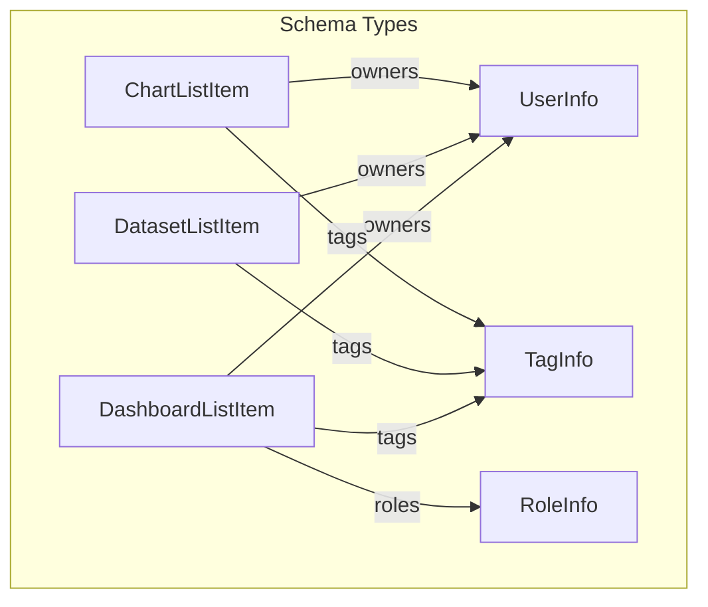
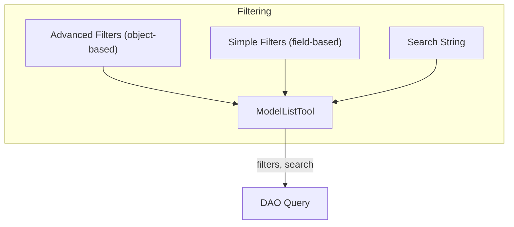

# Superset MCP Service: Tool Schemas Reference

This document provides a reference for the input and output parameters of all MCP tools in the Superset MCP service. Each section lists the tool name, its input parameters (with type), and its output schema.

## Dashboards

### list_dashboards

**Inputs:**
- `filters`: `Optional[List[DashboardFilter]]` — List of filter objects
- `search`: `Optional[str]` — Free-text search string
- `select_columns`: `Optional[List[str]]` — Columns to select (overrides columns/keys)
- `order_column`: `Optional[str]` — Column to order results by
- `order_direction`: `Optional[Literal['asc', 'desc']]` — Order direction
- `page`: `int` — Page number (1-based)
- `page_size`: `int` — Number of items per page

**Returns:** `DashboardListResponse`
- `dashboards`: `List[DashboardListItem]`
- `count`: `int`
- `total_count`: `int`
- `page`: `int`
- `page_size`: `int`
- `total_pages`: `int`
- `has_previous`: `bool`
- `has_next`: `bool`
- `columns_requested`: `List[str]`
- `columns_loaded`: `List[str]`
- `filters_applied`: `Dict[str, Any]`
- `pagination`: `PaginationInfo`
- `timestamp`: `datetime`

### get_dashboard_info

**Inputs:**
- `dashboard_id`: `int` — Dashboard ID

**Returns:** `DashboardInfoResponse` or `DashboardErrorResponse`

(See type definitions below)

## Datasets

### list_datasets

**Inputs:**
- `filters`: `Optional[List[DatasetFilter]]` — List of filter objects
- `search`: `Optional[str]` — Free-text search string
- `select_columns`: `Optional[List[str]]` — Columns to select (overrides columns/keys)
- `order_column`: `Optional[str]` — Column to order results by
- `order_direction`: `Optional[Literal['asc', 'desc']]` — Order direction
- `page`: `int` — Page number (1-based)
- `page_size`: `int` — Number of items per page

**Returns:** `DatasetListResponse`
- `datasets`: `List[DatasetListItem]`
- `count`: `int`
- `total_count`: `int`
- `page`: `int`
- `page_size`: `int`
- `total_pages`: `int`
- `has_previous`: `bool`
- `has_next`: `bool`
- `columns_requested`: `List[str]`
- `columns_loaded`: `List[str]`
- `filters_applied`: `Dict[str, Any]`
- `pagination`: `PaginationInfo`
- `timestamp`: `datetime`

### get_dataset_info

**Inputs:**
- `dataset_id`: `int` — Dataset ID

**Returns:** `DatasetInfoResponse` or `DatasetErrorResponse`

(See type definitions below)

## Charts

### list_charts

**Inputs:**
- `filters`: `Optional[List[ChartFilter]]` — List of filter objects
- `search`: `Optional[str]` — Free-text search string
- `select_columns`: `Optional[List[str]]` — Columns to select (overrides columns/keys)
- `order_column`: `Optional[str]` — Column to order results by
- `order_direction`: `Optional[Literal['asc', 'desc']]` — Order direction
- `page`: `int` — Page number (1-based)
- `page_size`: `int` — Number of items per page

**Returns:** `ChartListResponse`
- `charts`: `List[ChartListItem]`
- `count`: `int`
- `total_count`: `int`
- `page`: `int`
- `page_size`: `int`
- `total_pages`: `int`
- `has_previous`: `bool`
- `has_next`: `bool`
- `columns_requested`: `List[str]`
- `columns_loaded`: `List[str]`
- `filters_applied`: `Dict[str, Any]`
- `pagination`: `PaginationInfo`
- `timestamp`: `datetime`

### get_chart_info

**Inputs:**
- `chart_id`: `int` — Chart ID

**Returns:** `ChartInfoResponse` or `ChartErrorResponse`

(See type definitions below)

## Model Relationships

## ModelListTool and Schema Consistency

All list tools use the `ModelListTool` abstraction, which enforces:
- Consistent parameter order and types
- Strongly-typed Pydantic input/output models
- Only requested columns are returned in the response
- Unified pagination, filtering, and search logic

## Filtering & Search Flow

## Type Definitions

(Keep the rest of the type definitions as in the original file, but ensure all fields and types are up to date with the current codebase.) 