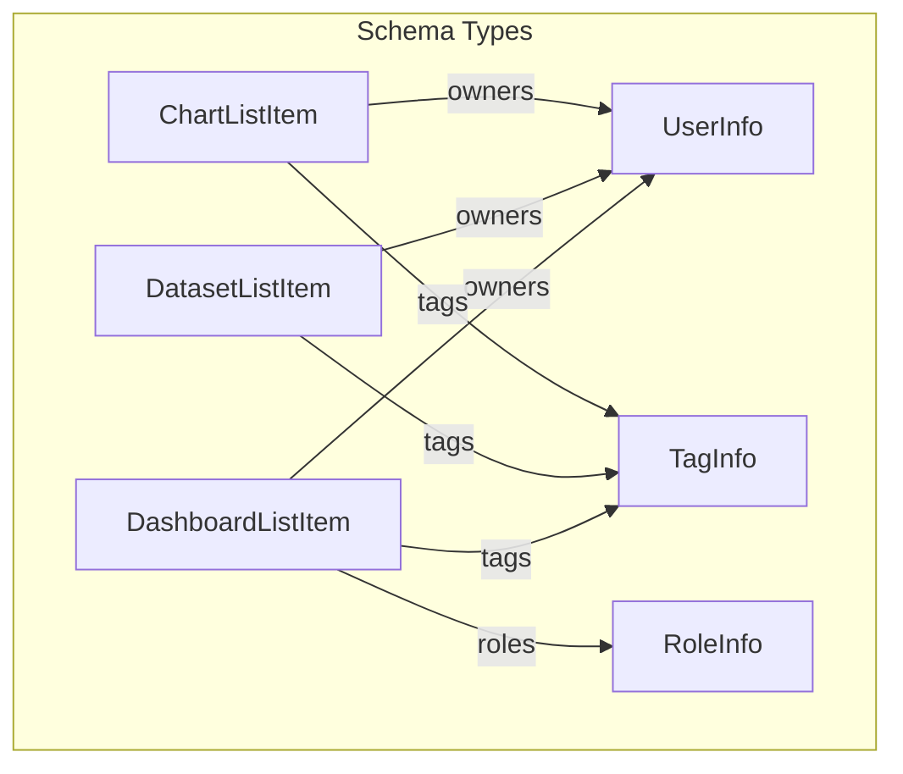

# Superset MCP Service: Tool Schemas Reference

This document provides a reference for the input and output schemas of all MCP tools in the Superset MCP service. All schemas are Pydantic v2 models with field descriptions for LLM/OpenAPI compatibility.

## Dashboards

### list_dashboards

**Inputs:**
- `filters`: `Optional[List[DashboardFilter]]` — List of filter objects
- `search`: `Optional[str]` — Free-text search string
- `select_columns`: `Optional[List[str]]` — Columns to select (overrides columns/keys)
- `order_column`: `Optional[str]` — Column to order results by
- `order_direction`: `Optional[Literal['asc', 'desc']]` — Order direction
- `page`: `int` — Page number (1-based)
- `page_size`: `int` — Number of items per page

**Returns:** `DashboardList`
- `dashboards`: `List[DashboardListItem]`
- `count`: `int`
- `total_count`: `int`
- `page`: `int`
- `page_size`: `int`
- `total_pages`: `int`
- `has_previous`: `bool`
- `has_next`: `bool`
- `columns_requested`: `List[str]`
- `columns_loaded`: `List[str]`
- `filters_applied`: `List[Any]`
- `pagination`: `PaginationInfo`
- `timestamp`: `datetime`

### get_dashboard_info

**Inputs:**
- `dashboard_id`: `int` — Dashboard ID

**Returns:** `DashboardInfo` or `DashboardError`

### get_dashboard_available_filters

**Returns:** `DashboardAvailableFilters`
- `column_operators`: `Dict[str, Any]` — Available filter operators and metadata for each column

## Datasets

### list_datasets

**Inputs:**
- `filters`: `Optional[List[DatasetFilter]]` — List of filter objects
- `search`: `Optional[str]` — Free-text search string
- `select_columns`: `Optional[List[str]]` — Columns to select (overrides columns/keys)
- `order_column`: `Optional[str]` — Column to order results by
- `order_direction`: `Optional[Literal['asc', 'desc']]` — Order direction
- `page`: `int` — Page number (1-based)
- `page_size`: `int` — Number of items per page

**Returns:** `DatasetList`
- `datasets`: `List[DatasetListItem]` (each includes columns and metrics)
- `count`: `int`
- `total_count`: `int`
- `page`: `int`
- `page_size`: `int`
- `total_pages`: `int`
- `has_previous`: `bool`
- `has_next`: `bool`
- `columns_requested`: `List[str]`
- `columns_loaded`: `List[str]`
- `filters_applied`: `List[Any]`
- `pagination`: `PaginationInfo`
- `timestamp`: `datetime`

### get_dataset_info

**Inputs:**
- `dataset_id`: `int` — Dataset ID

**Returns:** `DatasetInfo` or `DatasetError` (now includes columns and metrics)

#### DatasetInfo fields (new):
- `columns`: `List[TableColumnInfo]` — List of columns with name, type, verbose name, etc.
- `metrics`: `List[SqlMetricInfo]` — List of metrics with name, expression, verbose name, etc.

#### TableColumnInfo
- `column_name`: `str` — Column name
- `verbose_name`: `Optional[str]` — Verbose name
- `type`: `Optional[str]` — Column type
- `is_dttm`: `Optional[bool]` — Is datetime column
- `groupby`: `Optional[bool]` — Is groupable
- `filterable`: `Optional[bool]` — Is filterable
- `description`: `Optional[str]` — Column description

#### SqlMetricInfo
- `metric_name`: `str` — Metric name
- `verbose_name`: `Optional[str]` — Verbose name
- `expression`: `Optional[str]` — SQL expression
- `description`: `Optional[str]` — Metric description

> **Note:** All dataset list/info responses now include full column and metric metadata for each dataset.

### get_dataset_available_filters

**Returns:** `DatasetAvailableFilters`
- `column_operators`: `Dict[str, Any]` — Available filter operators and metadata for each column

## Charts

### list_charts

**Inputs:**
- `filters`: `Optional[List[ChartFilter]]` — List of filter objects
- `search`: `Optional[str]` — Free-text search string
- `select_columns`: `Optional[List[str]]` — Columns to select (overrides columns/keys)
- `order_column`: `Optional[str]` — Column to order results by
- `order_direction`: `Optional[Literal['asc', 'desc']]` — Order direction
- `page`: `int` — Page number (1-based)
- `page_size`: `int` — Number of items per page

**Returns:** `ChartList`
- `charts`: `List[ChartListItem]`
- `count`: `int`
- `total_count`: `int`
- `page`: `int`
- `page_size`: `int`
- `total_pages`: `int`
- `has_previous`: `bool`
- `has_next`: `bool`
- `columns_requested`: `List[str]`
- `columns_loaded`: `List[str]`
- `filters_applied`: `List[Any]`
- `pagination`: `PaginationInfo`
- `timestamp`: `datetime`

### get_chart_info

**Inputs:**
- `chart_id`: `int` — Chart ID

**Returns:** `ChartInfo` or `ChartError`

### get_chart_available_filters

**Returns:** `ChartAvailableFiltersResponse`
- `column_operators`: `Dict[str, Any]` — Available filter operators and metadata for each column

### create_chart

**Inputs:**
- `dataset_id`: `str` — ID of the dataset to use
- `config`: `ChartConfig` — Chart configuration (supports table and XY charts)
- `save_chart`: `bool` — Whether to save the chart (True) or just return an explore link (False)

**Returns:** `CreateChartResponse`
- `chart`: `Optional[ChartInfo]` — The created chart info, if save_chart=True
- `explore_url`: `Optional[str]` — URL to explore the chart configuration without saving, if save_chart=False
- `embed_url`: `Optional[str]` — URL to view or embed the chart, if requested
- `thumbnail_url`: `Optional[str]` — URL to a thumbnail image of the chart, if requested
- `embed_html`: `Optional[str]` — HTML snippet (e.g., iframe) to embed the chart, if requested
- `error`: `Optional[str]` — Error message, if creation failed

#### ChartConfig (Union of TableChartConfig and XYChartConfig)

#### TableChartConfig
- `chart_type`: `Literal["table"]` — Chart type
- `columns`: `List[ColumnRef]` — Columns to display
- `filters`: `Optional[List[FilterConfig]]` — Filters to apply
- `sort_by`: `Optional[List[str]]` — Columns to sort by

#### XYChartConfig
- `chart_type`: `Literal["xy"]` — Chart type
- `x`: `ColumnRef` — X-axis column
- `y`: `List[ColumnRef]` — Y-axis columns
- `kind`: `Literal["line", "bar", "area", "scatter"]` — Chart visualization type
- `group_by`: `Optional[ColumnRef]` — Column to group by
- `x_axis`: `Optional[AxisConfig]` — X-axis configuration
- `y_axis`: `Optional[AxisConfig]` — Y-axis configuration
- `legend`: `Optional[LegendConfig]` — Legend configuration
- `filters`: `Optional[List[FilterConfig]]` — Filters to apply

#### ColumnRef
- `name`: `str` — Column name
- `label`: `Optional[str]` — Display label for the column
- `dtype`: `Optional[str]` — Data type hint
- `aggregate`: `Optional[str]` — SQL aggregation function (SUM, COUNT, AVG, MIN, MAX, etc.)

#### AxisConfig
- `title`: `Optional[str]` — Axis title
- `scale`: `Optional[Literal["linear", "log"]]` — Axis scale type
- `format`: `Optional[str]` — Format string (e.g. '$,.2f')

#### LegendConfig
- `show`: `bool` — Whether to show legend
- `position`: `Optional[Literal["top", "bottom", "left", "right"]]` — Legend position

#### FilterConfig
- `column`: `str` — Column to filter on
- `op`: `Literal["=", ">", "<", ">=", "<=", "!="]` — Filter operator
- `value`: `Union[str, int, float, bool]` — Filter value

#### Supported Chart Types
- **Table charts** (`table`) — Simple column display with filters and sorting
- **Line charts** (`echarts_timeseries_line`) — Time series line charts
- **Bar charts** (`echarts_timeseries_bar`) — Time series bar charts
- **Area charts** (`echarts_area`) — Time series area charts
- **Scatter charts** (`echarts_timeseries_scatter`) — Time series scatter charts

#### Metric Handling
The tool intelligently handles two metric formats:
1. **Simple metrics** (like `["count"]`) — Passed as simple strings
2. **Complex metrics** (like column names) — Converted to full Superset metric objects with SQL aggregators

## Model Relationships

## ModelListTool and Schema Consistency

All list tools use the `ModelListTool` abstraction, which enforces:
- Consistent parameter order and types
- Strongly-typed Pydantic input/output models
- LLM/OpenAPI-friendly field names
