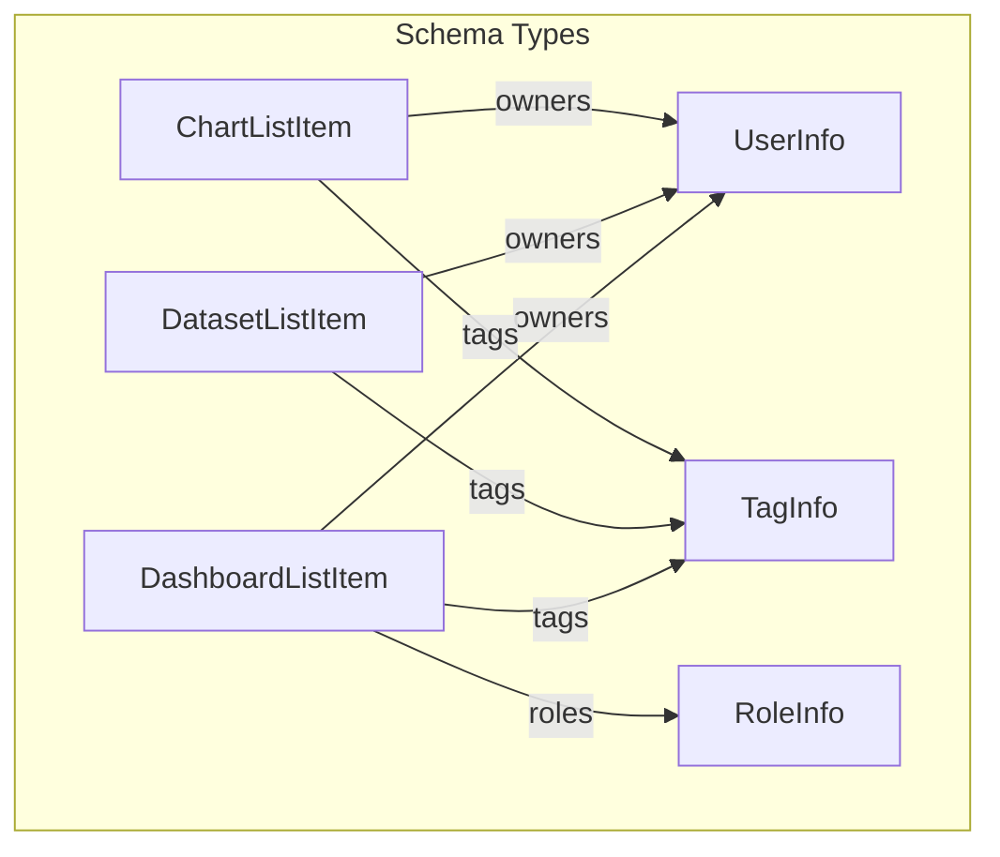

# Superset MCP Service: Tool Schemas Reference

This document provides a reference for the input and output schemas of all MCP tools in the Superset MCP service. All schemas are Pydantic v2 models with field descriptions for LLM/OpenAPI compatibility. All tool input and output is strongly typed and validated.

## Dashboards

### list_dashboards

**Inputs:**
- `filters`: `Optional[List[DashboardFilter]]` — List of filter objects
- `search`: `Optional[str]` — Free-text search string
- `select_columns`: `Optional[List[str]]` — Columns to select (overrides columns/keys)
- `order_column`: `Optional[str]` — Column to order results by
- `order_direction`: `Optional[Literal['asc', 'desc']]` — Order direction
- `page`: `int` — Page number (1-based)
- `page_size`: `int` — Number of items per page

**Returns:** `DashboardList`
- `dashboards`: `List[DashboardListItem]`
- `count`: `int`
- `total_count`: `int`
- `page`: `int`
- `page_size`: `int`
- `total_pages`: `int`
- `has_previous`: `bool`
- `has_next`: `bool`
- `columns_requested`: `List[str]`
- `columns_loaded`: `List[str]`
- `filters_applied`: `List[Any]`
- `pagination`: `PaginationInfo`
- `timestamp`: `datetime`

### get_dashboard_info

**Inputs:**
- `dashboard_id`: `int` — Dashboard ID

**Returns:** `DashboardInfo` or `DashboardError`

### get_dashboard_available_filters

**Returns:** `DashboardAvailableFilters`
- `column_operators`: `Dict[str, Any]` — Available filter operators and metadata for each column

## Datasets

### list_datasets

**Inputs:**
- `filters`: `Optional[List[DatasetFilter]]` — List of filter objects
- `search`: `Optional[str]` — Free-text search string
- `select_columns`: `Optional[List[str]]` — Columns to select (overrides columns/keys)
- `order_column`: `Optional[str]` — Column to order results by
- `order_direction`: `Optional[Literal['asc', 'desc']]` — Order direction
- `page`: `int` — Page number (1-based)
- `page_size`: `int` — Number of items per page

**Returns:** `DatasetList`
- `datasets`: `List[DatasetListItem]` (each includes columns and metrics)
- `count`: `int`
- `total_count`: `int`
- `page`: `int`
- `page_size`: `int`
- `total_pages`: `int`
- `has_previous`: `bool`
- `has_next`: `bool`
- `columns_requested`: `List[str]`
- `columns_loaded`: `List[str]`
- `filters_applied`: `List[Any]`
- `pagination`: `PaginationInfo`
- `timestamp`: `datetime`

### get_dataset_info

**Inputs:**
- `dataset_id`: `int` — Dataset ID

**Returns:** `DatasetInfo` or `DatasetError` (now includes columns and metrics)

#### DatasetInfo fields (new):
- `columns`: `List[TableColumnInfo]` — List of columns with name, type, verbose name, etc.
- `metrics`: `List[SqlMetricInfo]` — List of metrics with name, expression, verbose name, etc.

#### TableColumnInfo
- `column_name`: `str` — Column name
- `verbose_name`: `Optional[str]` — Verbose name
- `type`: `Optional[str]` — Column type
- `is_dttm`: `Optional[bool]` — Is datetime column
- `groupby`: `Optional[bool]` — Is groupable
- `filterable`: `Optional[bool]` — Is filterable
- `description`: `Optional[str]` — Column description

#### SqlMetricInfo
- `metric_name`: `str` — Metric name
- `verbose_name`: `Optional[str]` — Verbose name
- `expression`: `Optional[str]` — SQL expression
- `description`: `Optional[str]` — Metric description

> **Note:** All dataset list/info responses now include full column and metric metadata for each dataset.

### get_dataset_available_filters

**Returns:** `DatasetAvailableFilters`
- `column_operators`: `Dict[str, Any]` — Available filter operators and metadata for each column

## Charts

### list_charts

**Inputs:**
- `filters`: `Optional[List[ChartFilter]]` — List of filter objects
- `search`: `Optional[str]` — Free-text search string
- `select_columns`: `Optional[List[str]]` — Columns to select (overrides columns/keys)
- `order_column`: `Optional[str]` — Column to order results by
- `order_direction`: `Optional[Literal['asc', 'desc']]` — Order direction
- `page`: `int` — Page number (1-based)
- `page_size`: `int` — Number of items per page

**Returns:** `ChartList`
- `charts`: `List[ChartListItem]`
- `count`: `int`
- `total_count`: `int`
- `page`: `int`
- `page_size`: `int`
- `total_pages`: `int`
- `has_previous`: `bool`
- `has_next`: `bool`
- `columns_requested`: `List[str]`
- `columns_loaded`: `List[str]`
- `filters_applied`: `List[Any]`
- `pagination`: `PaginationInfo`
- `timestamp`: `datetime`

### get_chart_info

**Inputs:**
- `chart_id`: `int` — Chart ID

**Returns:** `ChartInfo` or `ChartError`

### get_chart_available_filters

**Returns:** `ChartAvailableFiltersResponse`
- `column_operators`: `Dict[str, Any]` — Available filter operators and metadata for each column

## Model Relationships

## ModelListTool and Schema Consistency

All list tools use the `ModelListTool` abstraction, which enforces:
- Consistent parameter order and types
- Strongly-typed Pydantic input/output models
- LLM/OpenAPI-friendly field names 