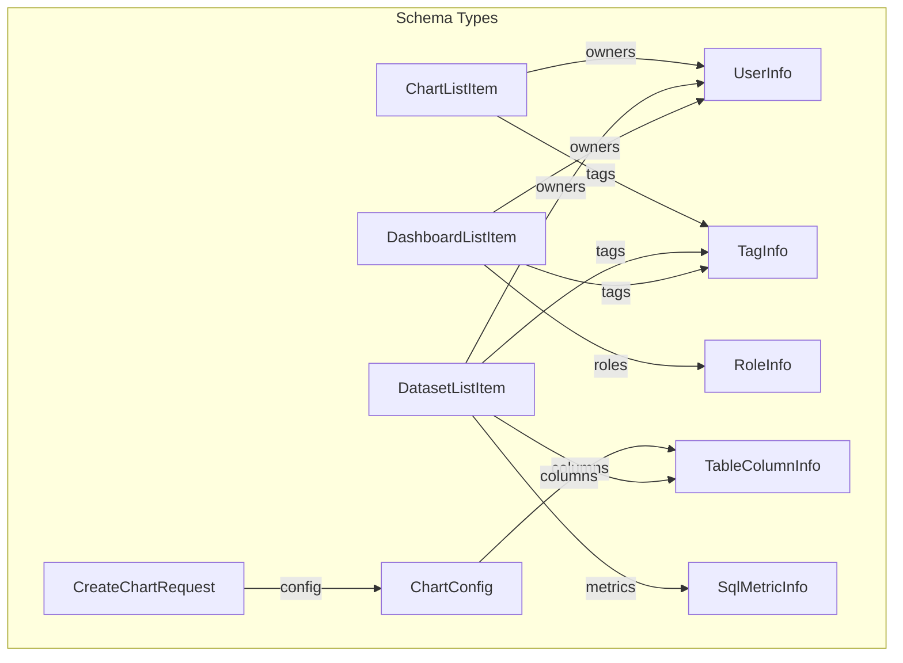

# Superset MCP Service: Tool Schemas Reference

This document provides a reference for the input and output schemas of all MCP tools in the Superset MCP service. All schemas are Pydantic v2 models with field descriptions for LLM/OpenAPI compatibility.

**Status**: Phase 1 nearing completion. All core schemas stable and production-ready.

## FastMCP Complex Inputs Pattern

All MCP tools use **structured request objects** instead of individual parameters to eliminate LLM validation issues:

```python
# All list tools use request objects
list_dashboards(request=ListDashboardsRequest(...))
list_datasets(request=ListDatasetsRequest(...))
list_charts(request=ListChartsRequest(...))

# All get_info tools use request objects with multi-identifier support
get_dashboard_info(request=GetDashboardInfoRequest(identifier="123"))  # ID
get_dashboard_info(request=GetDashboardInfoRequest(identifier="uuid-string"))  # UUID
get_dashboard_info(request=GetDashboardInfoRequest(identifier="slug-string"))  # Slug

# Chart creation with comprehensive config
create_chart(request=CreateChartRequest(
    dataset_id="1",
    config=XYChartConfig(
        chart_type="xy",
        x=ColumnRef(name="date"),
        y=[ColumnRef(name="sales", aggregate="SUM")],
        kind="line"
    )
))
```

### Key Benefits
- **No parameter ambiguity**: Filters are always arrays, never strings
- **Clear validation**: Cannot use both search and filters simultaneously
- **Multi-identifier support**: ID, UUID, and slug (where applicable) in single interface
- **LLM-friendly**: Unambiguous types prevent common LLM validation errors
- **Production-ready**: 149 unit tests ensure schema reliability

## Dashboards

### list_dashboards

**Input:** `ListDashboardsRequest`
- `filters`: `List[DashboardFilter]` — List of filter objects (cannot be used with search)
- `search`: `Optional[str]` — Free-text search string (cannot be used with filters)
- `select_columns`: `List[str]` — Columns to select (defaults include id, dashboard_title, slug, uuid)
- `order_column`: `Optional[str]` — Column to order results by
- `order_direction`: `Optional[Literal['asc', 'desc']]` — Order direction
- `page`: `int` — Page number (0-based)
- `page_size`: `int` — Number of items per page (default 100)

**Returns:** `DashboardList`
- `dashboards`: `List[DashboardListItem]`
- `count`: `int`
- `total_count`: `int`
- `page`: `int`
- `page_size`: `int`
- `total_pages`: `int`
- `has_previous`: `bool`
- `has_next`: `bool`
- `columns_requested`: `List[str]`
- `columns_loaded`: `List[str]`
- `filters_applied`: `List[Any]`
- `pagination`: `PaginationInfo`
- `timestamp`: `datetime`

### get_dashboard_info

**Input:** `GetDashboardInfoRequest`
- `identifier`: `Union[int, str]` — Dashboard identifier (supports ID, UUID, or slug)

**Returns:** `DashboardInfo` or `DashboardError`

**Multi-Identifier Support:**
- **ID**: Numeric dashboard ID (e.g., `123`)
- **UUID**: Dashboard UUID string (e.g., `"a1b2c3d4-e5f6-7890-abcd-ef1234567890"`)
- **Slug**: Dashboard slug string (e.g., `"sales-dashboard"`)

### get_dashboard_available_filters

**Returns:** `DashboardAvailableFilters`
- `column_operators`: `Dict[str, Any]` — Available filter operators and metadata for each column

## Datasets

### list_datasets

**Input:** `ListDatasetsRequest`
- `filters`: `List[DatasetFilter]` — List of filter objects (cannot be used with search)
- `search`: `Optional[str]` — Free-text search string (cannot be used with filters)
- `select_columns`: `List[str]` — Columns to select (defaults include id, table_name, uuid)
- `order_column`: `Optional[str]` — Column to order results by
- `order_direction`: `Optional[Literal['asc', 'desc']]` — Order direction
- `page`: `int` — Page number (0-based)
- `page_size`: `int` — Number of items per page (default 100)

**Returns:** `DatasetList`
- `datasets`: `List[DatasetListItem]` (each includes columns and metrics)
- `count`: `int`
- `total_count`: `int`
- `page`: `int`
- `page_size`: `int`
- `total_pages`: `int`
- `has_previous`: `bool`
- `has_next`: `bool`
- `columns_requested`: `List[str]`
- `columns_loaded`: `List[str]`
- `filters_applied`: `List[Any]`
- `pagination`: `PaginationInfo`
- `timestamp`: `datetime`

### get_dataset_info

**Input:** `GetDatasetInfoRequest`
- `identifier`: `Union[int, str]` — Dataset identifier (supports ID or UUID)

**Returns:** `DatasetInfo` or `DatasetError` (now includes columns and metrics)

**Multi-Identifier Support:**
- **ID**: Numeric dataset ID (e.g., `123`)
- **UUID**: Dataset UUID string (e.g., `"a1b2c3d4-e5f6-7890-abcd-ef1234567890"`)

#### DatasetInfo fields (new):
- `columns`: `List[TableColumnInfo]` — List of columns with name, type, verbose name, etc.
- `metrics`: `List[SqlMetricInfo]` — List of metrics with name, expression, verbose name, etc.

#### TableColumnInfo
- `column_name`: `str` — Column name
- `verbose_name`: `Optional[str]` — Verbose name
- `type`: `Optional[str]` — Column type
- `is_dttm`: `Optional[bool]` — Is datetime column
- `groupby`: `Optional[bool]` — Is groupable
- `filterable`: `Optional[bool]` — Is filterable
- `description`: `Optional[str]` — Column description

#### SqlMetricInfo
- `metric_name`: `str` — Metric name
- `verbose_name`: `Optional[str]` — Verbose name
- `expression`: `Optional[str]` — SQL expression
- `description`: `Optional[str]` — Metric description

> **Note:** All dataset list/info responses now include full column and metric metadata for each dataset.

### get_dataset_available_filters

**Returns:** `DatasetAvailableFilters`
- `column_operators`: `Dict[str, Any]` — Available filter operators and metadata for each column

## Charts

### list_charts

**Input:** `ListChartsRequest`
- `filters`: `List[ChartFilter]` — List of filter objects (cannot be used with search)
- `search`: `Optional[str]` — Free-text search string (cannot be used with filters)
- `select_columns`: `List[str]` — Columns to select (defaults include id, slice_name, uuid)
- `order_column`: `Optional[str]` — Column to order results by
- `order_direction`: `Optional[Literal['asc', 'desc']]` — Order direction
- `page`: `int` — Page number (0-based)
- `page_size`: `int` — Number of items per page (default 100)

**Returns:** `ChartList`
- `charts`: `List[ChartListItem]`
- `count`: `int`
- `total_count`: `int`
- `page`: `int`
- `page_size`: `int`
- `total_pages`: `int`
- `has_previous`: `bool`
- `has_next`: `bool`
- `columns_requested`: `List[str]`
- `columns_loaded`: `List[str]`
- `filters_applied`: `List[Any]`
- `pagination`: `PaginationInfo`
- `timestamp`: `datetime`

### get_chart_info

**Input:** `GetChartInfoRequest`
- `identifier`: `Union[int, str]` — Chart identifier (supports ID or UUID)

**Returns:** `ChartInfo` or `ChartError`

**Multi-Identifier Support:**
- **ID**: Numeric chart ID (e.g., `123`)
- **UUID**: Chart UUID string (e.g., `"a1b2c3d4-e5f6-7890-abcd-ef1234567890"`)

### get_chart_available_filters

**Returns:** `ChartAvailableFiltersResponse`
- `column_operators`: `Dict[str, Any]` — Available filter operators and metadata for each column

### create_chart

**Input:** `CreateChartRequest`
- `dataset_id`: `str` — ID of the dataset to use
- `config`: `ChartConfig` — Chart configuration (supports table and XY charts)

**Returns:** `Dict[str, Any]`
- `chart`: `Optional[Dict]` — The created chart info with id, slice_name, viz_type, and url
- `error`: `Optional[str]` — Error message, if creation failed

#### ChartConfig (Union of TableChartConfig and XYChartConfig)

#### TableChartConfig
- `chart_type`: `Literal["table"]` — Chart type
- `columns`: `List[ColumnRef]` — Columns to display
- `filters`: `Optional[List[FilterConfig]]` — Filters to apply
- `sort_by`: `Optional[List[str]]` — Columns to sort by

#### XYChartConfig
- `chart_type`: `Literal["xy"]` — Chart type
- `x`: `ColumnRef` — X-axis column
- `y`: `List[ColumnRef]` — Y-axis columns
- `kind`: `Literal["line", "bar", "area", "scatter"]` — Chart visualization type
- `group_by`: `Optional[ColumnRef]` — Column to group by
- `x_axis`: `Optional[AxisConfig]` — X-axis configuration
- `y_axis`: `Optional[AxisConfig]` — Y-axis configuration
- `legend`: `Optional[LegendConfig]` — Legend configuration
- `filters`: `Optional[List[FilterConfig]]` — Filters to apply

#### ColumnRef
- `name`: `str` — Column name
- `label`: `Optional[str]` — Display label for the column
- `dtype`: `Optional[str]` — Data type hint
- `aggregate`: `Optional[str]` — SQL aggregation function (SUM, COUNT, AVG, MIN, MAX, etc.)

#### AxisConfig
- `title`: `Optional[str]` — Axis title
- `scale`: `Optional[Literal["linear", "log"]]` — Axis scale type
- `format`: `Optional[str]` — Format string (e.g. '$,.2f')

#### LegendConfig
- `show`: `bool` — Whether to show legend
- `position`: `Optional[Literal["top", "bottom", "left", "right"]]` — Legend position

#### FilterConfig
- `column`: `str` — Column to filter on
- `op`: `Literal["=", ">", "<", ">=", "<=", "!="]` — Filter operator
- `value`: `Union[str, int, float, bool]` — Filter value

#### Supported Chart Types
- **Table charts** (`table`) — Simple column display with filters and sorting
- **Line charts** (`echarts_timeseries_line`) — Time series line charts
- **Bar charts** (`echarts_timeseries_bar`) — Time series bar charts
- **Area charts** (`echarts_area`) — Time series area charts
- **Scatter charts** (`echarts_timeseries_scatter`) — Time series scatter charts

#### Metric Handling
The tool intelligently handles two metric formats:
1. **Simple metrics** (like `["count"]`) — Passed as simple strings
2. **Complex metrics** (like column names) — Converted to full Superset metric objects with SQL aggregators (SUM, COUNT, AVG, MIN, MAX)

#### Chart Creation Output
```python
{
    "chart": {
        "id": 123,
        "slice_name": "Sales Over Time",
        "viz_type": "echarts_timeseries_line",
        "url": "/explore/?form_data=...",
        "explore_url": "http://localhost:8088/explore/?form_data=..."
    },
    "error": None
}
```

## System Tools

### get_superset_instance_info

**Returns:** `SupersetInstanceInfo`
- `version`: `str` — Superset version
- `build_number`: `Optional[str]` — Build identifier
- `instance_id`: `str` — Unique instance identifier
- `mcp_service_version`: `str` — MCP service version
- `authentication_enabled`: `bool` — Whether JWT authentication is enabled
- `available_tools`: `List[str]` — List of available MCP tools
- `supported_chart_types`: `List[str]` — Supported chart types for creation

### generate_explore_link

**Input:** `GenerateExploreLinkRequest`
- `dataset_id`: `str` — Dataset ID to explore
- `config`: `ChartConfig` — Chart configuration (same as create_chart)

**Returns:** `ExploreLinkResponse`
- `explore_url`: `str` — Full URL to Superset explore interface with chart configuration
- `form_data`: `Dict[str, Any]` — Serialized form data for the chart

## Authentication Context

When authentication is enabled, all tools receive additional context:

### JWT Authentication
- **User Extraction**: JWT claims (subject, client_id, email, username) mapped to Superset users
- **Scope Validation**: Each tool validates required scopes before execution
- **Audit Logging**: All operations logged with user context and JWT metadata
- **Impersonation**: Optional `run_as` parameter for user impersonation (where permitted)

### Error Responses
When authentication fails or permissions are insufficient:
```python
{
    "error": "Access denied: user lacks permission for tool_name",
    "error_type": "PermissionError",
    "required_scopes": ["chart:read"],
    "user_scopes": ["dashboard:read"]
}
```

## Model Relationships



## Request Schema Pattern Benefits

All tools using the FastMCP Complex Inputs Pattern provide:

### For List Tools (`list_*`)
- **Clear array types**: `filters` is always `List[Filter]`, never a string
- **Mutual exclusion**: Cannot use both `search` and `filters` simultaneously
- **Default columns**: Include UUID/slug in default responses for better searchability
- **Validation messages**: Clear error messages guide LLM usage

### For Get Info Tools (`get_*_info`)
- **Multi-identifier support**: Single interface for ID, UUID, and slug lookup
- **Intelligent detection**: Automatically determines identifier type based on format
- **Enhanced flexibility**: Works with LLM-generated identifiers of any supported type
- **Rich metadata**: Full object details including relationships (columns, metrics, owners)
- **Error handling**: Clear error responses when objects not found or access denied

### ModelListTool and Schema Consistency

All list tools use the `ModelListTool` abstraction, which enforces:
- Consistent parameter order and types via request schemas
- Strongly-typed Pydantic input/output models
- LLM/OpenAPI-friendly field names
- Validation logic preventing parameter conflicts
- Enhanced search including UUID/slug fields
- Comprehensive metadata in responses (columns_requested, columns_loaded, etc.)

## Schema Validation & Testing

All schemas are thoroughly tested with:
- **149 unit tests** covering all input/output combinations
- **Multi-identifier testing** for all get_*_info tools
- **Request schema validation** preventing parameter conflicts
- **Authentication integration** testing with JWT contexts
- **Error response validation** for permission and authentication failures
- **Chart creation testing** covering all supported chart types and aggregators

## Future Schema Enhancements

### Phase 1 Completion
- **Backend rendering schemas**: Chart screenshot and image response formats
- **SQL Lab schemas**: Context-aware query session parameters
- **Enhanced error responses**: More detailed validation and permission error details

### Future Phases
- **Dashboard creation schemas**: Multi-chart dashboard configuration
- **Advanced chart types**: Maps, 3D visualizations, custom components
- **Vega-Lite/Plotly output**: LLM-friendly chart rendering formats
