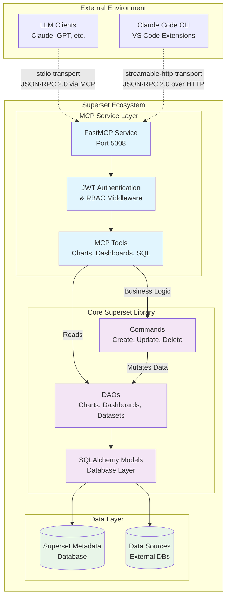
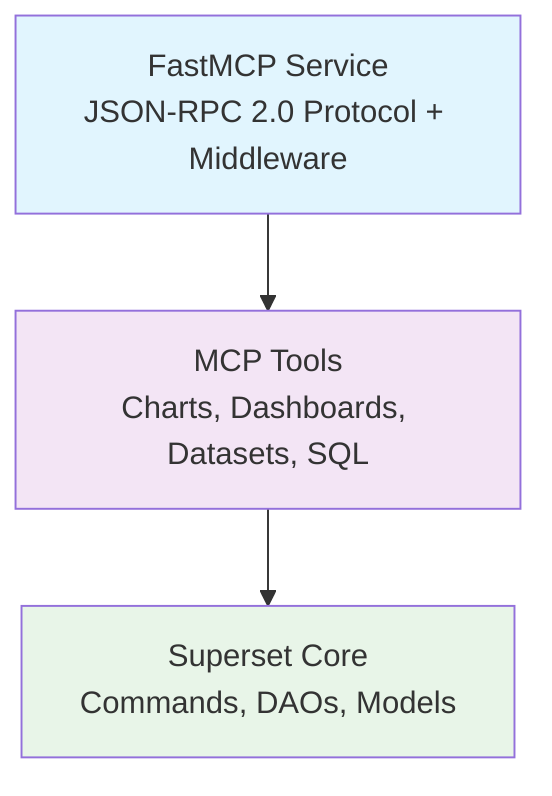
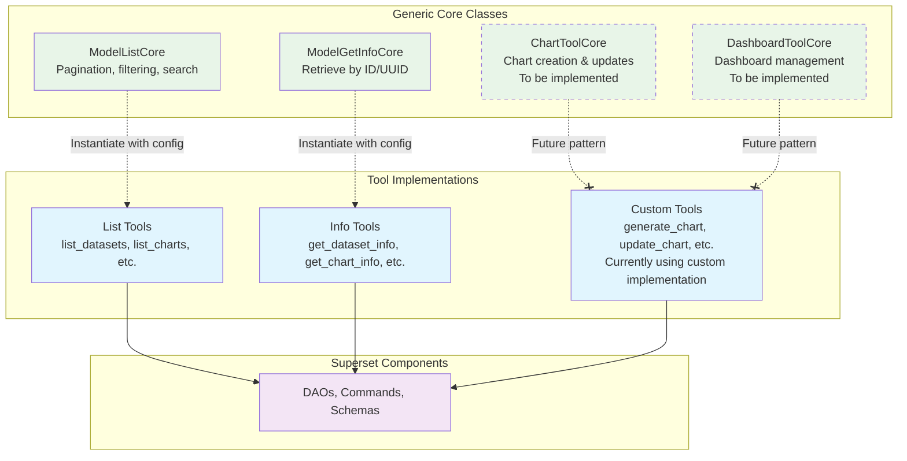
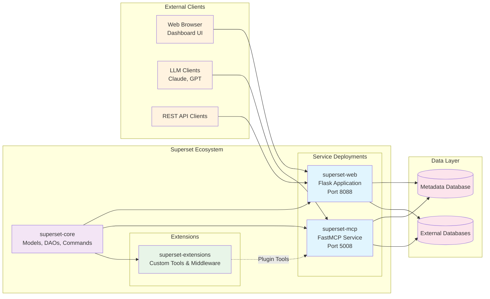

## Motivation

The prior [SIP-171](https://github.com/apache/superset/issues/33870) proposal outlined integrating Model Context Protocol (MCP) as an ASGI-compatible service within the existing Flask application architecture. However, initial proof-of-concept development has revealed significant advantages to a different architectural approach that better aligns with modern AI tooling ecosystems and provides cleaner separation of concerns.

This revised proposal presents a refined architecture based on learnings from the proof-of-concept implementation that:

1. **Addresses Flask-SQLAlchemy dependency challenges**: The original approach faced complications with Flask-AppBuilder's tight coupling to the web request lifecycle
2. **Improves AI agent compatibility**: FastMCP provides superior schema definitions and tooling optimized for LLM interactions
3. **Enables better code reusability**: A library-first approach allows the MCP service to leverage Superset's core functionality without web framework dependencies
4. **Supports enterprise deployment patterns**: FastMCP middleware enables multi-tenancy and security integrations required for production environments

The Model Context Protocol (MCP) is an open-source standard developed by Anthropic that provides AI agents with a unified interface to interact with various tools and services. MCP enables secure, controlled access to external resources through a standardized JSON-RPC 2.0 protocol.

**References:**
- [MCP Specification](https://spec.modelcontextprotocol.io/) - Official protocol specification
- [MCP Documentation](https://modelcontextprotocol.io/) - Implementation guides and examples
- [FastMCP Library](https://github.com/pydantic/fastmcp) - Python implementation framework

By implementing an MCP service for Superset, we enable LLMs to naturally create charts, manage dashboards, query data, and perform analytics workflows through standardized JSON-RPC 2.0 protocols.

## Proposed Change

### Architecture Overview

Instead of the originally proposed ASGI-Flask integration, this revised approach implements a **standalone FastMCP service that uses Superset as a library**. This architecture provides:

- Clean separation between the web application and AI service layers
- Better compatibility with FastAPI/Pydantic ecosystems
- Simplified deployment and scaling options
- Enhanced testability and maintainability

#### Context Diagram: MCP Service Integration with Superset



**Key Integration Points:**
- **RBAC Enforcement**: MCP tools leverage existing DAO/Command patterns that automatically handle role-based access control
- **Security Reuse**: Authentication and authorization logic is inherited from Superset core, not reimplemented
- **Library Pattern**: MCP service imports and uses Superset as a library, maintaining access to all core functionality

```md
superset/mcp_service/
├── app.py              # FastMCP application instance
├── server.py           # Service entry point and configuration
├── middleware.py       # Authentication, rate limiting, logging
├── dao/               # Enhanced data access objects
├── chart/             # Chart creation and management tools
├── dashboard/         # Dashboard management tools
├── dataset/           # Dataset listing and exploration
├── sql_lab/           # SQL execution and query tools
└── system/            # Instance metadata and health tools
```

## Architecture Principles

The MCP service implementation follows key architectural principles that ensure maintainability, security, and extensibility:

### 1. Security Logic Reuse

**Principle**: Reuse security logic from core Superset (commands and DAOs) and do not re-implement them.

**Implementation**:
- MCP tools leverage existing `BaseDAO` classes with enhanced `list()` and `count()` methods
- Commands layer provides business logic with built-in RBAC enforcement
- Authentication flows through existing Flask-AppBuilder security infrastructure
- Row-level security and column-level permissions automatically apply

**Benefits**:
- Consistent security model across web UI and MCP service
- Reduced attack surface by avoiding security reimplementation
- Automatic inheritance of security patches and improvements

### 2. Extensibility for Add-ons

**Principle**: It should be possible to expose new services added by extensions as MCP tools.

**Implementation**:
- Plugin-based tool registration system allows extensions to add MCP tools
- Standardized base classes for tool development with validation patterns
- Extension hooks for middleware integration (authentication, audit logging)
- Discovery mechanism for dynamically loaded tools

**Example Extension Pattern**:
```python
# Extension can register new MCP tools
from superset.mcp_service.core import register_tool

@register_tool(domain="custom_analytics")
class CustomAnalyticsTool(BaseMCPTool):
    def execute(self, request: CustomRequest) -> CustomResponse:
        # Extension-specific logic using Superset DAOs/Commands
        pass
```

### 3. Library-First Architecture

**Principle**: MCP service uses Superset as a library, not as a web framework dependency.

**Implementation**:
- Imports Superset models, DAOs, and commands without Flask context
- Standalone FastMCP service with independent lifecycle
- Database session management decoupled from web request cycle
- Configuration sharing through environment variables and shared config files

**Benefits**:
- Independent scaling and deployment
- Cleaner testing with reduced dependencies
- Better compatibility with async/await patterns
- Simplified error handling and debugging

### 4. Validation-First Development

**Principle**: Comprehensive validation prevents errors and improves user experience.

**Implementation**:
- 5-layer validation pipeline: Schema → Business Logic → Dataset → Superset Compatibility → Runtime
- Pydantic schemas with discriminated unions for type safety
- Fuzzy matching for column suggestions on validation errors
- Security validation prevents XSS and injection attacks

**Validation Layers**:
1. **Schema Validation**: Type checking and required fields
2. **Business Logic**: Cache parameters, preview formats
3. **Dataset Validation**: Column existence and compatibility
4. **Superset Compatibility**: Label conflicts and naming restrictions
5. **Runtime Validation**: Form data generation and empty chart detection

### 5. Preview-First User Experience

**Principle**: Enable exploration before persistence to improve user workflows. LLM-driven interactions are inherently conversational and exploratory, requiring different patterns than traditional transactional APIs.

**LLM Workflows vs Traditional API Workflows:**

| Aspect | Traditional API Calls | LLM Conversations |
|--------|----------------------|-------------------|
| Intent | Transactional - specific outcome known upfront | Exploratory - prototyping and refinement |
| Persistence | Immediate save on creation | Preview first, save when satisfied |
| Iterations | Minimal - precise requirements | Multiple - trying variations and alternatives |
| Cleanup | Developer manages resources | Automatic - previews don't clutter database |

**Chart Exploration & Persistence Tools:**

The MCP service provides separate tools for exploration vs persistence:

1. **Chart Exploration** (no database persistence):
   - `generate_chart(dataset_id, config, save_chart=False)` → Returns `form_data_key` + explore URL
   - `update_chart_preview(form_data_key, new_config)` → Iterate on configuration
   - User can try multiple variations without creating database records

2. **Chart Persistence** (save to database):
   - `generate_chart(dataset_id, config, save_chart=True)` → Creates permanent chart
   - `update_chart(chart_id, new_config)` → Modifies saved charts

3. **Dashboard Composition** (assumes finalized charts):
   - `generate_dashboard(chart_ids, title)` → Creates dashboard from saved charts
   - `add_chart_to_existing_dashboard(dashboard_id, chart_id)` → Adds chart to dashboard

**Implementation Details**:
- Cached form data allows iteration without database persistence
- Preview images enable visual validation in LLM conversations
- Explicit save operations give users control over when to persist
- Dashboard tools assume charts are already finalized (no "preview dashboard" concept)

**Example Exploratory Workflow**:
1. User: "Show me sales by region as a bar chart"
2. MCP: `generate_chart(..., save_chart=False)` → preview URL
3. User: "Try it as a pie chart instead"
4. MCP: `update_chart_preview(form_data_key, ...)` → new preview
5. User: "Perfect, save this one"
6. MCP: `generate_chart(..., save_chart=True)` → permanent chart
7. User: "Add it to my Q1 dashboard"
8. MCP: `add_chart_to_existing_dashboard(...)` → chart added

**Rationale**: LLM conversations naturally involve exploration and refinement. Without preview-first design, users would end up with dozens of half-finished charts cluttering their workspace. This pattern respects the conversational nature of AI interactions while maintaining database integrity.

### 6. Performance and Caching

**Principle**: Multi-level caching optimizes performance for AI workloads.

**Implementation**:
- Screenshot caching for chart previews
- Form data caching for iterative exploration (each iteration creates new cached entry)
- Query result caching inherited from Superset
- Metadata caching with refresh control

**Cache Housekeeping Consideration:**

Form data cache entries for chart previews inherit Superset's default 7-day TTL (`EXPLORE_FORM_DATA_CACHE_CONFIG`). For exploratory LLM workflows that may generate many preview iterations without saving, consider configuring a shorter TTL for MCP-created entries to avoid cache bloat:

```python
# Example MCP-specific configuration (optional)
MCP_EXPLORE_FORM_DATA_TTL = int(timedelta(hours=1).total_seconds())
```

This is not currently implemented but may be beneficial for deployments with high exploratory workload volumes.

### 7. Observability and Audit

**Principle**: Comprehensive logging and audit trails for enterprise deployment.

**Implementation**:
- Structured logging with request correlation IDs
- Security event audit logging
- Performance metrics and monitoring hooks
- Error sanitization for security and user experience

These principles ensure the MCP service provides a secure, extensible, and maintainable foundation for AI-driven analytics workflows while leveraging Superset's existing strengths.

## Implementation Details

### Data Access Layer

The MCP service uses superset’s DAO and Command implementations *out of the box*. To achive this we previously added (https://github.com/apache/superset/pull/35018) a couple of missing functions to remove the dependency on Flask-AppBuilder that does these for the CRID APIs:

```python
# superset/daos/base.py - Enhanced with new functions
class BaseDAO(Generic[T]):
    @classmethod
    def list(
        cls,
        column_operators: Optional[List[ColumnOperator]] = None,
        order_column: str = "changed_on",
        order_direction: str = "desc",
        page: int = 0,
        page_size: int = 100,
        search: Optional[str] = None,
        search_columns: Optional[List[str]] = None,
        custom_filters: Optional[Dict[str, Any]] = None,
        columns: Optional[List[str]] = None,
    ) -> Tuple[List[Any], int]:
        """Generic list method for filtered, sorted, and paginated results"""

    @classmethod
    def count(cls) -> int:
        """Count total records - required for instance statistics"""
```

### Pydantic Schema Framework

All MCP tool schemas use Pydantic for FastMCP compatibility and future FastAPI integration:

```python
# Chart creation with iterative, discriminated union approach
class ChartCreationRequest(BaseModel):
    dataset_id: int
    chart_type: ChartTypeEnum
    metrics: List[str]
    groupby: Optional[List[str]] = None
    filters: Optional[List[FilterConfig]] = None
    # Simplified schema - complex configurations added iteratively
```

**Why Pydantic over Marshmallow:**

- **FastMCP requirement**: FastMCP is Pydantic-first with Rust-based performance optimizations
- **Type-hint based**: Declarative style using native Python type hints
- **Automatic schema generation**: Pydantic models generate JSON schemas for MCP tool discovery

**Note**: This Pydantic adoption is isolated to the MCP service and does not require Superset-wide migration from Marshmallow.

### Chart Workflow Design

The MCP service implements a **preview-first workflow** optimized for LLM conversations rather than traditional API patterns. This design principle is detailed in the [Preview-First User Experience](#5-preview-first-user-experience) architecture principle.

**Key Design Difference:**
- **Traditional APIs**: Immediate persistence with precise requirements
- **MCP Service**: Exploration mode by default, explicit persistence when satisfied

This workflow prevents database clutter from exploratory LLM conversations while maintaining flexibility for users to iterate on chart designs before committing them.

### MCP Service Internal Architecture



**Architecture Layers:**

1. **FastMCP Service**: Handles MCP protocol with extensible middleware (auth, rate limiting, logging)
2. **MCP Tools**: Domain-specific tools for charts, dashboards, datasets, SQL, and system operations
3. **Superset Core**: Reuses existing Commands (business logic) and DAOs (data access) with built-in RBAC

### MCP Core Abstraction Pattern

The MCP service implements reusable core classes to eliminate code duplication:



**Pattern Benefits:**
- **Code Reuse**: Generic cores handle common operations (list, get, filter) for all models
- **Consistency**: Identical behavior across dataset, chart, and dashboard tools
- **Extensibility**: New tools can leverage existing cores with minimal configuration

## Security Model

The MCP service reuses Superset's existing security infrastructure:

- **Authentication**: JWT tokens, session-based auth (development)
- **Authorization**: Flask-AppBuilder RBAC automatically applied through DAOs
- **Input Validation**: 5-layer pipeline with Pydantic schemas and security sanitization
- **Data Access**: Row-level and column-level security inherited from Superset core

### Permission Model

**No Additional Permission Grants Required**: The MCP service does not request additional permissions from users. All permissions are directly derived from the user's existing Superset RBAC roles and permissions.

**How it Works:**
1. User authenticates to MCP service (JWT token or session)
2. User's identity is established in Flask's `g.user` context
3. All MCP tool operations enforce the user's existing Superset permissions
4. If a user lacks permission in the web UI, they lack it in MCP tools

**Example:**
- User has "Viewer" role in Superset → Can list/view charts via MCP, cannot create/modify
- User has "Editor" role → Can create/modify charts via MCP
- User has row-level security filters → Same filters apply to MCP query results

This design ensures users cannot bypass Superset's permission model by using MCP tools instead of the web UI.

### Permission Enforcement

When a user attempts an operation without proper permissions, the MCP service follows Superset's standard error handling:

1. **Command Layer Validation**: Commands (e.g., `CreateChartCommand`) call `security_manager.is_owner()` and `security_manager.can_access_datasource()`
2. **Exception Raised**: Permission failures raise specific exceptions:
   - `ChartAccessDeniedError`: "You don't have access to this chart"
   - `ChartForbiddenError`: "Changing this chart is forbidden"
   - `DashboardsForbiddenError`: "Changing one or more of these dashboards is forbidden"
3. **MCP Tool Response**: The tool catches these exceptions and returns structured error responses to the LLM

**Example Permission Flow:**

```python
# User tries to create chart without dataset access
try:
    CreateChartCommand(data).run()
except ChartAccessDeniedError as ex:
    return {
        "success": False,
        "error": {
            "type": "permission_denied",
            "message": "You don't have access to this dataset"
        }
    }
```

This ensures:
- **Consistent security**: Same permission checks as the web UI
- **Clear error messages**: LLMs receive actionable feedback
- **No privilege escalation**: Users cannot bypass permissions through MCP tools

## Deployment Architecture

### Updated Deployment Topology

Building on the original SIP-171 modular architecture concept, the revised implementation follows this deployment pattern:



**Key Deployment Characteristics:**

- **Modular Services**: Web application and MCP service can be deployed independently
- **Shared Core**: Both services use the same superset-core library for consistency
- **Independent Scaling**: MCP service can be scaled separately based on AI workload demands
- **Extension Support**: Plugins can add tools to both web and MCP services
- **Unified Data Access**: Both services access the same metadata and data sources

### Development Instructions

### Option 1: Standalone Service (Dev)

`superset mcp run --port 5008 --debug`

### Option 2: Docker Compose Integration

```yaml
services:
  superset-web:
    build: .
    command: ["superset", "run", "-h", "0.0.0.0", "-p", "8088", "--with-threads", "--reload", "--debugger"]
    ports:
      - "8088:8088"
    environment:
      - SUPERSET_CONFIG_PATH=/app/superset_config.py

  superset-mcp:
    build: .
    command: ["superset", "mcp", "run", "--port", "5008"]
    ports:
      - "5008:5008"
    environment:
      - SUPERSET_CONFIG_PATH=/app/superset_config.py
    depends_on:
      - superset-web
```

### Option 3: Production Deployment with Load Balancing

```yaml
services:
  superset-web:
    image: superset:latest
    deploy:
      replicas: 3
    ports:
      - "8088:8088"

  superset-mcp:
    image: superset:latest
    command: ["superset", "mcp", "run", "--workers", "4"]
    deploy:
      replicas: 2
    ports:
      - "5008:5008"
    environment:
      - MCP_ENABLE_AUTH=true
      - MCP_RATE_LIMIT=1000
```

## New or Changed Public Interfaces

### MCP Tools Interface

The initial MCP service exposes an example set of tools through MCP - the list will definitely grow as the project matures:

**Discovery Tools:**

- `list_dashboards(filters?, pagination?) → {dashboards: Dashboard[], pagination: PaginationInfo}`
- `list_charts(filters?, pagination?) → {charts: Chart[], pagination: PaginationInfo}`
- `list_datasets(filters?, pagination?) → {datasets: Dataset[], pagination: PaginationInfo}`

**Chart Management Tools:**

- `generate_chart(dataset_id, chart_type, config) → {explore_url: string, preview_url?: string}`
- `update_chart(chart_id, updates) → {chart: Chart, explore_url: string}`
- `get_chart_preview(chart_id) → {preview_url: string, data_preview: object}`

**Dashboard Management Tools:**

- `generate_dashboard(title, charts_layout) → {dashboard: Dashboard, edit_url: string}`
- `add_chart_to_existing_dashboard(dashboard_id, chart_id, position) → {success: boolean}`

**SQL and Analysis Tools:**

- `execute_sql(database_id, sql_query) → {results: QueryResult, execution_info: object}`
- `generate_explore_link(dataset_id, config) → {explore_url: string}`

### Enhanced DAO Interface

```python
def list(...) -> Tuple[List[Any], int]  # Replaces Flask-AppBuilder list functionality
def count() -> int                      # Required for instance statistics
def get_filterable_columns_and_operators() -> Dict[str, Any]  # Filter discovery
```

## New Dependencies

### Python Dependencies

- **fastmcp** (v2.10.0+): Core MCP protocol implementation
    - License: MIT
    - Maintenance: Active (Anthropic-backed)
    - Purpose: MCP server implementation and tooling
    - Compatible with: Pydantic v2, FastAPI ecosystem
- **pydantic** (v2.0+): Schema validation and serialization - already added as part of “dao updates PR”
    - License: MIT
    - Maintenance: Very active, widely adopted
    - Purpose: Type-safe API schemas, FastAPI compatibility
    - Note: Superset already uses Pydantic in some areas

### Optional Dependencies

- **playwright** (for chart screenshots): Already planned for SIP-178
- **Pillow** (for image processing): Chart preview functionality

### Breaking Changes

**Note**: Earlier versions had compatibility issues between werkzeug 3.1.3 and fastmcp 2.12.3. The current implementation uses fastmcp 2.10.0 which resolves these compatibility concerns and provides stable operation with the existing Flask/Werkzeug stack.

## Migration Plan and Compatibility

### Implementation Phases

The POC implementation is largely complete. The plan is to merge it in phases through multiple pull requests:

**Phase 0: Update Base DAO** [DONE]
- Enhanced `BaseDAO` with `list()` and `count()` methods

**Phase 1: Base Scaffold for MCP Service**
- Ability to run the service with `superset mcp run`
- Simple health tool
- Dev support locally and in docker
- Support `fastmcp` `http` and `stdio`

**Phase 2: Core Listing and Discovery Tools**
- `list_dashboards`, `list_charts`, `list_datasets`
- `get_dashboard_info`, `get_chart_info`, `get_dataset_info`
- `get_superset_instance_info`

**Phase 3: Chart Creation and Preview**
- `generate_chart` - Preview-first creation with explore links
- `update_chart` - Granular chart modifications
- `get_chart_preview` - Visual chart previews
- `execute_sql` - SQL Lab integration
- `generate_explore_link` - Pre-configured exploration URLs

**Phase 4: Dashboard Management**
- `generate_dashboard` - Row/column grid layout approach
- `add_chart_to_existing_dashboard` - Chart placement tools

**Phase 5: Advanced Features** (Future)
- Prompt testing framework to ensure tools are used correctly by LLMs

### Database Schema

**No database migrations required.** The MCP service uses existing Superset tables and models through the enhanced DAO layer.

### Configuration Migration

New installations include MCP service configuration in default config templates. Existing installations remain unaffected unless explicitly enabled.

### Backward Compatibility

- Existing Superset APIs and functionality unchanged
- MCP service operates independently of web application
- Feature flag ensures zero impact when disabled
- Enhanced DAO methods are additive, not breaking

### URL Structure

MCP service URLs are completely separate from existing Superset URLs:

- Superset: http://localhost:8088/*
- MCP Service: http://localhost:5008/* (or via MCP client connections)

## Rejected Alternatives

### 1. ASGI Integration with Flask (Original SIP-171)

**Rejected because:**

- Flask-AppBuilder's request lifecycle dependencies create complexity
- WSGI-to-ASGI wrapping introduces performance overhead
- Tight coupling between web and MCP service layers
- Difficult to scale and deploy independently

### 2. REST API Extensions

**Rejected because:**

- AI agents benefit from higher-level, workflow-oriented tools
- JSON-RPC 2.0 provides better function-call semantics for LLMs
- REST APIs require too many granular calls for complex workflows
- MCP provides standardized protocol for AI tool integration

### 3. External Bridge Service

**Rejected because:**

- Adds unnecessary architectural complexity
- Duplicates authentication and authorization logic
- Requires maintaining separate codebase
- Loses access to Superset's internal optimizations

### 4. Direct Flask-SQLAlchemy Integration

**Rejected because:**

- Flask-AppBuilder abstractions don't align with MCP tool patterns
- Request context requirements complicate standalone service deployment
- Dependency injection patterns conflict with FastMCP architecture
- Testing becomes more complex with web framework dependencies

## Implementation Status and Next Steps

This SIP represents the formalization of an architectural approach validated through proof-of-concept development. The current implementation demonstrates:

1. **Successful FastMCP integration** with Superset models
2. **Enhanced BaseDAO methods** for pagination and filtering
3. **Preview-first chart creation** workflows
4. **Pydantic schema compatibility** with FastMCP tooling
5. **Independent service deployment** options

### Immediate Next Steps

1. Community review and feedback on architectural decisions
2. Finalization of Pydantic schema designs for chart creation
3. Implementation of dashboard management tools
4. Production-ready middleware for authentication and rate limiting
5. [Comprehensive testing framework for MCP tools](https://www.notion.so/MCP-Testing-Validation-Framework-2778718b6465807c863dcf1f8ce292c7?pvs=21)

### Success Metrics

- LLM agents can successfully create and modify charts through natural language
- Chart creation workflows require fewer iterations than existing UI approaches
- Service can handle concurrent AI agent sessions without performance degradation
- Integration provides measurable productivity improvements for data analysis workflows

This revised SIP-171 proposal represents an evolution of the original concept, informed by practical implementation experience and optimized for the realities of AI-driven analytics workflows.
